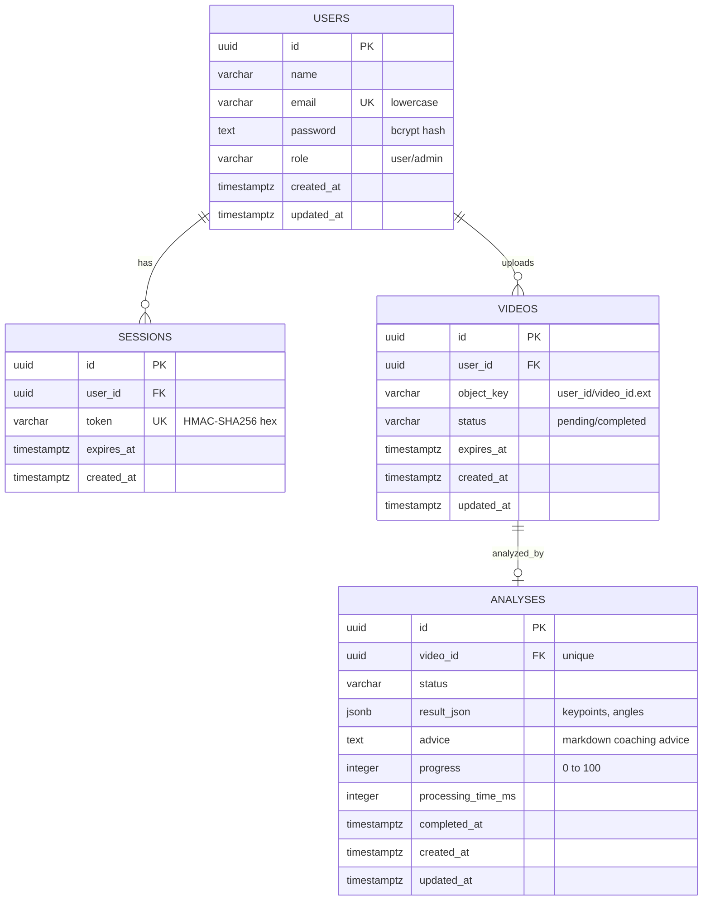
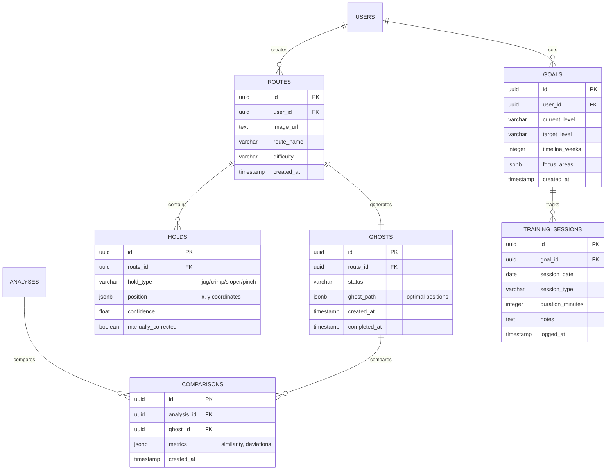

<!-- markdownlint-disable MD041 -->

> **Last updated:** 17th September 2026\
> **Version:** 1.2\
> **Authors:** Gianni TUERO, Christophe VANDEVOIR\
> **Original language:** English\
> **Status:** Done\
> {.is-success}

---

# Database Schema & Data Model

---

## Table of Contents

- [Database Schema & Data Model](#database-schema--data-model)
  - [Table of Contents](#table-of-contents)
  - [Implementation Status](#implementation-status)
  - [Conventions](#conventions)
  - [Entity-Relationship Diagrams (ERD)](#entity-relationship-diagrams-erd)
    - [Implemented Schema](#implemented-schema)
    - [Planned Extensions](#planned-extensions)
  - [Implemented Tables](#implemented-tables)
    - [Users Table](#users-table)
    - [Sessions Table](#sessions-table)
    - [Videos Table](#videos-table)
    - [Analyses Table](#analyses-table)
  - [Planned Tables](#planned-tables)
    - [Planned Users Columns](#planned-users-columns)
    - [Routes Table](#routes-table)
    - [Ghosts Table](#ghosts-table)
    - [Holds Table](#holds-table)
    - [Comparisons Table](#comparisons-table)
    - [Goals Table](#goals-table)
    - [Training Sessions Table](#training-sessions-table)
  - [Sample Queries](#sample-queries)
    - [Get a user's recent analyses](#get-a-users-recent-analyses)
    - [Delete expired uploads](#delete-expired-uploads)
    - [Check user quota (planned)](#check-user-quota-planned)
    - [Get route with ghost and holds (planned)](#get-route-with-ghost-and-holds-planned)

---

## Implementation Status

The source of truth for the implemented schema is the migration folder `apps/server/internal/outbound/postgres/migrations/`. Migrations are embedded in the Go binary and applied with `golang-migrate` when the API server (`cmd/server`) or the cron worker (`cmd/cron`) starts.

| Table | Status | Migration |
| --- | --- | --- |
| `users` | **Implemented** | `000002_create_users_table` |
| `sessions` | **Implemented** | `000003_create_sessions_table` |
| `videos` | **Implemented** | `000004_create_videos_table` |
| `analyses` | **Implemented** | `000005_create_analyses_table` |
| `routes` | Planned | \- |
| `ghosts` | Planned | \- |
| `holds` | Planned | \- |
| `comparisons` | Planned | \- |
| `goals` | Planned | \- |
| `training_sessions` | Planned | \- |

Migration `000001_updated_at_trigger` creates the shared `update_updated_at_column()` trigger function.

---

## Conventions

New tables and migrations must follow the conventions of the implemented schema:

- **Primary keys:** `UUID PRIMARY KEY DEFAULT uuidv7()` (time-ordered UUIDs, PostgreSQL 18).
- **Timestamps:** `TIMESTAMPTZ NOT NULL DEFAULT NOW()` for `created_at` and `updated_at`.
- **`updated_at`:** maintained by a `BEFORE UPDATE` trigger calling `update_updated_at_column()`.
- **Foreign keys:** `REFERENCES <table>(id) ON DELETE CASCADE` when the child row has no meaning without its parent.
- **Enumerated values:** `VARCHAR` column with a named constraint `chk_<table>_<column>` listing the values known by the Go model.
- **Unbounded text:** `TEXT` for hashes and generated content (password hashes, AI advice).
- **Indexes:** named `idx_<table>_<column>`, only added for a query that uses them (verify with `EXPLAIN`).
- **Migrations:** always provide both `.up.sql` and `.down.sql` files; the down file must undo exactly what the up file creates.

---

## Entity-Relationship Diagrams (ERD)

### Implemented Schema

A user owns many sessions and many videos. Each video has at most one analysis (`analyses.video_id` is unique). Deleting a user cascades to its sessions, videos and analyses.



### Planned Extensions

The planned model adds climbing routes with their holds and ghost (optimal path), comparisons between an analysis and a ghost, and training goals with their sessions.



---

## Implemented Tables

### Users Table

Stores user accounts.

```sql
CREATE TABLE users (
    id UUID PRIMARY KEY DEFAULT uuidv7(),
    name VARCHAR(64) NOT NULL,
    email VARCHAR(256) NOT NULL UNIQUE,
    password TEXT NOT NULL,
    role VARCHAR(32) NOT NULL DEFAULT 'user',
    created_at TIMESTAMPTZ NOT NULL DEFAULT NOW(),
    updated_at TIMESTAMPTZ NOT NULL DEFAULT NOW(),

    CONSTRAINT chk_users_role CHECK (role IN ('user', 'admin')),
    CONSTRAINT chk_users_email_lowercase CHECK (email = lower(email)),
    CONSTRAINT chk_users_email_trimmed CHECK (email = btrim(email, E' \t\n\r\f\x0B'))
);

CREATE TRIGGER update_users_updated_at
    BEFORE UPDATE ON users
    FOR EACH ROW
    EXECUTE FUNCTION update_updated_at_column();
```

**Notes:**

- `password` stores a bcrypt hash, never the raw password. It is `TEXT` so the hashing algorithm can change (argon2id hashes exceed 64 characters).
- `email` is stored lowercase and trimmed: the server normalizes it with `model.NewUserEmail` on signup, login and user create/update, and `chk_users_email_lowercase` and `chk_users_email_trimmed` enforce it, so the `UNIQUE` index also rejects addresses that only differ by case or surrounding whitespace.
- `email` stays `VARCHAR(256)`: an address is at most 254 characters (RFC 5321), and the bound keeps entries of the `UNIQUE` index under the B-tree size limit.
- `role` values match `model.UserRole` in the Go server.
- Name and password length rules are enforced by the Go model (`model.UserName`, `model.UserPassword`).

---

### Sessions Table

Authentication sessions.

```sql
CREATE TABLE sessions (
    id UUID PRIMARY KEY DEFAULT uuidv7(),
    user_id UUID NOT NULL REFERENCES users(id) ON DELETE CASCADE,
    token VARCHAR(64) NOT NULL UNIQUE,
    expires_at TIMESTAMPTZ NOT NULL,
    created_at TIMESTAMPTZ NOT NULL DEFAULT NOW()
);

CREATE INDEX idx_sessions_user_id  ON sessions(user_id);
CREATE INDEX idx_sessions_expires_at ON sessions(expires_at);
```

**Notes:**

- `token` stores the HMAC-SHA256 of the session token (64 hexadecimal characters), not the token itself.
- Expired sessions are deleted by the `ClearExpiredSessions` job of the cron worker.

---

### Videos Table

Stores uploaded climbing videos. The file itself lives in MinIO; the API only generates presigned URLs.

```sql
CREATE TABLE videos (
    id         UUID        PRIMARY KEY DEFAULT uuidv7(),
    user_id    UUID        NOT NULL REFERENCES users(id) ON DELETE CASCADE,
    object_key VARCHAR(128) NOT NULL,
    status     VARCHAR(32) NOT NULL DEFAULT 'pending',
    expires_at TIMESTAMPTZ NOT NULL,
    created_at TIMESTAMPTZ NOT NULL DEFAULT NOW(),
    updated_at TIMESTAMPTZ NOT NULL DEFAULT NOW(),

    CONSTRAINT chk_videos_status CHECK (status IN ('pending', 'completed'))
);

CREATE INDEX idx_videos_user_id  ON videos(user_id);
CREATE INDEX idx_videos_expires_at ON videos(expires_at);

CREATE TRIGGER update_videos_updated_at
    BEFORE UPDATE ON videos
    FOR EACH ROW
    EXECUTE FUNCTION update_updated_at_column();
```

**Notes:**

- `object_key` is built as `<user_id>/<video_id>.<extension>` (77 characters or more).
- `status` values match `model.VideoStatus`: `pending` until the client confirms the upload, then `completed`.
- `expires_at` is the upload deadline. Videos still `pending` after it are deleted by the `ClearExpiredVideos` job.
- There is no index on `status` alone: with two values it is never selected by the planner (measured on 200,000 rows).

---

### Analyses Table

Stores skeleton detection results produced by the AI worker.

```sql
CREATE TABLE analyses (
    id UUID PRIMARY KEY DEFAULT uuidv7(),
    video_id UUID NOT NULL UNIQUE REFERENCES videos(id) ON DELETE CASCADE,
    status VARCHAR(32) NOT NULL DEFAULT 'pending',
    result_json JSONB,
    advice TEXT,
    progress INTEGER NOT NULL DEFAULT 0,
    processing_time_ms INTEGER,
    completed_at TIMESTAMPTZ,
    created_at TIMESTAMPTZ NOT NULL DEFAULT NOW(),
    updated_at TIMESTAMPTZ NOT NULL DEFAULT NOW(),

    CONSTRAINT chk_analyses_progress CHECK (progress BETWEEN 0 AND 100)
);

CREATE TRIGGER update_analyses_updated_at
    BEFORE UPDATE ON analyses
    FOR EACH ROW
    EXECUTE FUNCTION update_updated_at_column();
```

**Notes:**

- The row is created by the API, then updated by the Python AI worker (`apps/ai/src/worker.py`).
- `status` has no check constraint yet: the values used by the API (`pending`, `completed`) and by the worker (`generating_hints`, `completed`, `failed`) still have to be aligned.
- `progress` is updated every ~30 frames (0 to 99) and set to 100 when the analysis completes.
- `advice` is markdown coaching advice generated by Gemini (`TEXT`, no length guarantee).

**result\_json example:**

```json
{
  "frames": [
    {
      "frame_number": 0,
      "keypoints": [
        {"name": "left_shoulder", "x": 0.5, "y": 0.3}
      ],
      "joint_angles": {
        "left_elbow": 145.2,
        "right_knee": 89.5
      }
    }
  ]
}
```

---

## Planned Tables

The following definitions describe the target data model. They are not implemented yet; when they are, adapt them to the [Conventions](#conventions) (`uuidv7()`, `TIMESTAMPTZ`, named constraints).

### Planned Users Columns

Subscription and profile data planned for the `users` table.

```sql
ALTER TABLE users
    ADD COLUMN first_name VARCHAR(100),
    ADD COLUMN last_name VARCHAR(100),
    ADD COLUMN last_login TIMESTAMPTZ,
    ADD COLUMN subscription_tier VARCHAR(50) NOT NULL DEFAULT 'freemium'
        CONSTRAINT chk_users_subscription_tier CHECK (subscription_tier IN ('freemium', 'premium', 'infinity')),
    ADD COLUMN monthly_quota INTEGER NOT NULL DEFAULT 10,
    ADD COLUMN quota_used INTEGER NOT NULL DEFAULT 0,
    ADD COLUMN email_verified BOOLEAN NOT NULL DEFAULT FALSE,
    ADD COLUMN phone_number VARCHAR(20);
```

**Business Rules:**

- Freemium tier: 10 videos/month (with ads, no ghost mode, max 5 routines)
- Premium tier: 30 videos/month (20€/month, ghost mode up to 30 uses/month, unlimited routines)
- Infinity tier: 100 videos/month (30€/month, ghost mode up to 100 uses/month, unlimited routines + server priority)

---

### Routes Table

Stores climbing route photos.

```sql
CREATE TABLE routes (
    id UUID PRIMARY KEY DEFAULT gen_random_uuid(),
    user_id UUID NOT NULL REFERENCES users(id) ON DELETE CASCADE,
    image_url TEXT NOT NULL,
    route_name VARCHAR(200),
    difficulty VARCHAR(10),
    created_at TIMESTAMP DEFAULT NOW()
);

CREATE INDEX idx_routes_user_id ON routes(user_id);
```

---

### Ghosts Table

Stores optimal path generation (ghost climber).

```sql
CREATE TABLE ghosts (
    id UUID PRIMARY KEY DEFAULT gen_random_uuid(),
    route_id UUID NOT NULL REFERENCES routes(id) ON DELETE CASCADE,
    status VARCHAR(50) DEFAULT 'pending',
    ghost_path JSONB,
    created_at TIMESTAMP DEFAULT NOW(),
    completed_at TIMESTAMP
);

CREATE INDEX idx_ghosts_route_id ON ghosts(route_id);
```

**ghost\_path example:**

```json
{
  "steps": [
    {
      "step": 1,
      "hand_position": {"x": 100, "y": 200},
      "foot_position": {"x": 120, "y": 350}
    }
  ]
}
```

---

### Holds Table

Stores detected climbing holds with types.

```sql
CREATE TABLE holds (
    id UUID PRIMARY KEY DEFAULT gen_random_uuid(),
    route_id UUID NOT NULL REFERENCES routes(id) ON DELETE CASCADE,
    hold_type VARCHAR(50) CHECK (hold_type IN ('jug', 'crimp', 'sloper', 'pinch', 'pocket', 'edge')),
    position JSONB NOT NULL,
    confidence FLOAT,
    manually_corrected BOOLEAN DEFAULT FALSE
);

CREATE INDEX idx_holds_route_id ON holds(route_id);
```

**Hold types:**

- `jug` - Easy to grip
- `crimp` - Small edge
- `sloper` - Rounded
- `pinch` - Thumb opposed
- `pocket` - Finger holes
- `edge` - Flat ledge

---

### Comparisons Table

Stores comparisons between video analysis and ghost.

```sql
CREATE TABLE comparisons (
    id UUID PRIMARY KEY DEFAULT gen_random_uuid(),
    analysis_id UUID NOT NULL REFERENCES analyses(id) ON DELETE CASCADE,
    ghost_id UUID NOT NULL REFERENCES ghosts(id) ON DELETE CASCADE,
    metrics JSONB,
    created_at TIMESTAMP DEFAULT NOW()
);

CREATE INDEX idx_comparisons_analysis_id ON comparisons(analysis_id);
```

**metrics example:**

```json
{
  "path_similarity": 0.78,
  "efficiency_score": 0.82,
  "deviations": [
    {"frame": 45, "difference": 15.5}
  ]
}
```

---

### Goals Table

Stores user climbing goals.

```sql
CREATE TABLE goals (
    id UUID PRIMARY KEY DEFAULT gen_random_uuid(),
    user_id UUID NOT NULL REFERENCES users(id) ON DELETE CASCADE,
    current_level VARCHAR(10),
    target_level VARCHAR(10),
    timeline_weeks INTEGER,
    focus_areas JSONB,
    created_at TIMESTAMP DEFAULT NOW()
);

CREATE INDEX idx_goals_user_id ON goals(user_id);
```

---

### Training Sessions Table

Tracks completed training sessions.

```sql
CREATE TABLE training_sessions (
    id UUID PRIMARY KEY DEFAULT gen_random_uuid(),
    goal_id UUID NOT NULL REFERENCES goals(id) ON DELETE CASCADE,
    session_date DATE NOT NULL,
    session_type VARCHAR(50),
    duration_minutes INTEGER,
    notes TEXT,
    logged_at TIMESTAMP DEFAULT NOW()
);

CREATE INDEX idx_training_sessions_goal_id ON training_sessions(goal_id);
```

---

## Sample Queries

### Get a user's recent analyses

```sql
SELECT a.id, a.status, a.progress, a.created_at, v.object_key
FROM analyses a
JOIN videos v ON a.video_id = v.id
WHERE v.user_id = $1
ORDER BY a.created_at DESC
LIMIT 20;
```

### Delete expired uploads

Query run by the `ClearExpiredVideos` cron job.

```sql
DELETE FROM videos
WHERE expires_at < $1 AND status != $2;
```

### Check user quota (planned)

Requires the [planned users columns](#planned-users-columns).

```sql
SELECT subscription_tier, monthly_quota, quota_used,
       (monthly_quota - quota_used) AS remaining
FROM users
WHERE id = $1;
```

### Get route with ghost and holds (planned)

```sql
SELECT r.*, g.ghost_path,
       json_agg(h.*) as holds
FROM routes r
LEFT JOIN ghosts g ON r.id = g.route_id
LEFT JOIN holds h ON r.id = h.route_id
WHERE r.id = $1
GROUP BY r.id, g.ghost_path;
```

---

**Related**:

- [API Specification](./api-specification.md)
- [System Overview](../system-overview.md)