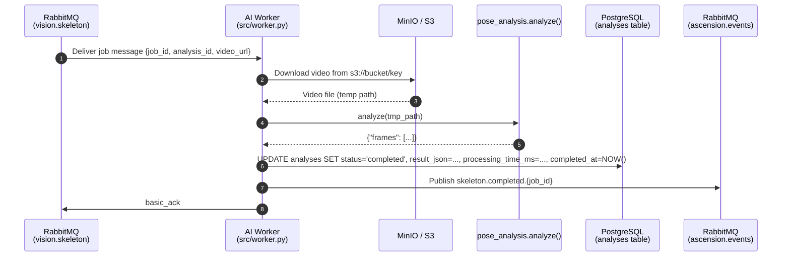

> **Last updated:** 12th March 2026  
> **Version:** 1.5  
> **Authors:** Darius  
> **Status:** Done  
> {.is-success}

---

# AI Worker — Developer Guide

---

## Table of Contents

- [AI Worker — Developer Guide](#ai-worker--developer-guide)
  - [Table of Contents](#table-of-contents)
  - [Overview](#overview)
  - [Repository Location](#repository-location)
  - [Environment Variables](#environment-variables)
  - [Local Environment Setup (Conda + moon)](#local-environment-setup-conda--moon)
  - [The vision.skeleton Pipeline](#the-visionskeleton-pipeline)
    - [Job Message Format](#job-message-format)
    - [End-to-End Flow](#end-to-end-flow)
    - [Output Stored in PostgreSQL](#output-stored-in-postgresql)
  - [The ai\_mediapipe Module (MediaPipe)](#the-ai_mediapipe-module-mediapipe)
    - [What It Does](#what-it-does)
    - [Tracked Landmarks](#tracked-landmarks)
    - [Output Format](#output-format)
  - [The ai\_sam3d Module (SAM 3D Body)](#the-ai_sam3d-module-sam-3d-body)
    - [SAM 3D Body Overview](#sam-3d-body-overview)
    - [Public API](#public-api)
      - [`create_estimator(**kwargs) → SAM3DBodyEstimator`](#create_estimatorkwargs--sam3dbodyestimator)
      - [`analyze(video_path, estimator, sample_every=3) → dict`](#analyzevideo_path-estimator-sample_every3--dict)
      - [`render_annotated_video(video_path, json_path, output_path)`](#render_annotated_videovideo_path-json_path-output_path)
    - [Keypoints \& Joint Angles](#keypoints--joint-angles)
    - [SAM 3D Body Output Format](#sam-3d-body-output-format)
  - [General Pipeline Pattern](#general-pipeline-pattern)
  - [Error Handling Strategy](#error-handling-strategy)
  - [RabbitMQ Startup Retry](#rabbitmq-startup-retry)

---

## Overview

The AI layer is a Python worker service (`apps/ai/`) that processes climbing video jobs
dispatched by the Rust API via RabbitMQ. Each pipeline is implemented as a **dedicated
worker process** that subscribes to a single queue, processes the job, persists results
to PostgreSQL, and publishes a completion event to the `ascension.events` topic exchange.

The first pipeline shipped is **`vision.skeleton`**, which extracts per-frame body
landmark data from a climbing video using MediaPipe Pose.

---

## Repository Location

```
apps/ai/
├── src/
│   ├── worker.py        # RabbitMQ worker — vision.skeleton pipeline
│   └── ai_mediapipe.py  # MediaPipe pose landmark extraction module
├── pose_landmarker.task # MediaPipe model asset (bundled)
├── environment.yml      # Conda environment definition
├── pyproject.toml
└── moon.yml             # moon tasks run via `conda run --prefix ./ai-env ...`
```

---

## Environment Variables

The `ai-worker` Docker service requires the following environment variables:

| Variable                | Default      | Description                                                         |
|-------------------------|--------------|---------------------------------------------------------------------|
| `RABBITMQ_HOST`         | `localhost`  | RabbitMQ hostname                                                   |
| `RABBITMQ_PORT`         | `5672`       | RabbitMQ port                                                       |
| `RABBITMQ_DEFAULT_USER` | `guest`      | RabbitMQ username                                                   |
| `RABBITMQ_DEFAULT_PASS` | `guest`      | RabbitMQ password                                                   |
| `MINIO_HOST`            | `minio`      | MinIO/S3 hostname                                                   |
| `MINIO_PORT`            | `9000`       | MinIO/S3 port                                                       |
| `MINIO_ROOT_USER`       | `minioadmin` | MinIO access key                                                    |
| `MINIO_ROOT_PASSWORD`   | `minioadmin` | MinIO secret key                                                    |
| `MINIO_ENDPOINT`        | _(derived)_  | Full endpoint URL — overrides `MINIO_HOST`/`MINIO_PORT` if set      |
| `POSTGRES_HOST`         | `postgresql` | PostgreSQL hostname                                                 |
| `POSTGRES_PORT`         | `5432`       | PostgreSQL port                                                     |
| `POSTGRES_USER`         | `postgres`   | PostgreSQL username                                                 |
| `POSTGRES_PASSWORD`     | `postgres`   | PostgreSQL password                                                 |
| `POSTGRES_DB`           | `ascension`  | Database name                                                       |
| `DB_URI`                | _(none)_     | Full connection URI — overrides individual `POSTGRES_*` vars if set |

---

## Local Environment Setup (Conda + moon)

The canonical local workflow is defined in `apps/ai/moon.yml` and uses a conda
environment at prefix `./ai-env`.

`moon run ai:setup` is intentionally idempotent for local refreshes: it runs
`conda env create --file environment.yml -p ./ai-env --force`, so re-running it
refreshes the same local environment path.

```bash
cd apps/ai

# Create / refresh conda env at ./ai-env from environment.yml
moon run ai:setup

# Download the MediaPipe pose landmarker model (skipped if already present)
moon run ai:download-model

# Install editable package + dev dependencies
# (runs setup + download-model automatically as dependencies)
moon run ai:install

# Run worker locally
moon run ai:dev

# Additional tasks
moon run ai:lint
moon run ai:test
moon run ai:build
```

> The `pose_landmarker.task` model file is not committed to the repository.
> Running `moon run ai:install` (or `moon run ai:download-model` directly) will
> download it automatically from the MediaPipe CDN if it is not present.

Equivalent raw commands from `apps/ai/moon.yml`:

```bash
conda env create --file environment.yml -p ./ai-env --force
bash -c 'if [ ! -f pose_landmarker.task ]; then curl -fsSL -o pose_landmarker.task <mediapipe-cdn>; fi'
conda run --prefix ./ai-env python -m pip install -e .[dev]
conda run --prefix ./ai-env python -u src/worker.py
```

---

## The vision.skeleton Pipeline

**Source:** `apps/ai/src/worker.py`

**Queue:** `vision.skeleton` (durable)

**Exchange (events):** `ascension.events` (topic, durable)

**Routing key published:** `skeleton.completed.{job_id}`

### Job Message Format

```json
{
  "job_id": "uuid",
  "analysis_id": "uuid",
  "video_url": "s3://bucket/path/to/video.mp4"
}
```

### End-to-End Flow



### Output Stored in PostgreSQL

The `analyses` table is updated with:

| Column               | Value                                                        |
|----------------------|--------------------------------------------------------------|
| `status`             | `completed` or `failed`                                      |
| `result_json`        | Full `{"frames": [...]}` JSON from `pose_analysis.analyze()` |
| `processing_time_ms` | Wall-clock duration of the `analyze()` call                  |
| `completed_at`       | UTC timestamp at time of update                              |

---

## The ai_mediapipe Module (MediaPipe)

**Source:** `apps/ai/pose_analysis.py`

### What It Does

`pose_analysis.analyze(video_path)` opens a video file with OpenCV, runs
`mediapipe.tasks.vision.PoseLandmarker` in `VIDEO` mode frame-by-frame, and returns a
structured dict of per-frame landmark data. Only frames where a pose is detected are
populated with landmark/angle data; all frames are included in the output with a
`pose_detected` flag.

The module also exposes `render_annotated_video()` for local debugging — it bakes the
skeleton overlay into a new MP4. This function is **not** called by the worker in
production.

### Tracked Landmarks

The module tracks 12 named body joints (MediaPipe indices):

| Index | Name            |
|-------|-----------------|
| 11    | left\_shoulder  |
| 12    | right\_shoulder |
| 13    | left\_elbow     |
| 14    | right\_elbow    |
| 15    | left\_wrist     |
| 16    | right\_wrist    |
| 23    | left\_hip       |
| 24    | right\_hip      |
| 25    | left\_knee      |
| 26    | right\_knee     |
| 27    | left\_ankle     |
| 28    | right\_ankle    |

A landmark is included in a frame only if its **presence score ≥ 0.8**.

### Output Format

```json
{
  "frames": [
    {
      "frame": 0,
      "timestamp_ms": 0,
      "pose_detected": true,
      "landmarks": {
        "11": { "x": 0.512, "y": 0.341, "z": -0.021, "pres": 0.997 },
        "12": { "x": 0.488, "y": 0.340, "z": -0.019, "pres": 0.996 }
      },
      "angles": {
        "13": 142.75
      }
    },
    {
      "frame": 1,
      "timestamp_ms": 33,
      "pose_detected": false
    }
  ]
}
```

- Coordinates (`x`, `y`, `z`) are normalised to `[0, 1]` relative to the frame dimensions.
- `angles` currently contains the **left elbow** flexion angle (the angle at joint `13`
  between the upper arm and forearm vectors). Additional joints will be added in future
  iterations.
- Frames with `pose_detected: false` contain no `landmarks` or `angles` keys.

---

## The ai_sam3d Module (SAM 3D Body)

**Source:** `apps/ai/src/ai_sam3d.py`

### SAM 3D Body Overview

`ai_sam3d` is the second
vision-transformer model). Unlike the MediaPipe module which produces 2D landmarks
normalised to the frame, `ai_sam3d` produces both **pixel-space 2D keypoints** and
**metric-space 3D keypoints** for the full MHR-70 skeleton (70 joints), along with
**joint angles** computed from the 3D data.

This module is designed for higher-accuracy analysis — notably for computing meaningful
biomechanical angles in 3D — at the cost of a heavier model checkpoint (~GB range).

The worker is not yet wired into the RabbitMQ pipeline. It is currently used standalone
for research and offline evaluation. Integration will follow the [General Pipeline Pattern](#general-pipeline-pattern).

---

### Public API

The module exposes two public functions:

#### `create_estimator(**kwargs) → SAM3DBodyEstimator`

Loads the SAM 3D Body model checkpoint and auxiliary modules (detector, segmentor, FOV
estimator) once. Returns a `SAM3DBodyEstimator` to reuse across many videos.

| Parameter          | Default / Env Var                  | Description                                  |
|--------------------|------------------------------------|----------------------------------------------|
| `checkpoint_path`  | `SAM3D_CHECKPOINT_PATH` env var    | Path to the SAM 3D Body model checkpoint     |
| `mhr_path`         | `SAM3D_MHR_PATH` env var           | Path to the MHR model asset                  |
| `detector_name`    | `""` (disabled)                    | Optional human detector (`HumanDetector`)    |
| `segmentor_name`   | `""` (disabled)                    | Optional human segmentor (`HumanSegmentor`)  |
| `fov_name`         | `""` (disabled)                    | Optional FOV estimator                       |
| `detector_path`    | `SAM3D_DETECTOR_PATH` env var      | Path to detector weights (if used)           |
| `segmentor_path`   | `SAM3D_SEGMENTOR_PATH` env var     | Path to segmentor weights (if used)          |
| `fov_path`         | `SAM3D_FOV_PATH` env var           | Path to FOV estimator weights (if used)      |

#### `analyze(video_path, estimator, sample_every=3) → dict`

Runs per-frame pose estimation on the given video. Pass a pre-built estimator to avoid
reloading the model between videos.

| Parameter      | Type                 | Description                                           |
|----------------|----------------------|-------------------------------------------------------|
| `video_path`   | `str`                | Path to the input video file                          |
| `estimator`    | `SAM3DBodyEstimator` | Pre-built estimator (or `None` to create from env)    |
| `sample_every` | `int` (default: `3`) | Inference on 1 frame out of every N; others reuse last |

Returns a dict: `{ "fps": …, "width": …, "height": …, "frames": [ … ] }`.

#### `render_annotated_video(video_path, json_path, output_path)`

Renders an annotated MP4 from a JSON produced by `analyze()`. Draws the MHR skeleton,
keypoint dots, bounding box, and per-joint angle labels on each frame. For debugging only — not called in production.

---

### Keypoints & Joint Angles

SAM 3D Body produces **70 keypoints** (MHR-70 skeleton). The module keeps a named
subset of the main body joints:

| Index | Name             |
|-------|------------------|
| 0     | `nose`           |
| 5     | `left_shoulder`  |
| 6     | `right_shoulder` |
| 7     | `left_elbow`     |
| 8     | `right_elbow`    |
| 9     | `left_hip`       |
| 10    | `right_hip`      |
| 11    | `left_knee`      |
| 12    | `right_knee`     |
| 13    | `left_ankle`     |
| 14    | `right_ankle`    |
| 41    | `right_wrist`    |
| 62    | `left_wrist`     |

Eight joint angles are computed from the 3D keypoints (vector dot-product method):

| Angle name        | Joint vertex     | Arms                          |
|-------------------|------------------|-------------------------------|
| `left_elbow`      | Left elbow       | Shoulder → Elbow → Wrist      |
| `right_elbow`     | Right elbow      | Shoulder → Elbow → Wrist      |
| `left_shoulder`   | Left shoulder    | Elbow → Shoulder → Hip        |
| `right_shoulder`  | Right shoulder   | Elbow → Shoulder → Hip        |
| `left_knee`       | Left knee        | Hip → Knee → Ankle            |
| `right_knee`      | Right knee       | Hip → Knee → Ankle            |
| `left_hip`        | Left hip         | Shoulder → Hip → Knee         |
| `right_hip`       | Right hip        | Shoulder → Hip → Knee         |

---

### SAM 3D Body Output Format

```json
{
  "frame": 0,
  "timestamp_ms": 0,
  "sampled": true,
  "n_people": 1,
  "people": [
    {
      "bbox": [120.5, 30.2, 500.1, 720.0],
      "landmarks": {
        "nose":           { "x": 312.4, "y": 45.1, "z": -0.00123 },
        "left_shoulder":  { "x": 280.0, "y": 130.5, "z": 0.00421 }
      },
      "keypoints_2d": [[312.4, 45.1], "..."],
      "keypoints_3d": [[0.12345, -0.33210, -0.00123], "..."],
      "focal_length": 1150.2345,
      "pred_cam_t": [0.01234, -0.00543, 5.43210],
      "angles": {
        "left_elbow":    142.75,
        "right_elbow":   138.20,
        "left_shoulder": 87.40,
        "right_shoulder": 91.10,
        "left_knee":     165.30,
        "right_knee":    172.80,
        "left_hip":      95.50,
        "right_hip":     98.20
      }
    }
  ]
}
```

- `landmarks` pixel coordinates (`x`, `y`) are in **pixel space** (not normalised).
- `keypoints_3d` are in **metric camera space** (metres).
- `sampled: false` frames reuse the `people` array from the previous sampled frame.
- `focal_length` and `pred_cam_t` are the camera intrinsic and extrinsic parameters
  estimated by the model per person.

---

## General Pipeline Pattern

All future AI pipelines (`vision.hold_detection`, `vision.advice`, `vision.ghost`,
`training.program`) must follow this pattern:

```
1. DOWNLOAD  — fetch asset from MinIO/S3 via boto3
2. PROCESS   — run the AI/algorithm module
3. PERSIST   — UPDATE analyses (or relevant table) in PostgreSQL
4. PUBLISH   — basic_publish to ascension.events with the appropriate routing key
5. ACK/NACK  — basic_ack on success; basic_nack (requeue=True) on exception
```

Each pipeline should be its own worker module (following `src/worker.py`) that:

- Declares its queue as **durable** at startup.
- Declares the `ascension.events` exchange as **topic + durable** at startup.
- Sets `prefetch_count=1` so a single worker processes one job at a time.
- Handles retries at the queue level via **nack + requeue** (not in-process loops).

---

## Error Handling Strategy

| Scenario                      | Behaviour                                                                                  |
|-------------------------------|--------------------------------------------------------------------------------------------|
| Exception during processing   | `analyses.status` set to `failed` (best-effort DB update), then `basic_nack(requeue=True)` |
| DB update fails on error path | Logged and swallowed — nack is still sent                                                  |
| Temp video file left on disk  | `finally` block always unlinks the temp file                                               |
| DB connection left open       | `finally` block always calls `conn.close()`                                                |

Messages are requeued on failure, which means a permanently broken job will loop
indefinitely. A dead-letter queue should be configured per queue to cap retry attempts —
this is tracked as a future infrastructure improvement.

---

## RabbitMQ Startup Retry

The worker retries the initial RabbitMQ connection up to **12 times with a 5-second
delay** (~60 seconds total) to handle the startup race condition in Docker Compose where
the worker container starts before RabbitMQ is ready. If all retries are exhausted, the
process exits with code 1 and Docker Compose restarts it.
