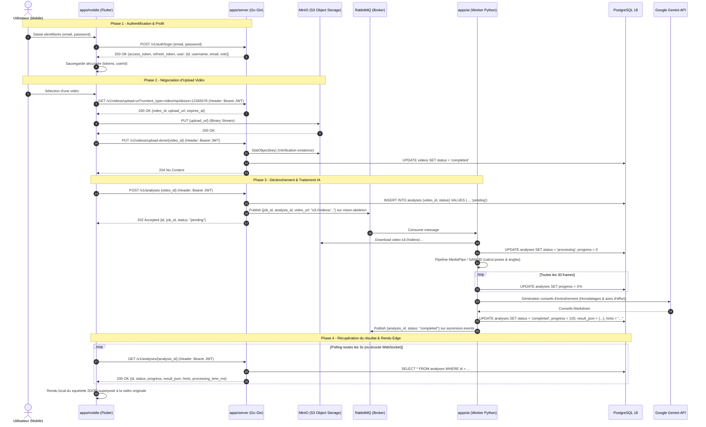

<!-- markdownlint-disable MD041 -->

> **Last updated:** 5th September 2026  
> **Version:** 1.0  
> **Authors:** Nicolas TORO  
> **Original language:** French  
> **Status:** Done  
> {.is-success}

---

# Audit des Communications Inter-Applications, Analyse des Écarts & Recommandations d'Architecture

Ce document fournit une analyse exhaustive et détaillée des flux de communication au sein de la plateforme **Ascension** :

1. **Communication Frontend Mobile (Flutter) $\longleftrightarrow$ Backend API Gateway (Go)**
2. **Communication Backend API Gateway (Go) $\longleftrightarrow$ Worker IA (Python)**
3. **Persistance partagée (PostgreSQL) et stockage objet (MinIO)**
4. **Recommandations d'architecture pour un code propre, moderne et modulaire**
5. **Roadmap concrète des actions à réaliser pour rendre le système 100% fonctionnel de bout en bout**

---

## Table of Contents

- [Audit des Communications Inter-Applications, Analyse des Écarts \& Recommandations d'Architecture](#audit-des-communications-inter-applications-analyse-des-écarts--recommandations-darchitecture)
  - [Table of Contents](#table-of-contents)
  - [1. Synthèse Globale de l'Architecture et du Problème](#1-synthèse-globale-de-larchitecture-et-du-problème)
    - [1.1 Vue d'ensemble des trois briques](#11-vue-densemble-des-trois-briques)
    - [1.2 Diagramme de communication cible](#12-diagramme-de-communication-cible)
  - [2. Matrice Comparative : Front Mobile $\\longleftrightarrow$ Backend API](#2-matrice-comparative--front-mobile-longleftrightarrow-backend-api)
    - [2.1 Domaine Authentification](#21-domaine-authentification)
      - [2.1.1 Inscription / Signup](#211-inscription--signup)
      - [2.1.2 Connexion / Login](#212-connexion--login)
      - [2.1.3 Déconnexion / Logout \& Rafraîchissement de Token](#213-déconnexion--logout--rafraîchissement-de-token)
    - [2.2 Domaine Utilisateurs \& Profil](#22-domaine-utilisateurs--profil)
      - [2.2.1 Récupération du profil (`getUser`)](#221-récupération-du-profil-getuser)
      - [2.2.2 Mise à jour du profil](#222-mise-à-jour-du-profil)
    - [2.3 Domaine Vidéos \& Stockage MinIO](#23-domaine-vidéos--stockage-minio)
      - [2.3.1 Demande d'URL de téléversement (`getUploadUrl`)](#231-demande-durl-de-téléversement-getuploadurl)
      - [2.3.2 Téléversement direct sur MinIO \& Problème de résolution DNS](#232-téléversement-direct-sur-minio--problème-de-résolution-dns)
      - [2.3.3 Confirmation de téléversement (`UploadComplete`)](#233-confirmation-de-téléversement-uploadcomplete)
      - [2.3.4 Téléchargement de vidéo (`GetDownloadURL`)](#234-téléchargement-de-vidéo-getdownloadurl)
    - [2.4 Domaine Analyses](#24-domaine-analyses)
      - [2.4.1 Déclenchement de l'analyse (`triggerAnalysis`)](#241-déclenchement-de-lanalyse-triggeranalysis)
      - [2.4.2 Suivi et résultat d'analyse (`getAnalysis`)](#242-suivi-et-résultat-danalyse-getanalysis)
      - [2.4.3 Historique des analyses d'un utilisateur](#243-historique-des-analyses-dun-utilisateur)
    - [2.5 Gestion Transversale : Sécurité JWT \& Erreurs](#25-gestion-transversale--sécurité-jwt--erreurs)
  - [3. Matrice Comparative : Backend API $\\longleftrightarrow$ Worker IA](#3-matrice-comparative--backend-api-longleftrightarrow-worker-ia)
    - [3.1 Message Broker RabbitMQ](#31-message-broker-rabbitmq)
      - [3.1.1 Nom de file (Queue Name Desynchronization)](#311-nom-de-file-queue-name-desynchronization)
      - [3.1.2 Structure du message de tâche (`JobPayload`)](#312-structure-du-message-de-tâche-jobpayload)
      - [3.1.3 Événements de terminaison (`ascension.events`)](#313-événements-de-terminaison-ascensionevents)
    - [3.2 Base de Données PostgreSQL](#32-base-de-données-postgresql)
      - [3.2.1 Nom de la table SQL (`analysis` vs `analyses`)](#321-nom-de-la-table-sql-analysis-vs-analyses)
      - [3.2.2 Colonnes manquantes (`progress`, `hints`, `job_id`)](#322-colonnes-manquantes-progress-hints-job_id)
      - [3.2.3 Double jeu de migrations en concurrence](#323-double-jeu-de-migrations-en-concurrence)
    - [3.3 Stockage Objet MinIO](#33-stockage-objet-minio)
  - [4. Recommandations d'Architecture \& Conception Modulaire](#4-recommandations-darchitecture--conception-modulaire)
    - [4.1 Architecture Backend Go](#41-architecture-backend-go)
    - [4.2 Architecture Mobile Flutter](#42-architecture-mobile-flutter)
    - [4.3 Architecture Worker IA Python](#43-architecture-worker-ia-python)
    - [4.4 Évolution vers le Temps Réel (WebSockets / SSE)](#44-évolution-vers-le-temps-réel-websockets--sse)
  - [5. Roadmap d'Actions Concrètes (Checklist Priorisée)](#5-roadmap-dactions-concrètes-checklist-priorisée)
    - [Phase 1 : Rétablissement du Schéma SQL \& Migrations (P0)](#phase-1--rétablissement-du-schéma-sql--migrations-p0)
    - [Phase 2 : Synchronisation RabbitMQ (P0)](#phase-2--synchronisation-rabbitmq-p0)
    - [Phase 3 : Harmonisation du Backend Go (P0)](#phase-3--harmonisation-du-backend-go-p0)
    - [Phase 4 : Refonte de la Couche Réseau Mobile Flutter (P0)](#phase-4--refonte-de-la-couche-réseau-mobile-flutter-p0)
    - [Phase 5 : Modernisation \& Cadrage Moyen Terme (P1)](#phase-5--modernisation--cadrage-moyen-terme-p1)

---

## 1. Synthèse Globale de l'Architecture et du Problème

### 1.1 Vue d'ensemble des trois briques

Le projet **Ascension** est articulé autour de 3 composants majeurs :

- **`apps/mobile` (Client Flutter)** : application mobile multiplateforme permettant la capture de vidéos de grimpe, le suivi de l'entraînement et la visualisation locale des squelettes 2D/3D superposés sur les vidéos.
- **`apps/server` (API Gateway Go)** : serveur REST (Gin) responsable de la sécurité (JWT, RBAC), de la gestion des utilisateurs, de la délivrance des URLs présignées MinIO et de la soumission asynchrone des analyses dans RabbitMQ.
- **`apps/ai` (Worker IA Python)** : démon consommateur RabbitMQ extrayant les points biomécaniques via MediaPipe (2D) ou SAM 3D Body (3D) et générant des conseils de grimpe personnalisés via l'API Google Gemini.

Actuellement, **le système ne peut pas fonctionner de bout en bout** en raison de plusieurs ruptures de contrat strictes intervenues lors de réécritures partielles du code (migration Rust $\rightarrow$ Go, découplage de l'IA, évolutions du client mobile).

### 1.2 Diagramme de communication cible

Le schéma ci-dessous illustre le flux complet normalisé requis pour que l'ensemble de la chaîne logicielle fonctionne sans accroc.



---

## 2. Matrice Comparative : Front Mobile $\longleftrightarrow$ Backend API

Cette section détaille chaque appel réseau effectué par l'application Flutter (`apps/mobile/lib/core/network/api_service.dart`), ce qu'elle attend en retour, ce que le Backend Go fournit réellement (`apps/server/internal/inbound/http/router/router.go`), et la liste exhaustive des divergences.

---

### 2.1 Domaine Authentification

#### 2.1.1 Inscription / Signup

- **Appel Mobile actuel** :
  - Méthode / Route : `POST $baseUrl/v1/auth/register`
  - Body transmis :
    ```json
    {
      "username": "climber42",
      "email": "climber@example.com",
      "password": "securepassword"
    }
    ```
  - Traitement du retour dans `register_page.dart` :
    ```dart
    await AuthService().saveTokens(
      accessToken: data['access_token'] as String,
      refreshToken: data['refresh_token'] as String? ?? '',
      userId: data['user_id'] as String,
      username: _usernameController.text.trim(),
      email: _emailController.text.trim(),
    );
    ```
- **Attente Backend Go actuel** :
  - Route enregistrée : `POST /v1/auth/signup` (gérée par `authH.SignupLogin`)
  - Validation DTO `request.SignupLoginForm` :
    ```go
    type SignupLoginForm struct {
        Name     string `json:"name" binding:"required,min=3,max=20,alphanumunicode|contains=_"`
        Email    string `json:"email" binding:"omitempty,email"`
        Password string `json:"password" binding:"required,min=8"`
        Remember bool   `json:"remember"`
    }
    ```
  - Réponse produite (`response.TokensUserToResponse`) :
    ```json
    {
      "refresh_token": "uuid",
      "access_token": "jwt_string",
      "token_type": "Bearer",
      "expires_in": 900,
      "user": {
        "ID": "uuid",
        "Name": "climber42",
        "Email": "climber@example.com",
        "Role": "user"
      }
    }
    ```
- **Écarts et Conséquences bloquantes** :
  1. **Route 404** : Le mobile appelle `/v1/auth/register`, le serveur écoute sur `/v1/auth/signup`.
  2. **Nom du champ d'utilisateur (400 Bad Request)** : Le mobile transmet `username`, le serveur exige `name` (`binding:"required"`).
  3. **Absence du champ `user_id` racine (Crash Dart)** : Le mobile tente d'extraire `data['user_id'] as String`. Le backend renvoie `user.ID` (imbriqué). En Dart, un cast explicite sur `null` génère un crash d'exécution immédiat (`TypeError: null is not a subtype of type 'String'`).
  4. **Casse des champs JSON de l'objet `user`** : Le struct Go `response.User` ne possède pas de tags JSON (`json:"id"`). Gin sérialise donc les champs avec leur casse Go brute : `"ID"`, `"Name"`, `"Email"`, `"Role"`.

#### 2.1.2 Connexion / Login

- **Appel Mobile actuel** :
  - Méthode / Route : `POST $baseUrl/v1/auth/login`
  - Body transmis : `{"email": email, "password": password}`
  - Traitement du retour dans `login_page.dart` :
    ```dart
    await AuthService().saveTokens(
      accessToken: data['access_token'] as String,
      refreshToken: data['refresh_token'] as String? ?? '',
      userId: data['user_id'] as String, // <-- Crash ici
      email: _emailController.text.trim(),
    );
    ```
- **Attente Backend Go actuel** :
  - Route : `POST /v1/auth/login`
  - Body accepté : `{"email": "...", "password": "...", "remember": false}`
  - Réponse émise : Identique au signup (`LoginResponse`).
- **Écarts et Conséquences bloquantes** :
  1. **Crash à la désérialisation du `user_id`** : Le mobile cherche `data['user_id']` qui vaut `null`. L'utilisateur ne peut pas se connecter.

#### 2.1.3 Déconnexion / Logout & Rafraîchissement de Token

- **Côté Mobile** :
  - `AuthService.logout()` se contente de vider `SharedPreferences` localement. Aucun appel réseau n'est passé vers l'API.
  - Aucun mécanisme de rafraîchissement automatique de token n'est implémenté : lorsque l'access token de 15 minutes expire, toutes les requêtes échouent en 401.
- **Côté Backend Go** :
  - `DELETE /v1/auth/logout` attend le token de rafraîchissement dans le corps : `{"refresh_token": "uuid"}` et révoque la session en BDD.
  - `PUT /v1/auth/refresh` attend `{"refresh_token": "uuid"}` et renvoie un nouvel `access_token`.
- **Recommandation** :
  - Aligner `ApiService.logout()` pour notifier le backend afin de détruire la session serveur.
  - Implémenter un intercepteur HTTP dans Flutter (avec `http` ou `dio`) pour capturer les 401 et exécuter un `PUT /v1/auth/refresh` transparent.

---

### 2.2 Domaine Utilisateurs & Profil

#### 2.2.1 Récupération du profil (`getUser`)

- **Appel Mobile actuel** :
  - Méthode / Route : `GET $baseUrl/v1/users/$userId` (sans aucun header d'authentification).
  - Données attendues : `{ id, username, email, role }` pour synchroniser le profil local.
- **Attente Backend Go actuel** :
  - Route : `GET /v1/users/:id`
  - Protection déclarée dans `router.go` :
    ```go
    usersGroup := v1.Group("/users")
    {
        usersGroup.Use(authMW, adminMW) // <-- Requiert le rôle admin !
        usersGroup.GET("/:id", userH.GetByID)
    }
    ```
- **Écarts et Conséquences bloquantes** :
  1. **Absence de header `Authorization` (401 Unauthorized)** : La requête mobile est rejetée dès `authMW`.
  2. **Interdiction d'accès aux non-admins (403 Forbidden)** : Même avec un token valide, un grimpeur standard (rôle `user`) reçoit un `403 Forbidden` car le groupe `/users` est verrouillé par `adminMW`.
  3. **Absence d'un endpoint profil dédié (`GET /v1/users/me`)** : L'architecture REST propre exige qu'un utilisateur puisse requêter `/v1/users/me` sans avoir à connaître ou manipuler son propre UUID côté client.

#### 2.2.2 Mise à jour du profil

- **Côté Mobile** :
  - L'écran `ProfilePage` (`_EditProfileSheet`) met à jour le profil uniquement dans `SharedPreferences`. Aucune synchronisation distante n'est effectuée.
- **Côté Backend Go** :
  - `PUT /v1/users/:id` est également réservé aux administrateurs.
  - **Anomalie critique dans `UpdateUser` (`apps/server/internal/inbound/http/dto/request/user.go`)** :
    Si le mot de passe est absent de la requête de mise à jour, un slice vide `[]byte("")` est passé à la persistance, effaçant le mot de passe de l'utilisateur. De plus, aucun hash bcrypt n'est appliqué lors de la mise à jour par cette route.

---

### 2.3 Domaine Vidéos & Stockage MinIO

#### 2.3.1 Demande d'URL de téléversement (`getUploadUrl`)

- **Appel Mobile actuel** :
  - Méthode / Route : `POST $baseUrl/v1/videos/upload-url` (sans header Authorization)
  - Body transmis :
    ```json
    {
      "filename": "video.mp4",
      "user_id": "uuid"
    }
    ```
  - Champs extraits de la réponse :
    ```dart
    final videoId = urlData['video_id'] as String;
    final uploadUrl = urlData['upload_url'] as String;
    ```
- **Attente Backend Go actuel** :
  - Route : `GET /v1/videos/upload-url` (avec `authMW` et `userMW`)
  - Paramètres attendus dans la Query String :
    - `content_type` : ex. `video/mp4`, `video/quicktime`, `video/webm`
    - `size` : taille en octets (entier $\le 1\text{ Go}$)
  - Le `user_id` est extrait de manière sécurisée depuis le JWT, pas depuis le corps client.
  - Réponse produite (`response.UploadURL`) :
    ```json
    {
      "video_id": "uuid",
      "upload_url": "http://minio:9000/videos/...",
      "expires_at": "2026-09-05T12:00:00Z"
    }
    ```
- **Écarts et Conséquences bloquantes** :
  1. **401 Unauthorized** : Le mobile n'envoie pas le token JWT.
  2. **405 Method Not Allowed** : Le mobile émet un `POST` au lieu d'un `GET`.
  3. **400 Bad Request** : Si la méthode était `GET`, les query params `content_type` et `size` exigés par le backend manquent.

#### 2.3.2 Téléversement direct sur MinIO & Problème de résolution DNS

- **Flux exécuté** :
  Le mobile effectue un `PUT` binaire directement sur l'URL reçue (`uploadUrl`).
- **Problème d'environnement Docker / Réseau** :
  En local et sous Docker Compose, le serveur Go est configuré avec `MINIO_ENDPOINT=http://minio:9000`.
  Par conséquent, l'URL présignée générée contient l'autorité hôte `minio:9000`.
  Un smartphone ou l'émulateur Android (`10.0.2.2`) est incapable de résoudre le nom d'hôte interne du conteneur `minio`. Le téléversement échoue systématiquement par une erreur réseau `SocketException: Failed host lookup: 'minio'`.

#### 2.3.3 Confirmation de téléversement (`UploadComplete`)

- **Comportement Mobile actuel** :
  Dès que le téléversement binaire vers MinIO est fini, le mobile passe directement à l'étape 3 (`triggerAnalysis`). Il **n'appelle jamais le backend pour confirmer la fin de l'upload**.
- **Comportement Backend Go actuel** :
  Le backend expose `PUT /v1/videos/upload-done/:id`.
  Ce contrôleur :
  1. Interroge MinIO via `StatObject` pour attester de la présence réelle du fichier.
  2. Passe le statut de la vidéo de `pending` à `completed` en base de données.
- **Conséquence bloquante majeure** :
  Lorsque le mobile demande le déclenchement de l'analyse, le backend vérifie l'état de la vidéo :
  ```go
  videoInfo, err := s.repo.GetCompletedVideoInfoByUserID(ctx, videoID, userID)
  ```
  Puisque `upload-done` n'a pas été appelé, le statut en base vaut toujours `pending`. Le backend refuse donc de créer l'analyse et renvoie une erreur 404/400.

#### 2.3.4 Téléchargement de vidéo (`GetDownloadURL`)

- Le backend propose `GET /v1/videos/download-url/:id` retournant une URL présignée GET temporaire.
- Le mobile ne l'exploite pas encore (il se base uniquement sur le fichier vidéo localement présent sur l'appareil).

---

### 2.4 Domaine Analyses

#### 2.4.1 Déclenchement de l'analyse (`triggerAnalysis`)

- **Appel Mobile actuel** :
  - Méthode / Route : `POST $baseUrl/v1/analyses` (sans header Authorization)
  - Body transmis : `{"video_id": videoId}`
  - Extraction de la réponse :
    ```dart
    final analysisId = analysisData['analysis_id'] as String;
    ```
- **Attente Backend Go actuel** :
  - Route : `POST /v1/analysis/` (au **singulier**, protégé par `authMW` et `userMW`)
  - Body accepté : `{"video_id": "uuid"}`
  - Réponse produite (`response.AnalysisResponse`) :
    ```json
    {
      "id": "uuid",
      "status": "pending"
    }
    ```
- **Écarts et Conséquences bloquantes** :
  1. **Route 404 (Pluriel vs Singulier)** : `/v1/analyses` vs `/v1/analysis`.
  2. **401 Unauthorized** : Token manquant.
  3. **Nom de clé d'ID (Crash Dart)** : Le mobile attend `analysis_id`, le backend renvoie `id`.
  4. **Échec vidéo non validée** : Comme vu en section 2.3.3, la vidéo n'ayant pas été validée via `upload-done`, le déclenchement échoue.

#### 2.4.2 Suivi et résultat d'analyse (`getAnalysis`)

- **Appel Mobile actuel** :
  - Méthode / Route : `GET $baseUrl/v1/analyses/$analysisId` (en boucle toutes les 5s)
  - Propriétés lues dans la boucle de polling :
    - `status` : attend `'pending'`, `'generating_hints'`, `'completed'`, `'failed'`
    - `progress` : entier de 0 à 100
    - `result_json` : chaîne JSON ou objet contenant l'ensemble des coordonnées articulaires par frame
    - `hints` : chaîne Markdown des conseils Gemini
    - `processing_time_ms` : temps de calcul en millisecondes
    - `created_at`, `completed_at` : horodatages ISO8601
- **Attente Backend Go actuel** :
  - Route : `GET /v1/analysis/:id` (au **singulier**)
  - Réponse produite (`response.AnalysisInfoResponse`) :
    ```json
    {
      "id": "uuid",
      "status": "pending"
    }
    ```
- **Écarts et Conséquences bloquantes** :
  1. **Route 404** : `/v1/analyses/:id` vs `/v1/analysis/:id`.
  2. **Amputation totale des données calculées par l'IA** : Le DTO Go `AnalysisInfoResponse` **ne retourne aucun des champs calculés** (`progress`, `result_json`, `hints`, `processing_time_ms`). Même si l'IA termine son travail, le mobile ne recevra jamais les squelettes ni les conseils.

#### 2.4.3 Historique des analyses d'un utilisateur

- **Côté Mobile** :
  Faute d'endpoint backend, l'application sauvegarde les résultats dans le stockage local de l'appareil (`SharedPreferences` via `AnalysisHistoryService`).
  Si l'utilisateur change de téléphone ou réinstalle l'app, tout son historique d'analyses est perdu.
- **Côté Backend Go** :
  Il n'existe actuellement **aucune route pour lister les analyses** d'un utilisateur (`GET /v1/analyses` ou `GET /v1/users/me/analyses`).

---

### 2.5 Gestion Transversale : Sécurité JWT & Erreurs

1. **Absence de centralisation d'authentification sur Mobile** :
   Chaque méthode de `api_service.dart` effectue un appel direct via le package `http` standard sans passer par une classe mère injectant le header `Authorization: Bearer <token>`.
2. **Absence de support CORS sur le Backend Go** :
   Aucun middleware CORS (`github.com/gin-contrib/cors` ou implémentation sur-mesure) n'est configuré dans `apps/server/internal/inbound/http/router/router.go`.
   Tout test ou exécution sur Flutter Web ou simulateur navigateur génère un blocage CORS immédiat sur les requêtes OPTIONS préliminaires (preflight).
3. **Format des erreurs hétérogène** :
   Le backend renvoie parfois un objet JSON `{"error": "message"}`, parfois une chaîne brute, ou simplement un code HTTP nu sans corps (`c.Status(http.StatusUnauthorized)`). Le mobile s'appuie sur une méthode fragile `_parseError(e)` inspectant les chaînes de caractères brutes.

---

## 3. Matrice Comparative : Backend API $\longleftrightarrow$ Worker IA

Cette section confronte les échanges asynchrones entre l'API Gateway Go et le Worker Python à travers RabbitMQ, PostgreSQL et MinIO.

---

### 3.1 Message Broker RabbitMQ

#### 3.1.1 Nom de file (Queue Name Desynchronization)

Il s'agit de **l'anomalie bloquante la plus critique** du système de files :

- **Backend Go** :
  Dans `apps/server/internal/setup/config/config.go` (ligne 54) :
  ```go
  QueueAI string `env:"QUEUE_AI" envDefault:"vision.skeleton"`
  ```
  Le serveur déclare et publie ses messages dans la queue **`vision.skeleton`**.
- **Worker IA Python** :
  Dans `apps/ai/src/config/validator.py` (ligne 170) :
  ```python
  queue_skeleton="ascension.skeleton"  # Valeur codée en dur !
  ```
  Le worker écoute et consomme la queue **`ascension.skeleton`**.
- **Conséquence** :
  Les tâches publiées par le backend s'accumulent dans `vision.skeleton` sans jamais être dépilées. Le worker IA reste perpétuellement inactif en attente sur `ascension.skeleton`.

#### 3.1.2 Structure du message de tâche (`JobPayload`)

- **Ce que publie le Backend Go** (`apps/server/internal/service/analysis.go`) :
  ```json
  {
    "analysis_id": "550e8400-e29b-41d4-a716-446655440000",
    "video_url": "s3://videos/user-uuid/video-uuid.mp4"
  }
  ```
- **Ce qu'attend le Worker IA Python** (`apps/ai/src/core/models.py`) :
  ```python
  @dataclass(frozen=True)
  class JobPayload:
      job_id: str
      analysis_id: str
      video_url: str
      pipeline_name: str | None = None
  ```
- **Impact** :
  Le champ `job_id` n'est pas fourni par le serveur Go. Le worker utilise alors le fallback par défaut `"unknown"`. L'identifiant de job devient introuvable dans les logs et la traçabilité est rompue.

#### 3.1.3 Événements de terminaison (`ascension.events`)

- À la fin de son exécution, le Worker IA publie un événement sur l'exchange Topic `ascension.events` :
  - Clé de routage : `skeleton.completed.{job_id}`
  - Corps de message :
    ```json
    {
      "job_id": "unknown",
      "analysis_id": "550e8400-e29b-41d4-a716-446655440000",
      "status": "completed",
      "processing_time_ms": 4520
    }
    ```
- **Côté Backend Go** :
  Le backend déclare bien l'exchange `ascension.events` au démarrage, mais **ne lie aucune file et ne consomme aucun message**.
  Le cycle événementiel est donc à sens unique : le backend n'écoute pas la fin des travaux de l'IA.

---

### 3.2 Base de Données PostgreSQL

Puisque le backend n'écoute pas les messages de fin sur RabbitMQ, **le Worker IA tente d'écrire directement son état d'avancement et ses résultats finaux dans PostgreSQL** via `apps/ai/src/infrastructure/database.py`.
C'est ici qu'interviennent des conflits majeurs de schéma SQL.

#### 3.2.1 Nom de la table SQL (`analysis` vs `analyses`)

- **Dans les migrations exécutées par Go (`golang-migrate`)** :
  Le fichier `apps/server/migrations/000006_create_analysis_table.up.sql` crée la table au **singulier** :
  ```sql
  CREATE TABLE analysis (
      id UUID PRIMARY KEY DEFAULT uuidv7(),
      video_id UUID NOT NULL UNIQUE REFERENCES videos(id) ON DELETE CASCADE,
      status TEXT NOT NULL DEFAULT 'pending',
      result_json JSONB,
      processing_time_ms INTEGER,
      completed_at TIMESTAMPTZ,
      created_at TIMESTAMPTZ NOT NULL DEFAULT NOW(),
      updated_at TIMESTAMPTZ NOT NULL DEFAULT NOW()
  );
  ```
- **Dans le code du Worker IA (`apps/ai/src/infrastructure/database.py`)** :
  Toutes les requêtes SQL ciblent la table au **pluriel** :
  ```python
  cur.execute("UPDATE analyses SET status = %s, updated_at = NOW() WHERE id = %s", (status, analysis_id))
  cur.execute("UPDATE analyses SET progress = %s, updated_at = NOW() WHERE id = %s", (progress, analysis_id))
  cur.execute("UPDATE analyses SET status = 'completed', result_json = %s, hints = %s ... WHERE id = %s", ...)
  ```
- **Conséquence** :
  Dès que le worker tente d'enregistrer la progression ou le résultat, PostgreSQL lève une exception fatale :
  `psycopg2.errors.UndefinedTable: relation "analyses" does not exist`.

#### 3.2.2 Colonnes manquantes (`progress`, `hints`, `job_id`)

Même en renommant la table, les colonnes suivantes **n'existent pas** dans la table créée par le backend :

1. `progress` (INTEGER) : requis par l'IA pour remonter l'avancement (0 à 100%).
2. `hints` (TEXT) : requis par l'IA pour stocker les conseils de grimpe générés par Gemini.
3. `job_id` (UUID / TEXT) : requis pour corréler la tâche asynchrone.

#### 3.2.3 Double jeu de migrations en concurrence

Le dossier `apps/server/migrations/` contient deux jeux de fichiers incohérents :

1. Les migrations numérotées au standard `golang-migrate` : `000001_...` à `000009_...up.sql` et `.down.sql`.
2. D'anciennes migrations préfixées par date (provenant de l'ancien backend Rust) :
   - `20260307000001_create_videos_table.sql`
   - `20260307000002_create_analyses_table.sql` (qui ciblait `analyses` avec `job_id`)
   - `20260311000001_add_progress_to_analyses.sql` (qui ajoutait `progress`)
   - `20260312000001_add_hints_to_analyses.sql` (qui ajoutait `hints`)

`golang-migrate` ignore ces fichiers datés car ils ne respectent pas le motif `<version>_<name>.<up|down>.sql`. Les colonnes n'ont donc jamais été créées en base.

---

### 3.3 Stockage Objet MinIO

- **Format d'URL de stockage** :
  - Le backend transmet : `s3://videos/{userID}/{videoID}.mp4`.
  - Le worker IA implémente `StorageService.parse_s3_url()` qui parse parfaitement ce schéma URI et télécharge le fichier via `boto3`.
  - **Verdict** : Ce segment est parfaitement aligné et fonctionne sans erreur.

---

## 4. Recommandations d'Architecture & Conception Modulaire

Pour transformer ce prototype désynchronisé en une application de niveau production, robuste, maintenable et modulaire, voici les meilleures pratiques et choix d'architecture recommandés.

---

### 4.1 Architecture Backend Go

1. **Standardisation RESTful & Cohérence Plurielle** :
   - Adopter uniformément le **pluriel** pour l'ensemble des ressources exposées :
     - `/v1/auth/*`
     - `/v1/users` et `/v1/users/me`
     - `/v1/videos`
     - `/v1/analyses` (remplaçant `/v1/analysis`)
2. **DTOs avec Tags JSON Explicites & Mapping Strict** :
   - Chaque struct de réponse Go doit comporter des tags JSON `camelCase` ou `snake_case` (ex: `json:"id"`, `json:"username"`). Ne jamais laisser Gin sérialiser des structs avec les noms de champs Go en majuscules.
3. **Endpoint Dédié `/v1/users/me`** :
   - Ajouter un handler permettant à tout utilisateur authentifié d'obtenir et de modifier ses informations (`GET /v1/users/me`, `PATCH /v1/users/me`), sans passer par un accès administrateur sur `/v1/users/:id`.
4. **Endpoint d'Historique `/v1/analyses`** :
   - Fournir `GET /v1/analyses` avec pagination (`limit`, `offset`) retournant la liste des analyses de l'utilisateur connecté avec leur statut, date, aperçu et durée.
5. **Résolution DNS MinIO pour Clients Externes** :
   - Introduire une variable d'environnement `MINIO_PUBLIC_ENDPOINT` (ex: `http://localhost:9000` en dev local, `http://10.0.2.2:9000` pour émulateur Android, ou `https://s3.ascension.app` en prod) distincte de l'endpoint réseau Docker interne (`MINIO_ENDPOINT=http://minio:9000`).
   - L'URL présignée doit impérativement être générée avec cette adresse publique accessible par le téléphone.
6. **Middleware CORS Universel** :
   - Installer `github.com/gin-contrib/cors` pour autoriser les requêtes multi-origines et les headers `Authorization`, `Content-Type`.

---

### 4.2 Architecture Mobile Flutter

1. **Refonte de la Couche Réseau (Client HTTP Centralisé & Intercepteur JWT)** :
   - Remplacer les instances statiques disparates par un service réseau structuré doté d'un client HTTP persistant.
   - Injecter automatiquement le header `Authorization: Bearer <token>` sur toutes les requêtes protégées.
   - Gérer le renouvellement transparent du token d'accès : lorsqu'une requête retourne 401, solliciter `PUT /v1/auth/refresh` avec le `refreshToken`, puis rejouer la requête d'origine.
2. **Cycle de Vie Complet de Téléversement Vidéo** :
   - Respecter le workflow contractuel complet :
     1. `GET /v1/videos/upload-url?content_type=...&size=...`
     2. `PUT <presigned_url>` binaire vers MinIO
     3. `PUT /v1/videos/upload-done/{videoId}` pour valider la vidéo auprès du serveur
     4. `POST /v1/analyses` avec `{"video_id": videoId}`
3. **Typage Strict des Modèles de Données** :
   - Ne plus manipuler de `Map<String, dynamic>` bruts dans l'interface utilisateur.
   - Créer des classes modèles immutables (`User`, `AnalysisResult`, `AnalysisFrame`, `VideoUpload`) avec des méthodes sécurisées `fromJson` gérant les valeurs nulles et les fallbacks par défaut.

---

### 4.3 Architecture Worker IA Python

1. **Découplage de la Persistance (Architecture Événementielle Pure)** :
   - _État actuel_ : Le worker IA a des identifiants directs vers la base PostgreSQL du backend et met à jour les tables lui-même.
   - _Recommandation Modulaire Cible_ :
     - Pour un découplage total de microservices, le Worker IA ne devrait **pas avoir connaissance de la BDD du backend**.
     - Le worker devrait déposer son fichier de résultat biomécanique directement sur MinIO (`s3://videos/{user_id}/{analysis_id}_result.json`).
     - Le worker publie ensuite l'événement `analysis.completed` sur RabbitMQ :
       ```json
       {
         "analysis_id": "uuid",
         "job_id": "uuid",
         "status": "completed",
         "result_url": "s3://videos/user/analysis_result.json",
         "hints": "markdown...",
         "processing_time_ms": 3200
       }
       ```
     - Le Backend Go consomme cet événement, met à jour sa propre base PostgreSQL, et prévient le client.
   - _Alternative Pragmatiste Immédiate_ :
     - Si le worker continue d'écrire en BDD pour aller au plus vite, harmoniser strictement la table (`analyses`) et appliquer la migration des colonnes `progress`, `hints`, et `job_id`.
2. **Consolidation des Dépendances & Container Docker** :
   - Nettoyer `apps/ai/Dockerfile` et `uv.lock` pour n'installer que les dépendances CPU MediaPipe en mode par défaut.
   - Injecter systématiquement `GEMINI_API_KEY` dans le conteneur du worker dans `docker-compose.yml`.

---

### 4.4 Évolution vers le Temps Réel (WebSockets / SSE)

- Actuellement, le mobile effectue un **polling HTTP agressif toutes les 5 secondes** pendant jusqu'à 10 minutes sur `GET /v1/analyses/:id`.
- Cette approche consomme inutilement de la bande passante et de la charge serveur.
- **Recommandation moderne** :
  - Implémenter un endpoint **Server-Sent Events (SSE)** ou **WebSocket** côté Go : `GET /v1/analyses/:id/events`.
  - Le serveur pousse en direct les pourcentages de progression (`progress: 30%`, `status: generating_hints`, `status: completed`).
  - Le client mobile s'abonne à ce stream et met à jour sa jauge en temps réel sans aucune boucle de polling.

---

## 5. Roadmap d'Actions Concrètes (Checklist Priorisée)

Voici la feuille de route ordonnée des interventions techniques à mener pour rétablir un fonctionnement nominal et robuste.

---

### Phase 1 : Rétablissement du Schéma SQL & Migrations (P0)

- [ ] **Supprimer les fichiers de migration obsolètes** : Retirer `apps/server/migrations/202603*` orphelins.
- [ ] **Créer la migration `000010_harmonize_analyses_table.up.sql`** :
  - Renommer la table `analysis` en `analyses` (au pluriel).
  - Ajouter les colonnes manquantes :
    ```sql
    ALTER TABLE analysis RENAME TO analyses;
    ALTER TABLE analyses ADD COLUMN IF NOT EXISTS job_id UUID;
    ALTER TABLE analyses ADD COLUMN IF NOT EXISTS progress INTEGER NOT NULL DEFAULT 0;
    ALTER TABLE analyses ADD COLUMN IF NOT EXISTS hints TEXT;
    CREATE INDEX IF NOT EXISTS idx_analyses_video_id ON analyses(video_id);
    CREATE INDEX IF NOT EXISTS idx_analyses_status ON analyses(status);
    ```
- [ ] **Corriger le trigger `000004_create_videos_table.up.sql`** :
  - Remplacer `BEFORE UPDATE ON users` par `BEFORE UPDATE ON videos`.
- [ ] **Corriger la syntaxe SQL dans `auth.go` (`DeleteExpiredSessions`)** :
  - Remplacer le `?` par `$1` dans la clause `expires_at < $1`.

---

### Phase 2 : Synchronisation RabbitMQ (P0)

- [ ] **Uniformiser le nom de la queue dans la configuration** :
  - Dans `.env.example` et `.env` : définir `RABBITMQ_QUEUE_AI=ascension.skeleton`.
  - Dans `apps/server/internal/setup/config/config.go` : changer la valeur par défaut de `QueueAI` à `"ascension.skeleton"`.
  - Dans `apps/ai/src/config/validator.py` : lire la variable d'environnement `os.getenv("RABBITMQ_QUEUE_AI", "ascension.skeleton")` plutôt que de la figer en dur.
- [ ] **Générer et transmettre un `job_id` (UUID)** :
  - Dans `apps/server/internal/service/analysis.go`, générer un UUID v7 pour `job_id`, le stocker en base et l'injecter dans le payload JSON envoyé à l'IA.

---

### Phase 3 : Harmonisation du Backend Go (P0)

- [ ] **Adopter les routes au pluriel dans `router.go`** :
  - Renommer `/v1/analysis` en `/v1/analyses`.
  - Ajouter un alias ou remplacer `/v1/auth/signup` par `/v1/auth/register` (ou accepter les deux).
- [ ] **Corriger le DTO `SignupLoginForm`** :
  - Accepter soit `name` soit `username` (via tag json `username` ou binding permissif).
- [ ] **Corriger le DTO de réponse utilisateur (`response.User`)** :
  - Ajouter les tags JSON explicites :
    ```go
    type User struct {
        ID    string `json:"id"`
        Name  string `json:"username"`
        Email string `json:"email"`
        Role  string `json:"role"`
    }
    ```
- [ ] **Corriger `response.LoginResponse`** :
  - Ajouter le champ racine `UserID: user.ID.String()` (`json:"user_id"`) pour garantir la compatibilité ascendante avec le client mobile.
- [ ] **Débloquer la consultation de profil utilisateur** :
  - Créer `GET /v1/users/me` accessible avec `authMW` + `userMW`.
- [ ] **Enrichir `response.AnalysisInfoResponse`** :
  - Renvoyer l'ensemble des champs dans `GET /v1/analyses/:id` :
    ```go
    type AnalysisInfoResponse struct {
        ID               uuid.UUID            `json:"id"`
        JobID            *uuid.UUID           `json:"job_id,omitempty"`
        Status           model.AnalysisStatus `json:"status"`
        Progress         int                  `json:"progress"`
        ResultJSON       *json.RawMessage     `json:"result_json,omitempty"`
        Hints            *string              `json:"hints,omitempty"`
        ProcessingTimeMS *int                 `json:"processing_time_ms,omitempty"`
        CreatedAt        time.Time            `json:"created_at"`
        CompletedAt      *time.Time           `json:"completed_at,omitempty"`
    }
    ```
- [ ] **Ajouter la route d'historique `GET /v1/analyses`** :
  - Permettre à un utilisateur de récupérer ses analyses passées directement depuis PostgreSQL.
- [ ] **Gérer `MINIO_PUBLIC_ENDPOINT`** :
  - Permettre de configurer une URL externe pour les URLs présignées renvoyées aux applications clientes.
- [ ] **Activer le middleware CORS** sur Gin.

---

### Phase 4 : Refonte de la Couche Réseau Mobile Flutter (P0)

- [ ] **Centraliser l'injection du token JWT dans `ApiService`** :
  - Créer une méthode utilitaire `_authenticatedHeaders()` incluant `Authorization: Bearer <token>`.
- [ ] **Corriger les routes et verbes HTTP appelés** :
  - Demande d'upload : passer en `GET /v1/videos/upload-url?content_type=video/mp4&size=...`.
  - Appeler `PUT /v1/videos/upload-done/:videoId` immédiatement après l'envoi vers MinIO.
  - Déclenchement d'analyse : appeler `POST /v1/analyses` avec `videoId`.
  - Suivi d'analyse : appeler `GET /v1/analyses/:analysisId`.
- [ ] **Sécuriser la désérialisation dans `login_page.dart` et `register_page.dart`** :
  - Récupérer `userId` depuis `data['user_id'] ?? data['user']?['id']`.
- [ ] **Migrer l'historique local vers l'API** :
  - Dans `ProfilePage` et `StatsPage`, requêter `GET /v1/analyses` en priorité avec cache local en fallback.

---

### Phase 5 : Modernisation & Cadrage Moyen Terme (P1)

- [ ] **Documentation Swagger / OpenAPI** :
  - Intégrer `swaggo/gin-swagger` dans le serveur Go pour exposer la documentation interactive sur `/swagger/index.html`.
- [ ] **Streaming temps réel de la progression** :
  - Remplacer le polling mobile de 5s par une connexion Server-Sent Events (SSE) ou WebSocket.
- [ ] **Tests d'intégration End-to-End (E2E)** :
  - Créer un script automatisé testant la chaîne complète : Inscription $\rightarrow$ Login $\rightarrow$ Presigned URL $\rightarrow$ Upload MinIO $\rightarrow$ Notification $\rightarrow$ Déclenchement RabbitMQ $\rightarrow$ Exécution Worker IA $\rightarrow$ Récupération du résultat complet.
