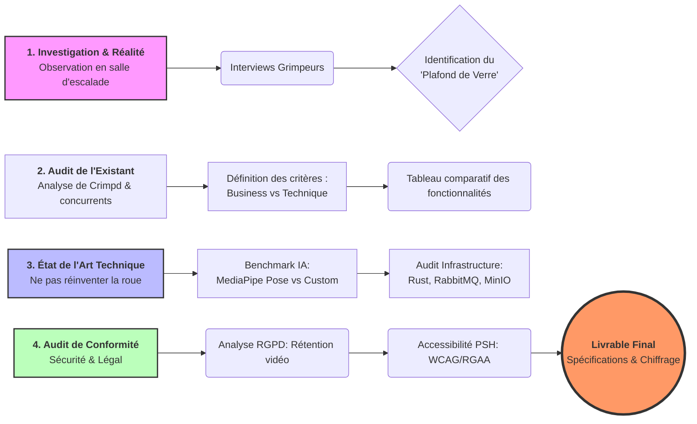
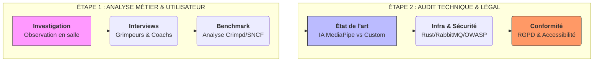
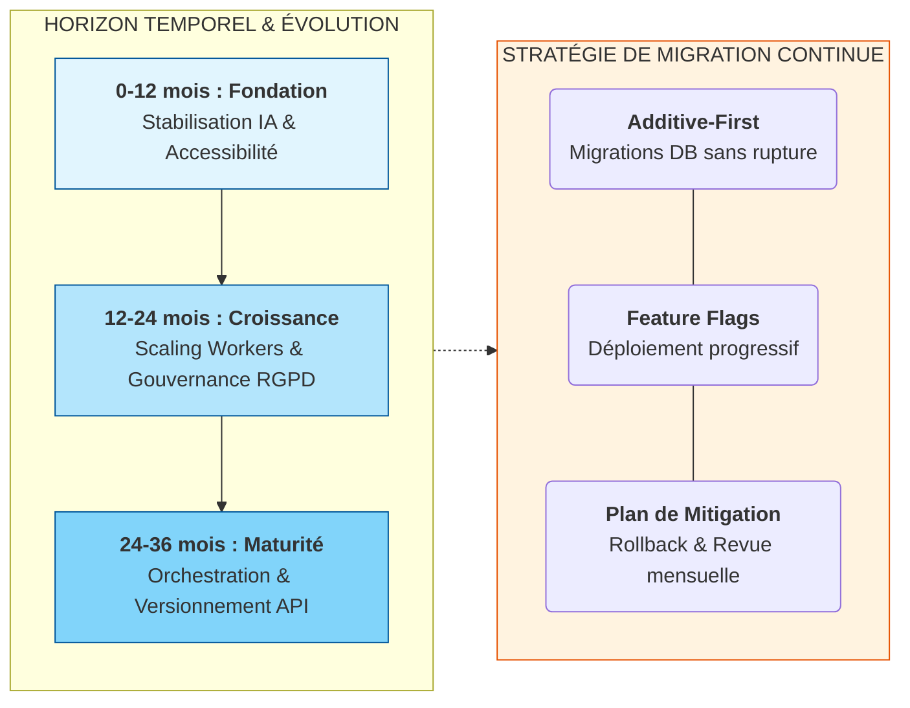
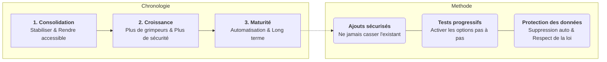

# Méthodologie d'Audit et de Conformité

L'objectif de cet audit était de définir l'écosystème complet dans lequel évolue **Ascension**. Nous avons dépassé la simple analyse de la concurrence pour intégrer des contraintes techniques, juridiques et humaines, garantissant ainsi que nous ne "réinventons pas la roue".

## 1. Analyse du Contexte Concurrentiel

Notre approche a combiné l'intuition brute et l'objectivité rationnelle pour positionner Ascension sur le marché.

-   **Formalisation de l'Intuition** : Nous sommes partis d'une conviction profonde : les grimpeurs ont besoin d'un feedback biomécanique précis, agnostique du lieu, pour dépasser leur plafond de verre.
    
-   **Définition de Critères Objectifs** : Pour nous comparer aux solutions existantes (comme Crimpd), nous avons établi des axes d'analyse précis:
    
    -   **Business** : Accessibilité (prix), dépendance aux bases de données de salles, facilité d'utilisation.
        
    -   **Technique** : Latence de traitement (cible < 60s), précision de l'extraction de squelette, consommation de batterie sur mobile.
        
-   **Outils de Visualisation** : Nous avons utilisé un **tableau comparatif de fonctionnalités** pour mettre en avant nos différenciateurs clés, notamment le **Mode Fantôme** et le rendu côté client.
    

## 2. Audit de l'État de l'Art Technique

Pour maximiser l'efficacité de notre développement, nous avons appliqué une stratégie de "Build vs Buy".

-   **Identification des Standards** : Plutôt que de développer nos propres modèles de vision par ordinateur, nous avons intégré des bibliothèques robustes comme **MediaPipe Pose** (33 points clés) et **PyTorch**.
    
-   **Services Tiers et APIs** : Nous utilisons des solutions standardisées pour les besoins transverses : **MinIO** pour le stockage compatible S3 et **RabbitMQ** pour la gestion asynchrone des tâches.
    
-   **Benchmark Technique** : Nous avons validé notre choix de **Rust (Axum)** pour l'API Gateway afin de garantir une sécurité mémoire native et des performances élevées (p95 < 200ms).
    

## 3. Conformité Légale et Sécurité

La gestion de vidéos d'utilisateurs impose une rigueur absolue en matière de protection des données.

-   **RGPD (GDPR)** : Nous avons audité les données collectées. Les vidéos non sauvegardées explicitement sont supprimées après 7 jours de notre bucket MinIO.
    
-   **Sécurité (OWASP)** : Nous avons identifié les risques majeurs, notamment l'injection de données via le JSONB de PostgreSQL et la sécurisation des uploads par **URL pré-signées** pour éviter l'exposition de nos clés secrètes S3.
    
-   **Accessibilité (A11y)** : Nous suivons les standards **WCAG** pour l'application Flutter, en nous concentrant sur les contrastes élevés pour une utilisation en salle d'escalade (souvent très lumineuse ou poussiéreuse).
    

## 4. Audit des Compétences de l'Équipe (HR)

Nous avons confronté l'ambition d'Ascension aux forces réelles de nos 5 membres.

-   **Matrice de Compétences** : Nous avons listé les besoins en IA (Python/PyTorch), Backend (Rust), Mobile (Flutter) et DevOps (Moonrepo/Docker).
    
-   **Analyse d'Écart (Gap Analysis)** : L'audit a révélé un besoin de montée en compétence sur l'intégration RabbitMQ pour Gianni et sur l'optimisation GPU pour Olivier.
    
-   **Plan d'Action** : Nous avons instauré des sessions de "Technology Watch" régulières et des POCs (Proof of Concept) pour valider l'intégration de chaque brique avant sa mise en production.

## Conclusion

### 1. Feuille de route d'évolution (Horizon 36 mois)

Notre stratégie est découpée en phases logiques pour absorber la croissance de la base utilisateur :

-   **Court terme (0–12 mois) :** Stabilisation du pipeline IA et industrialisation des tests d'accessibilité mobile pour les PSH.
    
-   **Moyen terme (12–24 mois) :** Passage à l'échelle via le scaling horizontal des workers IA (Python/MediaPipe) et durcissement de la gouvernance RGPD.
    
-   **Long terme (24–36 mois) :** Transition vers une orchestration plus robuste (type Kubernetes) selon le trafic et versionnement strict des contrats d'API pour éviter toute rupture de service client.
    

### 2. Stratégie de migration technique

Pour assurer une continuité de service, nous appliquons des principes de **déploiement continu** :

-   **Approche "Additive-first" :** Les modifications de schéma PostgreSQL sont d'abord additives (nouvelles colonnes/tables) pour maintenir la compatibilité avec les versions précédentes du code.
    
-   **Feature Flags :** Utilisation de drapeaux de fonctionnalités pour activer progressivement les nouvelles capacités (ex: Mode Fantôme) sans risquer une panne globale.
    
-   **Compatibilité ascendante :** Maintenance de la version N-1 des endpoints API durant les phases de transition.
    

### 3. Gouvernance et Mitigation des risques

Nous avons mis en place un cadre de suivi pour anticiper les points de rupture :

-   **Revue mensuelle des risques :** Analyse systématique de la sécurité, de la conformité légale et de l'accessibilité.
    
-   **Traçabilité des décisions :** Chaque changement d'architecture majeur est documenté (ADR - Architecture Decision Records) avant implémentation pour garantir la maintenabilité à long terme par n'importe quel membre de l'équipe.
-   

