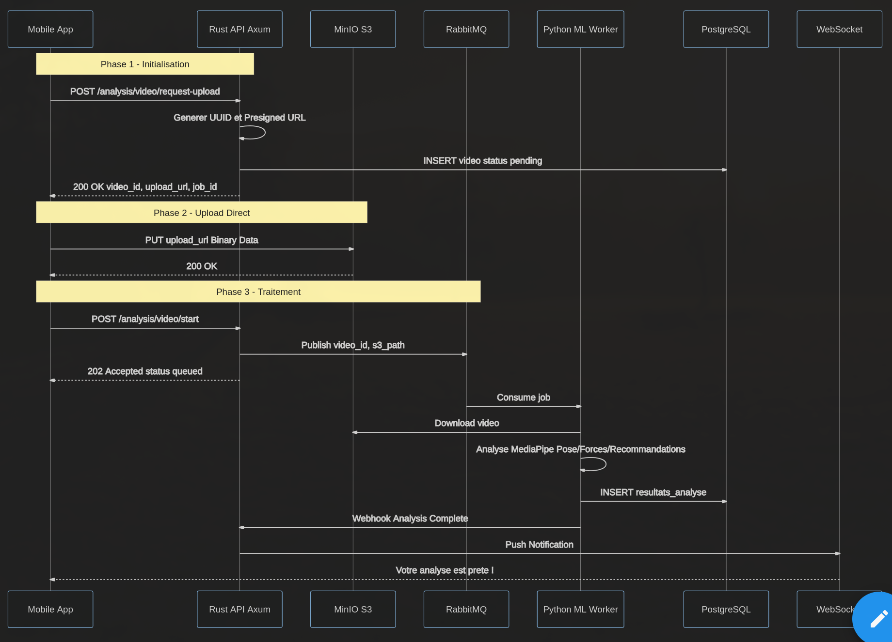

> **Last updated:** 2nd March 2026  
> **Version:** 1.0  
> **Authors:** Nicolas TORO  
> **Status:** Done  
> {.is-success}

---

# Mémo du Lundi 02/03/2026

Hello la team, suite au Kick-off voici ce qu'on a faire pour la journée :
- On doit définir nos scopes et objectifs donc faire un document qui précise ce que doit faire durant ces deux semaines
- On doit définir nos rôles, qui fait qquoi
- Le scénario de démo, comment on va faire notre démo
- Update le GitHub projects @nicolas_toro 
- Définir un environnement de travail -> Faire une documentation de chaque version de packets
- Faire un document de matériel

ya une IA qui transforme une photo en depth-map (on peut le combiner avec une autre qui segmente le corps (genre avant-bras, poignet etc)) et à partir de là on pourrait faire une visu 3D plutot qu'un exosquelette en 2D
C'est SAM (de Meta) l'ia 

@EIP 
**Pour résumé suite à notre conversion**

Les objectifs seraient :
- Avoir un début fonctionnel qui utilise toute nos technologie

Au niveau des scopes, on aimerait :
- Une IA qui analyse les forces / affiche l'exos squelette 
- Un linkage entre back et IA avec rabbit mq
- Une front qui marche, qui permet d'upload une vidéo et de lancer une analyse
- La vidéo doit être stocker sur MinIO
- La DB doit être setup avec les bon schèma

Voici comment on s'organise :
- @livo3192 s'occupe de faire une première IA utilisant MediaPipe
- @jundo va s'occuper du link entre l'IA et le Back-end grâce à RabbitMQ
- @itskarmaoff va s'occuper du front, faire qu'on puisse upload la vidéo etc
- @dimitri_lapoudre va s'occuper d'init le back et de travailler sur les premières routes
- @nicolas_toro va s'occuper de tous les trucs pro, GitHub projects etc, et ensuite je rejoindrais Lou et on s'organisera.

Petit brouillons d'informations du flow :
- Le back renvoie une URL ou tu peux upload une vidéo
- Comme sa le mbile envoie la vidéo sur l'url
- Un bouton analyse
- Sa envoie la requête au back, le serveur avec rabbit envoie le truc à l'ia, elle envoie la réponse en JSON au serveur, il la stocke dans la db et envoie la réponse au front
- Si on a finis on met l'auth
- Une IA est sortie pour obtenir la profondeur à partir d'une IA -> SAM3