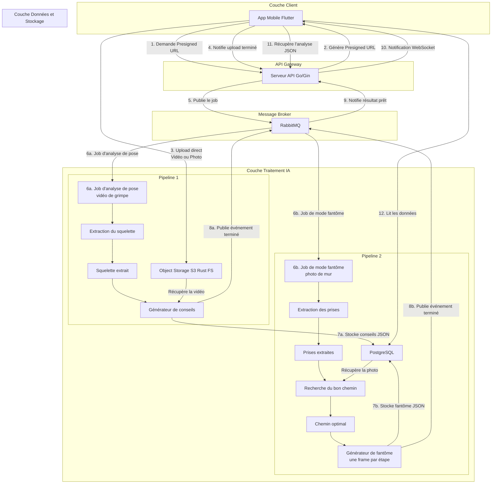

TODO

```mermaid
graph TD
    subgraph Couche Client
        App[App Mobile Flutter]
    end

    subgraph API Gateway
        Server[Serveur API Go/Gin]
    end

    subgraph Message Broker
        RMQ[RabbitMQ]
    end

    subgraph Couche Traitement IA
        subgraph Pipeline 1
            P1_Job[6a. Job d'analyse de pose<br>vidéo de grimpe] --> P1_Extract[Extraction du squelette]
            P1_Extract --> P1_Skel[Squelette extrait]
            P1_Skel --> P1_Gen[Générateur de conseils]
            S3[Object Storage S3 Rust FS] -->|Récupère la vidéo| P1_Gen
        end

        subgraph Pipeline 2
            P2_Job[6b. Job de mode fantôme<br>photo de mur] --> P2_Extract[Extraction des prises]
            P2_Extract --> P2_Prises[Prises extraites]
            P2_Prises --> P2_Search[Recherche du bon chemin]
            DB[PostgreSQL] -->|Récupère la photo| P2_Search
            P2_Search --> P2_Path[Chemin optimal]
            P2_Path --> P2_Ghost[Générateur de fantôme<br>une frame par étape]
        end
    end

    subgraph Couche Données et Stockage
        S3
        DB
    end

    %% Flux principaux
    App -->|1. Demande Presigned URL| Server
    Server -->|2. Génère Presigned URL| App
    App -->|3. Upload direct<br>Vidéo ou Photo| S3
    App -->|4. Notifie upload terminé| Server
    Server -->|5. Publie le job| RMQ

    RMQ -->|6a. Job d'analyse de pose| P1_Job
    RMQ -->|6b. Job de mode fantôme| P2_Job

    P1_Gen -->|7a. Stocke conseils JSON| DB
    P2_Ghost -->|7b. Stocke fantôme JSON| DB

    P1_Gen -->|8a. Publie événement terminé| RMQ
    P2_Ghost -->|8b. Publie événement terminé| RMQ

    RMQ -->|9. Notifie résultat prêt| Server
    Server -->|10. Notification WebSocket| App
    App -->|11. Récupère l'analyse JSON| Server
    App -->|12. Lit les données| DB
```
