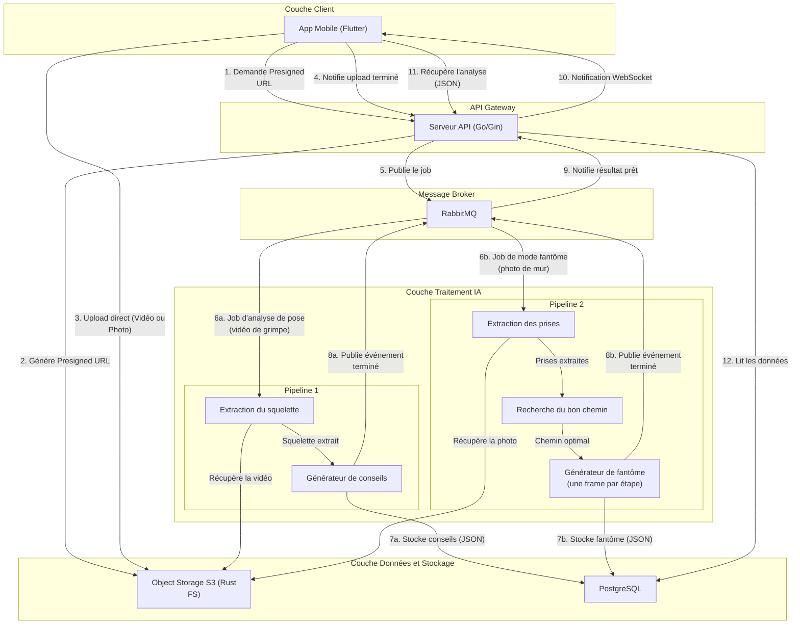

TODO

---

## Schèma du flow IA

```mermaid
flowchart TD
    subgraph Client ["Couche Client"]
        App["App Mobile (Flutter)"]
    end

    subgraph Gateway ["API Gateway"]
        API["Serveur API (Go/Gin)"]
    end

    subgraph Broker ["Message Broker"]
        RMQ["RabbitMQ"]
    end

    subgraph IA ["Couche Traitement IA"]
        subgraph P1 ["Pipeline 1"]
            ExtSkel["Extraction du squelette"]
            GenCons["Générateur de conseils"]
            ExtSkel -->|"Squelette extrait"| GenCons
        end

        subgraph P2 ["Pipeline 2"]
            ExtPrises["Extraction des prises"]
            RechChemin["Recherche du bon chemin"]
            GenFantome["Générateur de fantôme<br/>(une frame par étape)"]
            ExtPrises -->|"Prises extraites"| RechChemin
            RechChemin -->|"Chemin optimal"| GenFantome
        end
    end

    subgraph Data ["Couche Données et Stockage"]
        S3["Object Storage S3 (Rust<br/>FS)"]
        PG["PostgreSQL"]
    end

    %% Flux de communication (1 à 12)
    App -->|"1. Demande Presigned<br/>URL"| API
    API -->|"2. Génère Presigned URL"| S3
    App -->|"3. Upload direct (Vidéo ou<br/>Photo)"| S3
    App -->|"4. Notifie upload terminé"| API
    API -->|"5. Publie le job"| RMQ

    RMQ -->|"6a. Job d'analyse de pose<br/>(vidéo de grimpe)"| ExtSkel
    ExtSkel -->|"Récupère la vidéo"| S3
    GenCons -->|"7a. Stocke conseils (JSON)"| PG
    GenCons -->|"8a. Publie événement<br/>terminé"| RMQ

    RMQ -->|"6b. Job de mode fantôme<br/>(photo de mur)"| ExtPrises
    ExtPrises -->|"Récupère la photo"| S3
    GenFantome -->|"7b. Stocke fantôme (JSON)"| PG
    GenFantome -->|"8b. Publie événement<br/>terminé"| RMQ

    RMQ -->|"9. Notifie résultat prêt"| API
    API -->|"10. Notification WebSocket"| App
    App -->|"11. Récupère l'analyse<br/>(JSON)"| API
    API -->|"12. Lit les données"| PG
```
