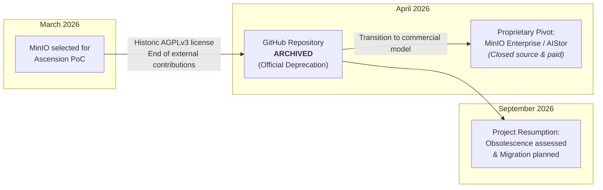

:::success
**Version:** 1.0
:::

---

# Technical Audit: MinIO Community Edition Deprecation and Associated Risks

This audit documents the state of the **MinIO Community Edition** object storage component within the Ascension project, details the root causes of its sudden obsolescence in 2026, evaluates technical, legal, and operational risks, and formally justifies the decision to abandon this technology in favor of a sustainable alternative.

---

## 1\. Context

At the inception of engineering work in March 2026, Ascension's architecture was designed around a fundamental principle: the asynchronous, decoupled processing of voluminous climbing videos (ranging from 50 MB to several GB per session).

To prevent saturating the Go API Gateway (`apps/server`) and ensure optimal scalability at low cost, the application relies on the **Edge Upload & Rendering** pattern:

- The mobile client (Flutter) requests an upload token from the API.
- The API returns a **presigned S3 URL** with strict constraints (size, MIME type, expiration).
- The smartphone directly uploads the raw video to the object storage bucket without passing through the application server.
- The Python biomechanical analysis workers (`apps/ai`) retrieve the raw video, extract 33 2D skeletal keypoints per frame via MediaPipe, build the 3D biomechanical model, and store intermediate and final artifacts (thumbnails, crops, coordinate JSON files).

In this architecture, S3-compatible object storage is a mission-critical system component. In March 2026, **MinIO Community Edition** was selected as the default storage solution due to its historical reputation, compliance with the AWS S3 API, and perceived ease of integration via Docker Compose.

---

## 2\. The September 2026 Disruption: Deprecation Findings

During the intensive project resumption in September 2026, an infrastructure maintenance and security review revealed a major disruption in the MinIO open-source ecosystem.

The official upstream repository (`minio/minio`) was **archived on April 25, 2026**, accompanied by an immediate and explicit deprecation notice from the maintainers: **MinIO Community Edition is officially deprecated and no longer maintained**.

*Figure 1: Evolution of MinIO between March and September 2026, highlighting the repository archival, proprietary pivot, and Ascension's migration decision.*

### 2.1 Causes of the Upstream Abandonment

The archiving of the project stems from a radical strategic pivot by the vendor, MinIO Inc.:

1. **Pivot to a closed commercial model (MinIO Enterprise / AIStor)**: The vendor concentrated all of its R&D and product offerings on proprietary paid solutions targeted at enterprise clients and enterprise AI infrastructure, billed per capacity and per physical node.
2. **Definitive abandonment of the community edition**: Contrary to open-source governance best practices where a project may be transferred to a foundation (e.g., Linux Foundation, CNCF), MinIO Inc. chose to lock the repository without handing over governance to a neutral organization.
3. **Closure of contribution channels**: Pull requests, issue tracking, and public discussions were disabled, preventing the community from contributing any fixes or patches to the main repository.

---

## 3\. Impact Analysis and Critical Risks for Ascension

Retaining MinIO Community Edition in production in its frozen April 2026 state introduces unacceptable risks to the Ascension project across security, technical reliability, and legal compliance.

### 3.1 Security Risk: End of Patches and Major Vulnerabilities

Ascension's object storage is directly exposed to the public network (via reverse proxy or ingress controller) to allow climbers' phones to upload videos using presigned URLs.

Historically, MinIO has been subject to multiple vulnerabilities of **High** to **Critical** severity:

- **CVE-2023-28432 (Critical Severity 9.8)**: Sensitive information leak exposing server environment variables, including administrative root credentials (`MINIO_ROOT_USER` and `MINIO_ROOT_PASSWORD`).
- **CVE-2023-28434 (High Severity 8.8)**: Multi-node request security bypass allowing attackers to alter access configurations.
- **IAM Bypass and SSRF Vulnerabilities**: Several flaws discovered across versions allowed abuse of administration endpoints or server-side request forgery against internal networks.

:::warning
**Absolute Security Veto**: By freezing the source code as of April 25, 2026, MinIO Inc. no longer publishes any security patches for the Community Edition. Any future *Zero-Day* vulnerability or newly discovered exploit will remain unpatched on our infrastructure, creating a direct attack vector against our users' private data.
:::

### 3.2 Reliability and Technical Obsolescence Risks

1. **Divergence from AWS S3 SDKs**: Official client SDKs (AWS SDK for Go v2, `boto3` in Python, Dart packages in Flutter) continue to evolve, optimizing checksum algorithms (e.g., streaming SHA256/CRC32C) and updating TLS negotiation and Signature Version 4 standards. A frozen storage server will eventually exhibit subtle yet blocking incompatibilities during multipart uploads or requests with preconditions.
2. **Lack of support for modern operating systems and hardware**: MinIO's low-level dependencies (Go compiler, cryptographic libraries, disk I/O drivers) will no longer receive updates, preventing the use of hardware optimizations on modern CPUs and Linux kernels.
3. **Unresolved bugs in the erasure coding engine**: Edge cases involving silent corruption, metadata inconsistencies (`.minio.sys`) following unexpected shutdowns, or network partitioning will receive no upstream fixes.

### 3.3 Legal Risk and Regulatory Compliance (GDPR & Intellectual Property)

1. **GDPR Compliance (Article 32 - Security of processing)**: The Ascension project processes sensitive personal data: identifiable climber videos, body silhouettes, and biomechanical data from 2D/3D pose extraction. Article 32 of the GDPR requires the data controller to implement technical and organizational measures ensuring a level of security appropriate to the risk, taking into account "the state of the art". Operating a deprecated storage system in production that has been publicly abandoned by its vendor and stripped of security updates constitutes a direct breach of this legal obligation.
2. **AGPLv3 License Complexity**: MinIO was distributed under the AGPLv3 (*GNU Affero General Public License*). This license imposes strict copyleft requirements whenever the software is modified or interfaced over a network. In a commercial SaaS context (Ascension's Freemium, Premium, and Infinity subscriptions), AGPLv3 presents legal contagion risks for surrounding software components.

---

## 4\. Evaluation of Considered Scenarios

In light of this deprecation, the engineering team evaluated three strategic options:

| Scenario | Description | Feasibility | Assessment |
| --- | --- | --- | --- |
| **1\. Status quo (Keep MinIO Community)** | Continue running the Docker image `minio/minio:RELEASE.2025-09-07T16-13-09Z`. | No | **Unacceptable**: Permanent critical security risk, GDPR non-compliance, accumulating technical debt upon public launch. |
| **2\. Adopt a community fork (e.g., Silo)** | Migrate to Silo, a community fork maintaining the `.minio.sys` format and existing configuration. | Partial | **Risky long-term**: Although Silo eases immediate migration, it relies on a very young volunteer community with no 3-year viability guarantee. It also retains the AGPLv3 license. |
| **3\. Migrate to a modern Object Storage engine** | Replace MinIO with an actively developed, performant open-source solution suited for our video workload (RustFS, Garage, SeaweedFS, Ceph). | Yes | **Recommended**: Eliminates technical debt, restores security coverage, unlocks better performance, and offers a more permissive license. |

---

## 5\. MinIO Risk Evaluation Matrix

The table below summarizes the severity of the risks associated with retaining MinIO in the Ascension architecture:

| Risk Dimension | Triggering Factor | Likelihood | Impact | Risk Level | Engineering Decision |
| --- | --- | --- | --- | --- | --- |
| **Application Security** | End of CVE patches, zero-day vulnerabilities | High | Critical | **Unacceptable** | Immediate veto on production deployment. |
| **Data Integrity** | Potential unpatched metadata corruption | Medium | High | **Major** | Refusal to entrust user videos to a frozen engine. |
| **Software Compatibility** | Evolution of AWS S3 SDKs (Go, Python, Dart) | High | Medium | **Major** | Risk of parsing errors and intermittent upload failures. |
| **GDPR Compliance** | Biometric data hosted on an unpatched component | High | Critical | **Unacceptable** | Risk of regulatory penalties (CNIL) and EIP compliance violation. |
| **Intellectual Property** | AGPLv3 license constraints in cloud environments | Medium | Medium | **Moderate** | Preference for a permissive license (e.g., Apache-2.0). |

---

## 6\. Conclusion and Engineering Decision

The technical audit confirms that **MinIO Community Edition cannot under any circumstances remain part of Ascension's technology stack**. Its abandonment by its creators in April 2026 turns what was once a solid foundation into critical technical debt and a major security liability.

The team's unanimous decision is:

1. **Complete removal of MinIO** across all repositories, deployment configurations (`docker-compose.yml`, `devenv.nix`, Kubernetes), and CI/CD pipelines.
2. **Conduct an in-depth benchmark** of alternative solutions (RustFS, Garage, SeaweedFS, Ceph) to identify the most performant, simple, and secure replacement for our video workflows.
3. **Maintain a strict abstraction protocol** within our Go and Python server adapters to ensure total independence from the underlying object storage implementation.
