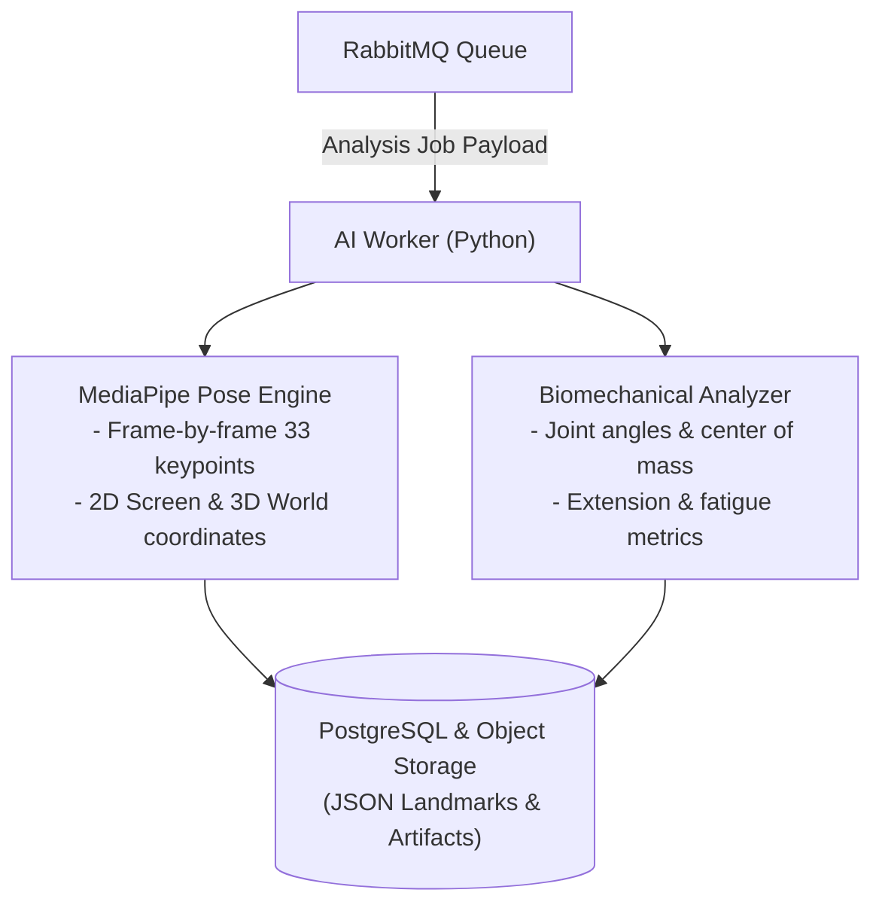

:::success
**Version:** 1.0
:::

---

# AI Architecture Benchmark: Language, Worker Decoupling & Pose Models

This benchmark documents the foundational architectural and technological choices for the Ascension AI subsystem. It analyzes the decisions regarding system coupling (in-process backend execution vs standalone asynchronous workers), language selection (Python vs Go, Rust, or C++), and the comparative evaluation of computer vision models for human pose estimation and biomechanical analysis.

---

## 1. Context & AI Workload Requirements

Ascension transforms smartphone climbing footage into biomechanical coaching intelligence. The AI subsystem must perform computationally intensive tasks:

- **Temporal Video Processing**: Ingestion of MP4 video files ranging from 10 to 60 seconds (300 to 1,800 frames at 30 FPS).
- **Body Pose Estimation**: Precise extraction of 33 anatomical keypoints per frame, including limbs, torso, and facial orientation.
- **3D World Landmark Metric Extraction**: Derivation of real-world coordinates in meters (origin centered at the hip midpoint) to calculate joint angles, center of mass, and body tension independent of camera perspective.
- **Biomechanical Analysis & Coaching Advice**: Detection of movement patterns (dynamic lunges, static locking, hip proximity to wall) and rule/LLM-based coaching advice generation.

_Figure: Asynchronous AI pipeline detailing pose extraction and biomechanical inference within the Python worker._

---

## 2. Team Competencies Baseline

At the inception of the AI pipeline design, the team possessed the following skill distribution:

| Technology / Domain | Team Proficiency Level    | Relevance to AI                                                       |
| :------------------ | :------------------------ | :-------------------------------------------------------------------- |
| **Python**          | Mastered by all 5 members | Core language of modern machine learning and computer vision.         |
| **TypeScript**      | Mastered by all 5 members | Experienced in full-stack orchestration, but limited deep ML tooling. |
| **Go & Rust**       | Partial / basic knowledge | Strong for systems/networking, but experimental ML ecosystems.        |
| **C++**             | Mastered by all 5 members | High performance, but high memory-management and build complexity.    |

Because the entire team was already fluent in Python and its scientific ecosystem (NumPy, SciPy, OpenCV, PyTorch), selecting Python for AI eliminated language learning friction.

---

## 3. Part 1: Language & Architectural Decoupling

Before evaluating specific computer vision models, the team evaluated two fundamental architectural questions:

### 3.1 Architectural Pattern: Embedded Monolith vs Decoupled Workers

| Strategy                       | Architecture                                                              | Advantages                                                                                                                   | Critical Drawbacks                                                                                                                            |
| :----------------------------- | :------------------------------------------------------------------------ | :--------------------------------------------------------------------------------------------------------------------------- | :-------------------------------------------------------------------------------------------------------------------------------------------- |
| **Embedded in Backend**        | AI inference runs in-process within the API Gateway (Go or Rust).         | Zero network serialization between API and AI; single deployed binary.                                                       | **Fatal for stability**: CPU/GPU-intensive video decoding blocks HTTP threads, memory leaks crash the web server, no independent autoscaling. |
| **Decoupled Workers (Chosen)** | Independent worker processes communicating via message queues (RabbitMQ). | Total fault isolation; AI crashes never impact API availability; independent horizontal autoscaling of GPU/CPU worker pools. | Minor queue latency (~5-10ms) and data serialization overhead.                                                                                |

**Decision**: The team adopted the **Decoupled Worker pattern**. The API Gateway handles client HTTP requests and presigned upload URLs, while AI workers consume jobs asynchronously from RabbitMQ queues.

### 3.2 Language Selection for AI Workers

| Language            | Ecosystem & Libraries                                       | Performance Profile                                       | Team Velocity                                                           | Verdict      |
| :------------------ | :---------------------------------------------------------- | :-------------------------------------------------------- | :---------------------------------------------------------------------- | :----------- |
| **Python (Chosen)** | Industry standard (MediaPipe, PyTorch, OpenCV, Ultralytics) | High throughput via C/C++ optimized C-extensions and CUDA | **Fastest**: Entire team proficient; rapid prototyping to production    | **Selected** |
| **Go**              | GoCV (OpenCV wrappers), ONNX Runtime Go bindings            | Excellent concurrency, moderate ML support                | Slower: Fragile CGo bindings, lack of mature pose estimation models     | Rejected     |
| **Rust**            | Tract, Candle, Burn, ONNX bindings                          | Highest CPU performance, strict memory safety             | Very slow: Immature CV ecosystem; high development overhead             | Rejected     |
| **C++**             | Native MediaPipe C++, LibTorch, OpenCV native               | Maximum raw execution speed                               | High maintenance: Complex build systems (Bazel), prone to memory errors | Rejected     |

**Decision**: **Python 3.11+** was selected. The core computational bottlenecks of computer vision (video decoding, matrix manipulation, neural network inference) are executed in C++ under the hood by OpenCV, NumPy, and MediaPipe. Writing the orchestration and analysis logic in Python maximized productivity without sacrificing runtime execution speed.

---

## 4. Part 2: Pose Estimation Model

Four computer vision solutions for human pose tracking were evaluated on climbing video datasets:

1. **Google MediaPipe Pose (Tasks Vision / PoseLandmarker)**:
   - Deep learning solution predicting 33 body landmarks (including hands and feet) in both 2D image coordinates and 3D real-world coordinates.
2. **YOLOv8-Pose (Ultralytics)**:
   - Single-stage object detector and keypoint estimator outputting 17 COCO keypoints.
3. **OpenPose / MMPose**:
   - Bottom-up / top-down multi-person pose estimation architectures.
4. **Custom PyTorch CNN / Transformer**:
   - Proprietary neural network trained from scratch on climbing hold and body position datasets.

### Evaluation Criteria

- **Keypoint Topology & Precision**: Number of anatomical landmarks and coverage of extremities (fingers, heels, wrists, toes).
- **Native 3D Coordinate Support**: Capability to estimate real-world metric depth ($X, Y, Z$ in meters) for biomechanical angle calculation.
- **Inference Speed (FPS)**: Frame rate achievable on standard CPU and entry-level GPU hardware.
- **Occlusion Resilience**: Ability to track limbs when climber bodies partially obscure holds or crossed limbs.
- **Deployment Footprint**: Model size, container image overhead, and dependency complexity.

---

## 5. Comparative Pose Model Matrix

| Evaluation Criterion           | MediaPipe Pose                          | YOLOv8-Pose                  | OpenPose / MMPose                 | Custom PyTorch CNN             | Winner               |
| :----------------------------- | :-------------------------------------- | :--------------------------- | :-------------------------------- | :----------------------------- | :------------------- |
| **Landmark Count**             | **33 Keypoints** (Full body + feet)     | 17 Keypoints (COCO standard) | 25 Keypoints (BODY_25)            | Variable (Task specific)       | **MediaPipe**        |
| **3D World Coordinates**       | **Native** (Metric $(X,Y,Z)$ in meters) | None (2D pixel only)         | Pseudo-3D (Requires stereo/depth) | High training complexity       | **MediaPipe**        |
| **Inference FPS (CPU)**        | **30 - 60+ FPS** (Real-time)            | 15 - 30 FPS                  | 2 - 5 FPS (Very slow)             | 10 - 25 FPS                    | **MediaPipe**        |
| **Inference FPS (GPU)**        | **90+ FPS**                             | 80+ FPS                      | 20 - 35 FPS                       | 40 - 60 FPS                    | **MediaPipe / YOLO** |
| **Model Tiers Available**      | **Lite, Full, Heavy**                   | Nano, Small, Medium, Large   | Single large model                | Custom                         | **MediaPipe / YOLO** |
| **Model File Size**            | **3 - 25 MB**                           | 6 - 80 MB                    | 200+ MB                           | Variable                       | **MediaPipe**        |
| **Occlusion Tracking**         | High (Temporal smoothing filter)        | Good bounding box detection  | Weak on dynamic crossings         | Requires massive training data | **MediaPipe**        |
| **Climbing Feet/Toe Tracking** | **Detailed toe & heel keypoints**       | Ankle only (No toe/heel)     | Foot keypoints available          | Custom                         | **MediaPipe**        |

---

## 6. Decision & Implementation: MediaPipe Pose Landmarker

### Why MediaPipe Pose Was Chosen

1. **33 Anatomical Keypoints with Foot Details**: Climbing analysis requires exact knowledge of where the climber's toes and heels are placed on footholds. COCO-based models (YOLOv8-Pose) only provide ankles, which is insufficient for climbing technique analysis.
2. **Native 3D World Landmarks**: MediaPipe predicts world landmarks $(X, Y, Z)$ expressed in meters with the origin at the hips. This enables Ascension to calculate true 3D joint angles (elbow flexion, knee extension, hip-to-wall distance) without camera calibration markers.
3. **Multi-Tiered Architecture**:
   - `pose_landmarker_lite.task` (approx. 5 MB): Optimized for instant edge inference and rapid previews.
   - `pose_landmarker_full.task` (approx. 12 MB): Balanced speed and precision for standard worker jobs.
   - `pose_landmarker_heavy.task` (approx. 25 MB): Maximum landmark accuracy for rigorous biomechanical evaluations.
4. **Efficiency & Packaging**: MediaPipe runs smoothly in standard Docker containers without requiring multi-gigabyte PyTorch GPU dependencies for baseline operations.
