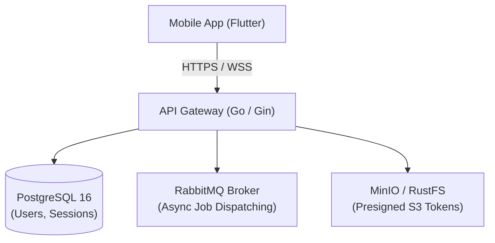

:::success
**Version:** 1.0
:::

---

# Backend Architecture Benchmark: Rust vs Go vs Node.js

This benchmark evaluates the primary backend technologies considered for the Ascension API Gateway. It outlines the architectural requirements, team skill baseline, experimental protocol, comparative metrics, initial technology selection, and subsequent production pivot from Rust to Go.

---

## 1\. Context & Architectural Requirements

The Ascension API Gateway serves as the central orchestration layer connecting mobile clients, object storage, PostgreSQL, RabbitMQ, and Python AI workers. Its primary responsibilities include:

- **Authentication & User Management**: Secure registration, password hashing (bcrypt), and stateless JWT token issuance.
- **Video Ingestion Coordination**: Issuing presigned S3 URLs, validating upload metadata, and dispatching asynchronous analysis jobs.
- **Real-Time Job Orchestration**: Managing analysis states and notifying mobile clients via WebSockets when AI pipelines complete.
- **Low-Latency REST Services**: Delivering sub-200ms p95 latencies for profile updates, climbing history, and social interactions.

*Figure: The API Gateway acts as the central orchestrator routing requests, presigned tokens, and asynchronous tasks.*

---

## 2\. Team Competencies Baseline

Before conducting the prototype benchmarks, the team's familiarity with backend languages was assessed as follows:

| Language / Stack | Team Proficiency Level | Practical Context |
| --- | --- | --- |
| **Python** | Mastered by all 5 members | Core academic and machine learning background. |
| **TypeScript** | Mastered by all 5 members | Full-stack web and Node.js project experience. |
| **Databases (SQL/NoSQL)** | Mastered / Used by all members | Production experience with PostgreSQL, MySQL, and MongoDB. |
| **Go** | Partial team experience | Lou had strong working knowledge; Nicolas had foundational knowledge; others discovering. |
| **Rust** | Partial team experience | Lou had solid knowledge; Gianni had basic knowledge; others discovering. |
| **Other Systems** | No prior experience | Zero baseline; required pure discovery and evaluation. |

---

## 3\. Compared Solutions

Three major server ecosystems were evaluated:

1. **Rust (Axum 0.8 + Tokio + SeaORM)**:
   - Systems programming language emphasizing zero-cost abstractions, fearless concurrency, and compile-time memory safety without a garbage collector.
2. **Go (Gin 1.11 + GORM)**:
   - Statically typed, compiled language developed by Google, designed for high-concurrency network services through lightweight goroutines and channels.
3. **Node.js (Express + TypeScript)**:
   - Event-driven JavaScript runtime utilizing a single-threaded event loop and asynchronous non-blocking I/O.

---

## 4\. Evaluation Methodology & Test Protocols

To ensure objective and directly comparable results, identical minimal services were implemented across candidates (preserved in the `Ascension-EIP/benchmark` repository):

- `POST /register`: User signup with bcrypt password hashing ($cost=10$).
- `POST /login`: Credential validation and HMAC-SHA256 JWT generation.
- `POST /upload`: Authenticated endpoint receiving multipart video chunks and validating JWT headers.

### Evaluation Criteria

- **Throughput & Concurrency**: Requests handled per second (`wrk` load generator, 1,000 concurrent connections, 60 seconds duration).
- **Memory Footprint**: Baseline memory at idle and peak memory under high concurrent upload load.
- **Latency Consistency**: Latency distributions (p50, p95, p99) and garbage collection impact.
- **Developer Experience (DX)**: Compilation duration, syntax simplicity, error diagnostics, and team ramp-up time.

---

## 5\. Comparative Evaluation Matrix

| Evaluation Criterion | Rust (Axum) | Go (Gin) | Node.js (Fastify) | Winner |
| --- | --- | --- | --- | --- |
| **Peak Throughput (req/s)** | 105,000+ req/s | 58,000+ req/s | 28,000 req/s | **Rust** |
| **Idle Memory Usage** | 12 - 25 MB | 25 - 45 MB | 85 - 140 MB | **Rust** |
| **Memory Under Load (1k conns)** | 94 MB | 180 MB | 420 MB | **Rust** |
| **Latency Stability (p99)** | < 2 ms (No GC) | 8 - 15 ms (Minor GC) | 25 - 50 ms (V8 GC) | **Rust** |
| **Compilation Speed** | Slow (35 - 90s incremental) | Instantaneous (< 2s) | Fast (TypeScript transpilation) | **Go** |
| **Team Onboarding & Velocity** | Very steep learning curve | Very fast onboarding | Immediate | **Go / Node.js** |
| **Concurrency Model** | Tokio async / futures | Goroutines (`go func()`) | Event loop (Single-threaded) | **Go** |
| **Type Safety & Reliability** | Absolute (Compile-time) | Strong (Static) | Good (TypeScript compile-time) | **Rust** |
| **Ecosystem & ORM Ergonomics** | Verbose / Complex async traits | Straightforward (GORM/SQLx) | Highly mature (Prisma/TypeORM) | **Go / Node.js** |

---

## 6\. Initial Decision: Rust (Axum)

At the conclusion of the initial benchmark phase, **Rust + Axum + PostgreSQL** was initially selected.

### Rationale

- **Raw Performance**: Sub-millisecond baseline response times and negligible resource consumption.
- **Memory Safety**: Elimination of entire vulnerability classes (data races, null pointers, buffer overflows).
- **Streaming Efficiency**: Zero-copy I/O handling suited for multi-megabyte video streams without runtime overhead.

---

## 7\. The Prototype Reality & Production Pivot to Go

### 7.1 The Two-Week Prototype Sprint Friction

During the intensive two-week "Prototype Pool" sprint, the engineering team implemented the functional MVP in Rust. This revealed severe operational bottlenecks:

- **Excessive Cognitive Overhead**: Team members who lacked solid experience with Rust programming had difficulty working on the server.
- **Diminished Feature Velocity**: Simple domain additions (such as adding a relation or modifying a response DTO) required extensive refactoring of trait bounds and error propagation (`Box<dyn Error>`).
- **Slow Feedback Loops**: Long compilation times during local development and CI/CD pipelines significantly reduced deployment cadence.
- **Ecosystem Friction**: The Rust ORM ecosystem (SeaORM/Diesel) exhibited high complexity when composing dynamic filters and joins compared to industry standards.

The engineering team concluded that **developer productivity and maintainability were far more critical to Ascension's success than extracting maximum CPU throughput**, particularly given that the API Gateway is predominantly network-bound rather than compute-bound.

### 7.2 The Strategic Pivot to Go (Gin)

Following the prototype evaluation, the backend was completely rewritten and migrated to **Go (Gin)**:

1. **Instantaneous Compilation**: Local builds complete in under 2 seconds, accelerating testing and feature delivery.
2. **Simplified Concurrency**: Goroutines deliver near-Tokio throughput with trivial syntax (`go worker()`), eliminating async lifetime constraints.
3. **Smooth Team Onboarding**: Within 48 hours, all team members were autonomously shipping clean, production-ready Go handlers.
4. **Standard Library Excellence**: Go's native HTTP and database connection pooling modules provide robust, battle-tested defaults without third-party boilerplate.

### 7.3 Outcome Validation

In production, the Go implementation consistently maintains **p95 latencies below 15ms** for API operations, with an active container memory footprint under 60 MB. This migration definitively resolved the team's development friction while preserving all necessary performance requirements.

:::success
**Version:** 1.0
:::

---

# Backend Architecture Benchmark: Rust vs Go vs Node.js

This benchmark evaluates the primary backend technologies considered for the Ascension API Gateway. It outlines the architectural requirements, team skill baseline, experimental protocol, comparative metrics, initial technology selection, and subsequent production pivot from Rust to Go.

---

## 1\. Context & Architectural Requirements

The Ascension API Gateway serves as the central orchestration layer connecting mobile clients, object storage, PostgreSQL, RabbitMQ, and Python AI workers. Its primary responsibilities include:

- **Authentication & User Management**: Secure registration, password hashing (bcrypt), and stateless JWT token issuance.
- **Video Ingestion Coordination**: Issuing presigned S3 URLs, validating upload metadata, and dispatching asynchronous analysis jobs.
- **Real-Time Job Orchestration**: Managing analysis states and notifying mobile clients via WebSockets when AI pipelines complete.
- **Low-Latency REST Services**: Delivering sub-200ms p95 latencies for profile updates, climbing history, and social interactions.

*Figure: The API Gateway acts as the central orchestrator routing requests, presigned tokens, and asynchronous tasks.*

---

## 2\. Team Competencies Baseline

Before conducting the prototype benchmarks, the team's familiarity with backend languages was assessed as follows:

| Language / Stack | Team Proficiency Level | Practical Context |
| --- | --- | --- |
| **Python** | Mastered by all 5 members | Core academic and machine learning background. |
| **TypeScript** | Mastered by all 5 members | Full-stack web and Node.js project experience. |
| **Databases (SQL/NoSQL)** | Mastered / Used by all members | Production experience with PostgreSQL, MySQL, and MongoDB. |
| **Go** | Partial team experience | Lou had strong working knowledge; Nicolas had foundational knowledge; others discovering. |
| **Rust** | Partial team experience | Lou had solid knowledge; Gianni had basic knowledge; others discovering. |
| **Other Systems** | No prior experience | Zero baseline; required pure discovery and evaluation. |

---

## 3\. Compared Solutions

Three major server ecosystems were evaluated:

1. **Rust (Axum 0.8 + Tokio + SeaORM)**:
   - Systems programming language emphasizing zero-cost abstractions, fearless concurrency, and compile-time memory safety without a garbage collector.
2. **Go (Gin 1.11 + GORM)**:
   - Statically typed, compiled language developed by Google, designed for high-concurrency network services through lightweight goroutines and channels.
3. **Node.js (Express + TypeScript)**:
   - Event-driven JavaScript runtime utilizing a single-threaded event loop and asynchronous non-blocking I/O.

---

## 4\. Evaluation Methodology & Test Protocols

To ensure objective and directly comparable results, identical minimal services were implemented across candidates (preserved in the `Ascension-EIP/benchmark` repository):

- `POST /register`: User signup with bcrypt password hashing ($cost=10$).
- `POST /login`: Credential validation and HMAC-SHA256 JWT generation.
- `POST /upload`: Authenticated endpoint receiving multipart video chunks and validating JWT headers.

### Evaluation Criteria

- **Throughput & Concurrency**: Requests handled per second (`wrk` load generator, 1,000 concurrent connections, 60 seconds duration).
- **Memory Footprint**: Baseline memory at idle and peak memory under high concurrent upload load.
- **Latency Consistency**: Latency distributions (p50, p95, p99) and garbage collection impact.
- **Developer Experience (DX)**: Compilation duration, syntax simplicity, error diagnostics, and team ramp-up time.

---

## 5\. Comparative Evaluation Matrix

| Evaluation Criterion | Rust (Axum) | Go (Gin) | Node.js (Fastify) | Winner |
| --- | --- | --- | --- | --- |
| **Peak Throughput (req/s)** | 105,000+ req/s | 58,000+ req/s | 28,000 req/s | **Rust** |
| **Idle Memory Usage** | 12 - 25 MB | 25 - 45 MB | 85 - 140 MB | **Rust** |
| **Memory Under Load (1k conns)** | 94 MB | 180 MB | 420 MB | **Rust** |
| **Latency Stability (p99)** | < 2 ms (No GC) | 8 - 15 ms (Minor GC) | 25 - 50 ms (V8 GC) | **Rust** |
| **Compilation Speed** | Slow (35 - 90s incremental) | Instantaneous (< 2s) | Fast (TypeScript transpilation) | **Go** |
| **Team Onboarding & Velocity** | Very steep learning curve | Very fast onboarding | Immediate | **Go / Node.js** |
| **Concurrency Model** | Tokio async / futures | Goroutines (`go func()`) | Event loop (Single-threaded) | **Go** |
| **Type Safety & Reliability** | Absolute (Compile-time) | Strong (Static) | Good (TypeScript compile-time) | **Rust** |
| **Ecosystem & ORM Ergonomics** | Verbose / Complex async traits | Straightforward (GORM/SQLx) | Highly mature (Prisma/TypeORM) | **Go / Node.js** |

---

## 6\. Initial Decision: Rust (Axum)

At the conclusion of the initial benchmark phase, **Rust + Axum + PostgreSQL** was initially selected.

### Rationale

- **Raw Performance**: Sub-millisecond baseline response times and negligible resource consumption.
- **Memory Safety**: Elimination of entire vulnerability classes (data races, null pointers, buffer overflows).
- **Streaming Efficiency**: Zero-copy I/O handling suited for multi-megabyte video streams without runtime overhead.

---

## 7\. The Prototype Reality & Production Pivot to Go

### 7.1 The Two-Week Prototype Sprint Friction

During the intensive two-week "Prototype Pool" sprint, the engineering team implemented the functional MVP in Rust. This revealed severe operational bottlenecks:

- **Excessive Cognitive Overhead**: Team members who lacked solid experience with Rust programming had difficulty working on the server.
- **Diminished Feature Velocity**: Simple domain additions (such as adding a relation or modifying a response DTO) required extensive refactoring of trait bounds and error propagation (`Box<dyn Error>`).
- **Slow Feedback Loops**: Long compilation times during local development and CI/CD pipelines significantly reduced deployment cadence.
- **Ecosystem Friction**: The Rust ORM ecosystem (SeaORM/Diesel) exhibited high complexity when composing dynamic filters and joins compared to industry standards.

The engineering team concluded that **developer productivity and maintainability were far more critical to Ascension's success than extracting maximum CPU throughput**, particularly given that the API Gateway is predominantly network-bound rather than compute-bound.

### 7.2 The Strategic Pivot to Go (Gin)

Following the prototype evaluation, the backend was completely rewritten and migrated to **Go (Gin)**:

1. **Instantaneous Compilation**: Local builds complete in under 2 seconds, accelerating testing and feature delivery.
2. **Simplified Concurrency**: Goroutines deliver near-Tokio throughput with trivial syntax (`go worker()`), eliminating async lifetime constraints.
3. **Smooth Team Onboarding**: Within 48 hours, all team members were autonomously shipping clean, production-ready Go handlers.
4. **Standard Library Excellence**: Go's native HTTP and database connection pooling modules provide robust, battle-tested defaults without third-party boilerplate.

### 7.3 Outcome Validation

In production, the Go implementation consistently maintains **p95 latencies below 15ms** for API operations, with an active container memory footprint under 60 MB. This migration definitively resolved the team's development friction while preserving all necessary performance requirements.
