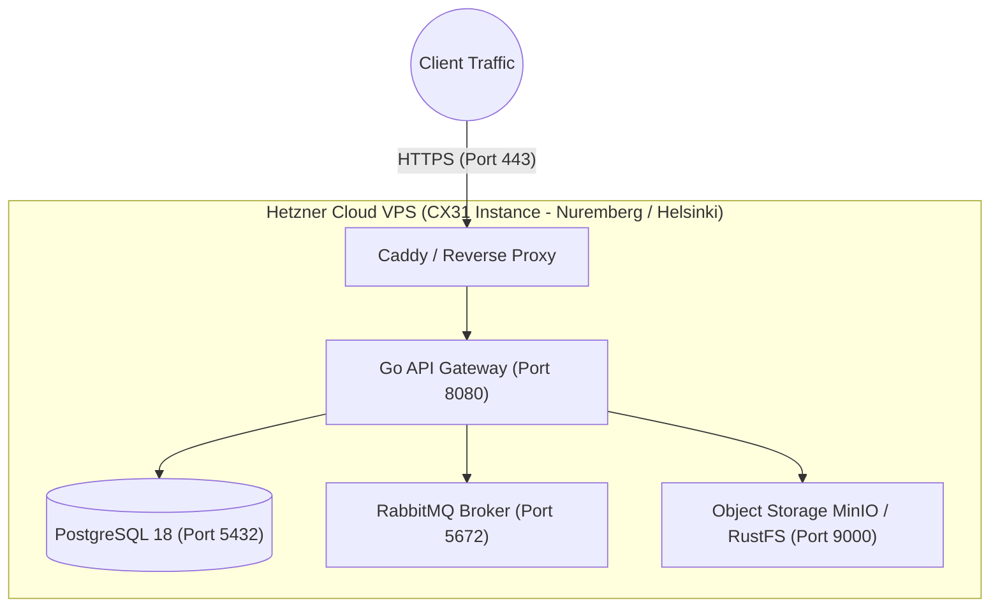

:::success
**Version:** 1.0
:::

---

# Cloud Hosting & Infrastructure Benchmark: Hetzner vs OVH vs AWS

This benchmark evaluates cloud infrastructure providers for the Ascension platform. It analyzes the compute, bandwidth, and storage requirements for self-hosting the API Gateway, PostgreSQL, RabbitMQ, and object storage, presents the team's initial skill baseline, compares three major cloud providers, and justifies selecting Hetzner Cloud.

---

## 1\. Context & Infrastructure Workload

The Ascension backend infrastructure must reliably host five interconnected services:

- **API Gateway**: Go/Gin container handling client REST/WebSocket traffic.
- **Relational Database**: PostgreSQL 18 storing user, session, and biomechanical telemetry.
- **Message Broker**: RabbitMQ 4.x managing asynchronous video analysis queues.
- **Object Storage**: S3-compatible engine (MinIO / RustFS) hosting climbing videos and extracted frames.
- **Reverse Proxy & Monitoring**: Caddy/Nginx with SSL termination and Prometheus/Grafana metric scrapers.

Because Ascension handles continuous video uploads (50 MB to 2 GB) and streams high-definition playback back to mobile clients, **network egress bandwidth** and **compute memory ratios** directly dominate infrastructure costs.

*Figure: Unified containerized topology deployed on a Hetzner Cloud virtual instance.*

---

## 2\. Team Competencies Baseline

At the beginning of the infrastructure evaluation phase, the team had the following technical profile:

| Domain | Team Proficiency Level | Practical Context |
| --- | --- | --- |
| **Cloud Infrastructure (AWS / GCP)** | No prior experience | Zero baseline; discovering cloud provider pricing models and architectures. |
| **Linux Sysadmin & Docker** | Basic / Intermediate | Comfortable deploying multi-container Docker Compose environments locally. |
| **Networking & Reverse Proxies** | Basic knowledge | Familiar with DNS records, port forwarding, and TLS certificates. |

With zero institutional ties to proprietary cloud ecosystems (such as AWS proprietary IAM or Lambda), the team prioritized transparent billing, predictability, and sovereign European data compliance.

---

## 3\. Compared Solutions

Three cloud hosting providers were evaluated across comparable compute tiers:

1. **Hetzner Cloud (Germany & Finland)**:
   - Leading European cloud provider known for high-performance bare metal and virtual servers at disruptive, developer-friendly price points.
2. **OVHcloud (France)**:
   - European cloud hyperscaler emphasizing data sovereignty, predictable European billing, and anti-DDoS protection.
3. **Amazon Web Services (AWS - Frankfurt / Ireland)**:
   - Global hyperscale market leader offering comprehensive managed services (EC2, ECS, RDS, S3) with granular enterprise configurability.

---

## 4\. Evaluation Methodology & Test Protocols

Providers were evaluated across three real-world deployment scenarios corresponding to Ascension's development roadmap:

- **Scenario 1: MVP & Development Stage** (1 shared virtual server: 4 vCPU, 8 GB RAM, 80 GB NVMe).
- **Scenario 2: Production Launch** (2 dedicated virtual servers: 1 API/DB node + 1 Video/Storage node).
- **Scenario 3: Scale Stage (~1,000 active users)** (Separation of database, storage, and worker nodes with 1 TB monthly video egress).

### Key Evaluation Criteria

- **Compute Unit Cost**: Monthly price for equivalent vCPU and RAM allocations.
- **Outbound Bandwidth (Egress) Pricing**: Cost of delivering gigabytes of climbing videos back to mobile users.
- **Object Storage Cost**: Monthly cost per terabyte of stored video footage.
- **Data Privacy & GDPR**: Server geographic locations, legal compliance, and immunity from foreign extraterritorial surveillance (e.g. US CLOUD Act).
- **Console & Tooling Ergonomics**: Simplicity of provisioning, API accessibility, and predictable invoice generation.

---

## 5\. Comparative Evaluation Matrix

| Criterion | Hetzner Cloud (DE/FI) | OVHcloud (FR) | AWS (Frankfurt) | Winner |
| --- | --- | --- | --- | --- |
| **VM (4 vCPU / 8 GB RAM / month)** | **~15 €** (CX31 tier) | ~22 € | ~60 € (t4g.xlarge / c6g) | **Hetzner** |
| **VM (8 vCPU / 16 GB RAM / month)** | **~45 €** (CPX41 tier) | ~65 € | ~180 € (c6i.2xlarge) | **Hetzner** |
| **Included Bandwidth / month** | **20 TB included** | 100 Mbps unmetered | 100 GB free tier only | **Hetzner / OVH** |
| **Egress Bandwidth (per TB over)** | **~1.00 € / TB** | Flat unmetered rate | **~90.00 € / TB ($0.09/GB)** | **Hetzner / OVH** |
| **Object Storage (1 TB / month)** | **~10 €** | ~12 € | ~23 € (S3 Standard) | **Hetzner** |
| **Datacenter Location & GDPR** | **Germany / Finland (EU)** | France (EU) | Ireland / Germany (EU region) | **All GDPR compliant** |
| **Extraterritorial Jurisdiction** | European Sovereign entity | European Sovereign entity | Subject to US CLOUD Act | **Hetzner / OVH** |
| **Management Ergonomics** | Minimal, modern UI & CLI | Traditional web manager | Complex IAM & billing matrix | **Hetzner** |
| **Total MVP Monthly Infrastructure** | **~15 - 30 € / month** | ~35 - 50 € / month | ~120 - 250 € / month | **Hetzner** |

---

## 6\. Strategic Decision: Hetzner Cloud

**Hetzner Cloud** was selected as the exclusive infrastructure provider for Ascension's development, staging, and production environments.

### Key Justifications

1. **4x Compute Cost Reduction**:
   - For a comparable 4 vCPU / 8 GB RAM virtual machine, Hetzner charges approximately **15 €/month**, compared to roughly **60 €/month** on AWS.
   - For a student engineering startup budget, this differential represents annual savings exceeding **2,500 €/year** while delivering dedicated, high-clock NVMe compute performance.
2. **Predictable Video Egress (Avoiding AWS Bandwidth Traps)**:
   - Ascension's video analysis workload generates heavy outbound video traffic. On AWS, serving 5 TB of video per month incurs over 400 € in egress bandwidth fees alone. Hetzner includes **20 TB of free monthly egress** with every instance, eliminating the risk of catastrophic unexpected billing spikes.
3. **European Sovereignty & GDPR Compliance**:
   - Climber video recordings and morphological metrics represent sensitive personal biometric data under GDPR. Hetzner's datacenters in Nuremberg and Helsinki ensure that all customer data remains strictly within European jurisdiction without exposure to US extraterritorial data retrieval.
4. **Developer Experience for a Small Team**:
   - Hetzner's modern web console, Terraform provider, and REST API allow our 5-person team to provision, snapshot, and manage servers in minutes without navigating the Byzantine complexity of AWS IAM policies.
