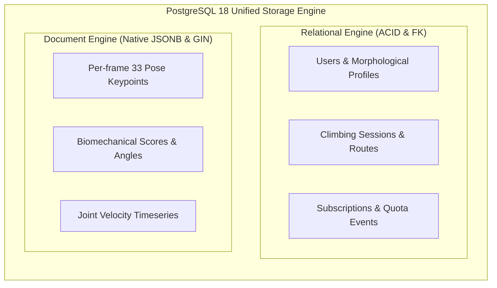

:::success
**Version:** 1.0
:::

---

# Database Benchmark: PostgreSQL vs MySQL/MariaDB vs MongoDB

This benchmark evaluates database technologies for the Ascension platform. It analyzes the dual requirements of strict relational integrity (user authentication, subscriptions, session logs) and high-density unstructured payload storage (33 body keypoints per video frame), reviews the team's technical baseline, details the comparative evaluation, and justifies the selection of PostgreSQL.

---

## 1\. Context & Data Architecture Requirements

The Ascension database must accommodate two distinctly different data models within a single, coherent persistence layer:

1. **Relational Core (Structured Business Data)**:
   - User identities, authentication credentials, and morphological profiles.
   - Subscription plans, quota usages, and billing events.
   - Climbing gyms, route grades, social friendships, and follow graphs.
   - Requires strict ACID guarantees, foreign key constraints, and multi-table joins.
2. **Biomechanical Telemetry (Semi-Structured Time Series)**:
   - Frame-by-frame 2D normalized coordinates and 3D metric world coordinates (33 keypoints $\times$ 4 coordinates $\times$ 30 FPS $\times$ 30 seconds $\approx$ 29,700 data points per video).
   - Biomechanical scores, joint angle velocity curves, and coach commentary.
   - Requires flexible JSON storage with high-speed query indexing.

*Figure: PostgreSQL satisfies both strict relational integrity and high-density JSONB biomechanical telemetry within a single database.*

---

## 2\. Team Competencies Baseline

Before initiating the benchmark, the team's database expertise was assessed:

| Database Engine / Paradigm | Team Proficiency Level | Practical Context |
| --- | --- | --- |
| **Relational (PostgreSQL)** | Mastered / Used by all members | Production experience in schema design, indexing, and migrations. |
| **Relational (MySQL / MariaDB)** | Mastered / Used by all members | Extensive experience in standard web application backends. |
| **Document Store (MongoDB)** | Mastered / Used by all members | Hands-on background in NoSQL document persistence and aggregation pipelines. |

Because the entire team was already comfortable across all three database paradigms, the evaluation focused purely on technical fitness for Ascension's hybrid workload rather than team ramp-up time.

---

## 3\. Compared Solutions

1. **PostgreSQL 18**:
   - Advanced open-source object-relational database management system known for rock-solid ACID compliance, sophisticated query optimization, and native binary JSON (`JSONB`) indexing.
2. **MySQL 8.x / MariaDB**:
   - Widely deployed relational database management system emphasizing fast read performance with traditional relational schemas and basic JSON support.
3. **MongoDB**:
   - Leading distributed NoSQL document database designed for horizontal scalability, native BSON document storage, and schema flexibility.

---

## 4\. Evaluation Methodology & Test Protocols

The candidate databases were tested against realistic Ascension workloads:

- **Relational Integrity & Complex JOINs**: Querying a climber's complete profile, active subscription status, recent sessions, and associated route grades across 5 relational tables.
- **Biomechanical JSON Telemetry**: Inserting, reading, and querying nested arrays of 33 keypoints across 1,000 video frames per analysis record.
- **Transactional Consistency**: Simulating concurrent quota decrements and subscription updates under simulated peak user load.
- **Schema Evolution & Migration Tooling**: Compatibility with automated migration tools (`golang-migrate`, GORM, SeaORM).

---

## 5\. Comparative Evaluation Matrix

| Evaluation Criterion | PostgreSQL | MySQL / MariaDB | MongoDB | Winner |
| --- | --- | --- | --- | --- |
| **Relational Data & ACID** | Complete ACID, robust constraints | Complete ACID (InnoDB) | Multi-document ACID with overhead | **PostgreSQL / MySQL** |
| **Complex Multi-Table JOINs** | Exceptional query optimizer | Good | Weak (Complex `$lookup` stages) | **PostgreSQL** |
| **Unstructured Data (Landmarks)** | Native `JSONB` with GIN indexing | Text-based JSON (Limited indexing) | Native BSON (Fast document writes) | **PostgreSQL / Mongo** |
| **Index Flexibility** | B-tree, Hash, GIN, GiST, BRIN | B-tree, Hash | B-tree, Compound, Multikey | **PostgreSQL** |
| **Future AI Vector Search** | Native `pgvector` extension | Third-party plugins required | Atlas Vector Search (Cloud tied) | **PostgreSQL** |
| **Connection Pooling & Footprint** | Efficient (pgbouncer / Go pool) | Efficient | High memory overhead | **PostgreSQL / MySQL** |
| **ORM / Driver Ecosystem** | Universal (Go `pgx`, Rust `SQLx`, Python) | Universal | Distinct document driver paradigm | **PostgreSQL / MySQL** |
| **Operational Simplicity** | Standard single container | Standard single container | Requires replica sets for full ACID | **PostgreSQL / MySQL** |

---

## 6\. Architectural Decision: PostgreSQL

**PostgreSQL 18** was chosen as the sole primary database for the Ascension platform.

### Key Justifications

1. **The Best of Both Worlds with `JSONB`**:
   - MediaPipe generates dense arrays of 33 spatial coordinates per frame. While MongoDB handles documents well, it lacks robust relational modeling for user billing, friendships, and climbing sessions.
   - PostgreSQL's binary `JSONB` allows Ascension to store dense biomechanical landmarks in the exact same table as the structured analysis metadata, while enabling Generalized Inverted Index (GIN) lookups for specific movement anomalies.
2. **Strict Financial & Quota Integrity**:
   - Subscription events, monthly analysis limits, and user profiles require uncompromising transactional safety. PostgreSQL guarantees absolute ACID compliance with zero risk of phantom reads or dirty state transitions.
3. **Architectural Simplicity (No Polyglot Persistence)**:
   - Storing structured data in MySQL and document data in MongoDB would have doubled backup routines, migration scripts, and monitoring overhead. PostgreSQL handles both workloads within a single, highly reliable database engine.
4. **Strategic Extensibility (`pgvector`)**:
   - As Ascension's AI capabilities evolve to compare a user's movement against a reference database of professional climbers, the `pgvector` extension will allow high-dimensional vector similarity searches directly within the existing PostgreSQL database.
