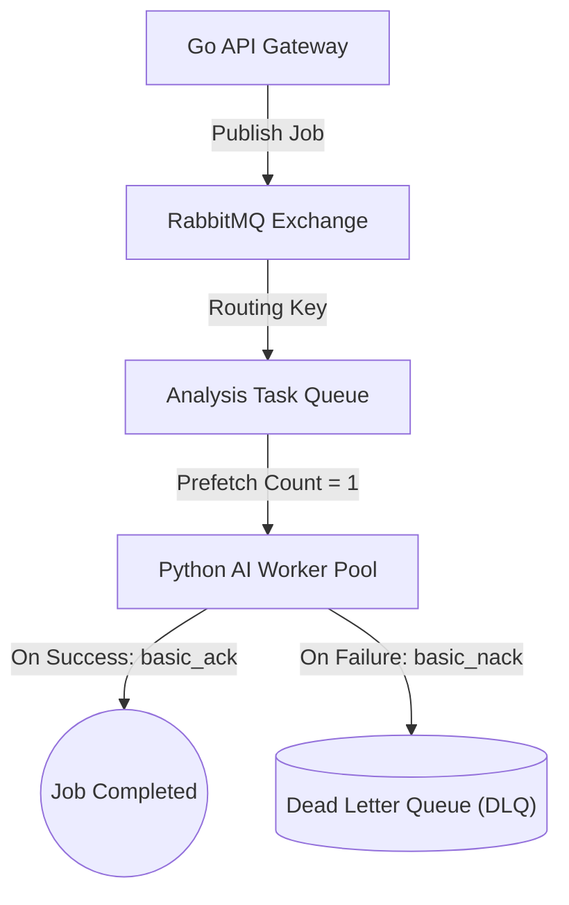

:::success
**Version:** 1.0
:::

---

# Message Broker Benchmark: RabbitMQ vs Redis vs Kafka vs NATS

This benchmark documents the evaluation of message queuing systems for the Ascension platform. It outlines the architectural requirements for decoupling asynchronous video processing, details the team's initial knowledge baseline, compares four candidate brokers, and justifies the selection of RabbitMQ.

---

## 1. Context & Architectural Requirements

Ascension's computer vision and biomechanical analysis cannot execute synchronously within the user's HTTP request-response cycle. Each climbing video analysis involves extracting 33 landmarks across hundreds of frames, consuming 10 to 60 seconds of dedicated compute time.

The message broker is the critical asynchronous backbone connecting the **Go API Gateway** (job producer) to **Python AI Workers** (job consumers). It requires:

- **Heavy Job Queueing Semantics**: Managing relatively low message volumes (hundreds to thousands of jobs per day) containing high-value payloads (video IDs, analysis parameters, user metadata).
- **Explicit Acknowledgment & Requeueing**: Workers must manually confirm job completion (`ACK`). If an AI worker crashes during analysis, the job must automatically return to the queue (`NACK` / requeue).
- **Dead Letter Exchanges (DLX)**: Poison-pill messages (corrupt video files, unreadable codecs) must automatically route to a Dead Letter Queue (DLQ) after retry limits, preventing stalled workers.
- **Worker Backpressure Control**: Workers must pull exactly one video at a time (`prefetch_count=1`) to prevent multiple concurrent analyses from exhausting GPU/CPU RAM.

_Figure: RabbitMQ asynchronous task queue with explicit acknowledgments and automated dead-letter routing._

---

## 2. Team Competencies Baseline

Before conducting the broker benchmark, the team's message queuing experience was assessed:

| Technology Domain             | Team Proficiency Level   | Practical Context                                                         |
| :---------------------------- | :----------------------- | :------------------------------------------------------------------------ |
| **RabbitMQ (AMQP)**           | No prior experience      | Zero baseline; discovered and evaluated specifically for Ascension.       |
| **Redis (Pub/Sub & Streams)** | No prior experience      | Used Redis occasionally as a simple key-value cache.                      |
| **Apache Kafka**              | No prior experience      | Studied distributed event streaming theoretically in academic coursework. |
| **NATS**                      | No prior experience      | Zero baseline; discovered during lightweight broker research.             |

Because the team had no pre-existing allegiance to any message queuing technology, the evaluation was governed strictly by operational simplicity, protocol reliability, and fault tolerance.

---

## 3. Compared Solutions

Four messaging architectures were evaluated:

1. **RabbitMQ 4.x (AMQP 0-9-1)**:
   - Battle-tested open-source message broker implementing the Advanced Message Queuing Protocol (AMQP), emphasizing rich routing, delivery guarantees, and queue-centric semantics.
2. **Redis Streams & Pub/Sub**:
   - In-memory data store providing lightweight publish/subscribe and append-only log streams.
3. **Apache Kafka**:
   - Distributed event streaming platform built for high-throughput, partitioned, replicated event logs.
4. **NATS (with JetStream)**:
   - Ultra-lightweight, high-performance messaging system written in Go, providing pub/sub with JetStream persistence.

---

## 4. Evaluation Methodology & Test Protocols

The brokers were tested against Ascension's failure modes and processing dynamics:

- **Worker Crash Resilience**: Killing an active worker process mid-analysis to verify automatic job requeuing and zero message loss.
- **Backpressure & Concurrency Control**: Flooding the queue with 100 simultaneous video requests while restricting worker pools to 2 active instances.
- **Poison-Pill Handling**: Injecting unprocessable corrupted video payloads and measuring automated dead-letter routing.
- **Operational Footprint in Docker**: Baseline memory consumption and configuration complexity for single-node container deployments.

---

## 5. Comparative Evaluation Matrix

| Evaluation Criterion         | RabbitMQ (AMQP)                       | Redis Streams                     | Apache Kafka                       | NATS JetStream            | Winner               |
| :--------------------------- | :------------------------------------ | :-------------------------------- | :--------------------------------- | :------------------------ | :------------------- |
| **Primary Architecture**     | Smart broker, dumb consumer           | In-memory key-value log           | Dumb broker, smart consumer        | Lightweight streaming     | **RabbitMQ**         |
| **Target Workload**          | **Heavy asynchronous task queues**    | Fast caching & ephemeral events   | Hyperscale streaming (100k+ msg/s) | Microsecond microservices | **RabbitMQ**         |
| **Delivery Guarantees**      | **At-least-once (Manual ACK/NACK)**   | At-least-once via Consumer Groups | At-least-once (Offset tracking)    | At-least-once             | **RabbitMQ / Kafka** |
| **Dead Letter Handling**     | **Native Dead Letter Exchange (DLX)** | Manual application logic required | Complex DLQ implementation         | Basic dead-lettering      | **RabbitMQ**         |
| **Backpressure / Prefetch**  | **Native `basic_qos(prefetch=1)`**    | Manual consumer offset pulling    | Partition-based assignment         | Pull consumer limits      | **RabbitMQ**         |
| **RAM Footprint (Baseline)** | **60 - 120 MB**                       | 15 - 40 MB                        | 500 MB - 1.5 GB (JVM / ZooKeeper)  | 20 - 50 MB                | **Redis / NATS**     |
| **Operational Simplicity**   | **Single container, instant setup**   | Single container, instant setup   | Complex multi-container clustering | Single lightweight binary | **RabbitMQ / Redis** |
| **Client Ecosystem**         | `amqp091-go` (Go) & `pika` (Python)   | Native Redis clients in Go & Py   | Segmented client libraries         | Go native, Python client  | **RabbitMQ / Redis** |

---

## 6. Architectural Decision: RabbitMQ

**RabbitMQ** was selected as the exclusive message broker for the Ascension platform.

### Key Justifications

1. **Perfect Paradigm Fit for Asynchronous Tasks**:
   - Kafka is designed for high-throughput stream processing (logging millions of sensor telemetry events per second across partitioned logs). For Ascension's workload—processing discrete 30-second video files—Kafka's partition rebalancing, consumer offset commits, and heavy JVM footprint introduce immense operational friction without architectural benefit.
   - Redis is an outstanding in-memory cache, but its persistence model requires careful AOF/RDB configuration and lacks native dead-letter and granular acknowledgement mechanics.
   - RabbitMQ was engineered specifically as an enterprise task queue.
2. **Native Dead Letter Exchange (DLX)**:
   - When an unparseable video crashes an AI worker or triggers maximum retries, RabbitMQ automatically routes the message to an isolated Dead Letter Queue without manual developer intervention. The API Gateway can inspect the DLQ and promptly notify the user of an unreadable video format.
3. **Hardware Protection via Fair Dispatch (`basic_qos`)**:
   - Video processing consumes 100% of an assigned GPU or CPU core. RabbitMQ's `basic_qos(prefetch_count=1)` ensures that no worker receives a second video until it has fully acknowledged completion of the first, eliminating out-of-memory container crashes under sudden upload spikes.
4. **First-Class Python & Go Libraries**:
   - The Go backend utilizes the official `github.com/rabbitmq/amqp091-go` driver, while Python workers utilize `pika`. Both libraries provide rock-solid, production-tested connection management and heartbeat monitoring out of the box.
