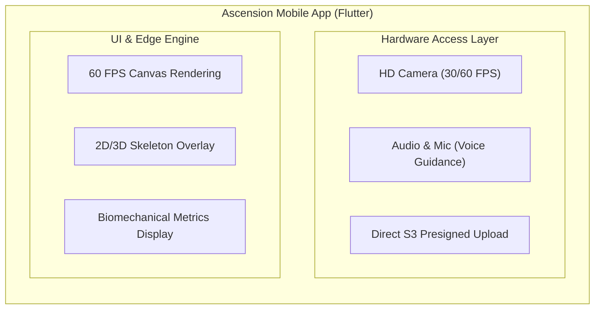

:::success
**Version:** 1.0
:::

---

# Mobile Architecture Benchmark: Flutter vs React Native vs Native

This benchmark documents the evaluation of mobile technologies for the Ascension application. It details the initial comparison between Flutter and React Native, the baseline team competencies, the experimental protocol, the initial selection of Flutter, and the subsequent exploration of native Android (Kotlin) and iOS (Swift) that firmly validated the Flutter architecture.

---

## 1\. Context & Architectural Requirements

The Ascension mobile client is the primary interface for climbers. It requires high hardware intimacy and fluid rendering:

- **Camera Reliability**: High-definition video recording (1080p at 30/60 FPS) with reliable permission lifecycle handling and hardware sensor access across varied Android and iOS devices.
- **Fluid Video Playback & Overlay**: Synchronized playback of recorded ascents with per-frame rendering of 2D/3D biomechanical keypoints, angle trajectories, and AI coaching feedback.
- **Cross-Platform Parity**: Identical user experience and feature parity between iOS and Android without platform-specific visual drift.
- **Edge ML Readiness**: Future capability to execute lightweight pose detection or preprocessing directly on-device using C/C++ libraries via native FFI bindings.

*Figure: Core architectural layers of the mobile client balancing hardware access with real-time UI rendering.*

---

## 2\. Team Competencies Baseline

At the beginning of the mobile evaluation phase, the team had the following technical profile:

| Technology | Team Proficiency Level | Practical Context |
| --- | --- | --- |
| **TypeScript / JavaScript** | Mastered by all 5 members | Deep familiarity with React and modern frontend development. |
| **Dart / Flutter** | No prior experience | Zero baseline; discovered and evaluated specifically for Ascension. |
| **Kotlin (Android)** | No prior experience | Zero baseline; discovered during platform explorations. |
| **Swift (iOS)** | No prior experience | Zero baseline; discovered during platform explorations. |

Despite universal mastery of TypeScript—which appeared to favor React Native at first glance—the team prioritized hardware reliability and runtime performance over existing familiarity.

---

## 3\. Compared Solutions

1. **Flutter (Dart 3.x + Impeller/Skia)**:
   - Google's UI toolkit compiling ahead-of-time (AOT) to native ARM machine code, rendering directly to an Skia/Impeller canvas without platform UI wrappers.
2. **React Native (Expo 54 + TypeScript)**:
   - Meta's cross-platform framework rendering native platform components via a JavaScript engine (Hermes) communicating through a bridge / JSI (JavaScript Interface).
3. **Dual Native (Kotlin / Jetpack Compose for Android & Swift / SwiftUI for iOS)**:
   - Direct platform development utilizing official first-party SDKs and toolchains for each operating system.

---

## 4\. Evaluation Methodology & Test Protocols

A standardized 3-screen workflow was implemented on both Flutter and React Native (preserved in the `Ascension-EIP/benchmark` repository):

1. **Home Screen**: Navigation entry point and session initialization.
2. **Camera Screen**: Hardware permissions negotiation (camera + microphone), live preview viewport, and a 30-second continuous recording buffer with automatic file finalization.
3. **Preview Screen**: Immediate local playback of recorded MP4 video, extraction of metadata (file size, duration, resolution), and mock presigned S3 upload execution.

### Evaluation Criteria

- **Camera Startup & Stability**: Initialization time, frame drops during recording, and permission flow reliability across physical test devices.
- **Rendering Performance**: Main-thread framerate consistency (target 60 FPS) during concurrent video playback and overlay manipulation.
- **Cross-Platform Consistency**: Layout and widget fidelity between Android (Pixel/Samsung) and iOS (iPhone).
- **Engineering Overhead**: Complexity of managing tooling, third-party libraries, and native bridge abstractions.

---

## 5\. Comparative Evaluation Matrix

| Evaluation Criterion | Flutter (Dart) | React Native (Expo) | Dual Native (Kotlin + Swift) | Winner |
| --- | --- | --- | --- | --- |
| **Rendering Architecture** | AOT Compiled (Impeller Canvas) | Interpreted / JSI Bridge | Native Platform Views | **Flutter / Dual Native** |
| **Camera FPS & Stability** | Stable 60 FPS, reliable init | Occasional drops / bridge lag | Maximum hardware control | **Flutter / Dual Native** |
| **Video Playback & Overlay** | Smooth native texture rendering | Codec & video view inconsistencies | Flawless | **Flutter / Dual Native** |
| **Codebase Maintenance** | Single unified codebase | Single unified codebase | Two completely separate codebases | **Flutter / React Native** |
| **Team Existing Expertise** | Zero (Dart learned in 1 week) | High (Universal TypeScript mastery) | Zero (Two new languages to learn) | **React Native** |
| **Low-Level / FFI Support** | Direct `dart:ffi` C-interop | Native modules (JSI/C++ glue) | Native C/C++ interop | **Flutter / Dual Native** |
| **Platform Parity** | 100% pixel-perfect matching | Platform-specific styling quirks | Divergent UI implementations | **Flutter** |
| **App Startup Time** | Fast (< 1.2s cold start) | Medium (Hermes bundle parse) | Instantaneous (< 0.8s) | **Dual Native** |

---

## 6\. Initial Decision: Flutter

Flutter was selected as the foundational framework for Ascension.

### Key Justifications

1. **Unified Cross-Platform Development**: Flutter allows a single codebase to target both Android and iOS, reducing duplicated engineering effort while maintaining near-native performance.
2. **Superior Camera & Video Performance**: During testing, Flutter's official `camera` and `video_player` packages proved significantly more reliable than Expo's camera stack, which exhibited permission race conditions and codec variances on certain Android devices.
3. **Direct Rendering Pipeline**: Because Flutter bypasses native OEM widgets and draws directly to the screen, overlays (such as drawing dynamic skeleton joints and climbing path lines on top of video frames) perform at a steady 60 FPS without bridge contention.
4. **Dart Ergonomics**: Despite having no prior Dart experience, the entire team became productive within several days thanks to Dart's familiar object-oriented syntax and strong static typing.
5. **Native Interop (FFI)**: Direct FFI access without bridging layers is crucial for Ascension's roadmap when integrating on-device pose inference.

---

## 7\. The Native Migration Experiment (Kotlin & Swift)

### 7.1 Motivation for the Native Exploration

During project development, the engineering team questioned whether migrating to fully native applications—**Kotlin (Jetpack Compose)** on Android and **Swift (SwiftUI)** on iOS—could yield even better camera responsiveness, lower memory overhead, or deeper platform integration.

To test this hypothesis, an exploratory native prototype was created on the `feat/mobile-mirgation-kotlin` branch, implementing:

- Android CameraX integration.
- ExoPlayer video playback with custom overlay views.
- Retrofit/OkHttp networking and local session stores.
- Custom audio coaching background services.

### 7.2 Findings: A Counterproductive Experiment

The native experiment quickly demonstrated significant drawbacks:

1. **Duplicated Engineering Effort**: A 5-person team building a complete system (API Gateway, PostgreSQL, RabbitMQ, Python AI models, and infrastructure) could not afford to write, test, and debug every mobile feature twice.
2. **Divergent Behavior & Inconsistent Bugs**: Subtleties in lifecycle management, background networking, and video decoding differed between Android CameraX and iOS AVFoundation, resulting in asynchronous bugs that required platform-specific fixes.
3. **No Perceptible Performance Gain**: Side-by-side comparisons on physical devices showed that Flutter's Impeller engine already delivered imperceptible latency differences compared to Jetpack Compose for our user flows.
4. **Distraction from Core Value**: The effort invested in native scaffolding detracted from core product development (biomechanical analysis algorithms, Ghost Mode overlays, and social climbing features).

### 7.3 Final Architectural Confirmation

The native exploration confirmed that **cross-platform unified development with Flutter was the superior architectural choice**. The native Kotlin code was archived, and all subsequent mobile engineering was concentrated exclusively on the Flutter codebase, which now incorporates the comprehensive Forui design system.
