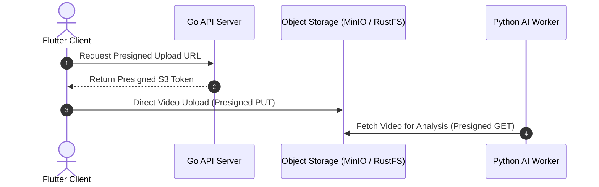

:::success
**Version:** 1.0
:::

---

# Object Storage Benchmark: Initial MinIO Adoption & RustFS Migration

This benchmark documents the evaluation of object storage solutions for the Ascension platform. It presents the initial benchmark that led to selecting MinIO Community Edition, the team's initial skill baseline, the upstream deprecation event in April 2026, and the comprehensive replacement audit that established RustFS as the new production standard.

---

## 1\. Context & Architectural Requirements

Object storage represents a critical foundational pillar for Ascension, hosting raw high-definition climbing video footage (50 MB to 2 GB per ascent), extracted frame sequences, annotated analysis videos, and 3D biomechanical datasets.

The storage architecture enforces strict operational constraints:

- **Direct Client Uploads (Presigned URLs)**: Mobile clients must upload video files directly to storage using presigned `PUT` URLs generated by the API Gateway, completely bypassing API server proxies to eliminate bandwidth bottlenecks.
- **Sequential Streaming & Range Requests**: The storage system must support HTTP Range headers to enable instant video seeking and scrubbing on mobile clients without buffering entire files.
- **Private Data & Encryption**: User climbing videos are private assets requiring strict IAM policies, bucket access controls, and TLS encryption in transit.
- **Self-Hosted Infrastructure**: Deployable via Docker / Linux on dedicated European servers (Hetzner) to minimize recurring cloud egress fees.

*Figure: Direct client-to-storage presigned upload workflow eliminating API server proxy bottlenecks.*

---

## 2\. Team Competencies Baseline

Prior to implementing object storage, the team's familiarity with storage technologies was as follows:

| Technology Domain | Team Proficiency Level | Practical Context |
| --- | --- | --- |
| **Object Storage Systems** | No prior experience | Zero baseline; discovered and evaluated specifically for Ascension. |
| **AWS S3 API Specifications** | No prior experience | Familiar with REST APIs, but no prior experience administering S3 clusters. |
| **Linux Storage & Filesystems** | Basic sysadmin knowledge | Capable of managing Docker volumes and Linux mountpoints. |

Because the team had no pre-existing bias toward any storage vendor, the selection was driven entirely by objective benchmarks, API fidelity, and operational simplicity.

---

## 3\. Part 1: Initial Benchmark & MinIO Selection

At the project's inception, three primary storage strategies were evaluated:

1. **MinIO Community Edition**:
   - High-performance, Kubernetes-native, S3-compatible object storage server distributed as a single Go binary.
2. **Local File System / NFS Storage**:
   - Traditional directory-based file storage exposed via host mounts or Network File System (NFS).
3. **Public Managed Cloud (AWS S3 / Wasabi)**:
   - Proprietary hyperscale cloud storage services.

### Initial Comparative Matrix

| Criterion | MinIO Community | Local File System (NFS) | AWS S3 Managed | Winner |
| --- | --- | --- | --- | --- |
| **S3 API Compatibility** | **100% S3 Strict Standard** | None (Custom REST required) | 100% Native Standard | **MinIO / AWS S3** |
| **Presigned URL Uploads** | **Native Presigned PUT/GET** | Requires API proxying | Native Presigned PUT/GET | **MinIO / AWS S3** |
| **Infrastructure Cost** | **Free / Self-hosted** | Free / Self-hosted | High (Egress & storage fees) | **MinIO / Local** |
| **Operational Overhead** | Low (Single Docker container) | Very Low | Zero (Fully managed) | **AWS S3 / Local** |
| **Vendor Lock-in** | Zero (Standard S3 client SDKs) | High (Tied to custom filesystem) | Moderate (AWS ecosystem) | **MinIO** |
| **Direct Video Seeking** | Native HTTP Range support | Dependent on web server setup | Native HTTP Range support | **MinIO / AWS S3** |

### Initial Decision

**MinIO Community Edition** was selected. It offered the ideal combination of strict S3 API compliance, seamless presigned URL generation for mobile clients, zero software licensing costs, and complete deployment autonomy within our Docker environment.

---

## 4\. The Upstream Deprecation Event

On **April 25, 2026**, the upstream MinIO Community Edition repository was officially **archived and marked as deprecated** by its maintainers, who ceased releasing open-source updates and security patches.

For Ascension, continuing to run an archived object storage platform in production posed critical risks:

- **Unpatched Security Vulnerabilities**: Storage services directly exposed to presigned client traffic require continuous security patching.
- **Dependency Drift**: Modern Go and Python S3 client SDKs gradually deprecate older signature behaviors.
- **Compliance & Audit Standards**: Academic and production security audits mandate actively maintained open-source dependencies.

Consequently, the engineering team launched a rigorous replacement audit to transition to a modern, actively maintained S3-compatible storage engine.

---

## 5\. Part 2: Replacement Audit & Benchmark

Four modern open-source S3 storage technologies were evaluated as potential replacements for MinIO:

1. **RustFS**:
   - Modern, high-performance distributed object storage system written in Rust, built specifically for scalable S3 workloads with Apache-2.0 licensing.
2. **Garage**:
   - Lightweight, geo-distributed S3-compatible object storage engine written in Rust, tailored for small-to-medium self-hosted clusters.
3. **SeaweedFS**:
   - Scalable distributed storage system inspired by Facebook's Haystack, optimized for billions of files with an optional S3 gateway.
4. **Ceph (Ceph Object Gateway / RGW)**:
   - Industry-standard unified distributed storage platform providing block, file, and S3 object storage on top of RADOS.

### Replacement Evaluation Matrix

| Evaluation Criterion | RustFS | Garage | SeaweedFS | Ceph (RGW) | Winner |
| --- | --- | --- | --- | --- | --- |
| **Primary Design Focus** | Dedicated S3 Object Store | Geo-distributed edge storage | Billions of small objects | Enterprise unified storage | **RustFS** |
| **Implementation Language** | **Rust** | Rust | Go | C++ | **RustFS / Garage** |
| **Licensing** | **Apache-2.0** | AGPLv3 | Apache-2.0 | LGPL | **RustFS / SeaweedFS** |
| **Sequential Video I/O** | **High throughput streaming** | Moderate | Chunk-reassembly overhead | High | **RustFS / Ceph** |
| **RAM Footprint (Baseline)** | **150 - 300 MB** | 100 - 250 MB | 200 - 400 MB | 2 - 4+ GB per daemon | **Garage / RustFS** |
| **Operational Complexity** | **Low (Single binary/Docker)** | Low (Single binary) | Medium (Master, Volume, Filer) | Extremely High (MON, OSD, RGW) | **RustFS / Garage** |
| **S3 Signature V4 Fidelity** | **Strict / Comprehensive** | Good (Minor policy gaps) | Dependent on Filer layer | Strict / Complete | **RustFS / Ceph** |
| **Active Maintenance (2026)** | **Very Active** | Active | Active | Very Active | **All** |

---

## 6\. Strategic Migration Decision: RustFS

**RustFS** was selected as the successor to MinIO across all environments.

### Key Justifications

1. **Workload Alignment**: Ascension's workload consists of heavy, sequential reads and writes of 50 MB to 2 GB video files. RustFS's core storage engine is purpose-built for streaming throughput, avoiding the small-chunk reassembly latency inherent in systems like SeaweedFS.
2. **Operational Simplicity vs Ceph**: Ceph provides enterprise-grade durability but requires managing multiple daemons (`mon`, `mgr`, `osd`, `rgw`) and dedicated storage networking. For our 5-person engineering team, RustFS delivers robust S3 compliance in a lightweight container footprint without operational drag.
3. **Permissive Licensing**: RustFS uses the business-friendly **Apache-2.0** license, avoiding the copyleft constraints of AGPLv3 solutions like Garage.
4. **Seamless API Drop-in**: RustFS maintains full protocol parity with AWS S3 Signature Version 4, allowing the Go backend and Flutter client to migrate from MinIO without altering client-side presigned URL generation logic.
