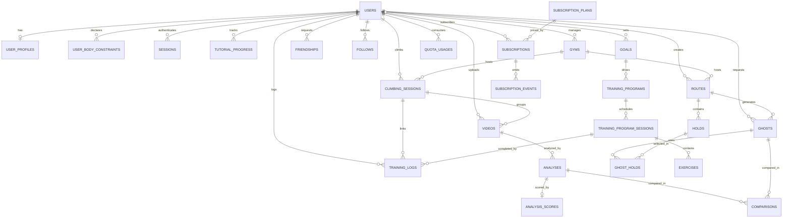

:::success
**Version:** 2.0 **Original language:** English
:::

---

# Database Schema & Data Model

---

## Table of Contents

- [Database Schema & Data Model](#database-schema--data-model)
  - [Table of Contents](#table-of-contents)
  - [1\. Scope and Conventions](#1-scope-and-conventions)
    - [1.1 Scope](#11-scope)
    - [1.2 Conventions](#12-conventions)
    - [1.3 Feature Coverage](#13-feature-coverage)
  - [2\. Entity-Relationship Diagram](#2-entity-relationship-diagram)
  - [3\. Shared Definitions](#3-shared-definitions)
    - [3.1 Enumerations](#31-enumerations)
    - [3.2 Trigger](#32-trigger-update_updated_at_column) `update_updated_at_column`
  - [4\. Identity and Profile](#4-identity-and-profile)
    - [4.1](#41-users) `users`
    - [4.2](#42-user_profiles) `user_profiles`
    - [4.3](#43-user_body_constraints) `user_body_constraints`
    - [4.4](#44-sessions) `sessions`
    - [4.5](#45-tutorial_progress) `tutorial_progress`
  - [5\. Gyms](#5-gyms)
    - [5.1](#51-gyms) `gyms`
  - [6\. Climbing Sessions, Videos and Analyses](#6-climbing-sessions-videos-and-analyses)
    - [6.1](#61-climbing_sessions) `climbing_sessions`
    - [6.2](#62-videos) `videos`
    - [6.3](#63-analyses) `analyses`
    - [6.4](#64-analysis_scores) `analysis_scores`
  - [7\. Routes, Holds and Ghost Mode](#7-routes-holds-and-ghost-mode)
    - [7.1](#71-routes) `routes`
    - [7.2](#72-holds) `holds`
    - [7.3](#73-ghosts) `ghosts`
    - [7.4](#74-ghost_holds) `ghost_holds`
    - [7.5](#75-comparisons) `comparisons`
  - [8\. Coaching and Training](#8-coaching-and-training)
    - [8.1](#81-goals) `goals`
    - [8.2](#82-training_programs) `training_programs`
    - [8.3](#83-training_program_sessions) `training_program_sessions`
    - [8.4](#84-exercises) `exercises`
    - [8.5](#85-training_logs) `training_logs`
  - [9\. Social](#9-social)
    - [9.1](#91-friendships) `friendships`
    - [9.2](#92-follows) `follows`
    - [9.3 Visibility Rules](#93-visibility-rules)
  - [10\. Subscriptions and Quotas](#10-subscriptions-and-quotas)
    - [10.1](#101-subscription_plans) `subscription_plans`
    - [10.2](#102-subscriptions) `subscriptions`
    - [10.3](#103-subscription_events) `subscription_events`
    - [10.4](#104-quota_usages) `quota_usages`
  - [11\. Scheduled Jobs (pg\_cron)](#11-scheduled-jobs-pg_cron)
  - [12\. Sample Queries](#12-sample-queries)
  - [13\. Migration Delta From Current Schema](#13-migration-delta-from-current-schema)

---

## 1\. Scope and Conventions

### 1.1 Scope

This document is the single source of truth for the PostgreSQL 18 data model of Ascension. It covers every feature of the [feature catalogue](../../../administrative/catalogue-fonctionnalites.md) (F01 to F16), including the ATP-phase features, so that the schema is complete from the start. Tables that are not needed yet are still specified here and will be created by migrations when their feature is implemented.

The current migrations in `apps/server/migrations/` implement only a subset of this schema. Section 13 lists the differences to apply.

### 1.2 Conventions

| Rule | Convention |
| --- | --- |
| Primary keys | `UUID` generated with `uuidv7()` (time-ordered, native in PostgreSQL 18). |
| Timestamps | Always `TIMESTAMPTZ`. Every mutable table has `created_at` and `updated_at`, the latter maintained by the shared trigger. |
| Naming | `snake_case` for tables and columns. Tables are plural. Join tables are named after both sides (`ghost_holds`). |
| Closed value sets | PostgreSQL `ENUM` types (never free `TEXT`). New values are added with `ALTER TYPE ... ADD VALUE`. |
| Units | Encoded in the column name: `_ms`, `_cm`, `_kg`, `_bytes`, `_cents`, `_min`. |
| Object storage | Only the `object_key` is stored. The bucket comes from the server configuration. The storage backend is S3-compatible (MinIO locally, S3 in prod). |
| Large AI payloads | Stored as `JSONB` in PostgreSQL (`analyses.result`, `ghosts.path`). No secondary object storage for results. |
| Deletion | Hard delete with `ON DELETE CASCADE`. Account deactivation is a status, not a deletion. |
| Async job lifecycle | Every AI-processed entity (`analyses`, `ghosts`, `comparisons`) shares the `job_status` enum and the same columns (`status`, `progress`, `error`). |
| Visibility | Shareable content (`videos`, `analyses`, `routes`, `climbing_sessions`) carries a `visibility` column using the `visibility` enum. |

### 1.3 Feature Coverage

| Feature | Tables |
| --- | --- |
| F01 Morphological profile | `user_profiles`, `user_body_constraints` |
| F02 / F03 Video analysis and skeleton | `videos`, `analyses` |
| F04 Score and progression | `climbing_sessions`, `analysis_scores` |
| F05 Ghost comparison | `comparisons` |
| F06 Hold analysis | `routes`, `holds` |
| F07 Ghost without climbing | `routes`, `holds`, `ghosts`, `ghost_holds` |
| F08 3D mobile experience | `analyses` (type `3d`) |
| F09 Personalised advice | `analyses.hints` |
| F10 Coach and training programs | `goals`, `training_programs`, `training_program_sessions`, `exercises`, `training_logs` |
| F11 Community and sharing | `friendships`, `follows`, `visibility` columns |
| F12 Assisted climbing (AR) | Real-time only, no persistence beyond `climbing_sessions` |
| F13 Subscriptions and quotas | `subscription_plans`, `subscriptions`, `subscription_events`, `quota_usages` |
| F14 Onboarding and tutorials | `tutorial_progress` |
| Gym partnerships | `gyms`, `users.role = 'gym'` |
| Authentication | `users`, `sessions` |

---

## 2\. Entity-Relationship Diagram

The diagram below shows the tables and their relationships. Column details are in the table definitions that follow. Enumerations and the `updated_at` trigger are shared across all tables.



Summary: `users` is the root of every branch. The video branch (`climbing_sessions` → `videos` → `analyses` → `analysis_scores`) holds the biomechanical analysis. The route branch (`routes` → `holds` → `ghosts`) holds the Ghost Mode without climbing, and `comparisons` joins both branches for the Ghost Mode in comparison. The coaching branch (`goals` → `training_programs` → `training_program_sessions` → `exercises`, with `training_logs` for what was actually done) and the business branch (`subscription_plans` → `subscriptions` → `subscription_events`, `quota_usages`) are independent of the AI branches.

---

## 3\. Shared Definitions

### 3.1 Enumerations

```sql
CREATE TYPE user_role AS ENUM ('user', 'admin', 'coach', 'gym');
CREATE TYPE user_status AS ENUM ('active', 'deactivated');
CREATE TYPE grading_system AS ENUM ('font', 'french', 'v_scale', 'yds');
CREATE TYPE dominant_hand AS ENUM ('left', 'right', 'ambidextrous');
CREATE TYPE body_zone AS ENUM (
    'head', 'neck', 'torso', 'lower_back',
    'left_shoulder', 'right_shoulder',
    'left_upper_arm', 'right_upper_arm',
    'left_elbow', 'right_elbow',
    'left_forearm', 'right_forearm',
    'left_wrist', 'right_wrist',
    'left_hand', 'right_hand',
    'left_fingers', 'right_fingers',
    'left_hip', 'right_hip',
    'left_thigh', 'right_thigh',
    'left_knee', 'right_knee',
    'left_shin', 'right_shin',
    'left_ankle', 'right_ankle',
    'left_foot', 'right_foot'
);
CREATE TYPE body_constraint_type AS ENUM ('missing', 'injured');
CREATE TYPE visibility AS ENUM ('private', 'friends', 'public');
CREATE TYPE video_status AS ENUM ('pending', 'completed');
CREATE TYPE analysis_type AS ENUM ('2d', '3d');
CREATE TYPE job_status AS ENUM ('pending', 'processing', 'generating_hints', 'completed', 'failed');
CREATE TYPE hold_type AS ENUM ('jug', 'crimp', 'sloper', 'pinch', 'pocket', 'edge', 'volume', 'foothold');
CREATE TYPE hold_source AS ENUM ('ai', 'manual');
CREATE TYPE goal_status AS ENUM ('active', 'achieved', 'abandoned');
CREATE TYPE focus_area AS ENUM ('technique', 'strength', 'endurance', 'flexibility', 'mental');
CREATE TYPE training_session_type AS ENUM ('technique', 'strength', 'endurance', 'climbing', 'recovery', 'rest');
CREATE TYPE training_program_status AS ENUM ('draft', 'active', 'completed', 'archived');
CREATE TYPE friendship_status AS ENUM ('pending', 'accepted', 'blocked');
CREATE TYPE subscription_status AS ENUM ('trialing', 'active', 'past_due', 'canceled', 'expired');
CREATE TYPE subscription_event_type AS ENUM (
    'created', 'activated', 'renewed', 'upgraded', 'downgraded',
    'payment_failed', 'canceled', 'expired'
);
CREATE TYPE tutorial_status AS ENUM ('not_started', 'in_progress', 'completed');
```

Notes:

- `job_status` is shared by `analyses`, `ghosts` and `comparisons`. `generating_hints` is only reached by `analyses`.
- `grading_system` distinguishes bouldering (`font`, `v_scale`) from route climbing (`french`, `yds`). The grade itself is stored as `TEXT` (`6a+`, `V4`, `7A`).
- `body_zone` follows the MediaPipe segment layout so that constraints can be mapped directly onto skeleton landmarks.

### 3.2 Trigger `update_updated_at_column`

```sql
CREATE OR REPLACE FUNCTION update_updated_at_column()
RETURNS TRIGGER AS $$
BEGIN
    NEW.updated_at = NOW();
    RETURN NEW;
END;
$$ LANGUAGE plpgsql;
```

Every table with an `updated_at` column attaches it with:

```sql
CREATE TRIGGER update_<table>_updated_at
    BEFORE UPDATE ON <table>
    FOR EACH ROW
    EXECUTE FUNCTION update_updated_at_column();
```

The trigger statement is omitted from the table definitions below for brevity.

---

## 4\. Identity and Profile

### 4.1 `users`

Account identity and access control. Everything that describes the climber's body or preferences lives in `user_profiles`.

```sql
CREATE TABLE users (
    id                 UUID PRIMARY KEY DEFAULT uuidv7(),
    email              TEXT NOT NULL UNIQUE,
    username           TEXT NOT NULL UNIQUE,
    first_name         TEXT NOT NULL,
    last_name          TEXT NOT NULL,
    password_hash      TEXT NOT NULL,
    role               user_role NOT NULL DEFAULT 'user',
    status             user_status NOT NULL DEFAULT 'active',
    email_verified_at  TIMESTAMPTZ,
    last_login_at      TIMESTAMPTZ,
    deactivated_at     TIMESTAMPTZ,
    stripe_customer_id TEXT UNIQUE,
    created_at         TIMESTAMPTZ NOT NULL DEFAULT NOW(),
    updated_at         TIMESTAMPTZ NOT NULL DEFAULT NOW(),

    CONSTRAINT chk_users_email_format
        CHECK (email ~* '^[A-Za-z0-9._%+-]+@[A-Za-z0-9.-]+\.[A-Za-z]{2,}$'),
    CONSTRAINT chk_users_username_format
        CHECK (username ~ '^[a-z0-9_]{3,30}$'),
    CONSTRAINT chk_users_deactivation
        CHECK ((status = 'deactivated') = (deactivated_at IS NOT NULL))
);

CREATE INDEX idx_users_role ON users(role);
CREATE INDEX idx_users_status ON users(status);
```

Business rules:

- `username` is the public handle used by the social features. It is lowercase and immutable once chosen unless an admin changes it.
- A `deactivated` user cannot log in and is hidden from social features, but all data is kept. Reactivation sets `status = 'active'` and clears `deactivated_at`. Account deletion is a hard `DELETE` that cascades everywhere.
- `stripe_customer_id` is set the first time the user enters a checkout and persists across subscriptions.
- `role = 'gym'` is the account of a partner gym (see `gyms.owner_user_id`). `role = 'coach'` is reserved for human coaches who will review programs.

### 4.2 `user_profiles`

Morphological profile and climbing context (F01). One row per user, created empty at signup and completed later.

```sql
CREATE TABLE user_profiles (
    user_id            UUID PRIMARY KEY REFERENCES users(id) ON DELETE CASCADE,
    birth_date         DATE,
    height_cm          SMALLINT,
    weight_kg          NUMERIC(5, 2),
    arm_span_cm        SMALLINT,
    dominant_hand      dominant_hand,
    climbing_level     TEXT,
    grading_system     grading_system,
    years_of_practice  SMALLINT,
    bio                TEXT,
    avatar_object_key  TEXT,
    created_at         TIMESTAMPTZ NOT NULL DEFAULT NOW(),
    updated_at         TIMESTAMPTZ NOT NULL DEFAULT NOW(),

    CONSTRAINT chk_user_profiles_height   CHECK (height_cm   IS NULL OR height_cm   BETWEEN 50 AND 250),
    CONSTRAINT chk_user_profiles_weight   CHECK (weight_kg   IS NULL OR weight_kg   BETWEEN 20 AND 250),
    CONSTRAINT chk_user_profiles_arm_span CHECK (arm_span_cm IS NULL OR arm_span_cm BETWEEN 50 AND 280),
    CONSTRAINT chk_user_profiles_level
        CHECK ((climbing_level IS NULL) = (grading_system IS NULL))
);
```

Business rules:

- The ape index (`arm_span_cm - height_cm`) is derived at read time, never stored.
- `climbing_level` and `grading_system` are set together. The API converts between systems for display.
- Profile values are snapshotted into `ghosts.morphology` when a ghost is requested, so that a later profile update does not silently change an existing ghost.

### 4.3 `user_body_constraints`

Missing or injured body zones declared on the interactive skeleton (F01). Used by analysis, ghost computation, advice generation and training programs.

```sql
CREATE TABLE user_body_constraints (
    id          UUID PRIMARY KEY DEFAULT uuidv7(),
    user_id     UUID NOT NULL REFERENCES users(id) ON DELETE CASCADE,
    zone        body_zone NOT NULL,
    type        body_constraint_type NOT NULL,
    note        TEXT,
    started_at  DATE NOT NULL DEFAULT CURRENT_DATE,
    ended_at    DATE,
    created_at  TIMESTAMPTZ NOT NULL DEFAULT NOW(),
    updated_at  TIMESTAMPTZ NOT NULL DEFAULT NOW(),

    CONSTRAINT chk_user_body_constraints_dates
        CHECK (ended_at IS NULL OR ended_at >= started_at)
);

CREATE INDEX idx_user_body_constraints_user_id ON user_body_constraints(user_id);
CREATE UNIQUE INDEX uq_user_body_constraints_active
    ON user_body_constraints(user_id, zone)
    WHERE ended_at IS NULL;
```

Business rules:

- `ended_at IS NULL` means the constraint is active. An injury that heals gets an `ended_at`; a `missing` limb never does.
- At most one active constraint per zone and user (partial unique index).
- History is kept so that a training program can account for a recent injury.

### 4.4 `sessions`

Refresh-token sessions. The access token is a stateless JWT; only the refresh token is persisted.

```sql
CREATE TABLE sessions (
    id            UUID PRIMARY KEY DEFAULT uuidv7(),
    user_id       UUID NOT NULL REFERENCES users(id) ON DELETE CASCADE,
    token_hash    TEXT NOT NULL UNIQUE,
    user_agent    TEXT,
    ip_address    INET,
    last_used_at  TIMESTAMPTZ NOT NULL DEFAULT NOW(),
    revoked_at    TIMESTAMPTZ,
    expires_at    TIMESTAMPTZ NOT NULL,
    created_at    TIMESTAMPTZ NOT NULL DEFAULT NOW()
);

CREATE INDEX idx_sessions_user_id ON sessions(user_id);
CREATE INDEX idx_sessions_expires_at ON sessions(expires_at);
```

Business rules:

- The refresh token sent to the client is a random 256-bit value. Only its SHA-256 hash is stored. The session `id` is never used as a secret.
- A session is valid when `revoked_at IS NULL AND expires_at > NOW()`. Logout sets `revoked_at`; "logout everywhere" revokes all sessions of the user.
- Expired sessions are purged by pg\_cron (section 11).

### 4.5 `tutorial_progress`

Progress of each replayable tutorial (F14). The tutorial catalogue itself lives in the mobile app; the database only stores the user's progress keyed by the tutorial code.

```sql
CREATE TABLE tutorial_progress (
    user_id        UUID NOT NULL REFERENCES users(id) ON DELETE CASCADE,
    tutorial_code  TEXT NOT NULL,
    status         tutorial_status NOT NULL DEFAULT 'not_started',
    current_step   SMALLINT NOT NULL DEFAULT 0,
    completed_at   TIMESTAMPTZ,
    created_at     TIMESTAMPTZ NOT NULL DEFAULT NOW(),
    updated_at     TIMESTAMPTZ NOT NULL DEFAULT NOW(),

    PRIMARY KEY (user_id, tutorial_code),
    CONSTRAINT chk_tutorial_progress_completed
        CHECK ((status = 'completed') = (completed_at IS NOT NULL))
);
```

Business rules:

- The first-launch onboarding is the tutorial with code `onboarding`. A user with no row for it is considered a new user.
- Replaying a tutorial resets `status` to `in_progress` and `current_step` to `0`, but keeps `completed_at`.

---

## 5\. Gyms

### 5.1 `gyms`

Climbing gyms, used as metadata for routes and climbing sessions, and as the anchor for gym partnerships (Climb Up, Arkose).

```sql
CREATE TABLE gyms (
    id             UUID PRIMARY KEY DEFAULT uuidv7(),
    owner_user_id  UUID REFERENCES users(id) ON DELETE SET NULL,
    name           TEXT NOT NULL,
    city           TEXT NOT NULL,
    country_code   CHAR(2) NOT NULL,
    address        TEXT,
    latitude       NUMERIC(9, 6),
    longitude      NUMERIC(9, 6),
    website_url    TEXT,
    is_partner     BOOLEAN NOT NULL DEFAULT FALSE,
    created_at     TIMESTAMPTZ NOT NULL DEFAULT NOW(),
    updated_at     TIMESTAMPTZ NOT NULL DEFAULT NOW()
);

CREATE INDEX idx_gyms_city ON gyms(country_code, city);
CREATE INDEX idx_gyms_owner_user_id ON gyms(owner_user_id);
```

Business rules:

- Any user can reference an existing gym on a route or climbing session. Only admins create gyms; partner gyms are linked to a `role = 'gym'` account through `owner_user_id`.
- Gym-less climbs (outdoor, home wall) leave the foreign key `NULL`.

---

## 6\. Climbing Sessions, Videos and Analyses

### 6.1 `climbing_sessions`

A climbing session groups the videos of one outing (same day, same place). The global score and the progression indicators (F04) are computed at this level, aggregated from `analysis_scores`.

```sql
CREATE TABLE climbing_sessions (
    id               UUID PRIMARY KEY DEFAULT uuidv7(),
    user_id          UUID NOT NULL REFERENCES users(id) ON DELETE CASCADE,
    gym_id           UUID REFERENCES gyms(id) ON DELETE SET NULL,
    title            TEXT,
    started_at       TIMESTAMPTZ NOT NULL,
    ended_at         TIMESTAMPTZ,
    overall_score    NUMERIC(5, 2),
    technique_score  NUMERIC(5, 2),
    power_score      NUMERIC(5, 2),
    endurance_score  NUMERIC(5, 2),
    scored_at        TIMESTAMPTZ,
    notes            TEXT,
    visibility       visibility NOT NULL DEFAULT 'private',
    created_at       TIMESTAMPTZ NOT NULL DEFAULT NOW(),
    updated_at       TIMESTAMPTZ NOT NULL DEFAULT NOW(),

    CONSTRAINT chk_climbing_sessions_dates
        CHECK (ended_at IS NULL OR ended_at >= started_at),
    CONSTRAINT chk_climbing_sessions_scores CHECK (
        (overall_score   IS NULL OR overall_score   BETWEEN 0 AND 100) AND
        (technique_score IS NULL OR technique_score BETWEEN 0 AND 100) AND
        (power_score     IS NULL OR power_score     BETWEEN 0 AND 100) AND
        (endurance_score IS NULL OR endurance_score BETWEEN 0 AND 100)
    )
);

CREATE INDEX idx_climbing_sessions_user_started ON climbing_sessions(user_id, started_at DESC);
CREATE INDEX idx_climbing_sessions_gym_id ON climbing_sessions(gym_id);
```

Business rules:

- The mobile app creates a session implicitly when the user uploads a video with no open session for the day, or explicitly from the session screen.
- Scores are recomputed each time an analysis of the session completes, then `scored_at` is set. Weekly and monthly progression curves are aggregated at query time from these columns (see section 12).
- Scores are on a 0 to 100 scale. The three indicators fixed for the BTP phase are technique, power and endurance; new indicators are added as columns, not as JSON, so that they remain queryable.

### 6.2 `videos`

A climbing video uploaded directly to object storage through a presigned URL.

```sql
CREATE TABLE videos (
    id                   UUID PRIMARY KEY DEFAULT uuidv7(),
    user_id              UUID NOT NULL REFERENCES users(id) ON DELETE CASCADE,
    climbing_session_id  UUID REFERENCES climbing_sessions(id) ON DELETE SET NULL,
    title                TEXT,
    object_key           TEXT NOT NULL UNIQUE,
    content_type         TEXT NOT NULL,
    status               video_status NOT NULL DEFAULT 'pending',
    size_bytes           BIGINT,
    duration_ms          INTEGER,
    width                SMALLINT,
    height               SMALLINT,
    fps                  NUMERIC(6, 3),
    retained             BOOLEAN NOT NULL DEFAULT FALSE,
    expires_at           TIMESTAMPTZ NOT NULL,
    visibility           visibility NOT NULL DEFAULT 'private',
    created_at           TIMESTAMPTZ NOT NULL DEFAULT NOW(),
    updated_at           TIMESTAMPTZ NOT NULL DEFAULT NOW()
);

CREATE INDEX idx_videos_user_created ON videos(user_id, created_at DESC);
CREATE INDEX idx_videos_climbing_session_id ON videos(climbing_session_id);
CREATE INDEX idx_videos_expiry ON videos(expires_at) WHERE retained = FALSE;
```

Business rules:

- **Upload lifecycle.** The row is created with `status = 'pending'` and `expires_at` set to the presigned URL deadline. When the client confirms the upload (`PUT /videos/upload-done/:id`), the server verifies the object, fills `size_bytes`, `content_type`, `duration_ms`, `width`, `height`, `fps`, sets `status = 'completed'` and resets `expires_at` to `NOW() + legal retention period` (a server configuration value).
- **Retention.** A video is purged when `expires_at < NOW()` unless `retained = TRUE`. The user can toggle `retained` from the app (premium option). The purge job deletes both the database row and the storage object.
- `object_key` is unique. The bucket is not stored: it is a server configuration value.
- A video can be analysed several times (see `analyses`).

### 6.3 `analyses`

One AI processing run on a video (F02, F03, F08, F09). Several analyses may exist for the same video, for instance a `2d` and a `3d` run, or a retry after a failure.

```sql
CREATE TABLE analyses (
    id                  UUID PRIMARY KEY DEFAULT uuidv7(),
    video_id            UUID NOT NULL REFERENCES videos(id) ON DELETE CASCADE,
    type                analysis_type NOT NULL DEFAULT '2d',
    status              job_status NOT NULL DEFAULT 'pending',
    progress            SMALLINT NOT NULL DEFAULT 0,
    result              JSONB,
    hints               JSONB,
    error               TEXT,
    processing_time_ms  INTEGER,
    started_at          TIMESTAMPTZ,
    completed_at        TIMESTAMPTZ,
    visibility          visibility NOT NULL DEFAULT 'private',
    created_at          TIMESTAMPTZ NOT NULL DEFAULT NOW(),
    updated_at          TIMESTAMPTZ NOT NULL DEFAULT NOW(),

    CONSTRAINT chk_analyses_progress CHECK (progress BETWEEN 0 AND 100),
    CONSTRAINT chk_analyses_completed
        CHECK (status <> 'completed' OR (result IS NOT NULL AND completed_at IS NOT NULL)),
    CONSTRAINT chk_analyses_failed
        CHECK (status <> 'failed' OR error IS NOT NULL)
);

CREATE INDEX idx_analyses_video_created ON analyses(video_id, created_at DESC);
CREATE INDEX idx_analyses_status ON analyses(status) WHERE status IN ('pending', 'processing', 'generating_hints');
```

Business rules:

- The status flow is `pending` → `processing` → `generating_hints` → `completed`, or `failed` from any state. The worker sets `started_at` when it picks the job, and `progress` from 0 to 99 during processing, then 100 on completion.
- No uniqueness on `(video_id, type)`: a user may relaunch an analysis. The API returns the latest completed analysis of each type by default.
- The partial index on `status` keeps the "in-flight jobs" lookup cheap without indexing millions of completed rows.

`result` **structure** (written by the AI worker, consumed by the mobile app for client-side rendering):

```json
{
  "fps": 30.0,
  "width": 1080,
  "height": 1920,
  "frames": [
    {
      "frame": 0,
      "timestamp_ms": 0,
      "pose_detected": true,
      "landmarks": {
        "left_shoulder": { "x": 0.51, "y": 0.32, "z": -0.12, "visibility": 0.98 }
      },
      "angles": {
        "left_elbow": 145.2,
        "right_knee": 89.5
      }
    }
  ]
}
```

For `type = '3d'`, `landmarks` values are metric 3D coordinates and the object carries the fields produced by the 3D pipeline (`fps`, `width`, `height` are always present).

`hints` **structure** (structured advice generated by the external model, F09):

```json
{
  "summary": "Good hip positioning, but the arms stay bent too long between moves.",
  "items": [
    {
      "category": "technique",
      "priority": 1,
      "title": "Straighten the arms on rests",
      "description": "Between frames 120 and 180 both elbows stay under 100 degrees.",
      "frame_start": 120,
      "frame_end": 180,
      "body_zones": ["left_elbow", "right_elbow"]
    }
  ],
  "model": "gemini-2.5-pro",
  "generated_at": "2026-09-18T10:12:00Z"
}
```

`category` uses the values of the `focus_area` enum. `priority` is 1 (highest) to 5.

### 6.4 `analysis_scores`

Per-analysis metrics (F04). One row per completed analysis, written by the worker. The climbing session aggregates these rows.

```sql
CREATE TABLE analysis_scores (
    analysis_id      UUID PRIMARY KEY REFERENCES analyses(id) ON DELETE CASCADE,
    overall_score    NUMERIC(5, 2) NOT NULL,
    technique_score  NUMERIC(5, 2) NOT NULL,
    power_score      NUMERIC(5, 2) NOT NULL,
    endurance_score  NUMERIC(5, 2) NOT NULL,
    details          JSONB,
    created_at       TIMESTAMPTZ NOT NULL DEFAULT NOW(),

    CONSTRAINT chk_analysis_scores_range CHECK (
        overall_score   BETWEEN 0 AND 100 AND
        technique_score BETWEEN 0 AND 100 AND
        power_score     BETWEEN 0 AND 100 AND
        endurance_score BETWEEN 0 AND 100
    )
);
```

Business rules:

- `details` holds the intermediate metrics that produced the scores (average joint angles, time on wall, number of pauses, and so on). Anything that must be charted over time gets promoted to a column.
- Scores are immutable once written; a new analysis produces a new row.

---

## 7\. Routes, Holds and Ghost Mode

Recommended split: the route photo is its own entity (`routes`), because it has a life independent of any video (F07 works without climbing). Holds belong to the route. A ghost is a computed path on a route for a given user morphology. A comparison joins a ghost with a video analysis (F05). All storage references are S3-compatible object keys; the backend (MinIO locally, S3 in production) is a configuration choice and never appears in the schema.

### 7.1 `routes`

A climbing route identified by a wall photo, with its metadata.

```sql
CREATE TABLE routes (
    id                UUID PRIMARY KEY DEFAULT uuidv7(),
    user_id           UUID NOT NULL REFERENCES users(id) ON DELETE CASCADE,
    gym_id            UUID REFERENCES gyms(id) ON DELETE SET NULL,
    name              TEXT,
    grade             TEXT,
    grading_system    grading_system,
    color             TEXT,
    image_object_key  TEXT NOT NULL UNIQUE,
    image_width       SMALLINT NOT NULL,
    image_height      SMALLINT NOT NULL,
    visibility        visibility NOT NULL DEFAULT 'private',
    created_at        TIMESTAMPTZ NOT NULL DEFAULT NOW(),
    updated_at        TIMESTAMPTZ NOT NULL DEFAULT NOW(),

    CONSTRAINT chk_routes_grade
        CHECK ((grade IS NULL) = (grading_system IS NULL))
);

CREATE INDEX idx_routes_user_created ON routes(user_id, created_at DESC);
CREATE INDEX idx_routes_gym_id ON routes(gym_id);
```

Business rules:

- `color` is the hold colour set by the route setter (used for the colour-based hold selection of F06). It is free text (`red`, `#E53935`) normalised by the app.
- `image_width` and `image_height` are the reference frame of every hold position and ghost path.

### 7.2 `holds`

Holds detected on a route photo, with AI prediction and user correction kept side by side (F06).

```sql
CREATE TABLE holds (
    id                    UUID PRIMARY KEY DEFAULT uuidv7(),
    route_id              UUID NOT NULL REFERENCES routes(id) ON DELETE CASCADE,
    source                hold_source NOT NULL,
    type                  hold_type NOT NULL,
    difficulty            SMALLINT,
    usable                BOOLEAN NOT NULL DEFAULT TRUE,
    contour               JSONB NOT NULL,
    predicted_type        hold_type,
    predicted_confidence  NUMERIC(4, 3),
    predicted_contour     JSONB,
    corrected_at          TIMESTAMPTZ,
    created_at            TIMESTAMPTZ NOT NULL DEFAULT NOW(),
    updated_at            TIMESTAMPTZ NOT NULL DEFAULT NOW(),

    CONSTRAINT chk_holds_difficulty
        CHECK (difficulty IS NULL OR difficulty BETWEEN 1 AND 5),
    CONSTRAINT chk_holds_confidence
        CHECK (predicted_confidence IS NULL OR predicted_confidence BETWEEN 0 AND 1),
    CONSTRAINT chk_holds_prediction
        CHECK (source = 'manual' OR (predicted_type IS NOT NULL AND predicted_confidence IS NOT NULL))
);

CREATE INDEX idx_holds_route_id ON holds(route_id);
CREATE INDEX idx_holds_corrected ON holds(route_id) WHERE corrected_at IS NOT NULL;
```

Business rules:

- `type`, `contour` and `usable` are the **current** values, always used by the ghost computation. `predicted_*` columns freeze what the model returned and are never updated.
- When the user corrects a hold, the current values change and `corrected_at` is set. The pair (`predicted_*`, current) feeds the learning loop of F06.
- `source = 'manual'` is a hold drawn by the user when detection missed it; its `predicted_*` columns are `NULL`.
- `contour` is a polygon in image pixel coordinates: `{"points": [{"x": 120, "y": 340}, ...], "bbox": {"x": 100, "y": 320, "w": 60, "h": 45}}`.

### 7.3 `ghosts`

Optimal movement path computed for a route and a user morphology (F05, F07). Same job lifecycle as `analyses`.

```sql
CREATE TABLE ghosts (
    id                  UUID PRIMARY KEY DEFAULT uuidv7(),
    route_id            UUID NOT NULL REFERENCES routes(id) ON DELETE CASCADE,
    user_id             UUID NOT NULL REFERENCES users(id) ON DELETE CASCADE,
    status              job_status NOT NULL DEFAULT 'pending',
    progress            SMALLINT NOT NULL DEFAULT 0,
    morphology          JSONB NOT NULL,
    path                JSONB,
    error               TEXT,
    processing_time_ms  INTEGER,
    started_at          TIMESTAMPTZ,
    completed_at        TIMESTAMPTZ,
    created_at          TIMESTAMPTZ NOT NULL DEFAULT NOW(),
    updated_at          TIMESTAMPTZ NOT NULL DEFAULT NOW(),

    CONSTRAINT chk_ghosts_progress CHECK (progress BETWEEN 0 AND 100),
    CONSTRAINT chk_ghosts_completed
        CHECK (status <> 'completed' OR (path IS NOT NULL AND completed_at IS NOT NULL)),
    CONSTRAINT chk_ghosts_failed
        CHECK (status <> 'failed' OR error IS NOT NULL)
);

CREATE INDEX idx_ghosts_route_created ON ghosts(route_id, created_at DESC);
CREATE INDEX idx_ghosts_user_id ON ghosts(user_id);
```

Business rules:

- `morphology` is a snapshot of `user_profiles` and active `user_body_constraints` at request time, so the ghost stays reproducible.
- `path` is a list of steps in image pixel coordinates: `{"steps": [{"step": 1, "left_hand": {"hold_id": "...", "x": 100, "y": 200}, "right_hand": {...}, "left_foot": {...}, "right_foot": {...}, "center_of_mass": {"x": 110, "y": 275}}]}`.
- Ghost Mode is a premium feature; the quota check happens in the API before the row is created.

### 7.4 `ghost_holds`

The holds selected by the user for a given ghost computation (F07).

```sql
CREATE TABLE ghost_holds (
    ghost_id  UUID NOT NULL REFERENCES ghosts(id) ON DELETE CASCADE,
    hold_id   UUID NOT NULL REFERENCES holds(id) ON DELETE CASCADE,
    position  SMALLINT,

    PRIMARY KEY (ghost_id, hold_id)
);

CREATE INDEX idx_ghost_holds_hold_id ON ghost_holds(hold_id);
```

Business rules:

- `position` is an optional ordering hint given by the user (start hold = 1, top = last). `NULL` lets the pathfinder decide.

### 7.5 `comparisons`

Comparison of a video analysis with a ghost (F05). Same job lifecycle as `analyses`.

```sql
CREATE TABLE comparisons (
    id                  UUID PRIMARY KEY DEFAULT uuidv7(),
    analysis_id         UUID NOT NULL REFERENCES analyses(id) ON DELETE CASCADE,
    ghost_id            UUID NOT NULL REFERENCES ghosts(id) ON DELETE CASCADE,
    status              job_status NOT NULL DEFAULT 'pending',
    progress            SMALLINT NOT NULL DEFAULT 0,
    similarity_score    NUMERIC(5, 2),
    efficiency_score    NUMERIC(5, 2),
    metrics             JSONB,
    error               TEXT,
    processing_time_ms  INTEGER,
    started_at          TIMESTAMPTZ,
    completed_at        TIMESTAMPTZ,
    created_at          TIMESTAMPTZ NOT NULL DEFAULT NOW(),
    updated_at          TIMESTAMPTZ NOT NULL DEFAULT NOW(),

    CONSTRAINT chk_comparisons_progress CHECK (progress BETWEEN 0 AND 100),
    CONSTRAINT chk_comparisons_scores CHECK (
        (similarity_score IS NULL OR similarity_score BETWEEN 0 AND 100) AND
        (efficiency_score IS NULL OR efficiency_score BETWEEN 0 AND 100)
    ),
    CONSTRAINT chk_comparisons_completed
        CHECK (status <> 'completed' OR (metrics IS NOT NULL AND completed_at IS NOT NULL))
);

CREATE INDEX idx_comparisons_analysis_id ON comparisons(analysis_id);
CREATE INDEX idx_comparisons_ghost_id ON comparisons(ghost_id);
```

Business rules:

- `metrics` holds the frame-aligned deviations rendered as the ghost overlay: `{"alignment": {"offset_ms": 350}, "deviations": [{"frame": 45, "timestamp_ms": 1500, "limb": "left_hand", "distance_px": 15.5, "note": "Hand reached too high"}]}`.
- `similarity_score` and `efficiency_score` are promoted to columns for progression charts.

---

## 8\. Coaching and Training

The coaching model is normalised: a goal drives one or more programs, a program is a schedule of planned sessions, a planned session is a list of exercises, and a training log records what was actually done.

### 8.1 `goals`

A climbing objective set by the user (F10).

```sql
CREATE TABLE goals (
    id                      UUID PRIMARY KEY DEFAULT uuidv7(),
    user_id                 UUID NOT NULL REFERENCES users(id) ON DELETE CASCADE,
    status                  goal_status NOT NULL DEFAULT 'active',
    current_grade           TEXT NOT NULL,
    target_grade            TEXT NOT NULL,
    grading_system          grading_system NOT NULL,
    focus_areas             focus_area[] NOT NULL DEFAULT '{}',
    training_days_per_week  SMALLINT NOT NULL,
    target_date             DATE NOT NULL,
    achieved_at             TIMESTAMPTZ,
    created_at              TIMESTAMPTZ NOT NULL DEFAULT NOW(),
    updated_at              TIMESTAMPTZ NOT NULL DEFAULT NOW(),

    CONSTRAINT chk_goals_days CHECK (training_days_per_week BETWEEN 1 AND 7),
    CONSTRAINT chk_goals_achieved
        CHECK ((status = 'achieved') = (achieved_at IS NOT NULL))
);

CREATE INDEX idx_goals_user_id ON goals(user_id);
CREATE UNIQUE INDEX uq_goals_active ON goals(user_id) WHERE status = 'active';
```

Business rules:

- One active goal per user at a time (partial unique index). Setting a new goal archives the previous one as `abandoned` or `achieved`.
- `focus_areas` is a native array of the `focus_area` enum; queries use `'technique' = ANY(focus_areas)`.

### 8.2 `training_programs`

A generated (or coach-authored) program attached to a goal.

```sql
CREATE TABLE training_programs (
    id                 UUID PRIMARY KEY DEFAULT uuidv7(),
    goal_id            UUID NOT NULL REFERENCES goals(id) ON DELETE CASCADE,
    author_user_id     UUID REFERENCES users(id) ON DELETE SET NULL,
    status             training_program_status NOT NULL DEFAULT 'draft',
    version            SMALLINT NOT NULL DEFAULT 1,
    title              TEXT NOT NULL,
    description        TEXT,
    duration_weeks     SMALLINT NOT NULL,
    starts_on          DATE,
    generation_input   JSONB,
    created_at         TIMESTAMPTZ NOT NULL DEFAULT NOW(),
    updated_at         TIMESTAMPTZ NOT NULL DEFAULT NOW(),

    CONSTRAINT chk_training_programs_duration CHECK (duration_weeks BETWEEN 1 AND 52),
    CONSTRAINT uq_training_programs_goal_version UNIQUE (goal_id, version)
);

CREATE UNIQUE INDEX uq_training_programs_active ON training_programs(goal_id) WHERE status = 'active';
```

Business rules:

- `author_user_id IS NULL` means the program was generated by the AI. A `coach` user can author or edit a program.
- Regenerating a program creates a new `version` for the same goal; the previous version is archived. `generation_input` snapshots what the generator used (profile, constraints, recent scores) for traceability.

### 8.3 `training_program_sessions`

A planned session inside a program (week and day).

```sql
CREATE TABLE training_program_sessions (
    id             UUID PRIMARY KEY DEFAULT uuidv7(),
    program_id     UUID NOT NULL REFERENCES training_programs(id) ON DELETE CASCADE,
    week_number    SMALLINT NOT NULL,
    day_of_week    SMALLINT NOT NULL,
    type           training_session_type NOT NULL,
    title          TEXT NOT NULL,
    description    TEXT,
    duration_min   SMALLINT NOT NULL,
    created_at     TIMESTAMPTZ NOT NULL DEFAULT NOW(),
    updated_at     TIMESTAMPTZ NOT NULL DEFAULT NOW(),

    CONSTRAINT chk_training_program_sessions_week CHECK (week_number >= 1),
    CONSTRAINT chk_training_program_sessions_day CHECK (day_of_week BETWEEN 1 AND 7),
    CONSTRAINT uq_training_program_sessions_slot UNIQUE (program_id, week_number, day_of_week)
);
```

Business rules:

- `day_of_week` follows ISO 8601 (1 = Monday, 7 = Sunday). At most one planned session per slot.

### 8.4 `exercises`

An exercise inside a planned session.

```sql
CREATE TABLE exercises (
    id                   UUID PRIMARY KEY DEFAULT uuidv7(),
    program_session_id   UUID NOT NULL REFERENCES training_program_sessions(id) ON DELETE CASCADE,
    position             SMALLINT NOT NULL,
    name                 TEXT NOT NULL,
    description          TEXT,
    sets                 SMALLINT,
    reps                 SMALLINT,
    duration_s           INTEGER,
    rest_s               INTEGER,
    target_grade         TEXT,
    created_at           TIMESTAMPTZ NOT NULL DEFAULT NOW(),
    updated_at           TIMESTAMPTZ NOT NULL DEFAULT NOW(),

    CONSTRAINT uq_exercises_position UNIQUE (program_session_id, position)
);
```

Business rules:

- Either `sets`/`reps` (strength work) or `duration_s` (timed drills, volume climbing) is filled, depending on the exercise. `target_grade` uses the goal's grading system.

### 8.5 `training_logs`

What the user actually did. A log may fulfil a planned session, be linked to a climbing session, both, or neither (free training).

```sql
CREATE TABLE training_logs (
    id                   UUID PRIMARY KEY DEFAULT uuidv7(),
    user_id              UUID NOT NULL REFERENCES users(id) ON DELETE CASCADE,
    program_session_id   UUID REFERENCES training_program_sessions(id) ON DELETE SET NULL,
    climbing_session_id  UUID REFERENCES climbing_sessions(id) ON DELETE SET NULL,
    type                 training_session_type NOT NULL,
    performed_on         DATE NOT NULL,
    duration_min         SMALLINT NOT NULL,
    perceived_effort     SMALLINT,
    notes                TEXT,
    created_at           TIMESTAMPTZ NOT NULL DEFAULT NOW(),
    updated_at           TIMESTAMPTZ NOT NULL DEFAULT NOW(),

    CONSTRAINT chk_training_logs_effort
        CHECK (perceived_effort IS NULL OR perceived_effort BETWEEN 1 AND 10)
);

CREATE INDEX idx_training_logs_user_performed ON training_logs(user_id, performed_on DESC);
CREATE INDEX idx_training_logs_program_session_id ON training_logs(program_session_id);
```

Business rules:

- A planned session is "completed" when at least one log references it. Program progress is computed from that count.
- `perceived_effort` is the RPE scale (Rating of Perceived Exertion, 1 to 10).

---

## 9\. Social

### 9.1 `friendships`

Symmetric friendship with a request to accept (F11).

```sql
CREATE TABLE friendships (
    id             UUID PRIMARY KEY DEFAULT uuidv7(),
    requester_id   UUID NOT NULL REFERENCES users(id) ON DELETE CASCADE,
    addressee_id   UUID NOT NULL REFERENCES users(id) ON DELETE CASCADE,
    status         friendship_status NOT NULL DEFAULT 'pending',
    responded_at   TIMESTAMPTZ,
    created_at     TIMESTAMPTZ NOT NULL DEFAULT NOW(),
    updated_at     TIMESTAMPTZ NOT NULL DEFAULT NOW(),

    CONSTRAINT chk_friendships_not_self CHECK (requester_id <> addressee_id),
    CONSTRAINT chk_friendships_responded
        CHECK ((status = 'pending') = (responded_at IS NULL))
);

CREATE UNIQUE INDEX uq_friendships_pair
    ON friendships(LEAST(requester_id, addressee_id), GREATEST(requester_id, addressee_id));
CREATE INDEX idx_friendships_addressee_pending
    ON friendships(addressee_id) WHERE status = 'pending';
```

Business rules:

- One row per pair, whichever side requested (unique index on the ordered pair).
- `blocked` is set by either side and hides all content in both directions. A blocked pair cannot send a new request.
- Declining a request deletes the row.

### 9.2 `follows`

One-way follow, no acceptance needed (F11).

```sql
CREATE TABLE follows (
    follower_id  UUID NOT NULL REFERENCES users(id) ON DELETE CASCADE,
    followed_id  UUID NOT NULL REFERENCES users(id) ON DELETE CASCADE,
    created_at   TIMESTAMPTZ NOT NULL DEFAULT NOW(),

    PRIMARY KEY (follower_id, followed_id),
    CONSTRAINT chk_follows_not_self CHECK (follower_id <> followed_id)
);

CREATE INDEX idx_follows_followed_id ON follows(followed_id);
```

Business rules:

- Following gives access to `public` content only. Friendship gives access to `friends` content.

### 9.3 Visibility Rules

`videos`, `analyses`, `routes` and `climbing_sessions` carry a `visibility` column. Access is resolved as follows:

| Visibility | Owner | Accepted friend | Follower | Anyone |
| --- | --- | --- | --- | --- |
| `private` | Yes | No | No | No |
| `friends` | Yes | Yes | No | No |
| `public` | Yes | Yes | Yes | Yes |

An analysis is never more visible than its video: the effective visibility is the most restrictive of the two. A `blocked` friendship overrides everything. Deactivated users are treated as `private` everywhere.

---

## 10\. Subscriptions and Quotas

### 10.1 `subscription_plans`

The commercial offers. Reference data, seeded by migration and edited by admins.

```sql
CREATE TABLE subscription_plans (
    code                    TEXT PRIMARY KEY,
    name                    TEXT NOT NULL,
    price_cents             INTEGER NOT NULL,
    currency                CHAR(3) NOT NULL DEFAULT 'EUR',
    monthly_analysis_quota  INTEGER NOT NULL,
    monthly_ghost_quota     INTEGER NOT NULL DEFAULT 0,
    ghost_mode_enabled      BOOLEAN NOT NULL DEFAULT FALSE,
    video_retention_enabled BOOLEAN NOT NULL DEFAULT FALSE,
    ads_enabled             BOOLEAN NOT NULL DEFAULT TRUE,
    server_priority         BOOLEAN NOT NULL DEFAULT FALSE,
    stripe_price_id         TEXT UNIQUE,
    is_active               BOOLEAN NOT NULL DEFAULT TRUE,
    created_at              TIMESTAMPTZ NOT NULL DEFAULT NOW(),
    updated_at              TIMESTAMPTZ NOT NULL DEFAULT NOW(),

    CONSTRAINT chk_subscription_plans_price CHECK (price_cents >= 0)
);
```

Seed data:

| code | name | price\_cents | monthly\_analysis\_quota | ghost\_mode\_enabled | ads\_enabled | server\_priority | stripe\_price\_id |
| --- | --- | --- | --- | --- | --- | --- | --- |
| `freemium` | Freemium | 0 | 10 | false | true | false | `NULL` |
| `premium` | Premium | 2000 | 30 | true | false | false | set in prod |
| `infinity` | Infinity | 3000 | 100 | true | false | true | set in prod |

### 10.2 `subscriptions`

Subscription lifecycle, mirrored from Stripe through webhooks (F13).

```sql
CREATE TABLE subscriptions (
    id                      UUID PRIMARY KEY DEFAULT uuidv7(),
    user_id                 UUID NOT NULL REFERENCES users(id) ON DELETE CASCADE,
    plan_code               TEXT NOT NULL REFERENCES subscription_plans(code),
    status                  subscription_status NOT NULL,
    stripe_subscription_id  TEXT UNIQUE,
    current_period_start    TIMESTAMPTZ NOT NULL,
    current_period_end      TIMESTAMPTZ NOT NULL,
    cancel_at_period_end    BOOLEAN NOT NULL DEFAULT FALSE,
    canceled_at             TIMESTAMPTZ,
    ended_at                TIMESTAMPTZ,
    created_at              TIMESTAMPTZ NOT NULL DEFAULT NOW(),
    updated_at              TIMESTAMPTZ NOT NULL DEFAULT NOW(),

    CONSTRAINT chk_subscriptions_period CHECK (current_period_end > current_period_start)
);

CREATE INDEX idx_subscriptions_user_id ON subscriptions(user_id);
CREATE UNIQUE INDEX uq_subscriptions_current
    ON subscriptions(user_id) WHERE status IN ('trialing', 'active', 'past_due');
CREATE INDEX idx_subscriptions_period_end ON subscriptions(current_period_end)
    WHERE status IN ('trialing', 'active', 'past_due');
```

Business rules:

- A user has at most one current subscription (partial unique index). A user with no current subscription is on the `freemium` plan; no row is created for freemium.
- Upgrades and downgrades keep the same row (Stripe keeps the same subscription and changes the price); the change is traced in `subscription_events`.
- `past_due` keeps the paid entitlements during the Stripe retry window, then Stripe cancels and the row becomes `canceled` with `ended_at` set.
- Stripe is the source of truth for billing. The database only stores what the API needs to enforce entitlements offline.

### 10.3 `subscription_events`

Append-only business instrumentation (activation, conversion, churn).

```sql
CREATE TABLE subscription_events (
    id               UUID PRIMARY KEY DEFAULT uuidv7(),
    subscription_id  UUID REFERENCES subscriptions(id) ON DELETE SET NULL,
    user_id          UUID NOT NULL REFERENCES users(id) ON DELETE CASCADE,
    type             subscription_event_type NOT NULL,
    from_plan_code   TEXT REFERENCES subscription_plans(code),
    to_plan_code     TEXT REFERENCES subscription_plans(code),
    stripe_event_id  TEXT UNIQUE,
    payload          JSONB,
    occurred_at      TIMESTAMPTZ NOT NULL DEFAULT NOW()
);

CREATE INDEX idx_subscription_events_user_occurred ON subscription_events(user_id, occurred_at DESC);
CREATE INDEX idx_subscription_events_type_occurred ON subscription_events(type, occurred_at DESC);
```

Business rules:

- Rows are never updated or deleted (no `updated_at`). `stripe_event_id` makes webhook processing idempotent.
- Conversion rate is `activated` events over signups in a period; churn is `canceled` plus `expired` over active subscriptions at period start.

### 10.4 `quota_usages`

Monthly consumption counters, one row per user and calendar month.

```sql
CREATE TABLE quota_usages (
    user_id         UUID NOT NULL REFERENCES users(id) ON DELETE CASCADE,
    period_start    DATE NOT NULL,
    analyses_count  INTEGER NOT NULL DEFAULT 0,
    ghosts_count    INTEGER NOT NULL DEFAULT 0,
    updated_at      TIMESTAMPTZ NOT NULL DEFAULT NOW(),

    PRIMARY KEY (user_id, period_start),
    CONSTRAINT chk_quota_usages_period CHECK (period_start = DATE_TRUNC('month', period_start)::DATE),
    CONSTRAINT chk_quota_usages_counts CHECK (analyses_count >= 0 AND ghosts_count >= 0)
);
```

Business rules:

- The API increments the counter in the same transaction that creates the `analyses` or `ghosts` row (`INSERT ... ON CONFLICT DO UPDATE`). A failed job does not refund the quota.
- The quota limit comes from the current plan (`subscription_plans.monthly_analysis_quota`); the remaining count is `limit - analyses_count`.
- Periods are calendar months. No cron reset is needed: a new month simply creates a new row.

---

## 11\. Scheduled Jobs (pg\_cron)

```sql
CREATE EXTENSION IF NOT EXISTS pg_cron;

-- Expired or revoked refresh sessions, daily at 00:00
SELECT cron.schedule('clean-expired-sessions', '0 0 * * *', $$
    DELETE FROM sessions
     WHERE expires_at < NOW()
        OR revoked_at < NOW() - INTERVAL '7 days';
$$);

-- Abandoned uploads (presigned URL expired, never confirmed), hourly
SELECT cron.schedule('clean-abandoned-uploads', '0 * * * *', $$
    DELETE FROM videos
     WHERE status = 'pending' AND expires_at < NOW();
$$);

-- Legally expired videos not retained by the user, daily at 02:00
SELECT cron.schedule('clean-expired-videos', '0 2 * * *', $$
    DELETE FROM videos
     WHERE status = 'completed' AND retained = FALSE AND expires_at < NOW();
$$);

-- Quota counters older than 24 months, monthly
SELECT cron.schedule('clean-old-quota-usages', '0 3 1 * *', $$
    DELETE FROM quota_usages
     WHERE period_start < DATE_TRUNC('month', NOW()) - INTERVAL '24 months';
$$);
```

Storage objects are not deleted by pg\_cron. A bucket lifecycle rule (S3 and MinIO both support it) expires objects whose key matches a deleted row, or the Go server runs a reconciliation job that lists object keys absent from `videos` and `routes` and removes them.

---

## 12\. Sample Queries

Latest completed analysis of each type for a video:

```sql
SELECT DISTINCT ON (type) *
  FROM analyses
 WHERE video_id = $1 AND status = 'completed'
 ORDER BY type, created_at DESC;
```

Remaining quota for a user this month:

```sql
SELECT COALESCE(p.monthly_analysis_quota, f.monthly_analysis_quota) - COALESCE(q.analyses_count, 0) AS remaining
  FROM users u
  CROSS JOIN subscription_plans f
  LEFT JOIN subscriptions s
         ON s.user_id = u.id AND s.status IN ('trialing', 'active', 'past_due')
  LEFT JOIN subscription_plans p ON p.code = s.plan_code
  LEFT JOIN quota_usages q
         ON q.user_id = u.id AND q.period_start = DATE_TRUNC('month', NOW())::DATE
 WHERE u.id = $1 AND f.code = 'freemium';
```

Weekly progression curve (F04):

```sql
SELECT DATE_TRUNC('week', started_at)::DATE AS week,
       AVG(overall_score)   AS overall,
       AVG(technique_score) AS technique,
       AVG(power_score)     AS power,
       AVG(endurance_score) AS endurance
  FROM climbing_sessions
 WHERE user_id = $1 AND scored_at IS NOT NULL AND started_at >= NOW() - INTERVAL '12 weeks'
 GROUP BY week
 ORDER BY week;
```

Route with its current holds and latest ghost:

```sql
SELECT r.*,
       (SELECT json_agg(h ORDER BY h.created_at) FROM holds h WHERE h.route_id = r.id) AS holds,
       (SELECT g.path FROM ghosts g
         WHERE g.route_id = r.id AND g.user_id = $2 AND g.status = 'completed'
         ORDER BY g.created_at DESC LIMIT 1) AS ghost_path
  FROM routes r
 WHERE r.id = $1;
```

Content visible to a viewer (friend check):

```sql
SELECT v.*
  FROM videos v
  JOIN users owner ON owner.id = v.user_id AND owner.status = 'active'
 WHERE v.user_id = $1
   AND (
        v.user_id = $2
     OR v.visibility = 'public'
     OR (v.visibility = 'friends' AND EXISTS (
            SELECT 1 FROM friendships f
             WHERE f.status = 'accepted'
               AND LEAST(f.requester_id, f.addressee_id) = LEAST($1, $2)
               AND GREATEST(f.requester_id, f.addressee_id) = GREATEST($1, $2)))
   )
   AND NOT EXISTS (
        SELECT 1 FROM friendships b
         WHERE b.status = 'blocked'
           AND LEAST(b.requester_id, b.addressee_id) = LEAST($1, $2)
           AND GREATEST(b.requester_id, b.addressee_id) = GREATEST($1, $2));
```

---

## 13\. Migration Delta From Current Schema

The migrations in `apps/server/migrations/` (20260905000001 to 20260905000005) differ from this specification as follows. These changes require a coordinated update of the Go models and DTOs (`apps/server/internal/model`, `apps/server/internal/outbound/postgres/dto`) and of the AI worker (`apps/ai/src/infrastructure/database.py`).

| Table | Change |
| --- | --- |
| `users` | Replace `name` with `first_name`, `last_name`, `username`. Rename `password` to `password_hash`. Convert `role` from `TEXT` to the `user_role` enum. Add `status`, `email_verified_at`, `last_login_at`, `deactivated_at`, `stripe_customer_id`, email and username `CHECK`s. |
| `sessions` | Add `token_hash` (the session `id` is no longer the refresh token), `user_agent`, `ip_address`, `last_used_at`, `revoked_at`. |
| `videos` | Drop `bucket`. Rename `size` to `size_bytes`, `duration` to `duration_ms`. Convert `status` to the `video_status` enum. Add `climbing_session_id`, `title`, `content_type`, `width`, `height`, `fps`, `retained`, `visibility`. Make `object_key` unique. |
| `analyses` | Convert `status` from `TEXT` to `job_status` (adds `processing` and `generating_hints`, already written by the worker). Rename `processing_time` to `processing_time_ms`. Convert `hints` from `TEXT` to `JSONB`. Add `started_at`, `visibility`, progress and consistency `CHECK`s. Drop `uq_analyses_video_id_type` and the two redundant indexes; keep one index on `(video_id, created_at DESC)`. |
| pg\_cron | Split `clean-expired-upload` into `clean-abandoned-uploads` and `clean-expired-videos`; add `clean-old-quota-usages`. |
| New | All enums of section 3.1 and the tables `user_profiles`, `user_body_constraints`, `tutorial_progress`, `gyms`, `climbing_sessions`, `analysis_scores`, `routes`, `holds`, `ghosts`, `ghost_holds`, `comparisons`, `goals`, `training_programs`, `training_program_sessions`, `exercises`, `training_logs`, `friendships`, `follows`, `subscription_plans`, `subscriptions`, `subscription_events`, `quota_usages`. |

Recommended migration order: enums and shared trigger, then `users` and `sessions` changes, then `gyms` and `climbing_sessions`, then `videos` and `analyses` changes, then each feature group in the order of the sections above.

---

**Related**:

- [API Specification](api-specification.md)
- [Feature catalogue](../../../administrative/catalogue-fonctionnalites.md)
- [System Overview](../system-overview.md)
