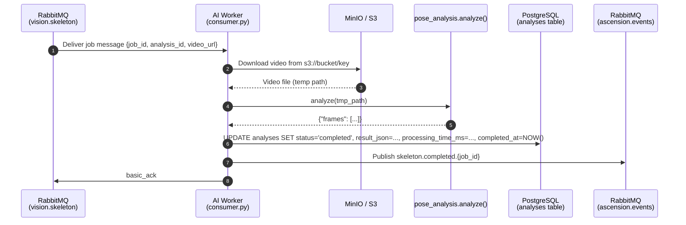

> **Last updated:** 3rd March 2026
> **Version:** 1.1
> **Authors:** Darius
> **Status:** Done
> {.is-success}

---

# AI Worker — Developer Guide

---

## Table of Contents

- [AI Worker — Developer Guide](#ai-worker--developer-guide)
  - [Overview](#overview)
  - [Repository Location](#repository-location)
  - [Environment Variables](#environment-variables)
    - [Local Environment Setup (Conda + moon)](#local-environment-setup-conda--moon)
  - [The vision.skeleton Pipeline](#the-visionskeleton-pipeline)
    - [Job Message Format](#job-message-format)
    - [End-to-End Flow](#end-to-end-flow)
    - [Output Stored in PostgreSQL](#output-stored-in-postgresql)
  - [The pose\_analysis Module](#the-pose_analysis-module)
    - [What It Does](#what-it-does)
    - [Tracked Landmarks](#tracked-landmarks)
    - [Output Format](#output-format)
  - [General Pipeline Pattern](#general-pipeline-pattern)
  - [Error Handling Strategy](#error-handling-strategy)
  - [RabbitMQ Startup Retry](#rabbitmq-startup-retry)

---

## Overview

The AI layer is a Python worker service (`apps/ai/`) that processes climbing video jobs
dispatched by the Rust API via RabbitMQ. Each pipeline is implemented as a **dedicated
consumer process** that subscribes to a single queue, processes the job, persists results
to PostgreSQL, and publishes a completion event to the `ascension.events` topic exchange.

The first pipeline shipped is **`vision.skeleton`**, which extracts per-frame body
landmark data from a climbing video using MediaPipe Pose.

---

## Repository Location

```
apps/ai/
├── consumer.py          # RabbitMQ consumer — vision.skeleton pipeline
├── pose_analysis.py     # MediaPipe pose landmark extraction module
├── pose_landmarker.task # MediaPipe model asset (bundled)
├── environment.yml      # Conda environment definition
├── pyproject.toml
└── moon.yml             # moon tasks run via `conda run -n ascension-ai ...`
```

---

## Environment Variables

The `ai-worker` Docker service requires the following environment variables:

| Variable | Default | Description |
|---|---|---|
| `RABBITMQ_HOST` | `localhost` | RabbitMQ hostname |
| `RABBITMQ_PORT` | `5672` | RabbitMQ port |
| `RABBITMQ_DEFAULT_USER` | `guest` | RabbitMQ username |
| `RABBITMQ_DEFAULT_PASS` | `guest` | RabbitMQ password |
| `MINIO_HOST` | `minio` | MinIO/S3 hostname |
| `MINIO_PORT` | `9000` | MinIO/S3 port |
| `MINIO_ROOT_USER` | `minioadmin` | MinIO access key |
| `MINIO_ROOT_PASSWORD` | `minioadmin` | MinIO secret key |
| `MINIO_ENDPOINT` | _(derived)_ | Full endpoint URL — overrides `MINIO_HOST`/`MINIO_PORT` if set |
| `POSTGRES_HOST` | `postgresql` | PostgreSQL hostname |
| `POSTGRES_PORT` | `5432` | PostgreSQL port |
| `POSTGRES_USER` | `postgres` | PostgreSQL username |
| `POSTGRES_PASSWORD` | `postgres` | PostgreSQL password |
| `POSTGRES_DB` | `ascension` | Database name |
| `DB_URI` | _(none)_ | Full connection URI — overrides individual `POSTGRES_*` vars if set |

---

## Local Environment Setup (Conda + moon)

The canonical local workflow is defined in `apps/ai/moon.yml` and uses a conda
environment named `ascension-ai`.

```bash
cd apps/ai

# Create / refresh conda env from environment.yml
moon run ai:setup

# Install editable package + dev dependencies
moon run ai:install

# Run worker locally
moon run ai:dev

# Additional tasks
moon run ai:lint
moon run ai:test
moon run ai:build
```

Equivalent raw commands from `apps/ai/moon.yml`:

```bash
conda env create --name ascension-ai --file environment.yml --force
conda run --name ascension-ai python -m pip install -e .[dev]
conda run --name ascension-ai python consumer.py
```

---

## The vision.skeleton Pipeline

**Source:** `apps/ai/consumer.py`

**Queue:** `vision.skeleton` (durable)

**Exchange (events):** `ascension.events` (topic, durable)

**Routing key published:** `skeleton.completed.{job_id}`

### Job Message Format

```json
{
  "job_id": "uuid",
  "analysis_id": "uuid",
  "video_url": "s3://bucket/path/to/video.mp4"
}
```

### End-to-End Flow



### Output Stored in PostgreSQL

The `analyses` table is updated with:

| Column | Value |
|---|---|
| `status` | `completed` or `failed` |
| `result_json` | Full `{"frames": [...]}` JSON from `pose_analysis.analyze()` |
| `processing_time_ms` | Wall-clock duration of the `analyze()` call |
| `completed_at` | UTC timestamp at time of update |

---

## The pose_analysis Module

**Source:** `apps/ai/pose_analysis.py`

### What It Does

`pose_analysis.analyze(video_path)` opens a video file with OpenCV, runs
`mediapipe.tasks.vision.PoseLandmarker` in `VIDEO` mode frame-by-frame, and returns a
structured dict of per-frame landmark data. Only frames where a pose is detected are
populated with landmark/angle data; all frames are included in the output with a
`pose_detected` flag.

The module also exposes `render_annotated_video()` for local debugging — it bakes the
skeleton overlay into a new MP4. This function is **not** called by the worker in
production.

### Tracked Landmarks

The module tracks 12 named body joints (MediaPipe indices):

| Index | Name |
|---|---|
| 11 | left\_shoulder |
| 12 | right\_shoulder |
| 13 | left\_elbow |
| 14 | right\_elbow |
| 15 | left\_wrist |
| 16 | right\_wrist |
| 23 | left\_hip |
| 24 | right\_hip |
| 25 | left\_knee |
| 26 | right\_knee |
| 27 | left\_ankle |
| 28 | right\_ankle |

A landmark is included in a frame only if its **presence score ≥ 0.8**.

### Output Format

```json
{
  "frames": [
    {
      "frame": 0,
      "timestamp_ms": 0,
      "pose_detected": true,
      "landmarks": {
        "11": { "x": 0.512, "y": 0.341, "z": -0.021, "pres": 0.997 },
        "12": { "x": 0.488, "y": 0.340, "z": -0.019, "pres": 0.996 }
      },
      "angles": {
        "13": 142.75
      }
    },
    {
      "frame": 1,
      "timestamp_ms": 33,
      "pose_detected": false
    }
  ]
}
```

- Coordinates (`x`, `y`, `z`) are normalised to `[0, 1]` relative to the frame dimensions.
- `angles` currently contains the **left elbow** flexion angle (the angle at joint `13`
  between the upper arm and forearm vectors). Additional joints will be added in future
  iterations.
- Frames with `pose_detected: false` contain no `landmarks` or `angles` keys.

---

## General Pipeline Pattern

All future AI pipelines (`vision.hold_detection`, `vision.advice`, `vision.ghost`,
`training.program`) must follow this pattern:

```
1. DOWNLOAD  — fetch asset from MinIO/S3 via boto3
2. PROCESS   — run the AI/algorithm module
3. PERSIST   — UPDATE analyses (or relevant table) in PostgreSQL
4. PUBLISH   — basic_publish to ascension.events with the appropriate routing key
5. ACK/NACK  — basic_ack on success; basic_nack (requeue=True) on exception
```

Each pipeline should be its own consumer module (following `consumer.py`) that:

- Declares its queue as **durable** at startup.
- Declares the `ascension.events` exchange as **topic + durable** at startup.
- Sets `prefetch_count=1` so a single worker processes one job at a time.
- Handles retries at the queue level via **nack + requeue** (not in-process loops).

---

## Error Handling Strategy

| Scenario | Behaviour |
|---|---|
| Exception during processing | `analyses.status` set to `failed` (best-effort DB update), then `basic_nack(requeue=True)` |
| DB update fails on error path | Logged and swallowed — nack is still sent |
| Temp video file left on disk | `finally` block always unlinks the temp file |
| DB connection left open | `finally` block always calls `conn.close()` |

Messages are requeued on failure, which means a permanently broken job will loop
indefinitely. A dead-letter queue should be configured per queue to cap retry attempts —
this is tracked as a future infrastructure improvement.

---

## RabbitMQ Startup Retry

The consumer retries the initial RabbitMQ connection up to **12 times with a 5-second
delay** (~60 seconds total) to handle the startup race condition in Docker Compose where
the worker container starts before RabbitMQ is ready. If all retries are exhausted, the
process exits with code 1 and Docker Compose restarts it.
