> **Last updated:** 18th February 2026  
> **Version:** 1.2  
> **Authors:** Gianni TUERO  
> **Status:** Done  
> {.is-success}

---

# Ascension Architecture Documentation

---

## Table of Contents

- [Overview](#overview)
- [Core Principles](#core-principles)
- [Essential Documentation](#essential-documentation)
  - [📋 Part 1: System Architecture](#part-1-system-architecture)
  - [📊 Part 2: Data & API Modeling](#part-2-data-api-modeling)
  - [🔄 Workflows](#workflows)
- [Architecture Components](#architecture-components)
- [Key Features](#key-features)
  - [Intelligent Upload System](#intelligent-upload-system)
  - [Asynchronous Processing](#asynchronous-processing)
  - [Lightweight Results](#lightweight-results)
  - [Lifecycle Management](#lifecycle-management)
- [Directory Structure](#directory-structure)
- [Repository Structure](#repository-structure)
- [Technology Stack](#technology-stack)
  - [Client Layer](#client-layer)
  - [API Gateway](#api-gateway)
  - [AI Processing](#ai-processing)
  - [Data Layer](#data-layer)
- [Deployment Phases](#deployment-phases)
  - [Phase 1: Development (Single Machine)](#phase-1-development-single-machine)
  - [Phase 2: Staging (Single Hetzner VPS)](#phase-2-staging-single-hetzner-vps)
  - [Phase 3: Production (Distributed — Hetzner)](#phase-3-production-distributed-hetzner)
- [Getting Started](#getting-started)
  - [For New Developers](#for-new-developers)
  - [For Architects & Tech Leads](#for-architects-tech-leads)
  - [Quick Links](#quick-links)
- [Design Decisions](#design-decisions)
  - [Why Rust for API?](#why-rust-for-api)
  - [Why Python for AI?](#why-python-for-ai)
  - [Why Separate AI Workers?](#why-separate-ai-workers)
  - [Why RabbitMQ?](#why-rabbitmq)
  - [Why Client-side Rendering?](#why-client-side-rendering)
- [Performance Targets](#performance-targets)
- [Security Considerations](#security-considerations)
- [Monitoring & Observability](#monitoring-observability)
- [Cost Optimization](#cost-optimization)
- [Contributing](#contributing)
- [References](#references)


---

## Overview

Ascension is built on a modern microservices architecture designed to handle computationally intensive AI workloads while maintaining responsiveness for end users. The system separates concerns between user interaction (Rust API), heavy computation (Python AI workers), and data persistence.

---

## Core Principles

1. **Separation of Concerns**: API layer handles user requests, AI workers handle computation
2. **Asynchronous Processing**: Heavy workloads are queued and processed independently
3. **Edge Rendering**: Client-side rendering of analysis results to minimize bandwidth
4. **Cost Optimization**: Direct video upload to storage, JSON-based result delivery
5. **Scalability**: Independent scaling of API and AI workers based on demand

---

## Essential Documentation

Before diving into implementation, review these key documents:

### 📋 Part 1: System Architecture

1. **[Architecture Decision Record (ADR)](./adr/tech-stack-decision.md)** - Technology stack justifications
   - Why Rust for API, Flutter for mobile, Python for AI
   - Performance benchmarks and cost analysis
   - Decision framework and evaluation criteria

2. **[System Overview](./system-overview.md)** - High-level design philosophy
   - Event-driven architecture patterns
   - CQRS implementation
   - Scaling strategy and performance targets

### 📊 Part 2: Data & API Modeling

3. **[Database Schema & ERD](./specifications/database-schema.md)** - Complete data model
   - Entity-Relationship Diagram (Mermaid)
   - PostgreSQL schema with triggers and indexes
   - Sample queries and migration strategy

4. **[API Specification](./specifications/api-specification.md)** - OpenAPI 3.0 documentation
   - REST endpoints with request/response examples
   - WebSocket protocol for real-time updates
   - Authentication flows and error codes

### 🔄 Workflows

5. **[Video Analysis Flow](./workflows/video-analysis-flow.md)** - End-to-end feature flow
   - Complete sequence diagrams
   - Implementation code examples
   - Phase-by-phase breakdown

---

## Architecture Components

```mermaid
graph TD
    subgraph Client ["📱 Client Layer"]
        MobileApp["Flutter Mobile App"]
    end

    subgraph API ["🛡️ API Gateway - Rust"]
        APIServer["API Server (Axum)"]
        AuthService["Authentication and WebSocket"]
    end

    subgraph Storage ["🗄️ Data and Storage Layer"]
        ObjectStorage["Object Storage (MinIO/S3)"]
        Database["PostgreSQL"]
        MessageQueue["RabbitMQ (Message Broker)"]
    end

    subgraph AI ["🤖 AI Processing Layer"]
        direction TB
        subgraph Vision ["Pipeline 1 – Vision GPU"]
            HoldDetection["Hold Detection"]
            SkeletonExtraction["Skeleton Extraction"]
            AdviceGenerator["Advice Generator"]
            GhostGenerator["Ghost Climber Generator"]
        end
        subgraph Training ["Pipeline 2 – Training CPU"]
            ProgramGenerator["Training Program Generator"]
        end
    end

    MobileApp -->|"1. Request Presigned URL"| APIServer
    APIServer -->|"2. Generate Presigned URL"| ObjectStorage
    MobileApp -->|"3. Direct Upload"| ObjectStorage
    MobileApp -->|"4. Notify Upload Complete"| APIServer

    APIServer -->|"5. Publish Job"| MessageQueue
    MessageQueue -->|"6a. Vision jobs"| HoldDetection
    MessageQueue -->|"6b. Training jobs"| ProgramGenerator

    HoldDetection -->|"Detect and classify holds"| SkeletonExtraction
    SkeletonExtraction -->|"Per-frame skeleton JSON"| AdviceGenerator
    SkeletonExtraction -->|"Reuse skeleton data"| GhostGenerator

    HoldDetection -->|"Fetch Photo"| ObjectStorage
    SkeletonExtraction -->|"Fetch Video"| ObjectStorage

    AdviceGenerator -->|"7a. Store advice JSON"| Database
    GhostGenerator -->|"7b. Store ghost JSON"| Database
    ProgramGenerator -->|"7c. Store program"| Database
    AdviceGenerator -->|"8. Publish Complete Event"| MessageQueue
    GhostGenerator -->|"8. Publish Complete Event"| MessageQueue

    MessageQueue -->|"9. Notify Ready"| APIServer
    APIServer -->|"10. WebSocket Notification"| MobileApp
    MobileApp -->|"11. Fetch Analysis JSON"| APIServer
    APIServer -->|"12. Retrieve JSON"| Database
```



---

## Key Features

### Intelligent Upload System

- **Presigned URLs**: Direct upload to object storage bypassing API server
- **No API Bottleneck**: API server only coordinates, doesn't handle video data
- **Security**: Time-limited, scoped access to storage

### Asynchronous Processing

- **Message Queue**: RabbitMQ-based job distribution
- **Worker Pool**: Python workers consume jobs independently
- **Non-blocking**: Users can continue using the app during processing

### Lightweight Results

- **JSON-only Response**: ~50KB instead of 50MB video
- **Client-side Rendering**: Flutter CustomPainter overlays analysis on local video
- **Cost Effective**: Minimal data egress from servers

### Lifecycle Management

- **Auto-deletion**: Videos deleted after 7 days unless explicitly saved
- **User Control**: Option to persist videos for sharing
- **Privacy First**: Temporary storage by default

---

## Directory Structure

```
architecture/
├── README.md                          # This file - Architecture overview
├── system-overview.md                 # High-level system design and philosophy
├── monorepo-guide.md                  # Monorepo management guide
├── adr/
│   └── tech-stack-decision.md         # Architecture Decision Record (ADR) for tech choices
├── specifications/
│   ├── database-schema.md             # Complete database schema with ERD
│   └── api-specification.md           # OpenAPI/REST API documentation
├── deployment/
│   ├── development.md                 # Development environment setup
│   ├── staging.md                     # Staging environment setup
│   └── production.md                  # Production environment setup
└── components/ (planned)
    ├── api-gateway.md                 # Rust API server details
    ├── ai-workers.md                  # Python AI workers details
    └── message-queue.md               # RabbitMQ queue patterns
```

---

## Repository Structure

Ascension uses a **monorepo managed with [moonrepo](https://moonrepo.dev)**. All services live in the same repository under `apps/`:

```
Ascension/                      # Monorepo root
├── .moon/
│   ├── workspace.yml           # moonrepo project definitions
│   └── toolchain.yml           # Pinned Rust & Python versions
├── docker-compose.yml          # Development orchestration
├── .env.example                # Environment template
├── README.md
│
└── apps/
    ├── server/                 # Rust/Axum API Gateway
    │   ├── moon.yml
    │   ├── Cargo.toml
    │   └── src/
    │
    ├── ai/                     # Python AI Workers
    │   ├── moon.yml
    │   ├── requirements.txt
    │   └── main.py
    │
    └── mobile/                 # Flutter Mobile App
        ├── moon.yml
        ├── pubspec.yaml
        └── lib/
```

**Benefits**:

- Single `git clone` — no submodule initialization required for development (`docs/` is the only submodule)
- Unified task runner (`moon run <project>:<task>`) with caching
- Toolchain versions pinned in `.moon/toolchain.yml`
- Affected-only builds in CI via `moon run :test --affected`
- `docker-compose.yml` references `apps/server` and `apps/ai` directly

---

## Technology Stack

### Client Layer

- **Framework**: Flutter
- **State Management**: TBD (Bloc/Riverpod recommended)
- **Video Rendering**: CustomPainter for analysis overlay
- **Networking**: HTTP/2 + WebSocket

### API Gateway

- **Language**: Rust
- **Framework**: Axum
- **Features**:
  - JWT Authentication
  - WebSocket for real-time notifications
  - Presigned URL generation
  - Request validation

### AI Processing

- **Language**: Python 3.10+
- **ML Frameworks**: MediaPipe (pose estimation), custom model (hold recognition)
- **Services**:
  - Pose Estimation (skeleton extraction)
  - Inverse Kinematics (Ghost Climber generation)
  - Hold Recognition (CNN-based)

### Data Layer

- **Database**: PostgreSQL 15+
- **Object Storage**: MinIO (self-hosted)
- **Message Queue**: RabbitMQ 3.12+

---

## Deployment Phases

### Phase 1: Development (Single Machine)

- All services in Docker Compose
- Local MinIO for storage
- Suitable for: Development, testing, prototyping

### Phase 2: Staging (Single Hetzner VPS)

- All services on a single Hetzner VPS via Docker Compose
- Each service has its own Docker image (API, AI Worker, RabbitMQ, PostgreSQL, MinIO)
- Suitable for: Beta testing, performance validation

### Phase 3: Production (Distributed — Hetzner)

- Separate Hetzner VPS per service (API, AI Worker, DB)
- Kubernetes (K8s) for horizontal scaling when needed
- MinIO cluster or Hetzner Object Storage
- AI workers on dedicated GPU instances
- Suitable for: Scale (100k+ users)

---

## Getting Started

### For New Developers

**Recommended Reading Order**:

1. **[Architecture Decision Record](./adr/tech-stack-decision.md)** - Understand WHY we chose each technology
2. **[System Overview](./system-overview.md)** - Understand HOW the system works
3. **[Database Schema](./specifications/database-schema.md)** - Understand WHAT data we store
4. **[API Specification](./specifications/api-specification.md)** - Understand the API CONTRACT
5. **[Video Analysis Flow](./workflows/video-analysis-flow.md)** - Understand the CORE FEATURE
6. **[Development Deployment](./deployment/development.md)** - SET UP your local environment

### For Architects & Tech Leads

**Quick Reference**:

- 📐 **C4 Model Diagram**: See "Architecture Components" section above
- 🗄️ **ERD Diagram**: [Database Schema](./specifications/database-schema.md#entity-relationship-diagram-erd)
- 📡 **API Contract**: [OpenAPI 3.0 Spec](./specifications/api-specification.md#openapi-30-specification)
- 🎯 **Tech Justifications**: [ADR](./adr/tech-stack-decision.md#technology-decisions)
- 📊 **Performance Targets**: [System Overview - SLAs](./system-overview.md#target-slas)

### Quick Links

- **Architecture Questions?** → [Tech Stack Decision Record](./adr/tech-stack-decision.md)
- **Need API docs?** → [API Specification](./specifications/api-specification.md)
- **Database queries?** → [Database Schema](./specifications/database-schema.md)
- **Setup local env?** → [Development Deployment](./deployment/development.md)

---

## Design Decisions

### Why Rust for API?

- Memory safety without garbage collection
- Exceptional performance for concurrent requests
- Strong typing prevents runtime errors
- Active ecosystem (Axum, SQLx, Tokio)

### Why Python for AI?

- MediaPipe provides production-ready pose estimation models (33 keypoints)
- Rich computer vision ecosystem (OpenCV, NumPy, scikit-image)
- Industry standard for ML/AI prototyping and experimentation
- Easy to recruit ML engineers
- Fast iteration on model tuning and pipeline logic

### Why Separate AI Workers?

- **Performance**: AI inference doesn't block API requests
- **Scaling**: Add more workers during peak times
- **Resource Isolation**: GPU requirements isolated from API server
- **Fault Tolerance**: API remains responsive if AI worker crashes

### Why RabbitMQ?

- Purpose-built message broker with guaranteed delivery
- Dead letter queues for failed job management
- Persistent messages survive broker restarts
- Flexible routing system for different job types
- Industry standard for reliable async processing

### Why Client-side Rendering?

- **Bandwidth**: 50KB JSON vs 50MB video (1000x reduction)
- **Cost**: Minimal data egress charges
- **Speed**: No video re-encoding delay
- **Quality**: User sees original video quality

---

## Performance Targets

- **Upload Confirmation**: < 100ms (presigned URL)
- **Video Upload**: Network dependent (direct to S3)
- **Analysis Processing**: < 30 seconds for 30-second video
- **Result Delivery**: < 100ms (JSON fetch)
- **Total Time-to-Result**: ~45 seconds (including upload)

---

## Security Considerations

- JWT-based authentication
- Presigned URLs with 15-minute expiration
- HTTPS/TLS for all external communication
- Network isolation for database and RabbitMQ
- Rate limiting on API endpoints
- Input validation on all user data

---

## Monitoring & Observability

- **Metrics**: Prometheus for time-series data (API latency, queue depth, GPU usage)
- **Logging**: Loki for centralized log aggregation (structured JSON logs)
- **Dashboards**: Grafana for visualization and alerting
- **Alerting**: Grafana alerting rules on Prometheus metrics

---

## Cost Optimization

1. **Video Storage**: 7-day auto-deletion policy
2. **Data Transfer**: Client-side rendering eliminates egress
3. **Compute**: AI workers scale with demand
4. **Database**: Connection pooling, prepared statements
5. **Caching**: Reduce database queries with PostgreSQL query optimization

---

## Contributing

When modifying the architecture:

1. Document changes in relevant files
2. Update diagrams to reflect new flows
3. Consider impact on all deployment phases
4. Update performance targets if applicable
5. Review security implications

---

## References

- [Rust Axum Framework](https://github.com/tokio-rs/axum)
- [MediaPipe Pose Estimation](https://google.github.io/mediapipe/solutions/pose.html)
- [RabbitMQ Tutorials](https://www.rabbitmq.com/tutorials)
- [MinIO Presigned URLs](https://min.io/docs/minio/linux/integrations/presigned-put-upload-via-browser.html)

---

