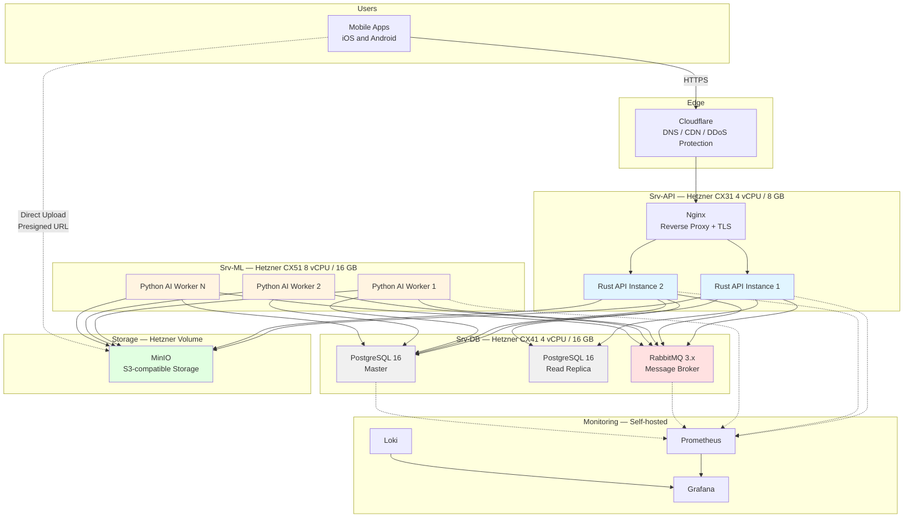
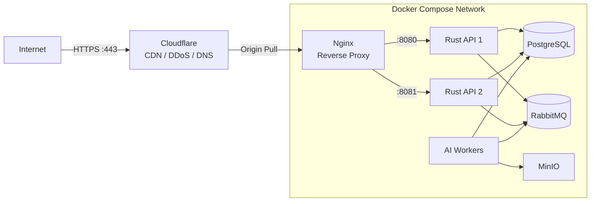

> **Last updated:** 25th February 2026  
> **Version:** 2.0  
> **Authors:** Gianni TUERO  
> **Status:** Work in Progress  
> {.is-warning}

---

# Production Environment Setup

---

## Table of Contents

- [Overview](#overview)
- [Architecture Diagram](#architecture-diagram)
- [Infrastructure Requirements](#infrastructure-requirements)
  - [Hetzner Machines](#hetzner-machines)
  - [GPU Machine (AI Workers — Optional Upgrade)](#gpu-machine-ai-workers-optional-upgrade)
    - [Option A: Hetzner GPU Server](#option-a-hetzner-gpu-server)
    - [Option B: On-Premise GPU Machine](#option-b-on-premise-gpu-machine)
- [Network Configuration](#network-configuration)
  - [Cloudflare + Nginx](#cloudflare-nginx)
  - [Firewall Rules](#firewall-rules)
- [Docker Compose Configuration](#docker-compose-configuration)
  - [Production `docker-compose.yml`](#production-docker-composeyml)
  - [Nginx Configuration](#nginx-configuration)
  - [MinIO Lifecycle Policy](#minio-lifecycle-policy)
  - [Environment Variables](#environment-variables)
- [Deployment Process](#deployment-process)
  - [1. Build Docker Images](#1-build-docker-images)
  - [2. Push to Container Registry](#2-push-to-container-registry)
  - [3. Deploy to Hetzner VPS](#3-deploy-to-hetzner-vps)
  - [4. Run Database Migrations](#4-run-database-migrations)
- [CI/CD Pipeline (GitHub Actions)](#cicd-pipeline-github-actions)
  - [Unified CI with moon](#unified-ci-with-moon)
  - [Production Deployment](#production-deployment)
- [Security Configuration](#security-configuration)
  - [System Hardening](#system-hardening)
  - [Secrets Management](#secrets-management)
  - [Network Security](#network-security)
  - [Data Protection](#data-protection)
- [Monitoring and Observability](#monitoring-and-observability)
  - [Prometheus Configuration](#prometheus-configuration)
  - [Grafana Data Sources](#grafana-data-sources)
  - [Key Metrics](#key-metrics)
  - [Alerting Rules (Grafana → Slack)](#alerting-rules-grafana-slack)
  - [Application Metrics (Rust API)](#application-metrics-rust-api)
- [Backup & Disaster Recovery](#backup-disaster-recovery)
  - [PostgreSQL Backups](#postgresql-backups)
  - [MinIO Backups](#minio-backups)
  - [Recovery Procedures](#recovery-procedures)
- [Scaling Strategy](#scaling-strategy)
  - [Phase 1: Docker Compose (Current — up to ~5,000 users)](#phase-1-docker-compose-current-up-to-5000-users)
  - [Phase 2: Multi-VPS (5,000–20,000 users)](#phase-2-multi-vps-500020000-users)
  - [Phase 3: K3s Kubernetes (20,000+ users)](#phase-3-k3s-kubernetes-20000-users)
  - [Phase 4: Full Scale (100,000+ users)](#phase-4-full-scale-100000-users)
- [Cost Analysis](#cost-analysis)
  - [Cost by Scale](#cost-by-scale)
  - [Comparison with Cloud Providers](#comparison-with-cloud-providers)
- [Security Best Practices Checklist](#security-best-practices-checklist)
- [Next Steps](#next-steps)


---

## Overview

The production environment is designed for scale, reliability, and security on **Hetzner dedicated servers**. The architecture begins with **Docker Compose on separate VPS instances** and is designed to evolve to **Kubernetes (K3s)** for horizontal auto-scaling when user volumes demand it.

All components use **RabbitMQ** as the message broker, **MinIO** (self-hosted) for S3-compatible object storage, and **PostgreSQL** for the database — consistent with development and staging environments.

---

## Architecture Diagram



---

## Infrastructure Requirements

### Hetzner Machines

| Machine | Role | Specs | Cost |
|---|---|---|---|
| **Srv-API** | Nginx + Rust API (×2) + Monitoring | CX31: 4 vCPU, 8 GB RAM, 80 GB SSD | 15€/month |
| **Srv-DB** | PostgreSQL Master + Replica + RabbitMQ | CX41: 4 vCPU, 16 GB RAM, 160 GB SSD | 25€/month |
| **Srv-ML** | Python AI Workers (×2-4) | CX51: 8 vCPU, 16 GB RAM, 240 GB SSD | 45€/month |
| **Storage** | MinIO S3-compatible | Hetzner Volume 1 TB | 10€/month |
| **Domain** | DNS | `.com` domain | 1€/month (12€/year) |
| **SSL** | TLS Certificates | Let's Encrypt via Cloudflare | 0€ |
| **Monitoring** | Prometheus + Grafana + Loki | Self-hosted on Srv-API | 0€ |
| | | **Total (MVP)** | **96€/month** |

### GPU Machine (AI Workers — Optional Upgrade)

For production performance, consider upgrading the ML server:

#### Option A: Hetzner GPU Server

- **Instance**: Hetzner CCX or dedicated GPU server
- **GPU**: NVIDIA A4000 or equivalent
- **Cost**: ~60-100€/month
- **Benefit**: Same provider, low latency to other services

#### Option B: On-Premise GPU Machine

- **Hardware**: Team member's GPU machine (RTX 3060+)
- **Connection**: SSH tunnel to Hetzner VPS
- **Cost**: 0€ (hardware already owned)
- **Trade-off**: Must maintain uptime, potential home network limitations

---

## Network Configuration

### Cloudflare + Nginx

Traffic flows through Cloudflare for DDoS protection and CDN caching, then reaches Nginx on the server which reverse-proxies to API instances.



### Firewall Rules

```bash
# Allow SSH (restrict to your IP)
sudo ufw allow from YOUR_IP to any port 22

# Allow HTTP/HTTPS (for Cloudflare origin pull)
sudo ufw allow 80/tcp
sudo ufw allow 443/tcp

# Internal Docker network handles all inter-service communication
# No need to expose PostgreSQL, RabbitMQ, or MinIO externally

sudo ufw enable
```

---

## Docker Compose Configuration

### Production `docker-compose.yml`

```yaml
version: "3.8"

services:
  # Nginx Reverse Proxy
  nginx:
    image: nginx:alpine
    container_name: ascension-nginx
    ports:
      - "80:80"
      - "443:443"
    volumes:
      - ./nginx/nginx.conf:/etc/nginx/nginx.conf:ro
      - ./nginx/ssl:/etc/nginx/ssl:ro
    depends_on:
      - api
    restart: always

  # Rust API Server (from apps/server/)
  api:
    image: ascension/api:latest
    container_name: ascension-api
    environment:
      DATABASE_URL: ${DATABASE_URL}
      RABBITMQ_URL: ${RABBITMQ_URL}
      MINIO_ENDPOINT: ${MINIO_ENDPOINT}
      MINIO_BUCKET: ${MINIO_BUCKET}
      MINIO_ROOT_USER: ${MINIO_ROOT_USER}
      MINIO_ROOT_PASSWORD: ${MINIO_ROOT_PASSWORD}
      JWT_SECRET: ${JWT_SECRET}
      RUST_LOG: info
    expose:
      - "8080"
    depends_on:
      db:
        condition: service_healthy
      rabbitmq:
        condition: service_healthy
      minio:
        condition: service_healthy
    restart: always
    healthcheck:
      test: ["CMD", "curl", "-f", "http://localhost:8080/health"]
      interval: 30s
      timeout: 10s
      retries: 3

  # PostgreSQL Database
  db:
    image: postgres:16-alpine
    container_name: ascension-db
    environment:
      POSTGRES_USER: ${POSTGRES_USER}
      POSTGRES_PASSWORD: ${POSTGRES_PASSWORD}
      POSTGRES_DB: ${POSTGRES_DB}
    ports:
      - "5432:5432"
    volumes:
      - pg_data:/var/lib/postgresql/data
      - ./backups:/backups
    restart: always
    command:
      - "postgres"
      - "-c"
      - "max_connections=200"
      - "-c"
      - "shared_buffers=512MB"
      - "-c"
      - "effective_cache_size=2GB"
      - "-c"
      - "wal_level=replica"
    healthcheck:
      test: ["CMD-SHELL", "pg_isready -U ${POSTGRES_USER}"]
      interval: 10s
      timeout: 5s
      retries: 5

  # RabbitMQ Message Broker
  rabbitmq:
    image: rabbitmq:3.12-management-alpine
    container_name: ascension-rabbitmq
    ports:
      - "5672:5672"
      - "15672:15672"
    volumes:
      - rabbitmq_data:/var/lib/rabbitmq
    restart: always
    healthcheck:
      test: ["CMD", "rabbitmq-diagnostics", "-q", "ping"]
      interval: 10s
      timeout: 5s
      retries: 5

  # MinIO Object Storage
  minio:
    image: minio/minio:latest
    container_name: ascension-minio
    command: server /data --console-address ":9001"
    environment:
      MINIO_ROOT_USER: ${MINIO_ROOT_USER}
      MINIO_ROOT_PASSWORD: ${MINIO_ROOT_PASSWORD}
    ports:
      - "9000:9000"
      - "9001:9001"
    volumes:
      - minio_data:/data
    restart: always
    healthcheck:
      test: ["CMD", "curl", "-f", "http://localhost:9000/minio/health/live"]
      interval: 30s
      timeout: 10s
      retries: 3

  # MinIO Bucket Init
  minio-init:
    image: minio/mc:latest
    depends_on:
      - minio
    entrypoint: >
      /bin/sh -c "
      /usr/bin/mc alias set myminio http://minio:9000 ${MINIO_ROOT_USER} ${MINIO_ROOT_PASSWORD};
      /usr/bin/mc mb myminio/${MINIO_BUCKET} --ignore-existing;
      exit 0;
      "

  # Python AI Workers (from apps/ai/)
  worker:
    image: ascension/worker:latest
    container_name: ascension-worker
    environment:
      DATABASE_URL: ${DATABASE_URL}
      RABBITMQ_URL: ${RABBITMQ_URL}
      MINIO_ENDPOINT: ${MINIO_ENDPOINT}
      MINIO_BUCKET: ${MINIO_BUCKET}
      MINIO_ROOT_USER: ${MINIO_ROOT_USER}
      MINIO_ROOT_PASSWORD: ${MINIO_ROOT_PASSWORD}
      WORKER_CONCURRENCY: ${WORKER_CONCURRENCY}
    depends_on:
      - db
      - rabbitmq
      - minio
    restart: always
    deploy:
      replicas: 2
    # Uncomment for GPU support:
    # deploy:
    #   resources:
    #     reservations:
    #       devices:
    #         - driver: nvidia
    #           count: 1
    #           capabilities: [gpu]

  # --- Monitoring Stack ---
  prometheus:
    image: prom/prometheus:latest
    container_name: ascension-prometheus
    ports:
      - "9090:9090"
    volumes:
      - ./prometheus/prometheus.yml:/etc/prometheus/prometheus.yml:ro
      - prometheus_data:/prometheus
    restart: always

  loki:
    image: grafana/loki:latest
    container_name: ascension-loki
    ports:
      - "3100:3100"
    volumes:
      - loki_data:/loki
    restart: always

  grafana:
    image: grafana/grafana:latest
    container_name: ascension-grafana
    ports:
      - "3000:3000"
    environment:
      GF_SECURITY_ADMIN_PASSWORD: ${GRAFANA_PASSWORD}
    volumes:
      - grafana_data:/var/lib/grafana
    restart: always

volumes:
  pg_data:
  rabbitmq_data:
  minio_data:
  prometheus_data:
  loki_data:
  grafana_data:
```

### Nginx Configuration

Create `/etc/nginx/nginx.conf`:

```nginx
upstream api_backend {
    least_conn;
    server api:8080;
    # Add more instances as needed:
    # server api-2:8080;
}

server {
    listen 80;
    server_name api.ascension.app;
    return 301 https://$server_name$request_uri;
}

server {
    listen 443 ssl http2;
    server_name api.ascension.app;

    ssl_certificate /etc/nginx/ssl/fullchain.pem;
    ssl_certificate_key /etc/nginx/ssl/privkey.pem;

    # API endpoints
    location /api/ {
        proxy_pass http://api_backend;
        proxy_set_header Host $host;
        proxy_set_header X-Real-IP $remote_addr;
        proxy_set_header X-Forwarded-For $proxy_add_x_forwarded_for;
        proxy_set_header X-Forwarded-Proto $scheme;
    }

    # WebSocket endpoint
    location /ws {
        proxy_pass http://api_backend;
        proxy_http_version 1.1;
        proxy_set_header Upgrade $http_upgrade;
        proxy_set_header Connection "Upgrade";
        proxy_set_header Host $host;
    }

    # Health check
    location /health {
        proxy_pass http://api_backend;
    }

    # Metrics (internal only)
    location /metrics {
        proxy_pass http://api_backend;
        allow 10.0.0.0/8;
        allow 172.16.0.0/12;
        deny all;
    }
}
```

### MinIO Lifecycle Policy

Create `lifecycle.json` (auto-delete unsaved videos after 7 days):

```json
{
  "Rules": [
    {
      "Id": "DeleteUnsavedVideos",
      "Status": "Enabled",
      "Filter": {
        "Prefix": "uploads/"
      },
      "Expiration": {
        "Days": 7
      }
    }
  ]
}
```

Apply:

```bash
mc ilm import myminio/ascension-production < lifecycle.json
```

### Environment Variables

```bash
# Database
POSTGRES_USER=ascension
POSTGRES_PASSWORD=<STRONG_GENERATED_PASSWORD>
POSTGRES_DB=ascension_production
DATABASE_URL=postgresql://ascension:<password>@db:5432/ascension_production

# RabbitMQ
RABBITMQ_URL=amqp://ascension:<password>@rabbitmq:5672

# MinIO
MINIO_ROOT_USER=ascension
MINIO_ROOT_PASSWORD=<STRONG_GENERATED_PASSWORD>
MINIO_ENDPOINT=http://minio:9000
MINIO_BUCKET=ascension-production

# API
JWT_SECRET=<GENERATE_SECURE_SECRET>
RUST_LOG=info

# Workers
WORKER_CONCURRENCY=4

# Monitoring
GRAFANA_PASSWORD=<STRONG_PASSWORD>

# Environment
ENVIRONMENT=production
```

---

## Deployment Process

### 1. Build Docker Images

From the monorepo root:

```bash
# Build API image
docker build -t ascension/api:v${VERSION} \
  -f apps/server/Dockerfile --target production ./apps/server

# Build Worker image
docker build -t ascension/worker:v${VERSION} ./apps/ai
```

### 2. Push to Container Registry

Using Docker Hub or a private registry:

```bash
docker tag ascension/api:v${VERSION} your-registry/ascension-api:v${VERSION}
docker push your-registry/ascension-api:v${VERSION}

docker tag ascension/worker:v${VERSION} your-registry/ascension-worker:v${VERSION}
docker push your-registry/ascension-worker:v${VERSION}
```

### 3. Deploy to Hetzner VPS

```bash
# SSH into production server
ssh deploy@production.ascension.app

# Pull latest images
docker pull your-registry/ascension-api:v${VERSION}
docker pull your-registry/ascension-worker:v${VERSION}

# Tag as latest
docker tag your-registry/ascension-api:v${VERSION} ascension/api:latest
docker tag your-registry/ascension-worker:v${VERSION} ascension/worker:latest

# Restart services (zero-downtime with health checks)
docker-compose up -d --no-deps api worker
```

### 4. Run Database Migrations

```bash
# On the server
docker-compose exec -T api sqlx migrate run

# Or via SSH from CI
ssh deploy@production.ascension.app \
  "cd /opt/ascension && docker-compose exec -T api sqlx migrate run"
```

---

## CI/CD Pipeline (GitHub Actions)

**Note**: moonrepo enables affected-only pipelines — only changed projects are built and tested.

### Unified CI with moon

**`.github/workflows/ci.yml`**:

```yaml
name: CI

on:
  push:
    branches: [main, dev]
  pull_request:
    branches: [main]

jobs:
  ci:
    runs-on: ubuntu-latest
    steps:
      - uses: actions/checkout@v4
        with:
          fetch-depth: 0

      - name: Install moon
        run: curl -fsSL https://moonrepo.dev/install/moon.sh | bash

      - name: Run affected tests
        run: moon run :test --affected

      - name: Run affected lint
        run: moon run :lint --affected
```

### Production Deployment

**`.github/workflows/deploy-production.yml`**:

```yaml
name: Deploy to Production

on:
  push:
    tags:
      - "v*"

jobs:
  build-and-deploy:
    runs-on: ubuntu-latest
    steps:
      - uses: actions/checkout@v4

      - name: Install moon
        run: curl -fsSL https://moonrepo.dev/install/moon.sh | bash

      - name: Login to Docker Registry
        uses: docker/login-action@v3
        with:
          username: ${{ secrets.DOCKER_USERNAME }}
          password: ${{ secrets.DOCKER_PASSWORD }}

      - name: Build and push API image
        run: |
          docker build -t ${{ secrets.DOCKER_REGISTRY }}/ascension-api:${{ github.ref_name }} \
            -f apps/server/Dockerfile --target production ./apps/server
          docker push ${{ secrets.DOCKER_REGISTRY }}/ascension-api:${{ github.ref_name }}

      - name: Build and push Worker image
        run: |
          docker build -t ${{ secrets.DOCKER_REGISTRY }}/ascension-worker:${{ github.ref_name }} \
            ./apps/ai
          docker push ${{ secrets.DOCKER_REGISTRY }}/ascension-worker:${{ github.ref_name }}

      - name: Deploy to Hetzner
        uses: appleboy/ssh-action@v1
        with:
          host: ${{ secrets.PRODUCTION_HOST }}
          username: deploy
          key: ${{ secrets.SSH_PRIVATE_KEY }}
          script: |
            cd /opt/ascension
            docker pull ${{ secrets.DOCKER_REGISTRY }}/ascension-api:${{ github.ref_name }}
            docker pull ${{ secrets.DOCKER_REGISTRY }}/ascension-worker:${{ github.ref_name }}
            docker tag ${{ secrets.DOCKER_REGISTRY }}/ascension-api:${{ github.ref_name }} ascension/api:latest
            docker tag ${{ secrets.DOCKER_REGISTRY }}/ascension-worker:${{ github.ref_name }} ascension/worker:latest
            docker-compose up -d --no-deps api worker
            docker-compose exec -T api sqlx migrate run

      - name: Verify deployment
        uses: appleboy/ssh-action@v1
        with:
          host: ${{ secrets.PRODUCTION_HOST }}
          username: deploy
          key: ${{ secrets.SSH_PRIVATE_KEY }}
          script: |
            sleep 10
            curl -f http://localhost:8080/health || exit 1
```

---

## Security Configuration

### System Hardening

```bash
# Disable root SSH login
sudo sed -i 's/PermitRootLogin yes/PermitRootLogin no/' /etc/ssh/sshd_config

# Key-only authentication
sudo sed -i 's/#PasswordAuthentication yes/PasswordAuthentication no/' /etc/ssh/sshd_config

# Restart SSH
sudo systemctl restart sshd

# Auto security updates
sudo apt install unattended-upgrades
sudo dpkg-reconfigure -plow unattended-upgrades

# Fail2Ban
sudo apt install fail2ban
sudo systemctl enable fail2ban
```

### Secrets Management

All secrets are stored in `.env` files on the server (never committed to Git):

```bash
# Generate secure secrets
openssl rand -hex 32  # For JWT_SECRET
openssl rand -hex 32  # For POSTGRES_PASSWORD
openssl rand -hex 32  # For MINIO_ROOT_PASSWORD
```

Secrets are injected into containers via Docker Compose `env_file` directive.

### Network Security

- **External access**: Only ports 22 (SSH), 80, 443 exposed via UFW
- **Inter-service**: All communication via Docker bridge network (not exposed)
- **Database**: Not accessible from outside Docker network
- **RabbitMQ Management UI**: Accessible only via SSH tunnel
- **MinIO Console**: Accessible only via SSH tunnel
- **TLS**: All external traffic encrypted (Cloudflare origin certificates or Let's Encrypt)

### Data Protection

- **In Transit**: TLS 1.3 for all external communication
- **At Rest**: Encrypted Hetzner volumes
- **RGPD**: Data stored in EU (Hetzner Germany/Finland), `ON DELETE CASCADE` for right-to-erasure
- **Passwords**: Hashed with Argon2
- **API Keys**: Presigned URLs expire after 15 minutes

---

## Monitoring and Observability

**Stack**: Prometheus (metrics) + Grafana (dashboards & alerting) + Loki (logs)

### Prometheus Configuration

```yaml
# prometheus/prometheus.yml
global:
  scrape_interval: 15s

scrape_configs:
  - job_name: 'ascension-api'
    static_configs:
      - targets: ['api:8080']

  - job_name: 'rabbitmq'
    static_configs:
      - targets: ['rabbitmq:15692']

  - job_name: 'postgres'
    static_configs:
      - targets: ['postgres-exporter:9187']

  - job_name: 'node'
    static_configs:
      - targets: ['node-exporter:9100']
```

### Grafana Data Sources

- **Prometheus** → `http://prometheus:9090`
- **Loki** → `http://loki:3100`

### Key Metrics

| Component | Metrics |
|---|---|
| **API** | Request rate, error rate (%), response time (p50/p95/p99), active WebSocket connections |
| **AI Workers** | RabbitMQ queue depth, processing time per video, failed jobs count |
| **Database** | Query time (p50/p95), connection pool usage, cache hit rate |
| **Storage** | Upload success rate, storage used (GB), download bandwidth |
| **System** | CPU, RAM, disk usage per machine |

### Alerting Rules (Grafana → Slack)

| Condition | Severity | Action |
|---|---|---|
| API error rate > 5% for 5 min | Critical | Page on-call |
| RabbitMQ queue depth > 200 jobs | Warning | Scale workers |
| Database CPU > 80% for 10 min | Warning | Investigate |
| Disk usage > 90% | Critical | Expand volume |
| API latency p95 > 500ms | Warning | Investigate |
| Worker processing > 5 min | Warning | Check worker health |

### Application Metrics (Rust API)

```toml
# Cargo.toml
[dependencies]
prometheus = "0.13"
axum-prometheus = "0.4"
```

```rust
// src/main.rs
use axum_prometheus::PrometheusMetricLayer;

let (prometheus_layer, metric_handle) = PrometheusMetricLayer::pair();

let app = Router::new()
    .route("/metrics", get(|| async move { metric_handle.render() }))
    .layer(prometheus_layer);
```

---

## Backup & Disaster Recovery

### PostgreSQL Backups

```bash
#!/bin/bash
# backup.sh — Run daily via cron at 3:00 AM

DATE=$(date +%Y%m%d_%H%M%S)

# Full dump
docker-compose exec -T db pg_dump -U ascension ascension_production \
  | gzip > /backups/backup_${DATE}.sql.gz

# Keep last 7 daily backups
find /backups -name "backup_*.sql.gz" -mtime +7 -delete
```

Cron setup:

```bash
crontab -e
# 0 3 * * * /opt/ascension/backup.sh
```

**RPO (Recovery Point Objective)**: < 15 minutes (via WAL archiving)
**RTO (Recovery Time Objective)**: < 2 hours (restore + restart services)

### MinIO Backups

MinIO uses distributed mode with data redundancy. Additional backups to Hetzner Storage Box:

```bash
# Sync MinIO data to backup storage
mc mirror local/ascension-production backup/ascension-production --overwrite
```

### Recovery Procedures

**Database Failure**:

1. Stop API services
2. Restore from latest backup: `gunzip < backup.sql.gz | docker-compose exec -T db psql -U ascension ascension_production`
3. Replay WAL logs for point-in-time recovery
4. Restart services

**Full Server Failure**:

1. Provision new Hetzner VPS
2. Install Docker + Docker Compose
3. Pull Docker images from registry
4. Restore database from backup
5. Restore `.env` from secure storage
6. Start services
7. Update Cloudflare DNS

**RabbitMQ Failure**:

- Persistent queues survive restarts
- If data lost: restart RabbitMQ, re-queue any in-flight jobs from database (status = 'processing')

---

## Scaling Strategy

### Phase 1: Docker Compose (Current — up to ~5,000 users)

Single set of VPS instances with Docker Compose. Scale by:

- Adding API replicas (Nginx upstream)
- Adding worker replicas (`deploy: replicas: N`)
- Upgrading VPS tiers (vertical scaling)

### Phase 2: Multi-VPS (5,000–20,000 users)

Separate machines for each concern:

- **Srv-API (×2)**: Nginx + multiple Rust API instances
- **Srv-DB**: Dedicated PostgreSQL with streaming replication
- **Srv-ML (×2-3)**: Dedicated AI worker machines
- **Srv-Storage**: Dedicated MinIO cluster
- **Srv-Monitor**: Dedicated monitoring stack

Estimated cost: **€200-400/month**

### Phase 3: K3s Kubernetes (20,000+ users)

Migrate to K3s cluster on Hetzner dedicated servers:

- Horizontal Pod Autoscaling (HPA) for API and workers
- RabbitMQ operator for cluster management
- PostgreSQL operator (e.g., CloudNativePG)
- Ingress controller replacing Nginx
- Persistent volumes on Hetzner

Estimated cost: **€500-1,500/month**

### Phase 4: Full Scale (100,000+ users)

- Hetzner Dedicated Servers (3× AX41): ~€150/month
- Hetzner GPU Servers for AI workers: ~€200-500/month
- PostgreSQL with replication: included
- RabbitMQ cluster: included
- MinIO distributed: included
- Hetzner Volume Storage (50 TB): ~€2,500/month

Estimated cost: **€3,000-3,500/month (~€0.035/user)**

---

## Cost Analysis

### Cost by Scale

| Phase | Users | Infrastructure | Monthly Cost | Cost/User |
|---|---|---|---|---|
| MVP | 100 | 3 VPS + Volume | 96€ | 0.96€ |
| Scale | 1,000 | Upgraded VPS + extra workers | 231€ | 0.23€ |
| Scale+ | 10,000 | Multi-VPS | 655€ | 0.07€ |
| Production | 100,000 | K3s cluster + dedicated servers | ~3,500€ | 0.035€ |

### Comparison with Cloud Providers

| Provider | MVP Cost | 100k Users | Extra Cost vs Hetzner |
|---|---|---|---|
| **Hetzner** | 96€/month | ~3,500€/month | Reference |
| OVH | 140€/month | ~5,000€/month | +46% |
| DigitalOcean | 207€/month | ~7,000€/month | +116% |
| AWS | 312€/month | ~11,700€/month | +225% |

**Annual savings vs AWS**: 2,592€ (MVP) → 98,400€ (100k users)

---

## Security Best Practices Checklist

- [ ] All data encrypted in transit (TLS 1.3) and at rest (encrypted volumes)
- [ ] Secrets stored in `.env` files (not in Git), rotated quarterly
- [ ] SSH key-only authentication, root login disabled
- [ ] UFW firewall active (only ports 22, 80, 443 exposed)
- [ ] Fail2Ban active for SSH brute-force protection
- [ ] Database not exposed to public internet
- [ ] RabbitMQ and MinIO consoles accessible only via SSH tunnel
- [ ] Automatic security updates via `unattended-upgrades`
- [ ] Docker images rebuilt weekly with latest base images
- [ ] Dependabot enabled for dependency vulnerability scanning
- [ ] RGPD: EU-only data storage (Hetzner Germany/Finland)
- [ ] RGPD: `ON DELETE CASCADE` implements right-to-erasure
- [ ] Rate limiting via Nginx (100 req/min per IP)
- [ ] JWT tokens expire after 1 hour, refresh tokens secured
- [ ] Presigned upload URLs expire after 15 minutes

---

## Next Steps

- Implement blue-green deployments for zero-downtime updates
- Set up K3s cluster for auto-scaling (Phase 3)
- Add comprehensive E2E testing in CI/CD
- Configure Grafana alerting to Slack/Discord
- Set up log retention policies in Loki
- Implement chaos engineering tests

---

**Last Updated**: 2026-02-25
**Maintainer**: Ascension DevOps Team
