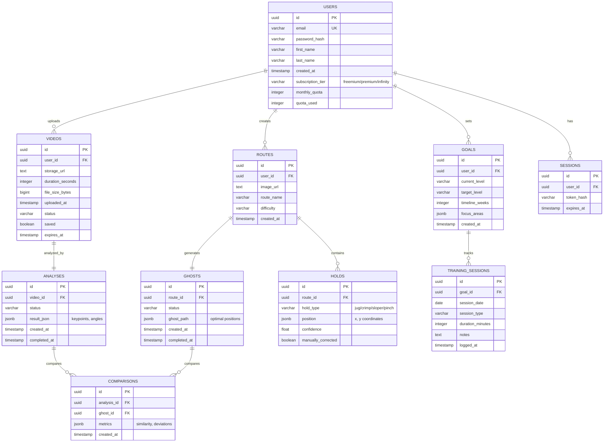

> **Last updated:** 16th February 2026  
> **Version:** 1.0  
> **Authors:** Gianni TUERO  
> **Status:** Done  
> {.is-success}

---

# Database Schema & Data Model

---

## Table of Contents

- [Entity-Relationship Diagram (ERD)](#entity-relationship-diagram-erd)
- [Table Definitions](#table-definitions)
  - [Users Table](#users-table)
  - [Videos Table](#videos-table)
  - [Analyses Table](#analyses-table)
  - [Routes Table](#routes-table)
  - [Ghosts Table](#ghosts-table)
  - [Holds Table](#holds-table)
  - [Comparisons Table](#comparisons-table)
  - [Goals Table](#goals-table)
  - [Training Sessions Table](#training-sessions-table)
  - [Sessions Table](#sessions-table)
- [Sample Queries](#sample-queries)
  - [Get user's recent analyses](#get-users-recent-analyses)
  - [Check user quota](#check-user-quota)
  - [Get route with ghost and holds](#get-route-with-ghost-and-holds)


---

## Entity-Relationship Diagram (ERD)



---

## Table Definitions

### Users Table

Stores user account information and subscription details.

```sql
CREATE TABLE users (
    id UUID PRIMARY KEY DEFAULT gen_random_uuid(),
    email VARCHAR(255) UNIQUE NOT NULL,
    password_hash VARCHAR(255) NOT NULL,
    first_name VARCHAR(100),
    last_name VARCHAR(100),
    created_at TIMESTAMP DEFAULT NOW(),
    last_login TIMESTAMP,
    subscription_tier VARCHAR(50) DEFAULT 'freemium' CHECK (subscription_tier IN ('freemium', 'premium', 'infinity')),
    monthly_quota INTEGER DEFAULT 10,
    quota_used INTEGER DEFAULT 0,
    email_verified BOOLEAN DEFAULT FALSE,
    phone_number VARCHAR(20),
    CONSTRAINT valid_email CHECK (email ~* '^[A-Za-z0-9._%+-]+@[A-Za-z0-9.-]+\.[A-Z|a-z]{2,}$')
);

CREATE INDEX idx_users_email ON users(email);
CREATE INDEX idx_users_subscription_tier ON users(subscription_tier);
CREATE INDEX idx_users_created_at ON users(created_at DESC);
```

**Business Rules**:
- Freemium tier: 10 videos/month (with ads)
- Premium tier: 30 videos/month (20€/month, ghost mode enabled)
- Infinity tier: 100 videos/month (30€/month, all features + server priority)

---

### Videos Table

```sql
CREATE TABLE videos (
    id UUID PRIMARY KEY DEFAULT gen_random_uuid(),
    user_id UUID NOT NULL REFERENCES users(id) ON DELETE CASCADE,
    storage_url TEXT NOT NULL,
    duration_seconds INTEGER,
    file_size_bytes BIGINT,
    uploaded_at TIMESTAMP DEFAULT NOW(),
    status VARCHAR(50) DEFAULT 'pending',
    saved BOOLEAN DEFAULT FALSE,
    expires_at TIMESTAMP  -- NULL if saved by user
);

CREATE INDEX idx_videos_user_id ON videos(user_id);
```

---

### Analyses Table

Stores skeleton detection results.

```sql
CREATE TABLE analyses (
    id UUID PRIMARY KEY DEFAULT gen_random_uuid(),
    video_id UUID NOT NULL REFERENCES videos(id) ON DELETE CASCADE,
    status VARCHAR(50) DEFAULT 'pending',
    result_json JSONB,
    created_at TIMESTAMP DEFAULT NOW(),
    completed_at TIMESTAMP
);

CREATE INDEX idx_analyses_video_id ON analyses(video_id);
```

**result_json example**:
```json
{
  "frames": [
    {
      "frame_number": 0,
      "keypoints": [
        {"name": "left_shoulder", "x": 0.5, "y": 0.3}
      ],
      "joint_angles": {
        "left_elbow": 145.2,
        "right_knee": 89.5
      }
    }
  ]
}
```

---

### Routes Table

Stores climbing route photos.

```sql
CREATE TABLE routes (
    id UUID PRIMARY KEY DEFAULT gen_random_uuid(),
    user_id UUID NOT NULL REFERENCES users(id) ON DELETE CASCADE,
    image_url TEXT NOT NULL,
    route_name VARCHAR(200),
    difficulty VARCHAR(10),
    created_at TIMESTAMP DEFAULT NOW()
);

CREATE INDEX idx_routes_user_id ON routes(user_id);
```

---

### Ghosts Table

Stores optimal path generation (ghost climber).

```sql
CREATE TABLE ghosts (
    id UUID PRIMARY KEY DEFAULT gen_random_uuid(),
    route_id UUID NOT NULL REFERENCES routes(id) ON DELETE CASCADE,
    status VARCHAR(50) DEFAULT 'pending',
    ghost_path JSONB,
    created_at TIMESTAMP DEFAULT NOW(),
    completed_at TIMESTAMP
);

CREATE INDEX idx_ghosts_route_id ON ghosts(route_id);
```

**ghost_path example**:
```json
{
  "steps": [
    {
      "step": 1,
      "hand_position": {"x": 100, "y": 200},
      "foot_position": {"x": 120, "y": 350}
    }
  ]
}
```

---

### Holds Table

Stores detected climbing holds with types.

```sql
CREATE TABLE holds (
    id UUID PRIMARY KEY DEFAULT gen_random_uuid(),
    route_id UUID NOT NULL REFERENCES routes(id) ON DELETE CASCADE,
    hold_type VARCHAR(50) CHECK (hold_type IN ('jug', 'crimp', 'sloper', 'pinch', 'pocket', 'edge')),
    position JSONB NOT NULL,
    confidence FLOAT,
    manually_corrected BOOLEAN DEFAULT FALSE
);

CREATE INDEX idx_holds_route_id ON holds(route_id);
```

**Hold types**:
- `jug` - Easy to grip
- `crimp` - Small edge
- `sloper` - Rounded
- `pinch` - Thumb opposed
- `pocket` - Finger holes
- `edge` - Flat ledge

---

### Comparisons Table

Stores comparisons between video analysis and ghost.

```sql
CREATE TABLE comparisons (
    id UUID PRIMARY KEY DEFAULT gen_random_uuid(),
    analysis_id UUID NOT NULL REFERENCES analyses(id) ON DELETE CASCADE,
    ghost_id UUID NOT NULL REFERENCES ghosts(id) ON DELETE CASCADE,
    metrics JSONB,
    created_at TIMESTAMP DEFAULT NOW()
);

CREATE INDEX idx_comparisons_analysis_id ON comparisons(analysis_id);
```

**metrics example**:
```json
{
  "path_similarity": 0.78,
  "efficiency_score": 0.82,
  "deviations": [
    {"frame": 45, "difference": 15.5}
  ]
}
```

---

### Goals Table

Stores user climbing goals.

```sql
CREATE TABLE goals (
    id UUID PRIMARY KEY DEFAULT gen_random_uuid(),
    user_id UUID NOT NULL REFERENCES users(id) ON DELETE CASCADE,
    current_level VARCHAR(10),
    target_level VARCHAR(10),
    timeline_weeks INTEGER,
    focus_areas JSONB,
    created_at TIMESTAMP DEFAULT NOW()
);

CREATE INDEX idx_goals_user_id ON goals(user_id);
```

---

### Training Sessions Table

Tracks completed training sessions.

```sql
CREATE TABLE training_sessions (
    id UUID PRIMARY KEY DEFAULT gen_random_uuid(),
    goal_id UUID NOT NULL REFERENCES goals(id) ON DELETE CASCADE,
    session_date DATE NOT NULL,
    session_type VARCHAR(50),
    duration_minutes INTEGER,
    notes TEXT,
    logged_at TIMESTAMP DEFAULT NOW()
);

CREATE INDEX idx_training_sessions_goal_id ON training_sessions(goal_id);
```

---

### Sessions Table

Authentication sessions.

```sql
CREATE TABLE sessions (
    id UUID PRIMARY KEY DEFAULT gen_random_uuid(),
    user_id UUID NOT NULL REFERENCES users(id) ON DELETE CASCADE,
    token_hash VARCHAR(255) NOT NULL,
    expires_at TIMESTAMP NOT NULL,
    created_at TIMESTAMP DEFAULT NOW()
);

CREATE INDEX idx_sessions_user_id ON sessions(user_id);
```

---

## Sample Queries

### Get user's recent analyses

```sql
SELECT a.id, a.status, a.created_at, v.duration_seconds
FROM analyses a
JOIN videos v ON a.video_id = v.id
WHERE v.user_id = $1
ORDER BY a.created_at DESC
LIMIT 20;
```

### Check user quota

```sql
SELECT subscription_tier, monthly_quota, quota_used,
       (monthly_quota - quota_used) AS remaining
FROM users
WHERE id = $1;
```

### Get route with ghost and holds

```sql
SELECT r.*, g.ghost_path,
       json_agg(h.*) as holds
FROM routes r
LEFT JOIN ghosts g ON r.id = g.route_id
LEFT JOIN holds h ON r.id = h.route_id
WHERE r.id = $1
GROUP BY r.id, g.ghost_path;
```

---

**Related**:
- [API Specification](./api-specification.md)
- [System Overview](../system-overview.md)
