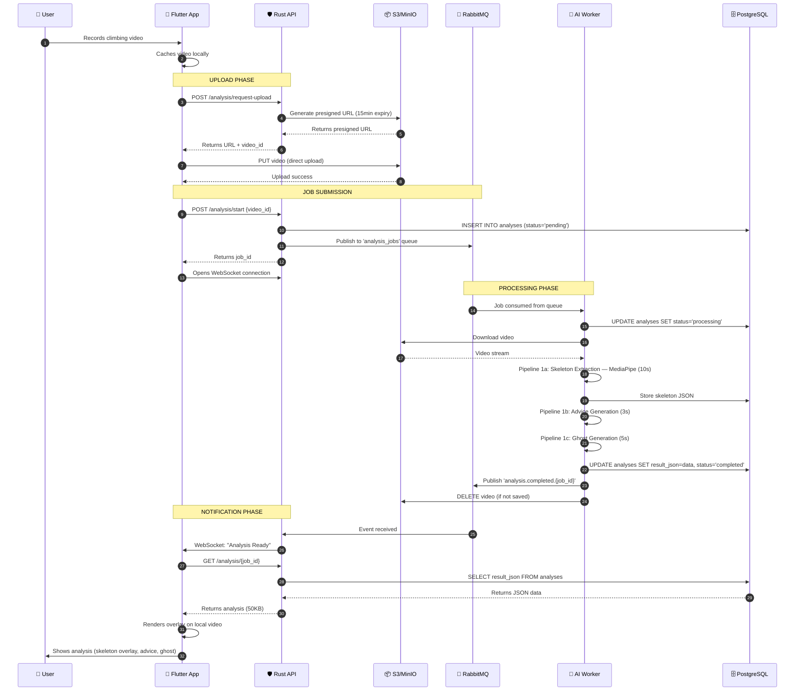

> **Last updated:** 12th February 2026  
> **Version:** 1.0  
> **Authors:** Gianni TUERO  
> **Status:** Done  
> {.is-success}

---

# System Overview

---

## Table of Contents

- [Philosophy](#philosophy)
- [Core Design Patterns](#core-design-patterns)
  - [1. Event-Driven Architecture](#1-event-driven-architecture)
  - [2. CQRS (Command Query Responsibility Segregation)](#2-cqrs-command-query-responsibility-segregation)
  - [3. Client-Side Rendering](#3-client-side-rendering)
- [System Layers](#system-layers)
  - [Layer 1: Client (Flutter Mobile App)](#layer-1-client-flutter-mobile-app)
  - [Layer 2: API Gateway (Rust)](#layer-2-api-gateway-rust)
  - [Layer 3: Message Queue (RabbitMQ)](#layer-3-message-queue-rabbitmq)
  - [Layer 4: AI Workers (Python + PyTorch + MediaPipe + OpenCV)](#layer-4-ai-workers-python-pytorch-mediapipe-opencv)
    - [Pipeline 1: Vision Pipeline (GPU-intensive)](#pipeline-1-vision-pipeline-gpu-intensive)
    - [Pipeline 2: Training Pipeline (CPU-only)](#pipeline-2-training-pipeline-cpu-only)
    - [Worker Architecture](#worker-architecture)
    - [Typical Vision Pipeline Flow](#typical-vision-pipeline-flow)
  - [Layer 5: Data Persistence](#layer-5-data-persistence)
    - [PostgreSQL (Structured Data)](#postgresql-structured-data)
    - [MinIO/S3 (Object Storage)](#minios3-object-storage)
- [Data Flow: Complete Video Analysis](#data-flow-complete-video-analysis)
- [Scaling Strategy](#scaling-strategy)
  - [Horizontal Scaling Points](#horizontal-scaling-points)
  - [Vertical Scaling Points](#vertical-scaling-points)
  - [Auto-scaling Triggers](#auto-scaling-triggers)
- [Fault Tolerance](#fault-tolerance)
  - [API Server Failure](#api-server-failure)
  - [AI Worker Failure](#ai-worker-failure)
  - [Database Failure](#database-failure)
  - [Object Storage Failure](#object-storage-failure)
  - [RabbitMQ Failure](#rabbitmq-failure)
- [Security Architecture](#security-architecture)
  - [Authentication Flow](#authentication-flow)
  - [Authorization Levels](#authorization-levels)
  - [Data Protection](#data-protection)
- [Monitoring Strategy](#monitoring-strategy)
  - [Key Metrics](#key-metrics)
  - [Alerting Rules](#alerting-rules)
- [Cost Analysis](#cost-analysis)
  - [Development Phase (Single Machine)](#development-phase-single-machine)
  - [Staging Phase (Single Hetzner VPS)](#staging-phase-single-hetzner-vps)
  - [Production Phase (1,000 active users — Hetzner)](#production-phase-1000-active-users-hetzner)
  - [Production Phase (100,000 active users — Hetzner / Kubernetes)](#production-phase-100000-active-users-hetzner-kubernetes)
- [Performance Benchmarks](#performance-benchmarks)
  - [Target SLAs](#target-slas)
  - [Bottleneck Analysis](#bottleneck-analysis)
- [Technology Choices Rationale](#technology-choices-rationale)
  - [Why Rust over Node.js/Go?](#why-rust-over-nodejsgo)
  - [Why PostgreSQL over MongoDB?](#why-postgresql-over-mongodb)
  - [Why RabbitMQ over Redis?](#why-rabbitmq-over-redis)
  - [Why MinIO for Development?](#why-minio-for-development)
- [Next Steps](#next-steps)


---

## Philosophy

Ascension's architecture is built on the principle of **separation of concerns** with a focus on **asynchronous processing** and **cost-effective scaling**. The system is designed to handle computationally expensive AI workloads without degrading user experience.

---

## Core Design Patterns

### 1. Event-Driven Architecture

The system uses an event-driven pattern where:

- User actions trigger events
- Events are published to a message queue
- Workers consume events asynchronously
- Results trigger completion events
- UI updates via WebSocket notifications

**Benefits**:

- Non-blocking user experience
- Natural load distribution
- Easy to add new event handlers
- Fault tolerance (retry failed events)

### 2. CQRS (Command Query Responsibility Segregation)

Commands (write operations) and Queries (read operations) follow different paths:

**Commands** (e.g., "Analyze this video"):

- API validates request
- Job published to queue
- Worker processes asynchronously
- Result stored in database

**Queries** (e.g., "Get my analysis"):

- API retrieves from database
- Response cached for frequent queries
- Direct to client

### 3. Client-Side Rendering

Instead of server-side video encoding, we return mathematical data:

**Traditional Approach** (Avoided):

```
Video (50MB) → AI Processing → Enhanced Video (50MB) → Client
Total bandwidth: 100MB
Processing time: 45s + encoding (30s)
```

**Our Approach**:

```
Video (50MB) → AI Processing → JSON (50KB) → Client renders overlay
Total bandwidth: 50MB
Processing time: 45s (no encoding)
```

**Savings per video**:

- Bandwidth: 50MB saved (50% reduction)
- Processing: 30s saved
- Storage: No need to keep processed videos

---

## System Layers

### Layer 1: Client (Flutter Mobile App)

**Responsibilities**:

- User interface and interaction
- Local video capture and caching
- Direct upload to object storage
- Rendering analysis overlays
- WebSocket connection for real-time updates

**Key Technologies**:

- Flutter SDK
- CustomPainter for overlay rendering
- WebSocket client
- HTTP/2 client

**Data Flow**:

1. Capture or select video
2. Keep video in local cache
3. Request presigned upload URL from API
4. Upload directly to S3/MinIO
5. Notify API of upload completion
6. Await WebSocket notification
7. Fetch JSON analysis
8. Render skeleton/ghost overlay on local video

### Layer 2: API Gateway (Rust)

**Responsibilities**:

- Authentication and authorization
- Request validation
- Presigned URL generation
- Job orchestration
- WebSocket connection management
- Result delivery

**Key Technologies**:

- Rust (Axum framework)
- JWT for authentication
- SQLx for database access
- RabbitMQ client (lapin crate)

**NOT Responsible For**:

- Video processing (too heavy)
- Video storage (handled by object storage)
- AI inference (delegated to workers)

**API Endpoints**:

```
POST   /api/v1/auth/register
POST   /api/v1/auth/login
POST   /api/v1/analysis/video/request-upload  # Returns presigned URL
POST   /api/v1/analysis/video/start           # Triggers AI analysis
GET    /api/v1/analysis/video/:id             # Fetch results
WebSocket /api/v1/ws                        # Real-time notifications
```

### Layer 3: Message Queue (RabbitMQ)

**Responsibilities**:

- Job queue management with message persistence
- Pub/Sub for events via exchanges
- Dead letter queue for failed jobs
- Flexible routing with routing keys

**Queue Pattern**:

```
Exchange: ascension.vision (type: direct)
Queues:
  - vision.hold_detection  (durable, persistent)
  - vision.skeleton        (durable, persistent)
  - vision.advice          (durable, persistent)
  - vision.ghost           (durable, persistent)

Exchange: ascension.training (type: direct)
Queues:
  - training.program       (durable, persistent)

Exchange: ascension.events (type: topic)
  - For completion/failure notifications back to API

Example message (vision.skeleton):
{
  "job_id": "uuid",
  "analysis_id": "uuid",
  "user_id": "uuid",
  "video_url": "s3://bucket/path",
  "route_id": "uuid",
  "created_at": "timestamp"
}
```

**Event Routing Keys** (ascension.events exchange):

- `hold_detection.completed.{job_id}`
- `skeleton.completed.{job_id}`
- `advice.completed.{job_id}`
- `ghost.completed.{job_id}`
- `training.completed.{job_id}`
- `*.failed.{job_id}`

### Layer 4: AI Workers (Python + PyTorch + MediaPipe + OpenCV)

A single Python service (`apps/ai/`) handles all AI tasks, routed through RabbitMQ into **two distinct pipelines**.

#### Pipeline 1: Vision Pipeline (GPU-intensive)

All computer-vision tasks that rely on MediaPipe Pose and image processing:

| Step | Queue | Input | Output | Description |
|------|-------|-------|--------|-------------|
| 1. Hold Detection | `vision.hold_detection` | Photo of the route | JSON hold map (positions + types) | User photographs the wall, AI detects and classifies holds (crimp, sloper, jug…). User can manually correct misclassified holds before proceeding. |
| 2. Skeleton Extraction | `vision.skeleton` | Video + hold map | JSON per-frame skeleton data | MediaPipe Pose extracts 33 keypoints per frame → computes joint angles, center of gravity, weight distribution, segment tensions. Returns the full skeleton timeline as JSON to the Rust API. |
| 3. Analysis & Advice | `vision.advice` | Skeleton JSON + hold map | JSON advice payload | Combines skeleton data with hold context to generate targeted coaching advice (e.g., "hip too far from wall on move 3", "match hands before flagging"). |
| 4. Ghost Mode | `vision.ghost` | Skeleton JSON + hold map + user morphology | JSON ghost overlay data | Computes an optimal movement path (pathfinding / inverse kinematics) for the user's body proportions. Output is a frame-by-frame ghost skeleton that the Flutter client renders as an overlay. |

**Key design**: Steps 2–4 share the same skeleton extraction output, so a single video is only processed once. The ghost mode and advice generation reuse the skeleton JSON.

#### Pipeline 2: Training Pipeline (CPU-only)

| Step | Queue | Input | Output | Description |
|------|-------|-------|--------|-------------|
| 1. Program Generation | `training.program` | User profile (goals, injuries, level, analysis history) | JSON training program | Algorithm selects and personalizes training routines based on the user's objectives, injury history, and past performance data from analyses. |

This pipeline does **not** require GPU or video processing. It runs as a lightweight algorithm (rule-based + optional LLM for textual personalization in the future).

#### Worker Architecture

```python
import pika
import json
from pipelines.vision import HoldDetector, SkeletonExtractor, AdviceGenerator, GhostGenerator
from pipelines.training import ProgramGenerator

class AscensionWorker:
    """Single worker service that routes jobs to the correct pipeline."""

    PIPELINE_MAP = {
        'vision.hold_detection': 'handle_hold_detection',
        'vision.skeleton':       'handle_skeleton',
        'vision.advice':         'handle_advice',
        'vision.ghost':          'handle_ghost',
        'training.program':      'handle_training_program',
    }

    def __init__(self):
        self.connection = pika.BlockingConnection(
            pika.ConnectionParameters('rabbitmq')
        )
        self.channel = self.connection.channel()
        self.s3 = S3Client()
        self.db = PostgresClient()

        # Declare all queues
        for queue_name in self.PIPELINE_MAP:
            self.channel.queue_declare(queue=queue_name, durable=True)

    def run(self):
        for queue_name, handler_name in self.PIPELINE_MAP.items():
            handler = getattr(self, handler_name)
            self.channel.basic_consume(
                queue=queue_name,
                on_message_callback=self._wrap(handler),
                auto_ack=False
            )
        self.channel.start_consuming()

    def _wrap(self, handler):
        def callback(ch, method, properties, body):
            job = json.loads(body)
            try:
                handler(job)
                ch.basic_ack(delivery_tag=method.delivery_tag)
            except Exception:
                ch.basic_nack(delivery_tag=method.delivery_tag, requeue=True)
        return callback

    # --- Pipeline 1: Vision ---
    def handle_hold_detection(self, job):
        photo = self.s3.download(job['photo_url'])
        holds = HoldDetector().detect(photo)
        self.db.save_holds(job['route_id'], holds)
        self._notify(job, 'hold_detection.completed')

    def handle_skeleton(self, job):
        video = self.s3.download(job['video_url'])
        skeleton = SkeletonExtractor().extract(video)  # JSON per frame
        self.db.save_skeleton(job['analysis_id'], skeleton)
        self._notify(job, 'skeleton.completed')

    def handle_advice(self, job):
        skeleton = self.db.get_skeleton(job['analysis_id'])
        holds = self.db.get_holds(job['route_id'])
        advice = AdviceGenerator().generate(skeleton, holds)
        self.db.save_advice(job['analysis_id'], advice)
        self._notify(job, 'advice.completed')

    def handle_ghost(self, job):
        skeleton = self.db.get_skeleton(job['analysis_id'])
        holds = self.db.get_holds(job['route_id'])
        ghost = GhostGenerator().generate(skeleton, holds, job['user_morphology'])
        self.db.save_ghost(job['analysis_id'], ghost)
        self._notify(job, 'ghost.completed')

    # --- Pipeline 2: Training ---
    def handle_training_program(self, job):
        program = ProgramGenerator().generate(
            user_id=job['user_id'],
            goals=job['goals'],
            injuries=job.get('injuries', []),
        )
        self.db.save_program(job['user_id'], program)
        self._notify(job, 'training.completed')

    # --- Helpers ---
    def _notify(self, job, event_type):
        self.channel.basic_publish(
            exchange='ascension.events',
            routing_key=f"{event_type}.{job.get('job_id', '')}",
            body=json.dumps({'job_id': job.get('job_id'), 'status': 'completed'})
        )
```

#### Typical Vision Pipeline Flow

```
1. User photos the route → hold_detection job → AI classifies holds → user validates
2. User uploads video  → skeleton job → per-frame JSON skeleton returned to API
3. API chains:         → advice job  → targeted coaching from skeleton + holds
4. If Ghost Mode:      → ghost job   → optimal path overlay for user's morphology
```

### Layer 5: Data Persistence

#### PostgreSQL (Structured Data)

**Schema Design**:

```sql
-- Users table
CREATE TABLE users (
    id UUID PRIMARY KEY DEFAULT gen_random_uuid(),
    email VARCHAR(255) UNIQUE NOT NULL,
    password_hash VARCHAR(255) NOT NULL,
    created_at TIMESTAMP DEFAULT NOW(),
    subscription_tier VARCHAR(50) DEFAULT 'freemium'
);

-- Videos table
CREATE TABLE videos (
    id UUID PRIMARY KEY DEFAULT gen_random_uuid(),
    user_id UUID REFERENCES users(id),
    storage_url TEXT NOT NULL,
    duration_seconds INTEGER,
    file_size_bytes BIGINT,
    uploaded_at TIMESTAMP DEFAULT NOW(),
    saved BOOLEAN DEFAULT FALSE,
    expires_at TIMESTAMP  -- NULL if saved
);

-- Analysis results table
CREATE TABLE analyses (
    id UUID PRIMARY KEY DEFAULT gen_random_uuid(),
    video_id UUID REFERENCES videos(id),
    status VARCHAR(50) DEFAULT 'pending',  -- pending, processing, completed, failed
    result_json JSONB,  -- The actual analysis data
    processing_time_ms INTEGER,
    created_at TIMESTAMP DEFAULT NOW(),
    completed_at TIMESTAMP
);

-- Analysis metadata (for quick queries)
CREATE TABLE analysis_metrics (
    id UUID PRIMARY KEY DEFAULT gen_random_uuid(),
    analysis_id UUID REFERENCES analyses(id),
    max_reach_cm FLOAT,
    avg_tension FLOAT,
    movement_efficiency FLOAT,
    hold_count INTEGER
);
```

**Indexes**:

```sql
CREATE INDEX idx_videos_user_id ON videos(user_id);
CREATE INDEX idx_videos_expires_at ON videos(expires_at) WHERE saved = FALSE;
CREATE INDEX idx_analyses_video_id ON analyses(video_id);
CREATE INDEX idx_analyses_status ON analyses(status);
```

#### MinIO/S3 (Object Storage)

**Bucket Structure**:

```
ascension-videos/
├── uploads/
│   └── {user_id}/
│       └── {video_id}.mp4
├── saved/
│   └── {user_id}/
│       └── {video_id}.mp4
└── thumbnails/
    └── {video_id}.jpg
```

**Lifecycle Policies**:

```json
{
  "Rules": [
    {
      "Id": "DeleteUnsavedVideos",
      "Status": "Enabled",
      "Filter": {
        "Prefix": "uploads/"
      },
      "Expiration": {
        "Days": 7
      }
    }
  ]
}
```

---

## Data Flow: Complete Video Analysis



---

## Scaling Strategy

### Horizontal Scaling Points

1. **API Servers**: Add more instances behind load balancer
2. **AI Workers**: Add more worker processes/containers
3. **Database**: Read replicas for query distribution
4. **Object Storage**: Inherently scalable (S3/MinIO)
5. **RabbitMQ**: RabbitMQ Cluster for high availability

### Vertical Scaling Points

1. **AI Workers**: Upgrade to more powerful GPUs
2. **Database**: Increase RAM for larger cache
3. **RabbitMQ**: Increase memory for larger queue

### Auto-scaling Triggers

- **API**: CPU > 70% or Request Queue > 100
- **Workers**: Queue depth > 50 jobs
- **Database**: Connection pool saturation

---

## Fault Tolerance

### API Server Failure

- **Impact**: New requests fail
- **Mitigation**: Multiple API instances behind load balancer
- **Recovery**: Automatic (load balancer detects failure)

### AI Worker Failure

- **Impact**: Job remains in queue
- **Mitigation**: Job timeout + dead letter queue
- **Recovery**: Job reassigned to healthy worker

### Database Failure

- **Impact**: Cannot write/read results
- **Mitigation**: Database replica + automated failover
- **Recovery**: Promote replica to primary

### Object Storage Failure

- **Impact**: Cannot upload/download videos
- **Mitigation**: Multi-region replication (production)
- **Recovery**: Automatic (S3 SLA: 99.99%)

### RabbitMQ Failure

- **Impact**: Queue unavailable, jobs cannot be published or consumed
- **Mitigation**: RabbitMQ clustering with mirrored queues
- **Recovery**: Automatic failover to replica node, persistent messages survive restart

---

## Security Architecture

### Authentication Flow

```
User → API: POST /auth/login {email, password}
API → DB: Verify credentials
API → API: Generate JWT (expires 24h)
API → User: Returns {access_token, refresh_token}

User → API: All requests include: Authorization: Bearer <token>
API → API: Verify JWT signature + expiry
API → DB: Fetch user permissions
```

### Authorization Levels

- **Freemium**: 10 analyses/month, with ads, no Ghost Climber
- **Premium**: 30 analyses/month (20€/month), Ghost Mode enabled
- **Infinity**: 100 analyses/month (30€/month), all features + server priority

### Data Protection

- **In Transit**: TLS 1.3 for all external communication
- **At Rest**: Encrypted S3 buckets, encrypted DB volumes
- **Secrets**: Environment variables, never in code
- **API Keys**: Stored hashed with bcrypt

---

## Monitoring Strategy

**Stack**: Prometheus (metrics) + Grafana (dashboards) + Loki (logs)

### Key Metrics

**API**:

- Request rate (requests/second)
- Error rate (%)
- Response time (p50, p95, p99)
- Active WebSocket connections

**AI Workers**:

- Queue depth
- Processing time per video
- GPU utilization (%)
- Failed jobs count

**Database**:

- Query time (p50, p95)
- Connection pool usage
- Cache hit rate

**Object Storage**:

- Upload success rate
- Download bandwidth
- Storage used (GB)

### Alerting Rules

- API error rate > 5% for 5 minutes → Page on-call
- Queue depth > 200 jobs → Scale workers
- Database CPU > 80% for 10 minutes → Alert
- Storage approaching quota → Warning

---

## Cost Analysis

### Development Phase (Single Machine)

```
Local Docker Compose: Free (runs on dev machine)
MinIO Storage: Included locally
Total: ~€0/month
```

### Staging Phase (Single Hetzner VPS)

```
Hetzner VPS (CX31 - 4 vCPU, 8GB RAM): ~€12/month
MinIO Storage (included on VPS): €0
Total: ~€12/month
```

### Production Phase (1,000 active users — Hetzner)

```
Hetzner VPS API+DB (CPX31 - 4 vCPU, 8GB): ~€15/month
Hetzner VPS AI Worker (CCX23 - 4 vCPU, 16GB): ~€30/month
RabbitMQ (self-hosted on API VPS): €0
MinIO (self-hosted Object Storage): €0
Hetzner Volume Storage (500GB): ~€25/month
Data Transfer (20TB included): €0
Total: ~€70/month (~€0.07 per user)
```

### Production Phase (100,000 active users — Hetzner / Kubernetes)

```
Hetzner Dedicated Servers (3x AX41): ~€150/month
Hetzner GPU Server (or cloud GPU): ~€200-500/month
PostgreSQL (replicated): Included on dedicated servers
RabbitMQ Cluster: Included on dedicated servers
MinIO Cluster (Object Storage): Included
Hetzner Volume Storage (50TB): ~€2,500/month
Data Transfer (included): €0
Total: ~€3,000-3,500/month (~€0.035 per user)
```

---

## Performance Benchmarks

### Target SLAs

- **API Response Time**: p95 < 200ms
- **Video Upload**: Network dependent (client → S3)
- **Analysis Processing**: < 60s for 30s video
- **WebSocket Notification**: < 100ms after completion
- **Result Fetch**: < 100ms
- **Total User Wait Time**: < 60s (upload + processing)

### Bottleneck Analysis

**Current Bottleneck**: GPU compute time

- **Solution**: Add more workers or upgrade GPUs

**Future Bottleneck** (at scale): Database writes

- **Solution**: Write batching, read replicas

---

## Technology Choices Rationale

### Why Rust over Node.js/Go?

**Vs Node.js**:

- No garbage collection pauses
- Memory safety without runtime overhead
- Better concurrency model (async/await without event loop)

**Vs Go**:

- More expressive type system
- Better memory safety guarantees
- Growing web ecosystem (Axum, Tokio, SQLx)

**Trade-off**: Slower development initially, but worth it for performance-critical API

### Why PostgreSQL over MongoDB?

- Structured data fits relational model
- ACID transactions for user accounts
- Better support for complex queries (JOIN user + video + analysis)
- JSONB support for flexible analysis data

### Why RabbitMQ over Redis?

- Purpose-built message broker with guaranteed delivery
- Dead letter queues for failed job management
- Persistent messages survive broker restarts
- Flexible routing system for different job types
- Industry standard for reliable async processing

### Why MinIO for Development?

- S3-compatible API (easy production migration)
- Self-hosted (no cloud costs)
- Docker-friendly

---

## Next Steps

1. Read [Development Deployment](./deployment/development.md) to set up local environment
2. Review [API Gateway Documentation](./components/api-gateway.md) for implementation details
3. Understand [Video Analysis Workflow](./workflows/video-analysis-flow.md) for the complete flow

---

**Last Updated**: 2026-02-12
**Maintainer**: Ascension Development Team
