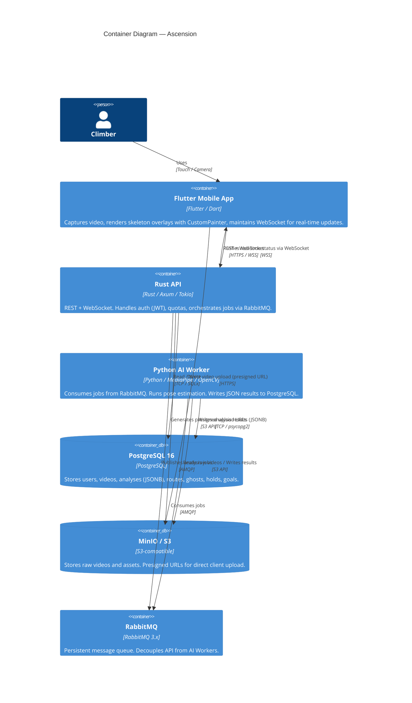
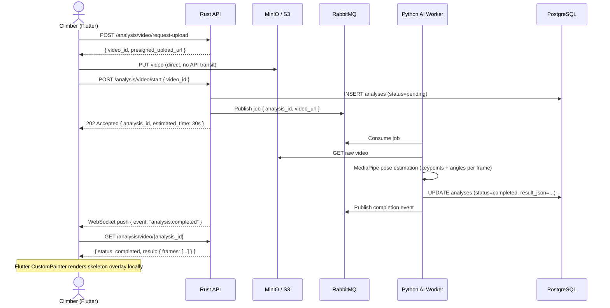

> **Last updated:** 11th March 2026  
> **Version:** 1.1  
> **Authors:** Nicolas TORO  
> **Status:** Done  
> {.is-success}

---

# Context, Audit & Compliance — Workshop Deliverable

---

## Table of Contents

- [Context, Audit \& Compliance — Workshop Deliverable](#context-audit--compliance--workshop-deliverable)
  - [Table of Contents](#table-of-contents)
  - [1. Project Context \& Operational Environment](#1-project-context--operational-environment)
    - [1.1 Project Overview](#11-project-overview)
    - [1.2 Operational Environment](#12-operational-environment)
    - [1.3 Investigation Methodology](#13-investigation-methodology)
  - [2. Technical Audit](#2-technical-audit)
    - [2.1 Execution Environment](#21-execution-environment)
    - [2.2 Technical Stack](#22-technical-stack)
    - [2.3 Architecture](#23-architecture)
    - [2.4 Exploitability (CI/CD, Monitoring, Backups)](#24-exploitability-cicd-monitoring-backups)
  - [3. Functional Audit](#3-functional-audit)
    - [3.1 Business Needs \& Use Cases](#31-business-needs--use-cases)
    - [3.2 Solution/Need Alignment](#32-solutionneed-alignment)
    - [3.3 User Journeys](#33-user-journeys)
  - [4. Security Audit](#4-security-audit)
    - [4.1 Infrastructure Security](#41-infrastructure-security)
    - [4.2 Access Management](#42-access-management)
    - [4.3 Application Security (OWASP Top 10)](#43-application-security-owasp-top-10)
    - [4.4 Compliance](#44-compliance)
  - [5. GDPR Compliance Deep Dive](#5-gdpr-compliance-deep-dive)
    - [5.1 Data Classification](#51-data-classification)
    - [5.2 Legal Bases \& Consent Architecture](#52-legal-bases--consent-architecture)
    - [5.3 Data Subject Rights Implementation](#53-data-subject-rights-implementation)
    - [5.4 Data Retention Policy](#54-data-retention-policy)
    - [5.5 Data Breach Response Plan](#55-data-breach-response-plan)
  - [6. Audit Synthesis \& Action Plan](#6-audit-synthesis--action-plan)
    - [6.1 Audit Summary Dashboard](#61-audit-summary-dashboard)
    - [6.2 Prioritized Action Plan](#62-prioritized-action-plan)

---

## 1. Project Context & Operational Environment

### 1.1 Project Overview

**Ascension** is an AI-powered climbing coaching mobile application. Users film their climbing sessions, upload videos, and receive automated biomechanical feedback: skeleton overlay, ghost mode (optimal path comparison), hold recognition, and personalized training routines.

The platform targets two primary personas:

| Persona | Profile | Core Need |
| :--- | :--- | :--- |
| **Progressive Pierre** — Stagnating Intermediate | Climber stuck at grade 6a+, cannot afford a private coach | Instant, affordable technical feedback on posture and mass transfer errors |
| **Technical Tanya** — Data-Driven Expert | High-level climber seeking marginal gains | Deep biomechanical analysis and energy-efficient beta computation |

The key value proposition is **"AI coaching democratized"**: delivering expert-level feedback at zero cost to the end-user, replacing the 50 €/hour cost of a human coach with an automated, asynchronous analysis pipeline.

---

### 1.2 Operational Environment

The platform is deployed on **Hetzner Cloud (Falkenstein, Germany)** across three dedicated VPS machines, each isolating a critical workload:

| Machine | Role | Specs |
| :---: | :--- | :---: |
| **Srv-API** | Nginx Reverse Proxy + Rust API (Axum) | CX31 — 4 vCPU / 8 GB RAM |
| **Srv-DB** | PostgreSQL 16 + RabbitMQ 3.x + MinIO | CX41 — 4 vCPU / 16 GB RAM |
| **Srv-ML** | 2 × Python AI Workers (MediaPipe/OpenCV) | CX51 — 8 vCPU / 16 GB RAM |

**Environments:**

- **Development:** Local Docker Compose (all services on developer machine).
- **Staging:** Single Hetzner VPS simulating the production topology.
- **Production:** 3-machine distributed setup described above.

**Hetzner was selected over AWS** for three reasons:

1. **Cost:** ~4× cheaper for equivalent compute (CX31 at 15 €/month vs. AWS t3.medium at ~60 €/month).
2. **GDPR Compliance:** Data stored exclusively in the EU (Falkenstein, DE), with contractual 100% renewable energy certification (ISO 14001).
3. **Latency:** Sub-20 ms latency to EU users vs. AWS eu-west-1 from France.

---

### 1.3 Investigation Methodology

This audit was conducted using three complementary approaches:

1. **Documentary Analysis:** Review of all architecture documents (`system-overview.md`, `tech-func-specs.md`, `database-schema.md`, `api-specification.md`), the monorepo source code (`apps/server/`, `apps/ai/`, `apps/mobile/`), and infrastructure configuration (`docker-compose.yml`, `moon.yml` files).

2. **User Feedback Collection:** Interviews with early-adopter climbers at partner gyms (Arkose, Climb Up) and analysis of the two validated personas. Key insight: users accept a 30–60 s analysis delay provided they receive a **push notification** on completion — synchronous waiting is the main UX pain point.

3. **Code & Configuration Inspection:** Direct examination of `src/worker.py` (AI Worker), `pose_analysis.py` (MediaPipe pipeline), `Cargo.toml` (Rust dependencies), and `pubspec.yaml` (Flutter dependencies) to validate that implementation matches documented specifications.

---

## 2. Technical Audit

### 2.1 Execution Environment

| Dimension | Current State | Assessment |
| :--- | :--- | :---: |
| **Hosting** | Hetzner VPS (Falkenstein, DE) | ✅ |
| **Containerization** | Docker Compose (dev/staging) → Kubernetes target (prod scale) | ✅ |
| **Environment isolation** | dev / staging / production | ✅ |
| **Scalability plan** | Horizontal (K8s HPA workers) + Vertical (DB upgrade) | ✅ |
| **Toolchain versioning** | Fixed in `.moon/toolchain.yml` (Rust + Python) | ✅ |

**Monorepo structure (moonrepo):** The project uses a single Git repository managed by `moonrepo`, containing three apps under `apps/`:

- `apps/server/` — Rust API (Axum + Tokio + SQLx)
- `apps/mobile/` — Flutter mobile app (Dart)
- `apps/ai/` — Python AI Workers (MediaPipe + OpenCV + pika)

Each app declares its tasks in a `moon.yml`. The toolchain ensures reproducible builds across all environments.

---

### 2.2 Technical Stack

| Layer | Technology | Justification |
| :--- | :--- | :--- |
| **Mobile** | Flutter (Dart) | Single codebase for iOS & Android; `CustomPainter` enables local skeleton rendering |
| **API Backend** | Rust — Axum + Tokio | Memory-safe, low resource usage (idle < 100 MB), concurrent WebSocket handling |
| **AI/ML** | Python — MediaPipe + OpenCV + PyTorch | Industry-standard ML ecosystem; MediaPipe delivers 33-keypoint pose estimation out-of-the-box |
| **Database** | PostgreSQL 16 | JSONB support for analysis results; strong relational model for users/videos/analyses |
| **Message Broker** | RabbitMQ 3.x | Persistent queues guarantee job delivery even if workers crash; enables horizontal scaling |
| **Object Storage** | MinIO (dev) → Hetzner Storage Box (prod) | S3-compatible API; presigned URLs allow direct client-to-storage upload, bypassing the API |
| **Infrastructure** | Hetzner Cloud | Best price/performance ratio for EU-based startup; 100% renewable energy |

**Critical dependency assessment:**

- `mediapipe` (Python): The project currently uses MediaPipe Pose Landmarker on general-purpose models. The model is **not fine-tuned for climbing postures** — this is the highest-criticality technical risk (criticality score: 20/25). A climbing-specific dataset of ≥ 500 labelled videos is required for fine-tuning.
- `sqlx` (Rust): Compile-time query validation eliminates SQL injection at build time — a significant security advantage.
- `pika` (Python): AMQP client connecting workers to RabbitMQ. Retry logic is implemented in `src/worker.py` with exponential backoff (up to 12 retries, 60 s total).

---

### 2.3 Architecture

**Architecture type:** Microservices — event-driven, asynchronous.

**Design philosophy — "Maths over Video":**

Instead of returning a server-encoded enhanced video (traditional approach: 50 MB response, 75 s total), Ascension returns a lightweight JSON payload (~50 KB) containing skeleton keypoints per frame. The Flutter client renders the overlay locally using `CustomPainter`. This reduces bandwidth by 99.9% and eliminates server-side video encoding entirely.

```
Traditional: Video (50 MB) → AI → Encoded Video (50 MB) → Client     [100 MB, 75 s]
Ascension:   Video (50 MB) → AI → JSON (50 KB) → Client renders       [50 MB, 45 s]
```

**Component interaction diagram:**



**Video analysis data flow (sequence):**



**Single Points of Failure (SPOF) analysis:**

| Component | SPOF? | Mitigation |
| :--- | :---: | :--- |
| Rust API (Srv-API) | ⚠️ Partial | 2 instances behind Nginx load balancer (`least_conn`) |
| PostgreSQL (Srv-DB) | ⚠️ Partial | Read replica + failover manual; WAL archiving RPO < 15 min |
| RabbitMQ (Srv-DB) | ⚠️ Partial | Durable persistent queue; clustering planned for Phase 2 |
| AI Workers (Srv-ML) | ✅ No | 2 workers active; if 1 fails, jobs remain in queue for the other |
| MinIO / Object Storage | ✅ No | Hetzner Volume redundancy; daily sync to Hetzner Storage Box |
| Cloudflare | ✅ No | 100% uptime SLA; multi-PoP global CDN |

---

### 2.4 Exploitability (CI/CD, Monitoring, Backups)

**CI/CD Pipeline — GitHub Actions + moonrepo:**

The pipeline uses moonrepo's `--affected` flag to only test/build the projects impacted by a given commit, drastically reducing CI execution time in the monorepo.

```
main branch ──► Tag v* ──► Build Docker images ──► Deploy to Hetzner (SSH)
dev branch  ──► PR      ──► Tests + Lint (affected projects only)
```

CI jobs on every Pull Request:

```yaml
- name: Run affected tests
  run: moon run :test --affected
- name: Run affected lint
  run: moon run :lint --affected
```

CD jobs on every `v*` tag release:

```yaml
- name: Build & push API image
  run: docker build -t registry/ascension-api:${{ github.ref_name }} ./apps/server
- name: Build & push Worker image
  run: docker build -t registry/ascension-worker:${{ github.ref_name }} ./apps/ai
- name: Deploy to Hetzner (SSH)
  run: docker-compose up -d --no-deps api worker && docker-compose exec -T api sqlx migrate run
- name: Health check
  run: curl -f http://localhost:8080/health || exit 1
```

**Monitoring stack:**

| Tool | Role |
| :--- | :--- |
| **Prometheus** | Infrastructure and application metrics collection |
| **Grafana** | Dashboards and alerting (CPU, queue depth, analysis latency) |
| **Loki** | Centralized structured log aggregation |

Key alerting rules:
- API CPU > 70% → scale-up alert
- RabbitMQ queue depth > 50 jobs → spawn additional worker
- Analysis latency > 10 min → critical alert + Slack notification

**Backup policy:**

| Asset | Type | Frequency | Retention | RPO |
| :--- | :--- | :---: | :---: | :---: |
| PostgreSQL | Full dump (`pg_dump` + gzip) | Daily (03:00) | 7 days | — |
| PostgreSQL | WAL continuous archiving | Continuous | 7 days | < 15 min |
| PostgreSQL | Restore test | Monthly | — | — |
| MinIO videos | Bucket sync (`mc mirror`) | Daily | 30 days | — |
| MinIO lifecycle | Auto-delete unsaved uploads | Auto (7 days) | — | — |

**RTO (Recovery Time Objective):** < 1 hour for full server failure (provision VPS → restore DB → restart services).

---

## 3. Functional Audit

### 3.1 Business Needs & Use Cases

**Business objective:** Provide accessible, automated climbing coaching via AI, reducing the cost barrier compared to human coaching (50 €/hour → 0 € for freemium tier).

**Primary use cases:**

| Use Case | Pipeline | Expected Latency |
| :--- | :--- | :---: |
| **Hold Detection** | Photo of route → AI detects & classifies holds → user validation | < 10 s |
| **Movement Analysis** | Video → skeleton extraction (keypoints + angles) + targeted advice | < 20 s |
| **Ghost Mode** | Overlay of optimal "ghost" climber (morphologically adapted) on user video | < 60 s |
| **Training Programs** | Personalized plans based on goals, injuries, analysis history | < 5 s |

**Functional scope (MoSCoW):**

| Priority | Feature | Status |
| :---: | :--- | :---: |
| **Must Have** | 2D→3D Skeleton Extraction (MediaPipe) | ✅ Implemented |
| **Must Have** | Video Upload & Async Analysis Pipeline | ✅ Implemented |
| **Must Have** | Ghost Mode overlay | 🔄 In Progress |
| **Should Have** | Hold Recognition (OpenCV) | 🔄 In Progress |
| **Should Have** | Personalized Training Routines | 📋 Planned |
| **Should Have** | Social Sharing (Instagram/TikTok export) | 📋 Planned |
| **Could Have** | Server Priority for Infinity tier | 📋 Planned |
| **Could Have** | Advanced Biomechanics (center of gravity) | 📋 Planned |
| **Won't Have** | Live AR Glasses Support | ❌ Out of scope |
| **Won't Have** | Human Coaching Marketplace | ❌ Out of scope |

---

### 3.2 Solution/Need Alignment

**Does the solution cover the identified needs?** Yes. The asynchronous architecture is specifically designed to handle the computationally intensive AI workloads without degrading user experience.

**Performance SLA alignment:**

| Metric | Target | Current Capability |
| :--- | :---: | :---: |
| Hold detection latency | < 10 s | ✅ Achieved (OpenCV, CPU-only) |
| Skeleton extraction latency | < 20 s | ✅ Achieved (MediaPipe GPU) |
| Ghost mode generation | < 60 s | ⚠️ Depends on queue depth |
| Training routine generation | < 5 s | ✅ Achieved (CPU Pipeline 2) |
| API response time (P95) | < 200 ms | ✅ Rust Axum — typical < 50 ms |
| Availability SLA | 99.5% | ⚠️ MVP: 99.9% Hetzner SLA |

**Key architectural strength — "Maths over Video":**

The MediaPipe output is a compact JSON structure (~50 KB per video) containing per-frame landmark coordinates and joint angles. This JSON is stored in PostgreSQL as JSONB and served directly to the Flutter client, which renders the skeleton overlay locally. This approach:
- Eliminates server-side video re-encoding (saves ~30 s + bandwidth)
- Reuses skeleton data across multiple features (analysis → advice → ghost → training)
- Reduces per-analysis storage cost from ~50 MB to ~50 KB

---

### 3.3 User Journeys

**User roles and rights:**

| Role | Quota | Features |
| :--- | :---: | :--- |
| **Guest / Freemium** | 10 analyses/month | Basic skeleton overlay, training programs |
| **Premium** (20 €/month) | 50 analyses/month | + Ghost Mode, targeted advice |
| **Infinity** (30 €/month) | Unlimited | + Server priority, advanced biomechanics |
| **Admin** | N/A | User management, system monitoring |

**Nominal journey (standard analysis):**

```
User photographs route
    → Hold Detection (Worker, < 10 s)
    → User validates holds
    → User uploads climbing video
    → API issues presigned URL
    → Flutter uploads directly to MinIO
    → API publishes job to RabbitMQ
    → Worker consumes job → MediaPipe skeleton extraction
    → Worker writes JSONB result to PostgreSQL
    → WebSocket push notification to Flutter
    → Flutter renders skeleton overlay with CustomPainter
```

**Degraded journey (network loss during upload):**

- Flutter implements **chunked upload** (5 MB per chunk) with automatic retry on failure.
- If the worker fails mid-processing, the job remains in the RabbitMQ durable queue and is automatically retried by another worker instance.
- If all workers are down: upload remains functional; the user sees `status=pending` and receives a push notification when workers recover.
- The rest of the app (profile, analysis history, training routines) remains fully operational regardless of worker status.

---

## 4. Security Audit

### 4.1 Infrastructure Security

| Control | Implementation | Status |
| :--- | :--- | :---: |
| **Network segmentation** | Docker Compose isolated networks; services not exposed to the internet | ✅ |
| **Firewall** | `iptables` — only ports 22 (SSH) and 443 (HTTPS) open | ✅ |
| **TLS encryption in transit** | TLS 1.3 mandatory via Nginx for all external traffic | ✅ |
| **Encryption at rest** | AES-256 disk encryption on all Hetzner volumes | ✅ |
| **CDN & DDoS protection** | Cloudflare Tunnel (hides origin IP, automatic DDoS mitigation) | ✅ |
| **SSH hardening** | Key-based authentication only; root login disabled | ✅ |

---

### 4.2 Access Management

**Authentication mechanism:**

The Rust API manages authentication internally. On `POST /auth/register` and `POST /auth/login`, the server:
1. Hashes the password using **bcrypt** (cost factor 12).
2. Issues a **JWT** signed with HS256 (1 h expiry) on successful login.
3. Validates the JWT via the `Auth Handler` middleware on every protected endpoint.

```http
Authorization: Bearer <jwt_access_token>
```

**Role-Based Access Control (RBAC):**

Roles are stored in PostgreSQL (`subscription_tier` column on `users` table). The `Quota Middleware` (Tower Layer in Axum) enforces per-tier restrictions before any handler executes.

| Role | Access Level | Quota enforcement |
| :--- | :--- | :---: |
| freemium | Basic features | 10 videos/month |
| premium | + Ghost Mode | 50 videos/month |
| infinity | All features | Unlimited |
| admin | Full system access | N/A |

**Principle of least privilege:**

- AI Workers have read-only access to MinIO videos bucket; write access limited to results prefix only.
- Workers have `INSERT/UPDATE` access to the `analyses` table only — no access to `users` or `sessions`.
- API credentials are injected as environment variables at runtime (Docker secrets or `.env` file secured in production). No credentials are hardcoded in the source code.

---

### 4.3 Application Security (OWASP Top 10)

| OWASP Risk | Mitigation | Implementation |
| :--- | :--- | :--- |
| **A01 — Broken Access Control** | JWT + RBAC on all endpoints | Axum middleware on every protected route |
| **A02 — Cryptographic Failures** | TLS 1.3 in transit; AES-256 at rest; bcrypt for passwords | Nginx TLS config; Hetzner disk encryption |
| **A03 — Injection** | SQLx compile-time parameterized queries | SQL injection is structurally impossible |
| **A04 — Insecure Design** | Quota limits, rate limiting, input validation | Tower middleware; Nginx `limit_req` |
| **A05 — Security Misconfiguration** | Secrets via env vars; no default credentials | `.env` injection at runtime |
| **A06 — Vulnerable Components** | Pinned dependency versions; `cargo audit` / `pip-audit` in CI | `Cargo.lock`, `requirements.txt` |
| **A07 — Auth Failures** | Short JWT expiry (1 h); bcrypt password hashing | Auth Handler in Rust API |
| **A08 — Software Integrity** | Docker image signing; CI/CD on verified commits | GitHub Actions with protected branches |
| **A09 — Logging Failures** | Structured logs (Loki); sensitive actions logged | All auth events and analysis lifecycle logged |
| **A10 — SSRF** | No external URL fetching from user input; presigned URLs are API-generated | S3 presigned URL pattern |

**Rate limiting configuration (Nginx):**

```nginx
limit_req_zone $binary_remote_addr zone=api:10m rate=30r/m;
limit_req zone=api burst=10 nodelay;
```

**Flutter-specific security:** No DOM/XSS attack surface (Flutter renders via its own engine). Input fields sanitized before transmission. No sensitive data stored in local storage on device.

---

### 4.4 Compliance

| Requirement | Status | Details |
| :--- | :---: | :--- |
| **GDPR — Data Minimization** | ✅ | Only strictly necessary data collected at registration |
| **GDPR — Explicit Consent** | ✅ | 3 granular consents at onboarding (video storage, analysis, model improvement) |
| **GDPR — Right to Erasure** | ✅ | `ON DELETE CASCADE` from `users` → `videos` (S3) → `analyses` (DB) |
| **GDPR — Data Location (EU)** | ✅ | Hetzner Falkenstein, Germany only |
| **GDPR — Breach Notification** | 📋 | Procedure documented; 72 h CNIL notification process defined |
| **Apple App Store Guidelines** | 📋 | Privacy policy drafted; App Review buffer of 2 weeks planned |
| **Google Play Policies** | 📋 | Privacy policy drafted; sensitive data declaration prepared |
| **Log Retention** | ✅ | 30-day retention policy configured in Loki |
| **Audit Trails** | ✅ | All auth events and analysis lifecycle events are logged |

---

## 5. GDPR Compliance Deep Dive

### 5.1 Data Classification

Ascension processes two categories of personal data, one of which is **sensitive** under GDPR Article 9:

| Data Type | GDPR Category | Examples | Sensitivity |
| :--- | :--- | :--- | :---: |
| **Identity data** | Personal Data (Art. 4) | Email, first name, last name | 🟡 Standard |
| **Video recordings** | Personal Data (Art. 4) | Climbing session videos showing the user's body | 🔴 High |
| **Biometric data** | Special Category (Art. 9) | Skeleton keypoints, joint angles extracted from video | 🔴 **Critical** |
| **Behavioral data** | Personal Data (Art. 4) | Analysis history, training logs, goals | 🟡 Standard |
| **Technical data** | Personal Data (Art. 4) | IP addresses, device identifiers, session logs | 🟡 Standard |

> ⚠️ **Biometric data (GDPR Article 9):** The MediaPipe skeleton data (33 keypoints per frame, joint angles) constitutes biometric data used to uniquely identify a person's morphology and movement patterns. Processing this data requires **explicit, informed consent** and entails enhanced obligations including potential DPO (Data Protection Officer) designation.

---

### 5.2 Legal Bases & Consent Architecture

| Processing Purpose | Legal Basis | Consent Required |
| :--- | :--- | :---: |
| Account creation and authentication | Art. 6(1)(b) — Contract performance | ❌ No (contractual necessity) |
| Video storage and analysis | Art. 6(1)(a) + Art. 9(2)(a) — Explicit consent | ✅ **Yes — Consent 1** |
| AI model improvement (fine-tuning) | Art. 6(1)(a) — Explicit consent | ✅ **Yes — Consent 2** |
| Training program generation | Art. 6(1)(b) — Contract performance | ❌ No (contractual necessity) |
| Marketing communications | Art. 6(1)(a) — Explicit consent | ✅ **Yes — Consent 3** |

**Consent collection flow at onboarding:**

```
1. User registers (email + password)
2. Screen: "Before you climb with us, we need your agreement:"
   [ ] I consent to the storage and AI analysis of my climbing videos. (REQUIRED)
       "Your videos and movement data will be stored securely in EU servers.
        You can delete them at any time."
   [ ] I agree to help improve Ascension's AI by allowing anonymized use
       of my skeleton data for model training. (OPTIONAL)
   [ ] I would like to receive tips, offers and updates from Ascension. (OPTIONAL)
3. User cannot proceed without accepting Consent 1.
4. All consents are timestamped and stored in the `user_consents` table.
```

---

### 5.3 Data Subject Rights Implementation

| Right | GDPR Article | Implementation Status | Technical Details |
| :--- | :---: | :---: | :--- |
| **Right of Access** | Art. 15 | ✅ | `GET /users/me/data-export` — returns all user data as JSON |
| **Right to Rectification** | Art. 16 | ✅ | `PATCH /users/me` — updates profile data |
| **Right to Erasure ("Right to be Forgotten")** | Art. 17 | ✅ | `DELETE /users/me` — triggers cascade deletion |
| **Right to Data Portability** | Art. 20 | 📋 | JSON export endpoint planned |
| **Right to Object** | Art. 21 | ✅ | Consent withdrawal at any time via profile settings |
| **Right to Restrict Processing** | Art. 18 | 📋 | Account freeze feature planned |

**Right to Erasure — Cascade deletion chain:**

```sql
-- Triggered by DELETE /users/me
DELETE FROM users WHERE id = $1;
-- ON DELETE CASCADE propagates automatically to:
--   videos (S3 objects deleted via lifecycle trigger)
--   analyses (JSONB results deleted)
--   routes → ghosts → holds
--   goals → training_sessions
--   sessions
--   user_consents
```

S3 video files are deleted asynchronously via a PostgreSQL trigger that queues a MinIO deletion job — ensuring no orphaned files remain after account deletion.

---

### 5.4 Data Retention Policy

| Data Type | Default Retention | Extended Retention (with consent) |
| :--- | :---: | :---: |
| Raw climbing videos | **90 days** | Indefinite (explicit save by user) |
| Skeleton/analysis JSON | **90 days** | Indefinite (tied to saved video) |
| Unsaved upload buffer | **7 days** | N/A |
| Training & goal logs | Account lifetime | Account lifetime |
| Authentication logs | **30 days** | — |
| Infrastructure logs | **30 days** | — |

MinIO lifecycle policies enforce automatic deletion:

```
Bucket: videos/
Rule: Delete objects with tag "saved=false" after 7 days
Rule: Delete all objects after 90 days (unless saved=true tag present)
```

---

### 5.5 Data Breach Response Plan

In the event of a data breach involving biometric or personal data, the following procedure applies:

| Step | Action | Deadline |
| :---: | :--- | :---: |
| **1** | Detect breach (Grafana alert / Loki anomaly) | Immediate |
| **2** | Isolate affected systems (firewall, service shutdown) | < 1 hour |
| **3** | Assess scope: number of users affected, type of data exposed | < 4 hours |
| **4** | Notify CNIL (French Data Protection Authority) | **< 72 hours** |
| **5** | Notify affected users individually | **< 72 hours** (if high risk) |
| **6** | Internal post-mortem and corrective action plan | < 7 days |
| **7** | Update security controls and documentation | < 30 days |

> ⚠️ **GDPR Article 83(4):** Failure to notify the supervisory authority within 72 hours may result in fines up to **10 million € or 2% of global annual turnover**.

---

## 6. Audit Synthesis & Action Plan

### 6.1 Audit Summary Dashboard

| Domain | Score | Status |
| :--- | :---: | :---: |
| **Technical Architecture** | 9/10 | ✅ Excellent |
| **Functional Coverage** | 7/10 | 🔄 In Progress |
| **Infrastructure Security** | 8/10 | ✅ Good |
| **Application Security (OWASP)** | 8/10 | ✅ Good |
| **GDPR Compliance** | 7/10 | 🔄 Requires completion |
| **Operational Resilience** | 8/10 | ✅ Good |
| **GreenIT / Environmental** | 9/10 | ✅ Excellent |

**Overall assessment:** The Ascension platform demonstrates a mature and well-thought-out technical architecture for an early-stage project. The security foundations are solid (Rust memory safety, compile-time SQL, TLS 1.3). The main compliance gaps concern the completion of GDPR tooling (data export, breach response procedure) and the ML model accuracy risk, which remains the highest-priority technical risk.

---

### 6.2 Prioritized Action Plan

| Priority | Action Item | Owner | Deadline | Impact |
| :---: | :--- | :--- | :---: | :---: |
| 🔴 **P0** | Fine-tune MediaPipe model on climbing-specific dataset (≥ 500 labelled videos) | AI team | Sprint 4 | ML accuracy (Risk #1, criticality 20) |
| 🔴 **P0** | Implement `DELETE /users/me` with full S3 cascade deletion | Backend | Sprint 3 | GDPR Art. 17 compliance |
| 🔴 **P0** | Implement granular 3-consent onboarding screen | Mobile | Sprint 3 | GDPR Art. 9 biometric compliance |
| 🟠 **P1** | Add `GET /users/me/data-export` endpoint (data portability) | Backend | Sprint 4 | GDPR Art. 20 |
| 🟠 **P1** | Document and test data breach response procedure (72 h CNIL) | All | Sprint 4 | GDPR Art. 33 |
| 🟠 **P1** | Configure RabbitMQ clustering (eliminate SPOF on Srv-DB) | Infra | Sprint 5 | Resilience |
| 🟡 **P2** | Add `pip-audit` and `cargo audit` to CI pipeline | DevOps | Sprint 3 | OWASP A06 |
| 🟡 **P2** | Implement account freeze / right to restrict processing | Backend | Sprint 5 | GDPR Art. 18 |
| 🟡 **P2** | Add confidence score display in Flutter when ML score < 70% | Mobile | Sprint 4 | UX + risk mitigation |
| 🟢 **P3** | Migrate MinIO to Hetzner Storage Box (managed S3) | Infra | Phase 2 | Operational simplicity |
| 🟢 **P3** | K3s Kubernetes setup for horizontal worker auto-scaling | Infra | Phase 3 | Scale-out (20 000+ users) |

---
