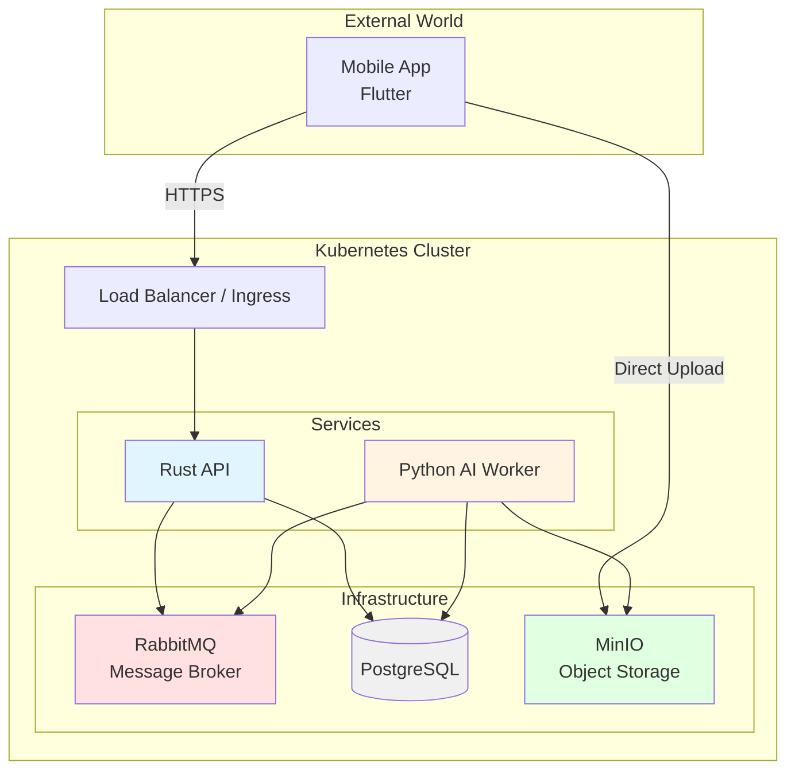

> **Last updated:** 16th February 2026
> **Version:** 1.1
> **Authors:** Lou PELLEGRINO, Gianni TUERO
> **Status:** Done
> {.is-success}

---

# RNCP Audit - Overview

---

## Compte-rendu d'audit technique, fonctionnel et de sécurité

---

## Environnement d'exécution du projet

Le dossier du candidat contient un **compte-rendu d'audit technique, fonctionnel et de sécurité** de l'environnement d'exécution du projet, mettant en lumière les **contraintes et opportunités du contexte opérationnel**. [C2]

Le candidat est en mesure d'expliquer **l'approche méthodologique** mise en œuvre pour réaliser l'audit :

- moyens d'investigation
- collecte de retours utilisateurs
- analyse documentaire
  […] [C2]

---

## 3. Audit technique

### Architecture Cible (Kubernetes)

### 3.1 Environnement d’exécution

- **Hébergement** : Hetzner (Production/Staging), Local Docker Compose (Dev)
- **VM / Containers** : Docker, Kubernetes (Scaling Horizontal)
- **Environnements** : Development, Staging, Production
- **Scalabilité prévue** :
  - Scaling horizontal (Kubernetes HPA - Horizontal Pod Autoscaler)
  - scaling vertical si besoin

---

### 3.2 Stack technique

- **Backend** : Rust (Axum framework), Tokio runtime
- **Frontend** : Mobile Android / iOS (Flutter)
- **IA** : Python + MediaPipe (pose estimation, reconnaissance de prises)
- **Base de données** : PostgreSQL
- **API backend** : REST (Commandes) + WebSocket (Notifications temps réel)
- **Middleware** :
  - **API Gateway/Load Balancer** : Nginx Reverse Proxy (+ Kubernetes Ingress en cible)
  - **Message Broker** : RabbitMQ
  - **Object Storage** : MinIO (Compatible S3)

- **Dépendances critiques** :
  - MediaPipe pour la squelettisation et la détection de poses
  - OpenCV pour le traitement d'images (détection de prises)

---

### 3.3 Architecture

- **Type** : Microservices
- **Schéma d’architecture (logique et physique)** :
  - **Client (Flutter)** : Upload direct vers S3/MinIO (Presigned URLs), Réception WebSocket
  - **API (Rust)** : Gestion des utilisateurs, validation, orchestration des tâches via RabbitMQ
  - **Workers (Python)** : Consommation des tâches depuis RabbitMQ, Processing GPU, stockage résultats JSON en DB
- **Flux entre composants** :
  - User (App flutter) upload video -> MinIO (Storage)
  - User -> Request Analysis (RUST) -> API -> RabbitMQ Queue
  - Worker -> Pull Job -> AI Processing -> Update DB -> Notify User via RabbitMQ/WebSocket
- **Points de défaillance uniques (SPOF)** :
  - Architecture conçue pour la haute disponibilité sur Hetzner.
  -

---

### 3.4 Exploitabilité

- **Déploiement (CI/CD)** : GitHub Actions pipeline
- **Monitoring (logs, métriques, alertes)** :
  - Grafana + Prometheus + Loki (Métriques infrastructure & Logs centralisés)
- **Sauvegardes et restauration** :
  - pg_dump automatisé + WAL archiving continu (Rétention configurable)
  - MinIO Lifecycle Policies & Versioning
- **Stratégie de montée de version** : Rolling Updates (Zéro downtime)

---

## 4. Audit fonctionnel

### 4.1 Compréhension du besoin

- **Objectifs métiers** : Offrir un coaching d'escalade accessible et automatisé via l'IA, réduisant les coûts par rapport au coaching humain.
- **Cas d’usage principaux** :
  - **Détection des prises** : Photo de la voie → IA détecte et classifie les prises → validation manuelle par l'utilisateur.
  - **Analyse du mouvement** : Squelettisation vidéo (poids, équilibre, angles des segments) + conseils ciblés basés sur les prises détectées.
  - **Mode Fantôme** : Superposition d'un grimpeur idéal ("Ghost") morphologiquement adapté sur la vidéo de l'utilisateur. Réutilise les données de squelettisation.
  - **Programmes d'entraînement** : Plans personnalisés basés sur les objectifs, blessures et historique d'analyses (Pipeline 2 — CPU uniquement).
  - **Comparaison** : Métriques de similarité entre l'utilisateur et le modèle optimal.

- **Contraintes réglementaires ou métier** :
  - Précision et crédibilité de l'analyse technique (exigence forte des grimpeurs confirmés).
  - Latence de traitement (UX fluide attendue malgré la lourdeur du calcul vidéo).

---

### 4.2 Adéquation solution / besoin

- **Les fonctionnalités prévues couvrent-elles les besoins ?** : Oui. L'architecture supporte le traitement asynchrone lourd nécessaire à l'IA.
- **Approche technique spécifique** : "Maths over Video". Au lieu de renvoyer une vidéo lourde traitée, le système renvoie des données mathématiques (JSON) que le client Flutter utilise pour dessiner l'overlay en local.
  - Élimine le temps d'encodage vidéo serveur.

- **Performances attendues** :
  - **Détection des prises** : < 10s de traitement (photo uniquement).
  - **Squelettisation + Conseils** : < 20s de traitement vidéo (skeleton JSON par frame + conseils ciblés).
  - **Mode Fantôme** : Génération asynchrone : < 1min (réutilise les données de squelettisation).
  - **Programme d'entraînement** : < 5s (Pipeline 2, CPU uniquement).

---

### 4.3 Parcours utilisateurs

- **Typologie des utilisateurs** : Grimpeurs (Amateur à Pro), Coachs.
- **Droits et rôles** :
  - **Guest/Freemium** : Analyses limitées, fonctionnalités de base, programmes d'entraînement.
  - **Premium/Infinity** : Analyses quasi-illimitées, accès au Ghost Mode, conseils ciblés.
  - **Admin** : Gestion utilisateurs, monitoring système.

**Scénarios clés** :

- **Nominal** : Utilisateur photo la voie → Détection prises → Validation → Upload vidéo → Squelettisation (Worker) → Conseils + Ghost (Worker) → Notification RabbitMQ → Visualisation avec Overlay côté client Flutter.
- **Dégradé** : Perte de connexion pendant l'upload (reprise gérée par client MinIO), ou échec processing IA (marqué comme "failed", notification erreur, retry possible).

---

## 5. Audit sécurité

### 5.1 Sécurité de l’infrastructure

- **Segmentation réseau** :
	- Docker Compose network isolation (Hetzner VPS)
- **Pare-feu / Security Groups** :
  - iptable open 22 443 user group for all container
- **Exposition Internet** :
	- port 22, 443
- **Chiffrement des données** :
  - **En transit** : TLS 1.3 obligatoire.
  - **Au repos** : Chiffrement disque

---

### 5.2 Gestion des accès

- **Authentification** : Gestion interne via API Rust (salt/hash), tokens session/JWT.
- **Gestion des rôles** : Rôles définis en base de données (RBAC).
- **Principe du moindre privilège** :
  - Les Workers utilisent des accès à MinIO limité, accès RabbitMQ limité.
  - L'API n'a accès qu'aux ressources nécessaires.
- **Comptes techniques** : Users/Roles pour les services, pas de credentials en dur.

---

### 5.3 Sécurité applicative (niveau projet)

- **Gestion des secrets** : Variables d'environnement injectées au runtime (Docker secrets ou fichier `.env` sécurisé en prod).
- **Protection API** :
  - Rate Limiting (via API Gateway ou RabbitMQ QoS) pour prévenir les abus.
  - Rust type system prévient de nombreuses classes de vulnérabilités (memory safety).
  - Validation stricte des entrées API.

- **Journalisation des actions sensibles** :
  - Logs structurés

- **Prévention OWASP Top 10** :
  - Injection SQL : Impossible grâce à l'usage de requêtes paramétrées.
  - XSS : Moins risqué avec Flutter (pas de DOM HTML classique), mais inputs sanitisés.

---

### 5.4 Conformité

- **RGPD (Données personnelles)** :
  - Consentement utilisateur à l'inscription.
  - Droit à l'oubli implémenté (suppression en cascade Users -> Videos S3 -> Analyses DB).
  - Données stockées en conformité (régionales).
- **Traçabilité** : Traces d'activités techniques conservées pour debug et audit de sécurité.
- **Conservation des logs** : Politique de rétention définie de 30 jours.

---

## 6. Annexes

Les documents suivants complètent cet audit :

- [Analyse des Risques et Impact (GreenIT)](impact-mitigation.md)
- [Justification de la Stack Technique](tech-stack.md)
- [Résumé de la Stack](stack-summary.md)
