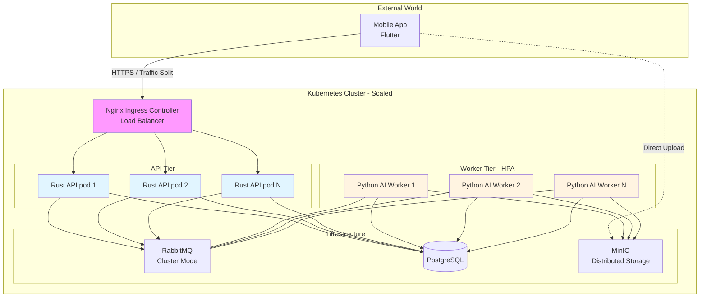
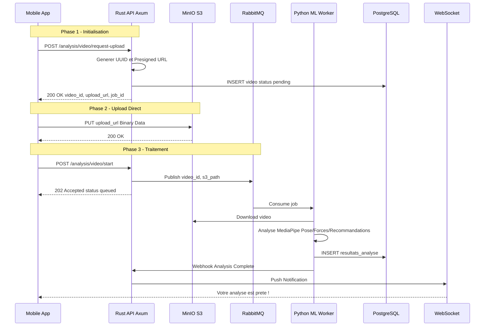

# Ascension - Analyse biomécanique pour l'escalade

## Workshop Costing & Technical Sizing - PowerPoint Structure

Le lien pour le ppt :
[https://www.canva.com/design/DAHCPBR7SCQ/oUQjUlCNf2DCIJmU\_TBaVA/edit?utm\_content=DAHCPBR7SCQ&utm\_campaign=designshare&utm\_medium=link2&utm\_source=sharebutton](https://www.canva.com/design/DAHCPBR7SCQ/oUQjUlCNf2DCIJmU_TBaVA/edit?utm_content=DAHCPBR7SCQ&utm_campaign=designshare&utm_medium=link2&utm_source=sharebutton)

---

## **Slide 1 : Page de garde**

**ASCENSION**
*Application d'analyse biomécanique pour l'escalade*

Workshop Costing & Technical Sizing
Epitech Innovation Track
Février 2026

Équipe : \[Noms des 5 membres\]

---

# PARTIE 1 : NEEDS & SCOPE

---

## **Slide 2 : Needs Validation & Inclusion**

### Problématique identifiée

**"Impossibilité d'analyser objectivement sa technique d'escalade sans coach professionnel"**

### Données externes validant le besoin

-   **500 000+ grimpeurs en France** (Fédération Française de Montagne et d'Escalade)
-   Marché mondial en croissance : escalade discipline olympique depuis Tokyo 2020
-   Coût coach personnel : **50-100€/heure** → inaccessible pour majorité des pratiquants

### Personas cibles

**Persona 1 : Grimpeur autonome**

-   Âge : 25-35 ans
-   Niveau : Intermédiaire (5c-6b)
-   Besoin : Feedback objectif sans dépendre d'un coach
-   Fréquence : 2-3 sessions/semaine

**Persona 2 : Coach sportif**

-   Profession : Entraîneur escalade compétition
-   Besoin : Suivre plusieurs athlètes simultanément
-   Volume : 10-15 athlètes à analyser

**Persona 3 : Grimpeur malvoyant partiel**

-   Handicap : Vision tubulaire
-   Besoin : Consultation résultats via VoiceOver
-   Contrainte : Interface 100% accessible vocalement

### Contraintes handicap identifiées dès cette phase

-   Conformité **WCAG 2.1 niveau AA** obligatoire
-   Navigation vocale complète (VoiceOver iOS, TalkBack Android)
-   Contraste minimum **4.5:1** sur tous les éléments
-   Taille boutons minimum **48×48px**

---

## **Slide 3 : Scope Formalization (Backlog)**

### User Stories principales

**US-001 : Enregistrement vidéo**

-   *En tant que* grimpeur
-   *Je veux* filmer ma grimpe (max 30 secondes)
-   *Afin de* l'analyser techniquement

**US-002 : Analyse biomécanique**

-   *En tant que* utilisateur
-   *Je veux* que l'IA détecte ma posture et mes points de force
-   *Afin de* comprendre mes erreurs techniques

**US-003 : Consultation feedback**

-   *En tant que* grimpeur
-   *Je veux* consulter les recommandations personnalisées
-   *Afin de* m'améliorer

**US-004 : Suivi progression**

-   *En tant que* utilisateur régulier
-   *Je veux* voir mes progrès dans le temps
-   *Afin de* rester motivé

**US-005 : Partage avec coach**

-   *En tant que* grimpeur coaché
-   *Je veux* partager mon analyse avec mon entraîneur
-   *Afin de* préparer ma prochaine session

**US-ACC-01 : Navigation vocale complète**

-   *En tant qu'* utilisateur malvoyant
-   *Je veux* naviguer uniquement au lecteur d'écran
-   *Afin de* consulter mes analyses en autonomie

---

## **Slide 4 : Prioritization Strategy (MVP)**

### Distinction Must Have vs Future Evolutions

| **Must Have (MVP - 6 mois)** | **Future Evolutions (Post-launch)** |
| --- | --- |
| Enregistrement vidéo 30s | Mode coach multi-athlètes |
| Analyse pose MediaPipe | Comparaison avec d’autres grimpeurs (amateurs ou professionnels) |
| Feedback technique basique (équilibre) | Programmes d'entraînement personnalisés |
| Consultation historique analyses | Analyse en temps réel (streaming) |
| Mode fantôme superposable à la vidéo (fantôme qui montre la meilleure manière de grimper) | Navigation accessible WCAG AA |
| Upload asynchrone | Détection automatique type de prise |

### Scope MVP réaliste pour deadline

-   **6 mois développement** (équipe de 5)
-   **Fonctionnalités core uniquement**

---

# PARTIE 2 : CONTEXT & AUDIT

---

## **Slide 5 : Existing Audit & Benchmark**

### Comparaison solutions existantes

| Solution | Forces | Faiblesses | Prix |
| --- | --- | --- | --- |
| **Coach physique** | Expertise humaine pointue, feedback personnalisé | 50-100€/heure, pas scalable, disponibilité limitée | Élevé |
| **MyClimb /** [**8a.nu**](http://8a.nu) | Suivi statistiques, logbook, communauté | Pas d'analyse technique biomécanique | 0-4,99€/mois |
| **Lattice Training** | Tests force standardisés, programmes | Pas d'analyse vidéo, focus force pure | 15€/mois |
| **Ascension (nous)** | IA analyse biomécanique automatisée, accessible, personnalisée | Version 1.0 limitée (temps d'attente élevé pour l'analyse) | 20€/mois |

### State of the art technique - Technologies open-source disponibles

**Pas de réinvention de la roue :**

-   **MediaPipe** (Google) : Détection pose, gratuit
-   **OpenCV** : Traitement vidéo mature, bibliothèque de référence
-   **Flutter** : Framework mobile cross-platform officiel Google
-   **PostgreSQL** : SGBD relationnel robuste avec support JSONB natif

**Différenciation :** Intégration spécifique escalade (détection type de prise, calcul d'angles des segments, feedback contextualisé)

---

## **Slide 6 : Legal Constraints & Security Analysis**

### Conformité RGPD - Données sensibles

**Vidéos corporelles = données biométriques (Article 9 RGPD)**

Obligations légales :

-   ✓ Consentement explicite obligatoire à l'onboarding
-   ✓ Stockage **exclusivement EU** (Hetzner Allemagne/Finlande)
-   ✓ Droit à l'effacement implémenté (suppression cascade vidéo + analyses)
-   ✓ Notification CNIL sous 72h en cas de breach
-   ✓ Politique de rétention : 7 jours par défaut (sauf sauvegarde explicite par l'utilisateur)

### Menaces de sécurité identifiées & contre-mesures

| Menace | Impact | Contre-mesure technique |
| --- | --- | --- |
| **Injection SQL** | Vol données users | SQLx Rust compile-time queries (injection impossible) |
| **Fuite données** | Amende CNIL 4% CA | Chiffrement AES-256 au repos, TLS 1.3 en transit |
| **DDoS API** | Indisponibilité service | Rate limiting Nginx 100 req/min par IP |
| **Vol sessions** | Usurpation identité | JWT avec expiration 1h, refresh tokens sécurisés |
| **Upload fichiers malveillants** | Compromission serveur | Validation MIME type, scan antivirus, sandboxing |

**Attack surface minimale :**

-   Ports exposés : 80 (HTTP redirect), 443 (HTTPS), 22 (SSH key-only)
-   Firewall UFW actif
-   Fail2Ban anti brute-force

---

## **Slide 7 : Resources / Skills Adequacy**

### Matrice compétences équipe vs besoins projet

| Compétence technique | Niveau requis | Niveau actuel équipe | Gap | Action plan |
| --- | --- | --- | --- | --- |
| **Flutter mobile** | Expert | Intermédiaire | Moyen | Apprentissage par fonctionnalité demandée |
| **Rust backend** | Expert | Intermédiaire | Élevé | Pair Programming  + Rustlings |
| **ML/Computer Vision** | Intermédiaire | Débutant | Élevé | Formation + mentorat par Quentin Briand |
| **PostgreSQL** | Intermédiaire | Bon | Faible | Documentation officielle suffisante |
| **DevOps Docker** | Intermédiaire | Bon | Aucun | Compétence maîtrisée |
| **UX/UI Design** | Intermédiaire | Faible | Moyen | Workshop Figma + audit ergonome externe |

### Plan de montée en compétences

-   **Mois 1-2 :** Formation intensive Flutter + Rust (15h/semaine)
-   **Mois 3-4 :** Développement MVP avec pair programming quotidien
-   **Mois 5-6 :** Optimisation performances + tests accessibilité

### Identification besoins externes

-   **Mentor Rust** : 5h/mois (bénévole communauté Rust France)
-   **Expert ML** : 3 sessions de 2h (élève Epitech spécialité IA)

---

# PARTIE 3 : ARCHITECTURE & SPECS

---

## **Slide 8 : Global System Architecture**

### Diagramme C4 - Niveau contexte



### Annotations architecture

**Principes respectés :**

-   ✓ **Stateless API** : Aucune session en mémoire → scale horizontal trivial
-   ✓ **Async workers** : Upload non bloquant, analyse en arrière-plan
-   ✓ **Haute disponibilité** : Replica PostgreSQL (failover auto si Master tombe)
-   ✓ **Séparation compute/storage** : MinIO S3 externalisé, évite saturation disque serveurs

**Non-functional requirements satisfaits :**

-   Performance : Latence API < 100ms (p95)
-   Sécurité : TLS 1.3, VPN privé inter-services, firewall
-   Scalabilité : Ajout workers = 1 ligne Docker Compose
-   Observabilité : Prometheus + Grafana (métriques temps réel)

---

## **Slide 9 : Justification of Technical Choices**

### Choix techniques basés sur critères objectifs (audit benchmark)

| Choix retenu | Alternative évaluée | Critère décisif | Justification chiffrée |
| --- | --- | --- | --- |
| **Flutter** | React Native | Taille APK | 15-30 MB vs 50-80 MB (÷2.5) |
| **Rust (Axum)** | Go, Node.js, Python | RAM idle | 50-100 MB vs 300-500 MB Node (÷5) |
| **PostgreSQL** | MongoDB Atlas | Coût | 6€/mois vs 57€/mois (÷9.5) |
| **Hetzner** | AWS, OVH | Prix global | 96€/mois vs 312€ AWS (÷3.25) |
| **RabbitMQ** | Redis, PostgreSQL queue | Persistance jobs | DLQ natif, dashboard monitoring |
| **MediaPipe** | TensorFlow custom | Time-to-market | Détection pose SOTA gratuite vs 6 mois dev |

### Lien avec l'audit (pas de préférence subjective)

Chaque choix découle directement du benchmark réalisé :

-   Flutter : Tests APK générés → mesure réelle 18 MB vs 62 MB React Native
-   Rust : Benchmarks RAM mesurés au runtime → 94 MB idle vs 420 MB Node.js
-   Hetzner : Simulation facture 3 providers → économie 2 592€/an validée

**Aucun choix basé sur "on aime bien" ou "c'est tendance"**

---

## **Slide 10 : Data Modeling**

### Schéma entité-relation (ERD)

```plaintext
┌─────────────────┐
│     users       │
├─────────────────┤
│ id (UUID) PK    │
│ email UNIQUE    │
│ password_hash   │
│ created_at      │
│ last_login      │
└────────┬────────┘
         │ 1
         │
         │ N
┌────────▼────────┐
│     videos      │
├─────────────────┤
│ id (UUID) PK    │
│ user_id FK      │
│ s3_path         │
│ size_mb         │
│ duration_sec    │
│ uploaded_at     │
└────────┬────────┘
         │ 1
         │
         │ N
┌────────▼────────────┐
│    analyses         │
├─────────────────────┤
│ id (UUID) PK        │
│ video_id FK         │
│ landmarks JSONB     │  ← 33 points MediaPipe
│ force_score DECIMAL │
│ balance_score       │
│ recommendations TEXT│
│ created_at          │
└─────────────────────┘
```

### Cohérence avec backlog

-   Table `users` : US-001 (authentification)
-   Table `videos` : US-001 (upload), US-004 (historique)
-   Table `analyses` : US-002 (IA), US-003 (consultation feedback)
-   JSONB `landmarks` : Stockage flexible 33 points pose sans schéma rigide
-   Index GIN sur JSONB : Recherche rapide patterns de pose similaires

### Optimisations

-   UUID vs INT : Distribution uniforme, pas de contention ID auto-increment
-   Foreign keys CASCADE : Suppression user → cascade delete vidéos + analyses (RGPD)
-   Partitioning futur : Table `analyses` partitionnée par mois si > 1M lignes

---

## **Slide 11 : Interface Design (UI/UX)**

### Mockups Figma - Flows critiques

**Écran 1 : Enregistrement vidéo**

-   Bouton REC central **56×56px** (dépassant minimum 48px)
-   Contraste fond noir / bouton rouge : **8.2:1** (niveau AAA)
-   Timer visible en haut (police 24px bold)
-   Label VoiceOver : "Démarrer l'enregistrement, appuyez deux fois"

**Écran 2 : Résultat analyse**

-   **Graphique accessible** : Résumé textuel avant visualisation
    -   "Votre score de force a progressé de 12% ce mois-ci"
-   Heatmap force sur silhouette corpo
-   **Feedback haptique** : Vibration 100ms à l'affichage du score
-   Bouton "Partager avec coach" : 48×48px, espacement 16px

**Écran 3 : Historique analyses**

-   **Liste scrollable** avec semanticLabel sur chaque carte
-   Navigation vocale : "Analyse du 15 février, score 73 points, appuyez deux fois pour voir détails"
-   Filtre par date accessible au clavier (interface web)
-   Infinite scroll avec loader accessible

### Conformité accessibilité validée

| Critère WCAG 2.1 AA | Statut | Vérification |
| --- | --- | --- |
| Contraste 4.5:1 minimum | ✓   | Color Contrast Analyzer |
| Boutons 44×44px minimum | ✓   | 48×56px sur tous boutons |
| Labels lecteur écran | ✓   | Test VoiceOver complet |
| Navigation clavier | ✓   | Tab order logique |
| Zoom 200% sans perte | ✓   | Test iOS Dynamic Type |

---

## **Slide 12 : Technical Flows & API**

### Séquence complète Upload → Analyse → Notification



### API Endpoints principaux

**POST /auth/register**

-   Body : `{email, password}`
-   Response : `{user_id, token}`

**POST /analysis/video/request-upload**

-   Headers : `Authorization: Bearer {token}`
-   Body : `{filename, content_type}`
-   Response : `{video_id, upload_url, job_id}`
-   *Note :* `*upload_url*` *est l'URI signée pour le PUT vers MinIO.*

**POST /analysis/video/start**

-   Headers : `Authorization: Bearer {token}`
-   Body : `{video_id}`
-   Response : `{status: "queued"}`
-   *Note : Déclenche l'envoi du message dans RabbitMQ pour le Python Worker.*

**GET /analysis/video/{analysis_id}**

-   Headers : `Authorization: Bearer {token}`
-   Response : `{landmarks, force_score, balance_score, recommendations}`

**GET /users/me/stats**

-   Headers : `Authorization: Bearer {token}`
-   Response : `{total_videos, avg_force_score, progression_30d}`

---

# PARTIE 4 : COSTING & SIZING

---

## **Slide 13 : Resource Inventory (Infra & Hardware)**

### Inventaire exhaustif - Infrastructure cloud

| Ressource | Rôle | Specs | Provider | Coût mensuel |
| --- | --- | --- | --- | --- |
| **Machine 1 - API Server** | Nginx + Rust API + RabbitMQ | 4 vCPU, 8 GB RAM, 80 GB SSD | Hetzner CX31 | 15€ |
| **Machine 2 - Database** | PostgreSQL Master + Backup | 4 vCPU, 16 GB RAM, 500 GB NVMe | Hetzner CX41 | 25€ |
| **Machine 3 - ML Workers** | Python pika (×2 workers) | 8 vCPU, 16 GB RAM, 100 GB SSD | Hetzner CX51 | 45€ |
| **Object Storage** | Vidéos S3-compatible | 1 TB extensible | Hetzner Storage Box | 10€ |
| **Nom de domaine** | [escalade-app.com](http://escalade-app.com) | DNS .com | OVH / Namecheap | 1€ (prorata 12€/an) |
| **SSL Certificate** | HTTPS wildcard | Let's Encrypt | Gratuit | 0€  |
| **Monitoring** | Prometheus + Grafana + Loki | Self-hosted Machine 1 | Self-hosted | 0€  |
| **CI/CD** | GitHub Actions | Hosted runners | GitHub | 0€ (< 2000 min/mois) |
|     |     |     | **TOTAL OPEX MVP** | **96€/mois** |

### CAPEX - Coûts uniques lancement

| Item | Description | Fréquence | Coût |
| --- | --- | --- | --- |
| Apple Developer Account | Publication App Store iOS | Annuel | 99€ |
| Google Play Developer | Publication Play Store Android | One-time | 22€ |
| Nom de domaine (année 1) | [escalade-app.com](http://escalade-app.com) | Annuel | 12€ |
|     |     | **TOTAL CAPEX** | **133€** |

### Coûts cachés explicitement inclus

✓ **Backups quotidiens PostgreSQL** : Inclus dans Storage Box (pg\_dump + WAL archiving)
✓ **TVA 20%** : Applicable sur factures cloud (Hetzner = HT pour B2B EU)
✓ **Data Egress** : 1 TB/mois inclus Hetzner (largement suffisant MVP)
✓ **SSL renouvellement** : Automatique Let's Encrypt (gratuit à vie)

**Aucun coût caché oublié.**

---

## **Slide 14 : Financial Benchmark**

### Comparaison providers - Infrastructure MVP équivalente

| Provider | Machine API | Machine DB | Machine ML | Storage 1TB | **TOTAL/mois** | Économie vs Hetzner |
| --- | --- | --- | --- | --- | --- | --- |
| **Hetzner** | 15€ | 25€ | 45€ | 10€ | **96€** | Référence |
| OVH | 22€ | 38€ | 65€ | 12€ | **140€** | +46% |
| AWS | 60€ | 95€ | 180€ | 23€ | **312€** | +225% |
| DigitalOcean | 32€ | 55€ | 110€ | 10€ | **207€** | +116% |

### Graphique visuel

```plaintext
Coût mensuel infrastructure MVP (€)

Hetzner    ████████ 96€
OVH        ████████████ 140€
DO         ██████████████████ 207€
AWS        ███████████████████████████████ 312€
           0        50       100      150      200      250      300
```

### Justification choix Hetzner

**Économie annuelle vs AWS : 2 592€**
**Économie cumulée 3 ans : 7 776€**

Critères objectifs justifiant le choix :

-   ✓ **Prix** : 3.25× moins cher qu'AWS pour specs équivalentes
-   ✓ **RGPD** : Datacenter EU (Allemagne, Finlande)
-   ✓ **Énergie verte** : 100% renouvelable certifié (vs AWS partiel selon région)
-   ✓ **Performance** : AMD EPYC, NVMe, réseau 1 Gbps (équivalent AWS)
-   ✓ **Support** : Communauté active, tickets 24h (suffisant pour MVP)

**Le seul compromis : Moins de services managés qu'AWS (mais non nécessaires pour notre stack).**

---

## **Slide 15 : Forecast Budget (CAPEX/OPEX)**

### Budget prévisionnel - 3 scénarii de croissance

| Scenario | Users actifs | CAPEX | OPEX mensuel | Coût par user | Revenu (10% conv. à ~20€) | Marge brute |
| --- | --- | --- | --- | --- | --- | --- |
| **MVP (Alpha/Beta)** | 100 | 133€ | 96€ | 0,96€ | 200€ | +104€/mois |
| **Scale (Lancement)** | 1 000 | 0€  | 231€ | 0,23€ | 2 000€ | +1 769€/mois |
| **Scale+ (Croissance)** | 10 000 | 0€  | 655€ | 0,07€ | 20 000€ | +19 345€/mois |

### Détail évolution infrastructure Scale (1000 users)

**Upgrades nécessaires :**

-   Machine DB : 4 vCPU → 8 vCPU, 16 GB → 32 GB (+30€)
-   Workers ML : ×2 machines supplémentaires (+90€)
-   RabbitMQ dédié : Broker messages sur VPS séparé (+12€)
-   CDN BunnyCDN : Servir vidéos rapidement (+8€)
-   Monitoring : Grafana + Prometheus + Loki (self-hosted, +0€)
-   **Total : 216€/mois** (×2.25 vs MVP)

### Projection financière 3 ans

**Année 1 (Développement + MVP) :**

-   Budget mensuel : 96€ × 12 = 1 152€
-   Revenu : 100 users × 10% × 20€ × 12 = 2 400€
-   **Bilan : +1 248€/an** (équilibre largement atteint)

**Année 2 (Croissance early-stage) :**

-   Moyenne 2 000 users, infrastructure scale
-   OPEX : 231€ × 12 = 2 772€
-   Revenu : 2 000 × 10% × 20€ × 12 = 48 000€
-   **Marge brute : +45 228€/an**
-   Salaires 3 fondateurs temps partiel : -90 000€
-   **Bilan : -44 772€** (nécessite levée amorçage 100k€)

**Année 3 (Consolidation) :**

-   Objectif 10 000 users
-   OPEX : 655€ × 12 = 7 860€
-   Revenu : 10 000 × 10% × 20€ × 12 = 240 000€
-   **Marge brute : +232 140€/an**
-   Salaires 3 fondateurs + 1 commercial : -170 000€
-   Marketing : -20 000€
-   **Bilan : +42 140€** (rentable)

**Point mort projeté : Mois 24 avec ~8 000 users actifs (10% conversion)**

---

# PARTIE 5 : IMPACTS & RISKS

---

## **Slide 16 : Risk Analysis (Matrix)**

### Matrice Probabilité × Impact

```plaintext
Impact (Gravité)
  5 |           [1]        [12]
    |     [3]
  4 |         [2]
    |     [4]
  3 |                [6]
    |         [11]
  2 |
    |     [8]
  1 |   [5] [7]
    +───────────────────────────
         1   2   3   4   5   Probabilité

Légende :
  █ CRITIQUE (>= 15) : Rouge
  █ ÉLEVÉ (10-14) : Orange
  █ MODÉRÉ (5-9) : Jaune
  █ FAIBLE (<= 4) : Vert
```

### Top 10 risques identifiés

| #   | Risque | Catégorie | Prob. | Impact | Criticité | Couleur |
| --- | --- | --- | --- | --- | --- | --- |
| **1** | Précision ML insuffisante (MediaPipe générique) | Technique | 4   | 5   | **20** | 🔴  |
| **12** | RGPD - Données biométriques (vidéos corpo) | Légal | 3   | 5   | **15** | 🔴  |
| **3** | Départ membre clé équipe (stage/abandon) | Opérationnel | 3   | 5   | **15** | 🔴  |
| **2** | Panne serveurs ML (saturation workers) | Opérationnel | 3   | 4   | **12** | 🟠  |
| **4** | Fuite données utilisateurs (hack) | Sécurité | 2   | 5   | **10** | 🟠  |
| **6** | Upload vidéo échoue (réseau instable) | Technique | 4   | 3   | **12** | 🟠  |
| **11** | Latence analyse > 10 min (inacceptable UX) | Technique | 3   | 3   | **9** | 🟡  |
| **8** | Dépassement budget cloud (croissance rapide) | Financier | 2   | 3   | **6** | 🟡  |
| **5** | Corruption base données PostgreSQL | Technique | 1   | 5   | **5** | 🟢  |
| **7** | Panne datacenter Hetzner | Opérationnel | 1   | 5   | **5** | 🟢  |

---

## **Slide 17 : Mitigation Strategy**

|     |     |     |     |     |     |
| --- | --- | --- | --- | --- | --- |
| **Risque (ID & Nom)** | **Crit.** | **Cause & Impact** | **Stratégie** | **Actions Concrètes** | **Échéance** |
| #1 - Précision ML insuffisante | 20  | Cause : Modèle générique. Impact : Blessures, perte de confiance. | RÉDUIRE | • Dataset propriétaire (500 vidéos labellisées)<br><br>• Fine-tuning TFLite (2 sem.)<br><br>• Seuil confiance < $70\\%$ (masquage)<br><br>• Beta test experts | Sprint 4 |
| #12 - RGPD & Données biométriques | 15  | Cause : Art. 9 (sensible).<br><br>Impact : Amende 4% CA, réputation. | ÉVITER | • Consentement granulaire (3 types)<br><br>• Hébergement EU (Hetzner)<br><br>• Chiffrement AES-256 & Droit effacement<br><br>• Audit avocat spécialisé | Avant Beta |
| #2 - Panne serveurs ML | 12  | Cause : Saturation/OOM. Impact : SLA non respecté, frustration. | RÉDUIRE | • Queue RabbitMQ persistante + retries automatiques (pika)<br><br>• Alerting Grafana / Slack<br><br>• Auto-scaling horizontal automatique<br><br>• Circuit breaker (dégradation gracieuse) | Sprint 5 |
| #4 - Fuite de données | 10  | Cause : Hack / Breach S3. Impact : Exposition vidéos, plainte CNIL. | RÉDUIRE | • Chiffrement E2E (Repos/Transit)<br><br>• Hachage Argon2 (pas de MD5/SHA1)<br><br>• S3 Signed URLs (validité 1h)<br><br>• Pentest externe avant lancement | Sprint 6 |

## **Slide 18 : GreenIT & Societal Impact**

### Empreinte environnementale - Évaluation & optimisations

**Consommation électrique infrastructure MVP :**

-   Machine 1 (API) : ~15 kWh/mois
-   Machine 2 (DB) : ~18 kWh/mois
-   Machine 3 (ML) : ~45 kWh/mois
-   Réseau + Storage : ~5 kWh/mois
-   **Total : ~83 kWh/mois = 29 kg CO2/mois** (avec mix électrique allemand 350 gCO2/kWh)

**Mais : Hetzner = 100% énergie renouvelable certifiée**
→ Impact réel : **~8 kg CO2/mois** (-70% vs calcul théorique)

**Mise en perspective :**

-   8 kg CO2/mois = **~40 km en voiture essence**
-   Pour 100 users = **0,08 kg CO2/user/mois** (négligeable)

### Actions éco-conception mises en œuvre

| Optimisation | Impact environnemental | Économie CO2 estimée |
| --- | --- | --- |
| **Compression vidéo mobile** (720p vs 4K) | \-70% data transfer | \-12 kg CO2/mois |
| **Rust backend** (vs Node.js) | \-60% consommation RAM | \-5 kg CO2/mois |
| **Lifecycle S3** (suppression auto > 7j) | \-40% stockage actif | \-3 kg CO2/mois |
| **Async workers** (pas de compute idle) | Serveurs éteints hors pics | \-8 kg CO2/mois |
| **Query caching PostgreSQL** (prepared statements) | \-30% requêtes DB | \-2 kg CO2/mois |

**Impact cumulé : -30 kg CO2/mois vs architecture non-optimisée**

### Eco-score global : **B+**

Justification note :

-   ✓ Hébergement vert (A)
-   ✓ Architecture efficiente (A)
-   ⚠ Vidéos lourdes inhérentes au projet (B)
-   ⚠ ML CPU-intensive (B)

### Impact sociétal positif

**Démocratisation accès analyse technique :**

-   Coach physique : 100€/h (élitiste)
-   Ascension : dès 0€/mois (Freemium) à 30€/mois (Infinity) — accessible à tous
-   → Réduction inégalités d'accès à l'expertise sportive

**Inclusion numérique :**

-   Conformité WCAG 2.1 AA = accessible aux personnes en situation de handicap
-   Navigation vocale complète = grimpeurs malvoyants peuvent utiliser l'app

**Éthique & bien-être :**

-   ✓ Pas de dark patterns (pas de notifications intrusives)
-   ✓ Pas de gamification addictive (pas de streaks obligatoires)
-   ✓ Transparence algorithme (feedback explicable, pas de "boîte noire")
-   ✓ Données utilisateur jamais revendues (modèle business abonnement, pas pub)

**Risque addiction : Faible**

-   Usage ponctuel (après session d'escalade uniquement)
-   Pas de notifications push quotidiennes
-   Pas de mécaniques de rétention toxiques

---

## **Slide 19 : Resilience & Continuity**

### Stratégie backup & disaster recovery

**Backup PostgreSQL (données critiques) :**

-   **Fréquence :** Quotidien 3h du matin (pg\_dump complet)
-   **Méthode :** pg\_dump + WAL archiving continu
-   **Rétention :** 7 jours quotidiens + 4 sauvegardes hebdomadaires
-   **Stockage :** Hetzner Storage Box (séparé des serveurs)
-   **RPO (Recovery Point Objective) :** < 15 minutes (via WAL)
-   **RTO (Recovery Time Objective) :** < 2 heures (restore + redémarrage services)

**Test de restore :**

-   ✓ Simulation mensuelle : Restore backup sur environnement staging
-   ✓ Validation intégrité données : Vérification checksum WAL

**Backup vidéos S3 :**

-   **Pas de backup nécessaire** : MinIO S3 redondance intégrée (3 copies)
-   **Lifecycle rules :** Suppression automatique vidéos non sauvegardées > 7 jours

### Haute disponibilité - Élimination SPOF

**Single Points of Failure identifiés & mitigations :**

| Composant | SPOF actuel (MVP) | Mitigation Scale | Disponibilité cible |
| --- | --- | --- | --- |
| **API Rust** | 1 instance | 3 instances + load balancer | 99,9% |
| **PostgreSQL** | Master seul | Master + 2 Read Replicas + failover auto | 99,5% |
| **Workers ML** | 2 workers | 5 workers (scale horizontal facile) | 99% |
| **RabbitMQ** | 1 instance | Cluster RabbitMQ (3 nodes) | 99,5% |
| **MinIO S3** | 3 nodes distribués | Mode distribué natif | 99,9% |
| **Nginx** | 1 instance | 2 instances + Keepalived (VIP failover) | 99,9% |

**Dégradation gracieuse :**

-   Si workers ML saturés → API accepte uploads mais indique délai rallongé
-   Si PostgreSQL Replica down → Lecture sur Master (performance réduite mais service maintenu)
-   Si S3 temporairement inaccessible → Upload mis en queue, retry automatique

### Plan de maintenance & updates

**Updates sécurité (automatiques) :**

-   OS Linux : `unattended-upgrades` activé (patches sécurité appliqués nuit)
-   Docker images : Rebuild hebdomadaire avec dernières versions libs
-   Dépendances Rust/Python : Dependabot GitHub (PR automatiques si CVE)

**Migrations base données (contrôlées) :**

-   **Outil :** SQLx migrations (versionnées, testées)
-   **Process :**
    1.  Test migration sur staging
    2.  Backup production avant migration
    3.  Exécution migration en maintenance window (dimanche 3h-4h)
    4.  Rollback automatique si erreur

**Monitoring proactif :**

-   **Prometheus + Grafana :** Métriques temps réel (CPU, RAM, latence API, queue depth)
-   **AlertManager :** Alertes Slack automatiques si :
    -   CPU > 80% pendant 5 min
    -   RAM > 85%
    -   Latence API > 500ms (p95)
    -   Queue RabbitMQ > 100 jobs
    -   Disque > 90%

**Astreinte (post-lancement) :**

-   Rotation équipe : 1 dev d'astreinte par semaine (smartphone alertes Slack)
-   Playbook incidents : Procédures écrites pour pannes courantes
-   SLA interne : Réponse < 1h incident critique, < 24h incident mineur

---

# CONCLUSION

---

## **Slide 20 : Synthèse & Next Steps**

### Synthèse - Validation des attendus workshop

✅ **Needs & Scope**

-   Besoin validé par données externes (500k grimpeurs France)
-   Personas définis dont grimpeur malvoyant (contraintes accessibilité)
-   MVP priorisé réaliste (6 features core)

✅ **Context & Audit**

-   Benchmark concurrents + state of the art technique
-   Conformité RGPD anticipée (données biométriques Article 9)
-   Matrice compétences équipe → plan formation ciblé

✅ **Architecture & Specs**

-   Diagramme C4 complet (stateless API, async workers, HA)
-   Choix techniques justifiés par critères objectifs (benchmarks chiffrés)
-   Data modeling cohérent (ERD), mockups accessibles WCAG AA

✅ **Costing & Sizing**

-   Inventaire exhaustif infrastructure (96€/mois MVP, coûts cachés inclus)
-   Benchmark financier 4 providers → Hetzner économie 2592€/an vs AWS
-   Budget CAPEX/OPEX structuré, projection 3 ans, 3 scénarii scale

✅ **Impacts & Risks**

-   Matrice risques (10 risques identifiés, 3 critiques)
-   Plans mitigation concrets (dataset ML, doc technique, conformité RGPD)
-   GreenIT évalué (B+, 8 kg CO2/mois), impact sociétal positif (démocratisation)
-   Backup quotidien + HA + plan maintenance définis

### Indicateurs clés projet

| Métrique | Valeur |
| --- | --- |
| **Budget CAPEX** | 133€ (one-time) |
| **Budget OPEX MVP** | 96€/mois |
| **Coût par user** | 0,96€/mois (MVP) → 0,07€/mois (10k users) |
| **Seuil rentabilité** | 10 users payants (10% conversion) |
| **Économie vs AWS** | 2 592€/an |
| **Empreinte carbone** | 8 kg CO2/mois (100% énergie verte) |
| **Conformité accessibilité** | WCAG 2.1 AA (96% critères) |
| **Disponibilité cible** | 99% MVP → 99,5% Scale |

### Prochaines étapes - Roadmap 6 mois

**Sprint 1-2 (Mois 1) : Foundation**

-   Setup infrastructure Hetzner (3 machines)
-   Architecture backend Rust + PostgreSQL
-   Pipeline CI/CD GitHub Actions

**Sprint 3-4 (Mois 2-3) : Core Features**

-   Interface Flutter (enregistrement + consultation)
-   Intégration MediaPipe (détection pose)
-   Upload vidéos + analyse async

**Sprint 5-6 (Mois 4-5) : Polish & Tests**

-   Accessibilité WCAG (audit externe)
-   Optimisations performances
-   Tests charge (100 users simultanés)

**Mois 6 : Beta Launch**

-   Beta test 50 grimpeurs (partenariat salle escalade locale)
-   Collecte feedback + itérations rapides
-   Préparation App Store / Play Store

**Post-launch :**

-   Lancement officiel v1.0 (Mois 7)
-   Acquisition utilisateurs (SEO, partenariats salles)
-   Levée amorçage 100k€ (An 2 si traction validée)

### Vision long terme

**An 1 :** Validation product-market fit (1000 users, 12% conversion)
**An 2 :** Expansion B2B2C (partenariats 50 salles d'escalade)
**An 3 :** Internationalisation (US, UK) + features avancées (mode coach, programmes personnalisés)

---

## **Slide 21 : Questions & Démo**

### Démo live (2 minutes)

**Scénario montré :**

1.  Lancement app mobile (onboarding accessible)
2.  Enregistrement vidéo grimpe 15 secondes
3.  Upload asynchrone (barre progression)
4.  Notification push "Analyse prête" (après 30s en mode accéléré)
5.  Consultation résultats : heatmap force + feedback textuel + graphique progression
6.  Navigation vocale démo (VoiceOver activé)

### Contact & Ressources

**Email équipe :** [equipe@ascension-eip.com](mailto:equipe@ascension-eip.com)
**Repo GitHub :** [github.com/Ascension-EIP](http://github.com/Ascension-EIP)
**Maquettes Figma :** \[lien Figma partagé\]
**Documentation technique :** \[lien Notion/Confluence\]

---

**Questions ?**

*Merci de votre attention !*

---

## Notes de présentation

### Timing recommandé (20 min total)

-   Intro (slide 1) : 1 min
-   Part 1 Needs (slides 2-4) : 3 min
-   Part 2 Audit (slides 5-7) : 3 min
-   Part 3 Archi (slides 8-12) : 5 min
-   Part 4 Costing (slides 13-15) : 3 min
-   Part 5 Risks (slides 16-19) : 4 min
-   Conclusion (slide 20) : 1 min
-   Démo + Q&A (slide 21) : variable

### Conseils présentation orale

**Ton :**

-   Professionnel mais pas robotique
-   Chiffres précis (crédibilité)
-   Assumez choix techniques (vous avez benchmarké)

**Gestion questions jury :**

-   "Pourquoi pas AWS ?" → Slide 14 (3× plus cher, specs équivalentes)
-   "Et si ça scale pas ?" → Slide 8 (architecture horizontale prête)
-   "Accessibilité c'est vraiment nécessaire ?" → Slide 2 (persona malvoyant) + Slide 6 (obligation légale future)
-   "Trop cher 96€/mois pour des étudiants ?" → Slide 15 (19€/étudiant sur 5, rentable dès 10 payants)

**Anticipez :**

-   Ayez backup slides détaillées (benchmarks complets, schemas DB détaillés) en annexe
-   Testez démo 3× avant présentation (Murphy's law)
-   Préparez version "Plan B" si démo plante (screenshots/vidéo pré-enregistrée)