> **Last updated:** 23rd February 2026  
> **Version:** 1.0  
> **Authors:** Nicolas TORO  
> **Status:** Done  
> {.is-success}

---

# Technical & Functional Specifications

---

## Table of Contents

- [Overview](#overview)
- [1. Architecture Diagram](#1-architecture-diagram)
  - [1.1 C4 Level 1 — Context Diagram](#11-c4-level-1-context-diagram)
  - [1.2 C4 Level 2 — Container Diagram](#12-c4-level-2-container-diagram)
  - [1.3 C4 Level 3 — Component Diagram (Rust API)](#13-c4-level-3-component-diagram-rust-api)
  - [1.4 Data Flow — Video Analysis Pipeline](#14-data-flow-video-analysis-pipeline)
  - [1.5 API Contract & Security](#15-api-contract-security)
    - [Authentication — JWT Bearer](#authentication-jwt-bearer)
    - [Standard Error Codes](#standard-error-codes)
  - [1.6 Deployment Architecture (Hetzner VPS — MVP)](#16-deployment-architecture-hetzner-vps-mvp)
- [2. Stack Justification (Decision Record)](#2-stack-justification-decision-record)
  - [2.1 Context & Constraints](#21-context-constraints)
  - [2.2 Decision Record](#22-decision-record)
    - [Mobile: Flutter (Dart)](#mobile-flutter-dart)
    - [Backend: Rust (Axum + Tokio)](#backend-rust-axum-tokio)
    - [AI/ML: Python (PyTorch + MediaPipe + OpenCV)](#aiml-python-pytorch-mediapipe-opencv)
    - [Database: PostgreSQL 16](#database-postgresql-16)
    - [Message Broker: RabbitMQ](#message-broker-rabbitmq)
    - [Object Storage: MinIO (dev) → Hetzner Storage Box / S3 (prod)](#object-storage-minio-dev-hetzner-storage-box-s3-prod)
    - [Infrastructure: Hetzner Cloud](#infrastructure-hetzner-cloud)
  - [2.3 Summary Table](#23-summary-table)
  - [2.4 Performance Constraints (SLA)](#24-performance-constraints-sla)
- [3. Data Model](#3-data-model)
  - [3.1 Entity-Relationship Diagram (ERD)](#31-entity-relationship-diagram-erd)
  - [3.2 Key Design Decisions](#32-key-design-decisions)
  - [3.3 Subscription Tiers](#33-subscription-tiers)
- [4. UI/UX Specification](#4-uiux-specification)
  - [4.1 Design System](#41-design-system)
  - [4.2 Navigation Structure](#42-navigation-structure)
  - [4.3 Screen Specifications](#43-screen-specifications)
    - [Screen 1 — Home (Dashboard)](#screen-1-home-dashboard)
    - [Screen 2 — Upload (Video Analysis)](#screen-2-upload-video-analysis)
    - [Screen 3 — Stats (Progress & History)](#screen-3-stats-progress-history)
    - [Screen 4 — Profile (Settings & Subscription)](#screen-4-profile-settings-subscription)
  - [4.4 Key User Flows (Wireflow)](#44-key-user-flows-wireflow)
    - [Flow A — First-time Video Analysis](#flow-a-first-time-video-analysis)
    - [Flow B — Ghost Mode Comparison (Premium)](#flow-b-ghost-mode-comparison-premium)
    - [Flow C — Degraded Mode (Network Loss During Upload)](#flow-c-degraded-mode-network-loss-during-upload)
  - [4.5 Accessibility (WCAG 2.1 AA)](#45-accessibility-wcag-21-aa)
- [Appendix — Cross-Reference with Functional Scope](#appendix-cross-reference-with-functional-scope)


---

## Overview

Ascension is an AI-powered climbing coach mobile application. Users film their climbing sessions, upload videos, and receive automated biomechanical feedback: skeleton overlay, ghost mode (optimal path), hold recognition and personalized training routines.

This document is the complete technical and functional specification covering all four deliverables required by the workshop.

---

## 1. Architecture Diagram

> 📌 All diagrams below are written in **Mermaid** and render natively on wiki.js, GitHub, and most modern Markdown viewers.

### 1.1 C4 Level 1 — Context Diagram

At the highest level, Ascension connects three actors: the mobile user, the Ascension system, and external services.

```mermaid
C4Context
    title System Context — Ascension

    Person(user, "Climber", "Amateur to professional climber using the mobile app to improve technique.")
    Person(admin, "Admin", "Internal team managing users and monitoring the platform.")

    System(ascension, "Ascension Platform", "AI-powered climbing coach. Processes climbing videos and delivers biomechanical feedback.")

    System_Ext(hetzner_s3, "Hetzner Storage Box / S3-compatible", "Object storage for raw videos and AI result assets.")
    System_Ext(rabbitmq, "RabbitMQ", "Message broker decoupling API from AI workers.")
    System_Ext(apn_fcm, "APNs / FCM", "Push notification gateways for iOS and Android.")

    Rel(user, ascension, "Films climb, uploads video, reads analysis", "HTTPS / WebSocket")
    Rel(admin, ascension, "Monitors system, manages users", "HTTPS")
    Rel(ascension, hetzner_s3, "Stores / retrieves videos and JSON results", "S3 API / HTTPS")
    Rel(ascension, rabbitmq, "Publishes and consumes analysis jobs", "AMQP")
    Rel(ascension, apn_fcm, "Sends analysis-complete push notifications", "HTTPS")
```



---

### 1.2 C4 Level 2 — Container Diagram

```mermaid
C4Container
    title Container Diagram — Ascension

    Person(user, "Climber")

    Container(mobile, "Flutter Mobile App", "Flutter / Dart", "Cross-platform iOS and Android app. Captures video, renders skeleton overlays with CustomPainter, maintains WebSocket for real-time updates.")
    Container(api, "Rust API", "Rust / Axum / Tokio", "REST + WebSocket server. Handles auth (JWT), quotas, orchestrates jobs via RabbitMQ, serves cached data from PostgreSQL.")
    Container(worker, "Python AI Worker", "Python / PyTorch / MediaPipe / OpenCV", "Consumes analysis jobs from RabbitMQ. Performs pose estimation, hold detection, ghost path generation. Writes JSON results to PostgreSQL and MinIO.")
    ContainerDb(db, "PostgreSQL", "PostgreSQL 16", "Stores users, videos metadata, analyses (JSONB), routes, ghosts, holds, goals and training sessions.")
    ContainerDb(storage, "MinIO / S3", "S3-compatible Object Storage", "Stores raw uploaded videos and processed asset files. Presigned URLs for direct client upload.")
    Container(broker, "RabbitMQ", "RabbitMQ 3.x", "Persistent message queue decoupling the API from AI Workers. Guarantees job delivery and enables horizontal scaling of workers.")

    Rel(user, mobile, "Uses", "Touch / Camera")
    Rel(mobile, api, "REST API calls + WebSocket", "HTTPS / WSS")
    Rel(mobile, storage, "Direct video upload via presigned URL", "HTTPS")
    Rel(api, db, "Read / Write", "TCP / SQLx")
    Rel(api, broker, "Publishes analysis jobs", "AMQP")
    Rel(api, storage, "Generates presigned upload URLs", "S3 API")
    Rel(worker, broker, "Consumes jobs", "AMQP")
    Rel(worker, storage, "Reads raw videos / Writes results", "S3 API")
    Rel(worker, db, "Writes analysis results (JSONB)", "TCP / SQLAlchemy")
    Rel(api, mobile, "Push real-time status via WebSocket", "WSS")
```



---

### 1.3 C4 Level 3 — Component Diagram (Rust API)

```mermaid
C4Component
    title Component Diagram — Rust API

    Container_Ext(mobile, "Flutter App")
    ContainerDb_Ext(db, "PostgreSQL")
    Container_Ext(broker, "RabbitMQ")
    Container_Ext(storage, "MinIO / S3")

    Container_Boundary(api, "Rust API (Axum)") {
        Component(auth, "Auth Handler", "Axum Router", "JWT token generation and validation. Bcrypt password hashing.")
        Component(quota, "Quota Middleware", "Tower Layer", "Enforces monthly video quota per subscription tier (freemium/premium/infinity).")
        Component(analysis, "Analysis Handler", "Axum Router", "Manages video analysis lifecycle: presigned URL generation, job dispatch, result retrieval.")
        Component(ghost, "Ghost Handler", "Axum Router", "Handles route photo upload, ghost path generation requests and results.")
        Component(holds, "Hold Detection Handler", "Axum Router", "Manages hold detection jobs and manual correction endpoints.")
        Component(coaching, "Coaching Handler", "Axum Router", "Manages goals, generates routines, logs training sessions.")
        Component(ws, "WebSocket Hub", "Tokio / Axum WS", "Broadcasts real-time analysis progress and completion events to connected clients.")
        Component(publisher, "Job Publisher", "lapin (AMQP client)", "Serialises and publishes analysis/ghost/hold jobs onto RabbitMQ queues.")
    }

    Rel(mobile, auth, "POST /auth/register, /auth/login", "HTTPS")
    Rel(mobile, analysis, "POST /analysis/video/*, GET /analysis/video/:id", "HTTPS")
    Rel(mobile, ghost, "POST /analysis/route/*, GET /analysis/ghost/:id", "HTTPS")
    Rel(mobile, holds, "POST /holds/*, PATCH /holds/:id", "HTTPS")
    Rel(mobile, coaching, "POST /coaching/goals, GET /coaching/routine", "HTTPS")
    Rel(mobile, ws, "wss://.../ws?token=...", "WSS")
    Rel(analysis, quota, "Check quota before job dispatch")
    Rel(analysis, publisher, "Dispatch analysis job")
    Rel(ghost, publisher, "Dispatch ghost job")
    Rel(holds, publisher, "Dispatch hold detection job")
    Rel(publisher, broker, "AMQP Publish")
    Rel(analysis, db, "Read/Write analyses")
    Rel(auth, db, "Read/Write users and sessions")
    Rel(analysis, storage, "Generate presigned URLs")
    Rel(ws, mobile, "Push progress/completion events")
```



---

### 1.4 Data Flow — Video Analysis Pipeline

```mermaid
sequenceDiagram
    actor User as 🧗 Climber (Flutter)
    participant API as Rust API
    participant S3 as MinIO / S3
    participant MQ as RabbitMQ
    participant Worker as Python AI Worker
    participant DB as PostgreSQL
    participant WS as WebSocket Hub

    User->>API: POST /analysis/video/request-upload
    API-->>User: { video_id, upload_url (presigned) }

    User->>S3: PUT video (direct upload via presigned URL)
    S3-->>User: 200 OK

    User->>API: POST /analysis/video/start { video_id }
    API->>DB: INSERT analyses (status=pending)
    API->>MQ: Publish job { analysis_id, video_url }
    API-->>User: 202 { analysis_id, estimated_time: 30s }

    Worker->>MQ: Consume job
    Worker->>S3: GET video
    Worker->>Worker: MediaPipe pose estimation (keypoints + angles)
    Worker->>DB: UPDATE analyses (status=completed, result_json=...)
    Worker->>MQ: Publish notification { analysis_id, status=completed }

    API->>WS: Broadcast to user WebSocket
    WS-->>User: { event: "analysis:completed", analysis_id }

    User->>API: GET /analysis/video/{analysis_id}
    API->>DB: SELECT analyses WHERE id=...
    API-->>User: { status: completed, result: { frames: [...] } }

    Note over User: Flutter CustomPainter renders<br/>skeleton overlay locally (no re-encode)
```



---

### 1.5 API Contract & Security

**Base URL:** `https://api.ascension.app/v1`
**Protocol:** REST (commands) + WebSocket `wss://` (real-time notifications)
**Format:** JSON — `Content-Type: application/json`

#### Authentication — JWT Bearer

Every protected endpoint requires a signed JWT token in the `Authorization` header:

```http
Authorization: Bearer <jwt_access_token>
```

Tokens are issued on `POST /auth/login` and `POST /auth/register`. They are signed with a server-side secret (HS256), carry a short expiry (1 h), and are verified by the **Auth Handler** in the Rust API before any handler executes.

| Flow                | Endpoint                         | Method  | Auth required |
| :------------------ | :------------------------------- | :-----: | :-----------: |
| Register            | `/auth/register`                 | `POST`  |       ❌       |
| Login               | `/auth/login`                    | `POST`  |       ❌       |
| Request upload URL  | `/analysis/video/request-upload` | `POST`  |       ✅       |
| Start analysis      | `/analysis/video/start`          | `POST`  |       ✅       |
| Get analysis result | `/analysis/video/{id}`           |  `GET`  |       ✅       |
| Generate ghost      | `/analysis/route/generate-ghost` | `POST`  | ✅ (Premium+)  |
| Detect holds        | `/holds/detect`                  | `POST`  |       ✅       |
| Correct hold        | `/holds/{id}`                    | `PATCH` |       ✅       |
| Set goals           | `/coaching/goals`                | `POST`  |       ✅       |
| Get routine         | `/coaching/routine`              |  `GET`  |       ✅       |
| Log session         | `/coaching/sessions`             | `POST`  |       ✅       |
| Get profile         | `/users/me`                      |  `GET`  |       ✅       |
| Real-time updates   | `wss://…/ws?token={jwt}`         |   WS    |       ✅       |

#### Standard Error Codes

| Code  | Meaning                                          |
| :---: | :----------------------------------------------- |
| `400` | Invalid / malformed request                      |
| `401` | Missing or expired JWT token                     |
| `403` | Quota exceeded or feature not available for tier |
| `404` | Resource not found                               |
| `413` | Video file too large (> 500 MB)                  |
| `429` | Rate limit exceeded                              |
| `500` | Internal server error                            |

---

### 1.6 Deployment Architecture (Hetzner VPS — MVP)

```mermaid
graph TB
    subgraph "Client Devices"
        iOS["📱 iOS App (Flutter)"]
        Android["📱 Android App (Flutter)"]
    end

    subgraph "CDN / Tunnel"
        CF["Cloudflare Tunnel / DNS"]
    end

    subgraph "Srv-API — Hetzner CX31 4vCPU / 8GB"
        Nginx["Nginx (Reverse Proxy + TLS termination)"]
        RustAPI["Rust API (Axum)"]
    end

    subgraph "Srv-DB — Hetzner CX41 4vCPU / 16GB"
        PG["PostgreSQL 16"]
        Rabbit["RabbitMQ 3.x"]
        MinIO["MinIO (S3-compatible)"]
    end

    subgraph "Srv-ML — Hetzner CX51 8vCPU / 16GB"
        W1["Python AI Worker 1"]
        W2["Python AI Worker 2"]
    end

    iOS -->|HTTPS| CF
    Android -->|HTTPS| CF
    CF --> Nginx
    Nginx --> RustAPI
    RustAPI --> PG
    RustAPI --> Rabbit
    RustAPI --> MinIO
    W1 --> Rabbit
    W2 --> Rabbit
    W1 --> MinIO
    W2 --> MinIO
    W1 --> PG
    W2 --> PG

    iOS -->|Direct upload presigned URL| MinIO
    Android -->|Direct upload presigned URL| MinIO

    style RustAPI fill:#e1f5ff,color:#000
    style W1 fill:#fff4e1,color:#000
    style W2 fill:#fff4e1,color:#000
    style PG fill:#f0f0f0,color:#000
    style Rabbit fill:#ffe1e1,color:#000
    style MinIO fill:#e1ffe1,color:#000
```



---

## 2. Stack Justification (Decision Record)

### 2.1 Context & Constraints

| Constraint           | Description                                           |
| :------------------- | :---------------------------------------------------- |
| **Team size**        | 5 students (Epitech EIP)                              |
| **Timeline**         | MVP within 6 months                                   |
| **Budget**           | ~100 €/month max at launch                            |
| **Key feature**      | Real-time skeleton overlay on climbing video          |
| **Target**           | iOS + Android simultaneously                          |
| **Data sensitivity** | Biometric data (video body posture) → RGPD Article 9 |

---

### 2.2 Decision Record

#### Mobile: Flutter (Dart)

|                           |                                                                                                                                                                                                                                                                                                                              |
| ------------------------- | ---------------------------------------------------------------------------------------------------------------------------------------------------------------------------------------------------------------------------------------------------------------------------------------------------------------------------- |
| **Decision**              | Flutter, cross-platform framework by Google                                                                                                                                                                                                                                                                                  |
| **Rationale**             | Single codebase targets iOS **and** Android simultaneously, cutting mobile development effort by half. The `CustomPainter` API allows drawing skeleton keypoint overlays frame-by-frame on the video without any native bridge. The team already has Flutter expertise, and hot-reload drastically accelerates UI iteration. |
| **Alternatives rejected** | **React Native** — JS bridge introduces latency for frame-by-frame rendering; **Swift + Kotlin** — two codebases doubles workload, incompatible with our 6-month deadline.                                                                                                                                                   |
| **Trade-offs**            | App binary is slightly larger (~10 MB overhead). Accepted.                                                                                                                                                                                                                                                                   |

---

#### Backend: Rust (Axum + Tokio)

|                           |                                                                                                                                                                                                                                                                                                                                                                                                                       |
| ------------------------- | --------------------------------------------------------------------------------------------------------------------------------------------------------------------------------------------------------------------------------------------------------------------------------------------------------------------------------------------------------------------------------------------------------------------- |
| **Decision**              | Rust with the Axum web framework and Tokio async runtime                                                                                                                                                                                                                                                                                                                                                              |
| **Rationale**             | Rust delivers C++-level throughput with near-zero memory footprint (idle < 100 MB), allowing the API and Nginx to coexist on a single CX31 node (15 €/month). Memory safety eliminates whole classes of vulnerabilities (buffer overflow, use-after-free). The type system catches data contract errors at compile time. Axum's async model handles thousands of concurrent WebSocket connections efficiently. |
| **Alternatives rejected** | **Node.js** — higher memory usage, dynamically typed; **Go** — good performance but the team already has a Rust specialist; **Python** — too slow for high-concurrency API, GIL limits WebSocket scalability.                                                                                                                                                                                                         |
| **Trade-offs**            | Steeper learning curve. Mitigated by pairing juniors with the Rust expert during code reviews.                                                                                                                                                                                                                                                                                                                        |

---

#### AI/ML: Python (PyTorch + MediaPipe + OpenCV)

|                           |                                                                                                                                                                                                                                                                                                                                                |
| ------------------------- | ---------------------------------------------------------------------------------------------------------------------------------------------------------------------------------------------------------------------------------------------------------------------------------------------------------------------------------------------- |
| **Decision**              | Python workers using MediaPipe for pose estimation, OpenCV for video frame processing, PyTorch for model fine-tuning                                                                                                                                                                                                                           |
| **Rationale**             | Python is the lingua franca of AI/ML research. MediaPipe provides a production-ready, pre-trained human pose estimation model (33 landmarks) that runs without GPU for prototyping. The asynchronous worker pattern (RabbitMQ consumer) isolates Python's GIL from the Rust API entirely. The team's AI specialist has deep PyTorch expertise. |
| **Alternatives rejected** | **TensorFlow** — team prefers PyTorch ecosystem; **ONNX Runtime** — faster inference but harder to iterate on custom climbing-specific models; **Rust ML (burn)** — ecosystem too immature.                                                                                                                                                    |
| **Trade-offs**            | Python is slower than Rust, but since workers are I/O-bound (reading video from S3) and CPU-bound in isolation, the GIL is not a bottleneck at our scale.                                                                                                                                                                                      |

---

#### Database: PostgreSQL 16

|                           |                                                                                                                                                                                                                                                                                                                                                                                                                      |
| ------------------------- | -------------------------------------------------------------------------------------------------------------------------------------------------------------------------------------------------------------------------------------------------------------------------------------------------------------------------------------------------------------------------------------------------------------------- |
| **Decision**              | PostgreSQL with JSONB columns for semi-structured AI results                                                                                                                                                                                                                                                                                                                                                         |
| **Rationale**             | Our core entities (users, videos, analyses, routes, training sessions) have clear relational structure that benefits from JOIN queries and foreign-key constraints. The `JSONB` type stores MediaPipe keypoint arrays (per-frame skeleton data) efficiently without a separate NoSQL layer. `ON DELETE CASCADE` simplifies RGPD right-to-erasure implementation. SQLx (Rust) provides compile-time query validation. |
| **Alternatives rejected** | **MongoDB** — flexible schema not needed when most data is structured; added operational complexity; **MySQL** — fewer features (no JSONB, weaker ACID guarantees).                                                                                                                                                                                                                                                  |
| **Trade-offs**            | Horizontal sharding is harder than with NoSQL, but irrelevant at our scale.                                                                                                                                                                                                                                                                                                                                          |

---

#### Message Broker: RabbitMQ

|                           |                                                                                                                                                                                                                                                                                                                                         |
| ------------------------- | --------------------------------------------------------------------------------------------------------------------------------------------------------------------------------------------------------------------------------------------------------------------------------------------------------------------------------------- |
| **Decision**              | RabbitMQ for asynchronous job queuing between the API and AI workers                                                                                                                                                                                                                                                                    |
| **Rationale**             | Video analysis is CPU-intensive (20–60 s per video). Without a queue, the API would block. RabbitMQ ensures jobs are **never lost** even if a worker crashes (persistent queues, manual ACK). It decouples the API from workers, enabling horizontal scaling by simply adding worker nodes. Dead-letter queues provide automatic retry. |
| **Alternatives rejected** | **Redis (BullMQ)** — faster but message persistence is weaker; **Kafka** — designed for millions of events/second, overkill for our throughput; **AWS SQS** — cloud lock-in, incompatible with local dev.                                                                                                                               |
| **Trade-offs**            | Slightly more complex ops than Redis. Mitigated by Docker Compose setup and good documentation.                                                                                                                                                                                                                                         |

---

#### Object Storage: MinIO (dev) → Hetzner Storage Box / S3 (prod)

|                           |                                                                                                                                                                                                                                                                                                                                |
| ------------------------- | ------------------------------------------------------------------------------------------------------------------------------------------------------------------------------------------------------------------------------------------------------------------------------------------------------------------------------ |
| **Decision**              | MinIO locally, S3-compatible storage in production                                                                                                                                                                                                                                                                             |
| **Rationale**             | Videos (avg. 50 MB each) must not transit through the API server (bandwidth cost + latency). **Presigned URLs** let clients upload directly to the storage bucket, bypassing the API entirely. MinIO is S3-compatible, so zero code changes for production. Hetzner Storage Box costs ~7 €/TB/month versus ~23 €/TB on AWS S3. |
| **Alternatives rejected** | **Cloudinary** — expensive for video; **Firebase Storage** — Google lock-in, RGPD concerns; **AWS S3 only** — 4× more expensive than Hetzner.                                                                                                                                                                                  |
| **Trade-offs**            | Self-managed MinIO in dev requires Docker. Trivial overhead.                                                                                                                                                                                                                                                                   |

---

#### Infrastructure: Hetzner Cloud

|                           |                                                                                                                                                                                                                                                                                                          |
| ------------------------- | -------------------------------------------------------------------------------------------------------------------------------------------------------------------------------------------------------------------------------------------------------------------------------------------------------- |
| **Decision**              | Hetzner Cloud (Falkenstein, Germany)                                                                                                                                                                                                                                                                     |
| **Rationale**             | Hetzner offers comparable compute to AWS at 4× lower cost (CX31 = 15 €/month vs. ~60 €/month for equivalent EC2). 100% certified renewable energy (ISO 14001) aligns with our GreenIT commitment. German datacenter guarantees EU-only data residency for RGPD compliance (biometric data under Art. 9). |
| **Alternatives rejected** | **AWS** — too expensive for student budget; **GCP** — similar pricing to AWS.                                                                                                                                                                                                                            |

---

### 2.3 Summary Table

|    Component     |            Technology            | Main Reason                                                  |
| :--------------: | :------------------------------: | :----------------------------------------------------------- |
|    Mobile App    |        **Flutter (Dart)**        | Single codebase iOS + Android, CustomPainter for overlays    |
|   API Backend    |         **Rust (Axum)**          | High throughput, memory-safe, low cost per request           |
|    AI Workers    | **Python (PyTorch / MediaPipe)** | AI/ML standard, pre-trained pose models, team expertise      |
|     Database     |        **PostgreSQL 16**         | Relational structure + JSONB for AI results, RGPD cascades   |
|  Message Broker  |           **RabbitMQ**           | Persistent async jobs, decoupling, horizontal worker scaling |
|  Object Storage  |     **MinIO → Hetzner S3**      | S3-compatible, direct client upload, 4× cheaper than AWS     |
|  Infrastructure  |      **Hetzner Cloud (DE)**      | Cost-effective, 100% green energy, EU data residency         |
| Monorepo tooling |           **moonrepo**           | Unified task runner across Rust / Flutter / Python codebases |

---

### 2.4 Performance Constraints (SLA)

The following SLA targets are set for MVP and must be validated during load testing before the production release.

| Operation                           |      Target      | Measurement conditions                |
| :---------------------------------- | :--------------: | :------------------------------------ |
| API response (read endpoints)       |  < 200 ms (p95)  | 100 concurrent users, Hetzner CX31    |
| API response (write / job dispatch) |  < 500 ms (p95)  | Includes RabbitMQ publish round-trip  |
| Video analysis — 30 s clip          |    **< 60 s**    | 1 active worker (Srv-ML CX51, 8 vCPU) |
| Video analysis — 90 s clip          |   **< 3 min**    | 1 active worker                       |
| Ghost path generation               |    **< 90 s**    | 1 active worker                       |
| Hold detection (single photo)       |    **< 15 s**    | 1 active worker                       |
| Upload (50 MB video, 100 Mbps)      |      < 10 s      | Client-side chunked upload to MinIO   |
| WebSocket notification latency      |      < 2 s       | After worker writes result to DB      |
| Availability (API)                  | ≥ 99.5 % / month | Monitored via Uptime Kuma             |

> **Note on video analysis SLA:** Processing time scales with clip length and complexity. The 60 s target for a 30 s clip was measured with MediaPipe running on CPU. Adding a GPU-enabled worker node (Hetzner CCX) drops this to < 20 s.

---

## 3. Data Model

### 3.1 Entity-Relationship Diagram (ERD)

```mermaid
erDiagram
    USERS ||--o{ VIDEOS : "uploads"
    USERS ||--o{ ROUTES : "creates"
    USERS ||--o{ GOALS : "sets"
    USERS ||--o{ SESSIONS : "has"
    VIDEOS ||--|| ANALYSES : "analyzed_by"
    ROUTES ||--|| GHOSTS : "generates"
    ROUTES ||--o{ HOLDS : "contains"
    ANALYSES ||--o{ COMPARISONS : "compares_with"
    GHOSTS ||--o{ COMPARISONS : "referenced_by"
    GOALS ||--o{ TRAINING_SESSIONS : "tracks"

    USERS {
        uuid id PK
        varchar email UK
        varchar password_hash
        varchar first_name
        varchar last_name
        timestamp created_at
        timestamp last_login
        varchar subscription_tier "freemium / premium / infinity"
        int monthly_quota
        int quota_used
        boolean email_verified
    }

    VIDEOS {
        uuid id PK
        uuid user_id FK
        text storage_url
        int duration_seconds
        bigint file_size_bytes
        timestamp uploaded_at
        varchar status "pending / uploaded / failed"
    }

    ANALYSES {
        uuid id PK
        uuid video_id FK
        varchar status "pending / processing / completed / failed"
        jsonb result_json "frames[], keypoints[], joint_angles{}"
        timestamp created_at
        timestamp completed_at
    }

    ROUTES {
        uuid id PK
        uuid user_id FK
        text image_url
        varchar route_name
        varchar difficulty
        timestamp created_at
    }

    GHOSTS {
        uuid id PK
        uuid route_id FK
        varchar status "pending / processing / completed / failed"
        jsonb ghost_path "steps[]: hand_pos, foot_pos, body_pos"
        timestamp created_at
        timestamp completed_at
    }

    HOLDS {
        uuid id PK
        uuid route_id FK
        varchar hold_type "jug / crimp / sloper / pinch / pocket / edge"
        jsonb position "x, y coordinates (normalized 0-1)"
        float confidence
        boolean manually_corrected
    }

    COMPARISONS {
        uuid id PK
        uuid analysis_id FK
        uuid ghost_id FK
        jsonb metrics "path_similarity, efficiency_score, deviations[]"
        timestamp created_at
    }

    GOALS {
        uuid id PK
        uuid user_id FK
        varchar current_level "e.g. 6a"
        varchar target_level "e.g. 6c"
        int timeline_weeks
        jsonb focus_areas "technique, strength, endurance…"
        timestamp created_at
    }

    TRAINING_SESSIONS {
        uuid id PK
        uuid goal_id FK
        date session_date
        varchar session_type "technique / strength / endurance"
        int duration_minutes
        text notes
        timestamp logged_at
    }

    SESSIONS {
        uuid id PK
        uuid user_id FK
        varchar token_hash
        timestamp expires_at
        timestamp created_at
    }
```



---

### 3.2 Key Design Decisions

| Decision                                                               | Justification                                                                                                                                                   |
| :--------------------------------------------------------------------- | :-------------------------------------------------------------------------------------------------------------------------------------------------------------- |
| **JSONB for AI results** (`analyses.result_json`, `ghosts.ghost_path`) | AI output is variable-length arrays (per-frame keypoints). JSONB avoids a separate NoSQL store while retaining full SQL query capability.                       |
| **`ON DELETE CASCADE`** on all FK relationships                        | Implements RGPD right-to-erasure in a single `DELETE FROM users WHERE id = $1` — videos, analyses, ghosts, holds are automatically purged.                      |
| **`subscription_tier` + quota fields on `USERS`**                      | Enforces business rules (freemium = 10 videos/month) at the database level, not only in application code.                                                       |
| **Separate `ROUTES` and `VIDEOS`**                                     | A route (wall photo + holds) is a reusable entity independent of any specific climb attempt. Multiple videos can reference the same route ghost for comparison. |
| **`HOLDS.manually_corrected` flag**                                    | Allows tracing AI accuracy over time and filtering out corrected holds from model re-training datasets.                                                         |

---

### 3.3 Subscription Tiers

|     Tier     |   Price    | Videos / Month | Ghost Mode | Deep Analysis | Server Priority | Ads |
| :----------: | :--------: | :------------: | :--------: | :-----------: | :-------------: | :-: |
| **Freemium** |    Free    |       10       |     ❌      |       ❌       |        ❌        |  ✅  |
| **Premium**  | 20 €/month |       30       |     ✅      |       ❌       |        ❌        |  ❌  |
| **Infinity** | 30 €/month |      100       |     ✅      |       ✅       |        ✅        |  ❌  |

---

## 4. UI/UX Specification

> 🎨 **Interactive Prototype (read-only):**
> The full clickable prototype is available at: **[Ascension — Figma Web Prototype](http://localhost:5173)**
> _(Run locally: `cd docs/rncp/workshop/figma && npm install && npm run dev`)_
>
> The prototype covers all 4 main screens (Home, Upload, Stats, Profile) with bottom-tab navigation replicating the native mobile experience.

---

### 4.1 Design System

The Ascension app follows a dark, immersive aesthetic inspired by the vertical world of climbing.

| Token           | Value                   | Usage                                |
| :-------------- | :---------------------- | :----------------------------------- |
| Background      | `#0f0f0f` (gray-950)    | App background                       |
| Surface         | `#1f2937` (gray-800/50) | Cards, modals                        |
| Accent — Cyan   | `#22d3ee` (cyan-400)    | Primary CTA, video stats, highlights |
| Accent — Green  | `#34d399` (emerald-400) | Success, level indicators            |
| Accent — Purple | `#a78bfa` (violet-400)  | Ghost mode, progression              |
| Accent — Orange | `#fb923c` (orange-400)  | Time metrics, warnings               |
| Text Primary    | `#ffffff`               | Headings, values                     |
| Text Secondary  | `#9ca3af` (gray-400)    | Labels, descriptions                 |
| Border radius   | `1rem` (rounded-2xl)    | Cards; `9999px` for pills            |
| Touch targets   | Minimum 48 × 48 px      | WCAG 2.1 AA compliance               |

---

### 4.2 Navigation Structure

```
App
├── Onboarding (unauthenticated)
│   ├── Welcome / Value Proposition
│   ├── Register
│   └── Login
│
└── Main Tab Navigation (authenticated)
    ├── 🏠 Home (Dashboard)
    ├── 📤 Upload (Video Analysis)
    ├── 📊 Stats (Progress & History)
    └── 👤 Profile (Settings & Subscription)
```

---

### 4.3 Screen Specifications

#### Screen 1 — Home (Dashboard)

**Purpose:** Give the climber an at-a-glance summary of their recent performance and quick access to the most recent analysis.

**Key components:**
- App header with logo and tagline "Visualiser l'invisible"
- 4-tile stats grid:
  - 🎬 Videos analysed (total count)
  - 🏆 Current average level (e.g. V6)
  - 📈 Monthly progression (e.g. +24%)
  - ⏱ Total training hours
- Recent activity list: each item shows session date, grade range, duration and an AI quality badge (Excellent / Good / To improve)
- Individual performance metrics per session: power, technique, endurance (0–10 scale)

**Accessibility:**
- All stat tiles labelled with `Semantics` widget (screen reader)
- Color is never the sole information carrier (text labels alongside color badges)

---

#### Screen 2 — Upload (Video Analysis)

**Purpose:** Allow a climber to submit a video for AI analysis in as few taps as possible.

**Key components:**
- Dashed upload zone with cyan gradient (tap to open file picker, MP4/MOV up to 500 MB)
- Dashed record zone with purple gradient (opens native camera)
- Selected file preview card showing filename, size and duration
- Upload + Analyze CTA button (disabled until file selected)
- Animated loading state: pulsing spinner + "Analyse en cours…" label
- Success confirmation badge before auto-reset

**User flow:**
```
Tap "Choisir une vidéo"
  → System file picker
  → File preview appears
  → Tap "Uploader & Analyser"
    → Presigned URL requested from API
    → Direct upload to MinIO (progress indicator)
    → API notified → job dispatched to RabbitMQ
    → WebSocket "analysis:completed" event received
    → Redirect to Stats screen with new result highlighted
```

**Quota display:** Remaining analyses shown (e.g. "8 / 10 analyses restantes ce mois").

---

#### Screen 3 — Stats (Progress & History)

**Purpose:** Deep-dive into biomechanical progression over time.

**Key components:**
- Monthly progress bar / line chart (technique, power, endurance over weeks)
- Analysis history list: sortable by date, grade, score
- Skeleton overlay viewer: tap any analysis → full-screen video player with drawn skeleton landmarks and joint angle values per frame
- Ghost Mode comparison view (Premium/Infinity): side-by-side or overlay of user skeleton vs. optimal ghost path, with deviation heatmap
- Performance radar chart: 6 axes (power, technique, balance, endurance, flexibility, footwork)

---

#### Screen 4 — Profile (Settings & Subscription)

**Purpose:** Manage account, goals, and subscription tier.

**Key components:**
- Avatar + name + current subscription pill
- Monthly quota usage bar (e.g. 12/30 videos used)
- Goals section: current level → target level, weeks remaining, focus areas
- Training routine card: today's session type and exercises
- Log session button
- Subscription upgrade CTA (visible to Freemium and Premium users)
- RGPD section: delete account + all data (cascades videos, analyses, biometrics)
- Accessibility: font size preference, high-contrast mode toggle

---

### 4.4 Key User Flows (Wireflow)

#### Flow A — First-time Video Analysis

```
[Onboarding] → Register
→ [Home] (empty state, quota: 10/10 remaining)
→ [Upload] → Select video → Tap "Uploader & Analyser"
→ Loading state (WebSocket polling)
→ [Stats] → New analysis card highlighted
→ Tap analysis → Skeleton overlay player
```

#### Flow B — Ghost Mode Comparison (Premium)

```
[Upload] → Upload route photo
→ AI generates ghost path
→ [Stats] → Select climb video → "Comparer au Ghost"
→ Ghost overlay rendered client-side via CustomPainter
→ Deviation score + per-frame annotations displayed
```

#### Flow C — Degraded Mode (Network Loss During Upload)

```
[Upload] → Upload starts (chunked: 5 MB chunks)
→ Network interruption detected
→ Client-side retry with exponential backoff
→ On reconnect: resume from last successful chunk
→ If analysis job fails server-side: status = "failed"
→ WebSocket delivers failure event
→ User notified → Manual retry button displayed
```

---

### 4.5 Accessibility (WCAG 2.1 AA)

| Criterion               | Implementation                                                                             |
| :---------------------- | :----------------------------------------------------------------------------------------- |
| **Contrast**            | All text meets 4.5:1 contrast ratio on dark backgrounds                                    |
| **Touch targets**       | All interactive elements ≥ 48 × 48 px                                                      |
| **Screen readers**      | `Semantics` widgets on all Flutter components; VoiceOver (iOS) + TalkBack (Android) tested |
| **Captions / Alt text** | Skeleton analysis results include text descriptions of detected posture errors             |
| **Video control**       | Playback pause/play, speed control (0.5×, 1×, 2×) for users with cognitive impairments     |
| **No color-only info**  | All status indicators (Excellent/Failed) use both color **and** text label                 |
| **Font scaling**        | UI respects system font size settings (Flutter `textScaleFactor`)                          |

---

## Appendix — Cross-Reference with Functional Scope

| User Story (Workshop 1)              | Technical Implementation                                                                  |
| :----------------------------------- | :---------------------------------------------------------------------------------------- |
| Record climb → see skeleton overlay | MediaPipe pose estimation (Python Worker) → JSONB → Flutter CustomPainter               |
| Ghost Mode overlay                   | Route photo → Hold detection → Ghost path generation (Python Worker) → Flutter overlay |
| Affordable coaching (free tier)      | Freemium: 10 analyses/month, no Ghost Mode; enforced by `quota_used` + Quota Middleware   |
| Hold recognition                     | Python Worker: OpenCV + custom ML classifier → `HOLDS` table                             |
| Personalized training routines       | `GOALS` + `TRAINING_SESSIONS` + `/coaching/goals` endpoint                                |
| Social sharing (Ghost clip)          | Video export composited client-side in Flutter → share sheet                             |
| Server Priority (Infinity tier)      | RabbitMQ priority queue: Infinity jobs routed to high-priority lane                       |
